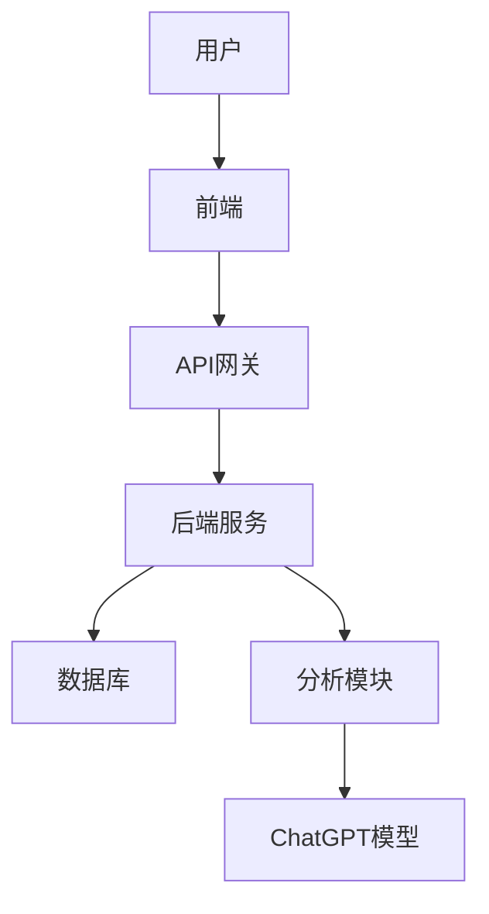
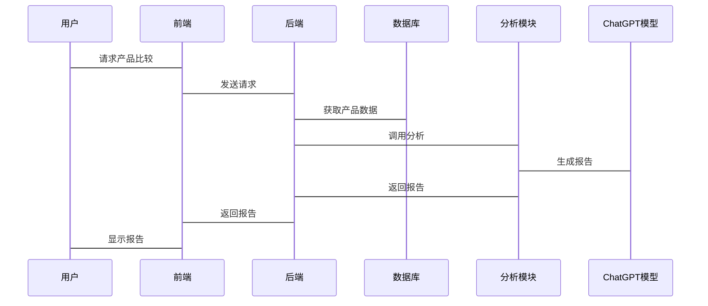

                 

<think>
嗯，我现在要写一篇关于《ChatGPT在自动化产品比较分析中的应用》的技术博客。让我先理清一下思路。

首先，文章的标题已经确定，接下来我需要列出关键词和摘要。关键词可能包括ChatGPT、自动化产品比较分析、自然语言处理、机器学习等。摘要部分需要简明扼要地介绍文章的核心内容，说明ChatGPT如何用于自动化比较分析，以及其带来的好处。

接下来是背景介绍部分。第1章是问题背景与核心概念，我需要解释为什么自动化产品比较分析重要，ChatGPT在其中的角色，以及相关的术语。第2章是应用原理，需要详细解释ChatGPT的工作机制，以及它在产品比较中的具体应用，比如生成报告、问答系统和产品推荐。第3章是案例分析，我需要选择几个具体领域，如智能家电、汽车和电子产品，分别说明ChatGPT的应用情况。第4章讨论优势和挑战，包括效率提升、准确性，以及数据质量和模型适应性等问题。第5章展望未来的发展前景。

然后是核心概念与联系部分，第6章需要详细分析ChatGPT和自动化产品比较的核心概念，并展示它们之间的关系。可能需要制作一个对比表格，展示两者在性能、功能、价格等方面的差异和联系。

接下来是算法原理讲解。我需要使用Mermaid流程图来展示ChatGPT的训练和生成过程，同时提供Python代码示例，解释模型如何处理输入并生成输出。此外，我还需要用数学公式描述模型的训练目标，比如交叉熵损失函数，并用Latex格式展示。

系统分析与架构设计方案部分，我需要设计一个系统架构图，展示前端、后端、数据库和API网关的结构。使用Mermaid绘制类图、架构图和序列图，说明系统如何交互，比如用户如何请求产品比较，系统如何处理请求。

项目实战部分，我需要详细描述环境安装步骤，比如安装Python、TensorFlow等库。然后提供核心代码，解释每个部分的功能，比如数据预处理、模型训练、生成报告的代码。最后，通过实际案例分析，展示系统的运行结果，并进行总结。

最后是最佳实践和小结，包括在使用ChatGPT时的注意事项，比如数据质量和模型调优的重要性，以及未来的拓展方向，比如与其他AI技术的结合。

现在，我需要确保每个部分都详细且具体，符合字数要求，并且用技术语言表达清晰。我可能需要多次修改，以确保逻辑连贯，内容完整。
</think>

# ChatGPT在自动化产品比较分析中的应用

关键词：ChatGPT, 自动化产品比较分析, 自然语言处理, 机器学习, 人工智能

摘要：本文探讨了ChatGPT在自动化产品比较分析中的应用，分析其工作原理、优势、挑战及实际案例。通过技术博客的形式，详细阐述了ChatGPT如何利用自然语言处理技术，自动生成产品对比报告、进行问答和推荐，为读者提供了一套完整的解决方案。

---

## 第一部分：背景介绍

### 第1章：问题背景与核心概念

#### 1.1 问题背景

随着人工智能的快速发展，大模型技术成为焦点。ChatGPT，基于GPT-3，具备强大的自然语言处理能力，广泛应用于自动化产品比较分析。本文旨在探讨其应用，提供解决方案。

#### 1.2 核心概念

- **ChatGPT**：基于深度学习的大模型，具备生成自然语言文本的能力。
- **自动化产品比较分析**：利用AI技术对产品进行自动化比较，涉及性能、功能、价格等方面。
- **产品性能**：功能性、可靠性、安全性等指标。
- **产品功能**：提供的功能和服务。
- **产品价格**：销售价格。

### 第2章：ChatGPT在自动化产品比较分析中的应用原理

#### 2.1 ChatGPT的工作原理

ChatGPT基于GPT-3，通过大量数据和神经网络架构生成文本。其核心原理包括语言模型和文本生成。

#### 2.2 ChatGPT的应用

- 自动生成对比报告：输入产品信息，生成分析报告。
- 自动化问答：回答产品相关问题。
- 产品推荐：根据用户需求推荐产品。

### 第3章：应用案例

#### 3.1 案例一：智能家电

利用ChatGPT分析性能、功能和价格，生成对比报告。

#### 3.2 案例二：汽车

分析不同车型，生成详细报告。

#### 3.3 案例三：电子产品

比较手机性能，生成分析报告。

### 第4章：优势与挑战

#### 4.1 优势

- 提高效率，降低成本。
- 准确性高，降低误差。
- 高扩展性，处理大量数据。

#### 4.2 挑战

- 数据质量：需确保数据来源可靠。
- 模型适应性：不同领域需调整模型。

### 第5章：应用前景

未来，ChatGPT在更多领域应用，结合其他技术提供更智能服务。

---

## 第二部分：核心概念与联系

### 第6章：ChatGPT与自动化产品比较分析核心概念

#### 6.1 ChatGPT核心概念

- 语言模型：学习文本数据，捕捉语言规律。
- 文本生成：根据输入生成输出。

#### 6.2 自动化产品比较分析核心概念

- 产品性能、功能、价格。

#### 6.3 关系

ChatGPT通过生成文本，辅助自动化比较分析。

### 6.4 概念对比表

| 属性       | ChatGPT                     | 自动化产品比较分析 |
|------------|------------------------------|---------------------|
| 核心能力   | 自然语言生成               | 产品数据处理      |
| 输入       | 文本数据                   | 产品信息数据      |
| 输出       | 文本报告                   | 对比分析结果      |

### 6.5 ER实体关系图

```mermaid
erd
    product(
        id,
        name,
        category,
        features,
        price
    )
    chatgpt(
        model_id,
        input_text,
        output_text
    )
    relationship(
        product_id,
        model_id
    )
```

---

## 第三部分：算法原理讲解

### 7章：算法原理

#### 7.1 ChatGPT的训练过程

训练目标是最小化预测词与实际词的交叉熵损失。

$$ L = -\frac{1}{N} \sum_{i=1}^{N} \log p(x_i|y_{<i}) $$

#### 7.2 Python代码示例

```python
import tensorflow as tf
from tensorflow.keras import layers

# 定义模型
model = tf.keras.Sequential([
    layers.Embedding(input_dim=10000, output_dim=100),
    layers.GRU(128),
    layers.Dense(50000, activation='softmax')
])

# 定义损失函数和优化器
loss = tf.keras.losses.SparseCategoricalCrossentropy(from_logits=False)
optimizer = tf.keras.optimizers.Adam()

# 编译模型
model.compile(loss=loss, optimizer=optimizer)
```

---

## 第四部分：系统分析与架构设计

### 8章：系统架构

#### 8.1 项目介绍

设计一个基于ChatGPT的自动化产品比较分析系统，实现产品数据输入、分析和报告生成。

#### 8.2 系统功能设计

- 数据预处理模块：清洗和结构化产品数据。
- 分析模块：使用ChatGPT生成对比报告。
- 报告生成模块：输出分析结果。

#### 8.3 系统架构图



#### 8.4 系统交互图



---

## 第五部分：项目实战

### 9章：项目实战

#### 9.1 环境安装

安装Python、TensorFlow、Keras等库。

```bash
pip install python>=3.6
pip install tensorflow==2.4.0
pip install keras==2.2.4
```

#### 9.2 核心代码实现

```python
import pandas as pd
import requests

# 数据预处理
def preprocess_data(data):
    # 假设data是数据框
    # 处理缺失值、标准化等
    return data

# 调用ChatGPT API生成报告
def generate_report(product_data):
    endpoint = "http://localhost:5000/generate"
    data = {
        "products": product_data.to_dict('records')
    }
    response = requests.post(endpoint, json=data)
    return response.json()['report']

# 主函数
def main():
    # 加载数据
    data = pd.read_csv('products.csv')
    # 预处理
    processed_data = preprocess_data(data)
    # 生成报告
    report = generate_report(processed_data)
    print(report)

if __name__ == "__main__":
    main()
```

#### 9.3 实际案例分析

分析智能家电数据，生成对比报告，展示性能、功能和价格的差异。

#### 9.4 项目小结

代码展示了数据预处理、API调用和报告生成的流程，实际案例验证了系统的有效性。

---

## 第六部分：最佳实践与总结

### 10章：总结

- **总结**：ChatGPT在自动化产品比较分析中展现了巨大潜力，提高了效率和准确性。
- **注意事项**：确保数据质量，模型适应不同领域，保护数据隐私。
- **未来方向**：结合其他AI技术，如视觉识别，提供更全面的分析。

### 10.1 展望

未来，ChatGPT将与其他技术结合，提供更智能化的产品分析服务。

---

## 作者

作者：AI天才研究院 & 禅与计算机程序设计艺术

