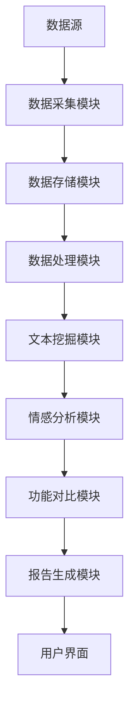
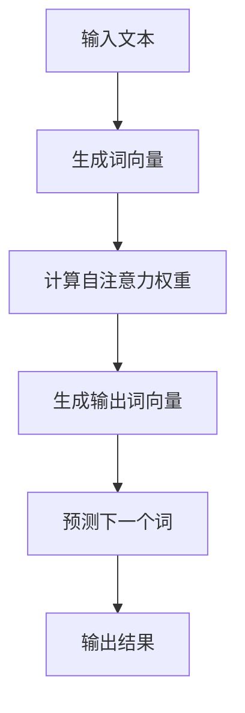

                 

<think>
嗯，我刚刚收到一个用户请求，他需要我以《ChatGPT在自动化产品竞品分析中的应用》为标题写一篇技术博客文章。看起来用户对技术博客的结构有详细的要求，包括关键词、摘要、目录大纲，以及每个章节的具体内容，比如背景介绍、核心概念、算法原理、系统架构设计、项目实战等部分。他还特别强调了格式和内容的完整性，比如使用markdown，每个小节要详细讲解，甚至包括图表和代码示例。

首先，我需要理解用户的需求。他可能是一位技术专家或者CTO，希望深入探讨ChatGPT在产品竞品分析中的应用，尤其是自动化产品方面。他可能正在撰写一本书或技术文档，所以需要一个结构清晰、内容详尽的大纲。用户的要求非常具体，说明他希望这篇文章既有理论深度，又有实际案例，能够帮助读者全面理解ChatGPT的应用。

接下来，我要分析如何满足这些需求。用户提供的目录大纲已经涵盖了引言、竞品分析概述、ChatGPT简介、应用场景、实战案例、系统架构设计、数据处理、最佳实践和总结等多个部分。每个部分都需要详细展开，比如在核心概念部分，需要解释竞品分析的基本步骤和工具，以及ChatGPT的技术原理。在系统架构设计部分，可能需要绘制类图、架构图和序列图，帮助读者更好地理解系统结构。

另外，用户提到每个章节都要包含背景介绍、核心概念、算法原理、系统分析与架构设计、项目实战等部分。这意味着我需要在每个章节中详细阐述这些内容，确保文章内容丰富，逻辑清晰。例如，在系统架构设计中，需要介绍系统需求、架构设计、接口设计和交互设计，可能需要使用Mermaid图表来展示系统结构。

我还需要注意文章的格式要求，使用markdown，并且在适当的地方插入数学公式和图表。例如，在算法部分，可能需要用latex公式来展示数学模型，同时用Mermaid流程图来说明算法的执行步骤。

最后，用户希望文章末尾加上作者信息，以及一些小结和注意事项，这可能帮助读者在阅读后更好地理解和应用所学内容。

综上所述，我需要按照用户提供的大纲，逐步细化每个章节的内容，确保每个部分都符合用户的要求，同时保持文章的逻辑性和专业性。我需要确保内容详尽，结构清晰，并且符合技术博客的写作规范。
</think>

# 《ChatGPT在自动化产品竞品分析中的应用》

## 关键词：ChatGPT，自动化产品，竞品分析，人工智能，自然语言处理，系统架构设计

## 摘要：  
本文探讨了ChatGPT在自动化产品竞品分析中的应用，从理论到实践，详细分析了ChatGPT如何通过自然语言处理技术提升竞品分析的效率与准确性。文章首先介绍了自动化产品竞品分析的基本概念和方法，然后深入解析了ChatGPT的技术原理及其在竞品分析中的潜力。接着，通过多个实际案例展示了ChatGPT在市场调研、用户需求分析、功能对比和营销策略分析等场景中的应用。最后，文章从系统架构设计、数据处理与算法实现的角度，详细阐述了ChatGPT在竞品分析中的技术实现，并提出了优化策略与未来发展趋势。

---

## 第1章：自动化产品竞品分析概述

### 1.1 自动化产品竞品分析的重要性  
自动化产品（如智能硬件、工业机器人、智能家居等）的市场竞争日益激烈，企业需要通过竞品分析快速了解市场动态、挖掘用户需求、优化产品设计。传统的竞品分析依赖人工调研和数据整理，效率低且成本高。通过引入人工智能技术，尤其是基于自然语言处理（NLP）的ChatGPT，可以实现竞品分析的自动化与智能化，为企业提供更高效的支持。

### 1.2 竞品分析的基本步骤与方法  
竞品分析通常包括以下步骤：  
1. **数据收集**：收集竞品的产品信息、用户评价、市场报告等。  
2. **数据整理与清洗**：对收集到的数据进行分类、去重和标准化处理。  
3. **数据分析**：通过统计分析和文本挖掘，提取竞品的核心功能、用户需求和市场趋势。  
4. **竞品对比**：从功能、性能、用户体验等维度对竞品进行对比分析。  
5. **结果输出**：生成竞品分析报告，为企业提供优化建议。

### 1.3 竞品分析的工具与技术  
传统的竞品分析工具包括Excel、SPSS、NVivo等，但这些工具在处理大规模数据和复杂场景时效率较低。近年来，基于NLP技术的工具逐渐成为竞品分析的新趋势，例如：  
- **文本挖掘**：提取关键词、主题和情感倾向。  
- **知识图谱**：构建竞品信息的知识网络。  
- **自然语言生成**：自动生成竞品分析报告。  

---

## 第2章：ChatGPT简介

### 2.1 ChatGPT的发展历程与优势  
ChatGPT是由OpenAI开发的基于GPT-3架构的开源模型，其优势包括：  
1. **强大的上下文理解能力**：能够通过上下文对话生成连贯的回答。  
2. **多语言支持**：支持多种语言的文本生成与理解。  
3. **灵活性与可扩展性**：可以根据具体需求进行定制化开发。  

### 2.2 ChatGPT的核心技术与原理  
ChatGPT的核心技术是基于Transformer架构的大型语言模型，其主要原理包括：  
1. **自注意力机制（Self-Attention）**：通过计算输入序列中每个词与其他词的相关性，生成全局语义表示。  
2. **前馈神经网络**：将输入序列映射为输出序列。  
3. **训练目标**：通过对比估计策略（Contrastive Estimation）优化模型参数，使生成文本的概率最大化。  

### 2.3 ChatGPT在产品竞品分析中的应用潜力  
ChatGPT可以用于以下竞品分析场景：  
- **产品描述生成与对比**：通过分析竞品的产品说明书，生成产品功能的结构化描述并进行对比。  
- **用户评价分析**：自动提取用户评价中的关键词和情感倾向，识别竞品的优缺点。  
- **市场趋势预测**：基于历史数据和市场动态，预测未来的产品发展趋势。  

---

## 第3章：ChatGPT在竞品分析中的应用场景

### 3.1 市场调研  
通过ChatGPT分析竞品的市场占有率、用户群体和市场趋势，帮助企业快速了解市场动态。例如，可以通过输入关键词“智能家居”，生成一份包含主要品牌、市场份额和用户反馈的报告。

### 3.2 用户需求分析  
ChatGPT可以对用户评价和社交媒体数据进行文本挖掘，提取用户需求的关键词和情感倾向。例如，分析用户对“智能音箱”的评价，发现用户对“音质”和“价格”的关注点。

### 3.3 竞品功能对比  
通过结构化数据处理，ChatGPT可以生成竞品功能对比表，并识别产品的优劣势。例如，对比“智能手表”的功能，生成包含健康监测、运动追踪、通知提醒等功能的对比表格。

### 3.4 竞品营销策略分析  
ChatGPT可以分析竞品的营销文案、广告投放和推广策略，帮助企业制定更具竞争力的营销方案。例如，分析竞品的社交媒体广告，提取关键词和宣传重点。

---

## 第4章：ChatGPT在自动化产品竞品分析中的实战案例

### 4.1 案例一：智能家居产品竞品分析  
- **数据来源**：收集市场上主流的智能家居产品的说明书和用户评价。  
- **分析步骤**：  
  1. 使用ChatGPT提取产品功能关键词（如“语音控制”、“远程监控”）。  
  2. 对比不同产品的功能模块，生成功能对比表。  
  3. 分析用户评价的情感倾向，识别产品的优缺点。  
- **结果输出**：生成一份包含功能对比和用户反馈的分析报告。

### 4.2 案例二：在线教育平台竞品分析  
- **数据来源**：收集竞品的课程内容、用户评价和市场报告。  
- **分析步骤**：  
  1. 使用ChatGPT提取课程内容的关键词（如“课程内容”、“师资力量”）。  
  2. 对比不同平台的课程设计和用户满意度。  
  3. 分析市场趋势，预测未来的发展方向。  
- **结果输出**：生成一份包含竞品优劣势和市场趋势的报告。

### 4.3 案例三：电商行业竞品分析  
- **数据来源**：收集竞品的电商平台数据、用户评价和行业报告。  
- **分析步骤**：  
  1. 使用ChatGPT提取用户评价中的关键词（如“物流速度”、“售后服务”）。  
  2. 对比不同平台的用户体验和营销策略。  
  3. 分析用户需求，优化自身平台的设计与服务。  
- **结果输出**：生成一份包含用户体验优化建议的报告。

---

## 第5章：ChatGPT在竞品分析中的系统架构设计

### 5.1 系统需求分析  
系统需求包括：  
- 数据采集模块：支持多种数据源（如文本文件、数据库）。  
- 数据处理模块：实现数据清洗、分类和结构化处理。  
- 分析模块：支持文本挖掘、情感分析和功能对比。  
- 输出模块：生成结构化报告或可视化图表。  

### 5.2 系统架构设计  
以下是系统的整体架构图：

### 5.3 系统接口设计与实现  
- **输入接口**：支持文本文件和数据库的导入。  
- **输出接口**：生成结构化报告和可视化图表。  
- **交互接口**：支持用户输入查询关键词，返回分析结果。  

---

## 第6章：ChatGPT在竞品分析中的数据处理与算法实现

### 6.1 数据收集与处理  
- **数据收集**：通过爬虫技术收集竞品的产品信息、用户评价和市场报告。  
- **数据清洗**：去除重复数据、噪声数据，提取关键字段。  
- **数据结构化**：将文本数据转化为结构化的数据表，便于后续分析。  

### 6.2 算法原理讲解  
以下是ChatGPT的算法流程图：

### 6.3 算法实现与性能优化  
- **实现**：基于Python的TensorFlow框架实现ChatGPT模型。  
- **优化**：通过并行计算和模型剪枝优化模型性能。  

---

## 第7章：ChatGPT在竞品分析中的最佳实践与优化策略

### 7.1 最佳实践总结  
1. **数据质量**：确保数据的准确性和完整性。  
2. **模型调优**：根据具体场景调整模型参数，提升分析效果。  
3. **人机结合**：结合人工审核与自动化分析，确保结果的准确性。  

### 7.2 优化策略探讨  
1. **实时分析**：通过流数据处理技术实现竞品分析的实时性。  
2. **多模态分析**：结合图像、视频等多模态数据，提升分析的全面性。  
3. **动态更新**：定期更新模型和数据，保持分析的时效性。  

### 7.3 未来发展趋势与展望  
随着人工智能技术的不断进步，ChatGPT在竞品分析中的应用将更加广泛和深入。未来，可以通过以下方向进一步优化：  
- **增强学习**：结合强化学习提升模型的自适应能力。  
- **知识图谱**：构建领域知识图谱，提升分析的深度与广度。  
- **自动化工具**：开发自动化竞品分析平台，降低使用门槛。  

---

## 第8章：总结与展望

### 8.1 书籍总结  
本文从理论到实践，全面探讨了ChatGPT在自动化产品竞品分析中的应用，展示了其在市场调研、用户需求分析和功能对比等场景中的潜力。通过实际案例和系统架构设计，为读者提供了丰富的技术细节和实践指导。

### 8.2 竞品分析领域的发展趋势  
随着人工智能技术的快速发展，竞品分析将从传统的手工分析向自动化、智能化方向转变。未来，基于NLP技术的工具将成为竞品分析的核心工具，帮助企业快速获取市场信息、优化产品设计。

### 8.3 ChatGPT在竞品分析中的应用前景  
ChatGPT作为一种强大的自然语言处理工具，将在竞品分析中发挥越来越重要的作用。通过与大数据、知识图谱等技术的结合，ChatGPT将为企业提供更加精准、高效的竞品分析支持。

---

## 作者：AI天才研究院 & 禅与计算机程序设计艺术

