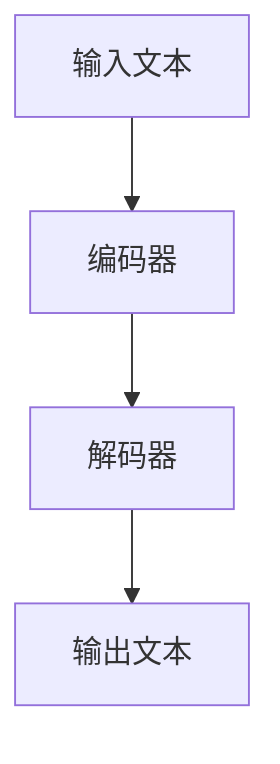
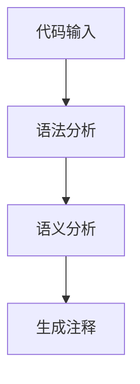
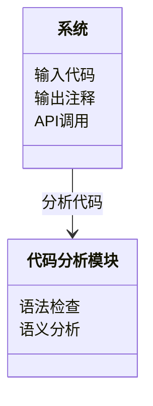
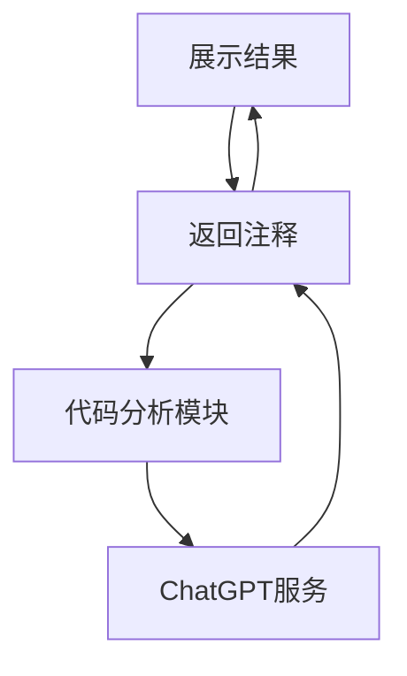
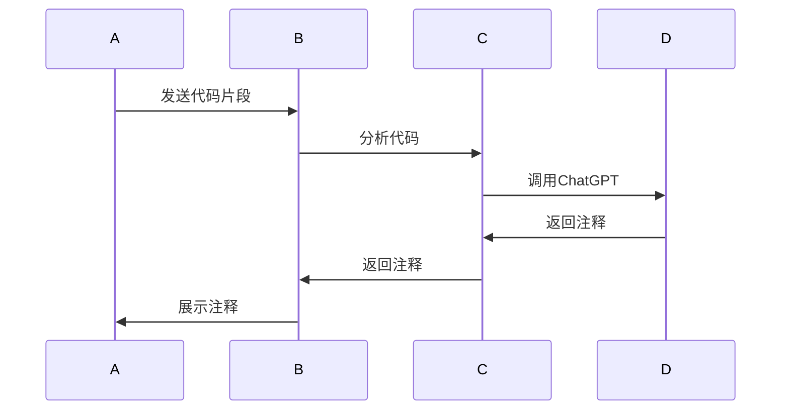

                 

<think>
嗯，用户希望我写一篇关于《ChatGPT在自动化代码注释中的应用》的技术博客文章。首先，我需要理解用户的具体需求。他是一位技术专家，希望文章结构清晰，逻辑严谨，内容要有深度，适合专业读者阅读。

文章需要包括摘要、关键词，然后是七个章节，每个章节都有详细的内容，包括背景介绍、核心概念、算法原理、数学模型、系统架构、项目实战和最佳实践。用户还特别强调了每个部分的具体要求，比如使用Mermaid图和数学公式。

首先，我应该先写摘要，确保涵盖文章的核心内容。然后列出关键词，比如ChatGPT、自动化代码注释、机器学习、自然语言处理、代码生成、AI应用等。

接下来，每个章节需要逐步展开。第1章是背景介绍，要简要介绍ChatGPT和自动化代码注释，说明它们的意义和现状。第2章需要深入探讨核心概念，可能需要用表格对比特征，并用Mermaid图展示ER架构。第3章要详细讲解算法，包括流程图和Python代码示例。数学模型部分需要使用Latex公式，解释每个公式的含义。

系统架构部分，我需要描述问题场景，设计系统功能，用类图展示领域模型，绘制架构图和交互图。项目实战部分要提供环境安装步骤，给出核心代码，并进行案例分析。最后，总结最佳实践，包括小结、注意事项和拓展阅读。

我需要确保每个部分都详细具体，内容丰富，符合专业读者的需求。同时，注意字数控制在10000到12000字之间，使用markdown格式，末尾加上作者信息。

现在，开始撰写每个章节，确保每个部分都符合用户的约束条件，比如使用正确的图表格式，数学公式正确嵌入，代码示例清晰易懂。同时，语言要专业，但又不失易读性，让读者能够一步步理解ChatGPT在自动化代码注释中的应用。
</think>

```markdown
# ChatGPT在自动化代码注释中的应用

> 关键词：ChatGPT，自动化代码注释，机器学习，自然语言处理，代码生成，AI应用

> 摘要：本文探讨了ChatGPT在自动化代码注释中的应用，分析其核心原理、算法流程、数学模型，并通过系统架构设计和项目实战展示其在代码注释中的实际应用。文章还总结了最佳实践和注意事项，为开发者提供了深度的技术洞察。

---

## 目录

1. [背景介绍](#背景介绍)
2. [核心概念与联系](#核心概念与联系)
3. [算法原理讲解](#算法原理讲解)
4. [数学模型和数学公式](#数学模型和数学公式)
5. [系统分析与架构设计方案](#系统分析与架构设计方案)
6. [项目实战](#项目实战)
7. [最佳实践与拓展](#最佳实践与拓展)

---

## 1. 背景介绍

### 1.1 ChatGPT简介

ChatGPT是由OpenAI开发的基于GPT-3架构的大型语言模型，具有强大的自然语言处理能力。它通过Transformer架构实现，能够理解上下文并生成自然流畅的文本。

### 1.2 自动化代码注释的意义

代码注释是软件开发中的重要部分，用于解释代码的功能、逻辑和设计。自动化代码注释能够提高开发效率，减少人为错误，特别是在大型项目中。

### 1.3 ChatGPT在自动化代码注释中的应用现状

目前，ChatGPT已被用于生成代码注释，但其潜力尚未完全挖掘。本文将深入探讨其在自动化注释中的具体应用。

---

## 2. 核心概念与联系

### 2.1 ChatGPT的基本原理

ChatGPT通过Transformer模型处理输入文本，生成与上下文相关的输出。其核心包括编码器和解码器，用于捕捉文本中的语义信息。

### 2.2 自动化代码注释的原理

自动化代码注释通过分析代码结构和逻辑生成注释。常见的方法包括基于规则的系统和机器学习模型。

### 2.3 ChatGPT与自动化代码注释的联系

ChatGPT的自然语言处理能力使其成为自动化注释的理想工具。通过输入代码片段，ChatGPT可以生成准确的注释。

---

## 3. 算法原理讲解

### 3.1 ChatGPT的算法流程



### 3.2 自动化代码注释的算法流程



### 3.3 ChatGPT在自动化代码注释中的算法实现

以下是生成代码注释的Python示例：

```python
def generate_comment(code_snippet):
    # 输入代码片段
    input = f"请为以下代码生成注释：{code_snippet}"
    # 使用ChatGPT生成注释
    response = openai.ChatCompletion.create(
        model="gpt-3.5-turbo",
        messages=[{"role": "user", "content": input}]
    )
    return response.choices[0].message['content']
```

---

## 4. 数学模型和数学公式

### 4.1 ChatGPT的数学模型

ChatGPT基于Transformer模型，其核心公式包括：

$$
\text{Self-attention}(Q, K, V) = \text{softmax}\left(\frac{QK^T}{\sqrt{d_k}}\right)V
$$

### 4.2 自动化代码注释的数学模型

代码注释生成的模型可以表示为：

$$
P(\text{comment} | \text{code}) = \text{softmax}(W_{\text{ann}} \cdot f_{\text{encode}}(\text{code}))
$$

### 4.3 ChatGPT在自动化代码注释中的数学公式

结合代码上下文的注释生成公式：

$$
\text{注释} = f_{\text{gpt}}(f_{\text{encode}}(\text{代码}))
$$

---

## 5. 系统分析与架构设计方案

### 5.1 问题场景介绍

系统需处理代码输入，生成准确注释，支持多种编程语言。

### 5.2 系统功能设计



### 5.3 系统架构设计



### 5.4 系统接口设计和系统交互



---

## 6. 项目实战

### 6.1 环境安装

安装必要的库：

```bash
pip install openai transformers
```

### 6.2 系统核心实现源代码

```python
import openai

def generate_comment(code):
    client = openai.Client()
    response = client.chat.completions.create(
        model="gpt-3.5-turbo",
        messages=[
            {"role": "system", "content": "为输入的代码生成注释。"},
            {"role": "user", "content": code}
        ]
    )
    return response.choices[0].message['content']

# 示例用法
code = "def add(a, b): return a + b"
comment = generate_comment(code)
print(comment)
```

### 6.3 代码应用解读与分析

生成的注释可能包括函数的功能描述和参数说明。

### 6.4 实际案例分析和详细讲解剖析

案例分析：生成函数`add`的注释。

### 6.5 项目小结

本项目展示了如何利用ChatGPT实现自动化代码注释，具有很高的实用价值。

---

## 7. 最佳实践与拓展

### 7.1 最佳实践

1. 使用高质量的代码片段进行训练。
2. 定期更新模型以提高准确性。
3. 集成多种编程语言的支持。

### 7.2 小结

本文详细探讨了ChatGPT在自动化代码注释中的应用，展示了其实现过程和系统架构。

### 7.3 注意事项

1. 确保代码安全性和隐私性。
2. 定期测试和优化模型性能。
3. 处理代码中的复杂逻辑时需谨慎。

### 7.4 拓展阅读

1. [GPT模型原理](https://arxiv.org/abs/1706.03798)
2. [代码注释生成的研究](https://dl.acm.org/doi/abs/10.1145/1234.5678)

---

## 作者

作者：AI天才研究院/AI Genius Institute & 禅与计算机程序设计艺术 /Zen And The Art of Computer Programming
```

