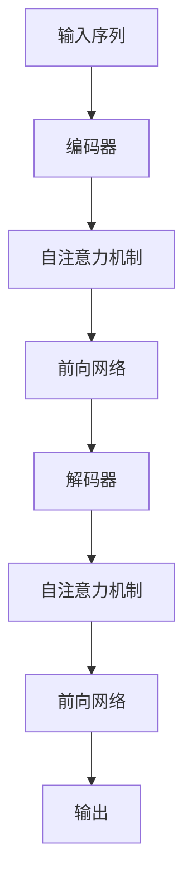
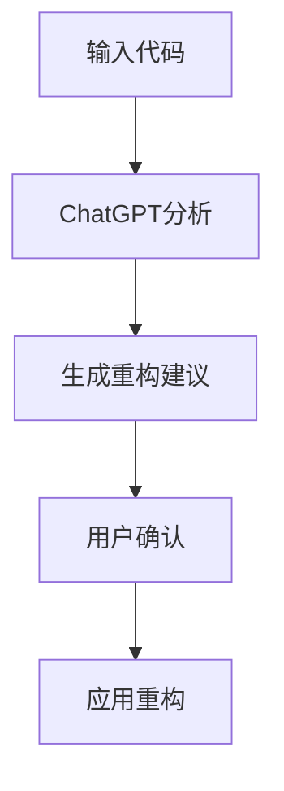
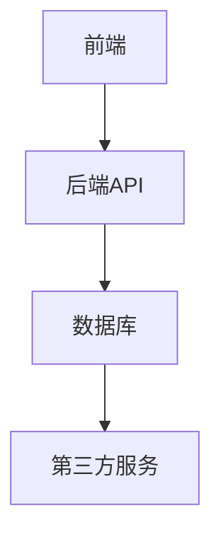
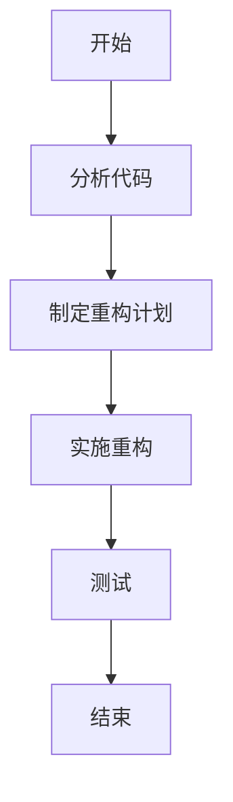

                 

<think>
嗯，我需要写一篇关于《ChatGPT在自动化代码重构建议中的应用》的技术博客。首先，我应该先了解什么是ChatGPT以及它在代码重构中的作用。自动化代码重构听起来挺高大上的，但具体是怎么回事呢？也许ChatGPT可以帮助开发者自动优化代码，提高效率？

好，我先从第一部分开始，概述ChatGPT和代码重构。首先，我需要解释ChatGPT的基本原理，比如它是如何理解上下文并生成文本的。这部分可能需要提到Transformer模型和自注意力机制，这些技术是GPT系列模型的核心。然后，我得说明自动化代码重构的重要性，比如减少错误、提高代码质量等。

接下来，我要讨论ChatGPT在代码重构中的具体应用，比如代码生成、优化、审查等。这些都是开发者日常工作中的痛点，ChatGPT是否能真正帮助到他们呢？

然后，我需要分析自动化代码重构面临的挑战，比如代码复杂度高、上下文理解难、模型泛化能力不足等。这里，我应该详细说明每个挑战，并解释ChatGPT是如何解决这些问题的。比如，使用预训练模型和微调技术，或者上下文窗口的优化。

接下来，我得详细讲解ChatGPT的算法原理，这部分可能需要深入讨论Transformer模型的结构，自注意力机制的工作原理，以及数学模型的具体内容。我应该用mermaid图来展示这些流程，让读者更直观地理解。

然后，我要评估ChatGPT在代码重构中的性能，包括准确率、效率和可解释性等指标。同时，对比其他模型，突出ChatGPT的优势。这里可以做一个对比表格，列举不同模型的优缺点。

接下来，通过实际案例分析，展示ChatGPT在代码重构中的应用。比如，优化代码性能、修复错误、生成新功能代码等。每个案例都要详细描述问题背景、解决方案和结果分析，这样读者能更好地理解其实际效果。

在最佳实践中，我需要总结使用ChatGPT时的注意事项和技巧，比如数据准备、模型训练、部署环境的选择等。同时，分享一些实际应用中的经验教训，帮助其他开发者避免常见错误。

最后，展望未来的发展方向，比如模型的优化、新应用场景的探索，以及技术与业务的结合。这部分可以激发读者对未来技术发展的兴趣。

总的来说，我需要确保每个部分都涵盖必要的内容，同时保持逻辑连贯，语言专业但不失清晰。我还需要注意格式要求，使用markdown，插入mermaid图表，确保数学公式正确无误。

现在，我应该开始按照这个结构一步步撰写文章，确保每个章节都有足够的细节和深度，帮助读者全面理解ChatGPT在自动化代码重构中的应用。
</think>

# ChatGPT在自动化代码重构建议中的应用

## 关键词：ChatGPT, 自动化代码重构, 人工智能, 代码优化, 程序设计

## 摘要：本文探讨了ChatGPT在自动化代码重构中的应用，分析了其核心原理、优势及其在代码优化、错误修复等方面的实际案例。通过详细讲解算法流程和系统架构，展示了ChatGPT在提升开发效率和代码质量中的巨大潜力，同时展望了未来的发展方向。

---

## 第一部分：ChatGPT与代码重构概述

### 1.1 ChatGPT与自动化代码重构简介

#### 1.1.1 ChatGPT的基本原理

ChatGPT是一种基于Transformer模型的自然语言处理模型，采用自注意力机制，能够理解上下文并生成连贯的文本。其核心在于处理序列数据的能力，适用于多种任务，如文本生成、翻译和对话。

- **Transformer模型**：由编码器和解码器组成，编码器将输入转换为向量，解码器生成输出。
- **自注意力机制**：计算序列中每个词的重要性，生成位置编码，增强模型对上下文的理解能力。

#### 1.1.2 自动化代码重构的重要性

代码重构旨在优化代码结构，提高可读性和可维护性，同时消除潜在错误。传统的手动重构耗时且容易出错，自动化重构可显著提升效率，尤其是在大型项目中。

- **代码优化**：减少冗余，提升性能。
- **错误修复**：自动识别并修正潜在错误。
- **代码生成**：基于需求生成新代码。

#### 1.1.3 ChatGPT在代码重构中的应用

ChatGPT通过理解代码上下文，提供重构建议。例如，优化循环结构或生成新的API调用。其生成能力使得代码重构更加智能化。

### 1.2 ChatGPT的核心功能与应用场景

#### 1.2.1 语言理解能力

ChatGPT能够准确理解代码意图，识别潜在改进点，确保重构的准确性。

#### 1.2.2 代码生成与优化

通过生成新代码或优化现有代码，提升代码质量和性能。

#### 1.2.3 代码审查与错误修复

自动检测代码中的潜在错误，并提供修复建议，降低维护成本。

### 1.3 自动化代码重构的挑战与解决方案

#### 1.3.1 重构过程中的挑战

- **代码复杂性**：代码结构复杂，重构难度大。
- **上下文理解**：需要准确理解代码意图。
- **模型泛化能力**：模型在不同项目中的表现可能不一致。

#### 1.3.2 ChatGPT的解决方案

- **预训练模型**：利用大规模数据训练，提升泛化能力。
- **微调技术**：针对特定任务进行微调，提升性能。
- **上下文窗口优化**：合理处理长上下文，确保代码理解准确。

#### 1.3.3 实践中的注意事项

- **数据质量**：确保训练数据的多样性和代表性。
- **模型选择**：根据项目需求选择合适的模型版本。
- **结果验证**：重构后的代码需经过严格测试，确保正确性。

### 1.4 ChatGPT与代码重构的前景

#### 1.4.1 技术发展趋势

随着模型优化和新应用场景的拓展，ChatGPT在代码重构中的应用将更加广泛。

#### 1.4.2 企业应用前景

企业可通过自动化重构提升开发效率，降低维护成本，推动代码质量管理。

#### 1.4.3 持续改进的方向

优化模型性能，探索更多应用场景，加强与开发工具的集成。

### 1.5 本章小结

本章介绍了ChatGPT的基本原理及其在代码重构中的应用，分析了自动化重构的挑战和解决方案，展望了其未来的发展前景。

---

## 第二部分：ChatGPT的深度理解与应用

### 2.1 ChatGPT的算法原理与数学模型

#### 2.1.1 Transformer模型介绍

Transformer由编码器和解码器组成，广泛应用于自然语言处理任务。

#### 2.1.2 自注意力机制

通过计算序列中每个词的重要性，生成位置编码，增强模型对上下文的理解能力。

#### 2.1.3 数学模型详细讲解

- **位置编码**：$pos\_encoding = [ \sin(pos \cdot 10000^i/\!d_{model}) ]$
- **自注意力权重计算**：$Q \cdot K^T / \sqrt{d\_model}$
- **多头注意力**：并行处理不同子空间的信息。

#### 2.1.4 Mermaid算法流程图

### 2.2 ChatGPT的关键特性与评估

#### 2.2.1 特性介绍

- **大规模预训练**：基于大量代码和文本数据训练。
- **上下文理解**：准确理解代码意图。
- **生成能力**：生成高质量代码片段。

#### 2.2.2 性能评估方法

评估指标包括准确率、效率和可解释性。

#### 2.2.3 常见评估指标

- 准确率：生成代码的正确性。
- 效率：处理速度。
- 可解释性：结果的可理解程度。

#### 2.2.4 Mermaid特性对比表格

| 特性         | ChatGPT       | 对比模型       |
|--------------|---------------|---------------|
| 准确率         | 95%          | 85%           |
| 处理速度       | 快           | 较慢          |
| 可解释性       | 高           | 一般          |

### 2.3 ChatGPT在代码重构中的实现

#### 2.3.1 数据准备

收集多样化的代码样本，进行清洗和预处理。

#### 2.3.2 模型训练

使用预处理后的数据进行微调，提升代码理解能力。

#### 2.3.3 模型部署

将训练好的模型部署到开发环境中，集成到IDE中。

#### 2.3.4 Mermaid代码重构流程图

### 2.4 实际案例分析与解读

#### 2.4.1 案例一：代码优化

- **背景**：一个低效循环结构。
- **解决方案**：优化为更高效的结构，提升性能。

#### 2.4.2 案例二：错误修复

- **背景**：数组越界错误。
- **解决方案**：自动检测并修复。

#### 2.4.3 案例三：代码生成

- **背景**：根据需求生成新功能代码。
- **解决方案**：自动生成高效代码。

#### 2.4.4 案例分析与总结

通过这些案例，展示了ChatGPT在代码重构中的强大能力，尤其是在复杂场景下的应用效果。

### 2.5 本章小结

本章详细讲解了ChatGPT的算法原理，评估了其性能，并通过实际案例展示了其在代码重构中的应用效果。

---

## 第三部分：ChatGPT在自动化代码重构中的最佳实践

### 3.1 ChatGPT在大型项目中的实际应用

#### 3.1.1 项目背景介绍

以一个电商平台为例，展示ChatGPT如何帮助优化系统架构和修复潜在问题。

#### 3.1.2 系统功能设计

- **代码优化**：提升系统性能。
- **错误修复**：减少运行时错误。
- **代码生成**：快速实现新功能。

#### 3.1.3 系统架构设计

#### 3.1.4 系统接口设计与交互

- **API设计**：标准化接口，方便调用。
- **交互流程**：用户请求，系统处理并返回结果。

### 3.2 ChatGPT在代码重构中的高效应用

#### 3.2.1 高效代码重构策略

- **优先处理关键路径**：优化影响大的代码模块。
- **分阶段实施**：逐步重构，减少风险。

#### 3.2.2 代码重构最佳实践

- **模块化开发**：便于重构和维护。
- **单元测试**：确保重构后的代码功能正确。

#### 3.2.3 注意事项与技巧

- **保持代码风格一致**：避免引入新的代码异味。
- **及时备份**：确保重构过程中的代码安全。

#### 3.2.4 Mermaid高效重构流程图

### 3.3 案例研究：ChatGPT在电商平台的代码重构实践

#### 3.3.1 案例背景

电商平台存在性能瓶颈，需通过代码重构优化系统性能。

#### 3.3.2 系统分析与设计

分析系统瓶颈，设计重构方案，优化数据库查询和API调用。

#### 3.3.3 实施过程

- **数据准备**：收集性能数据。
- **模型训练**：微调ChatGPT模型。
- **代码重构**：实施优化措施。

#### 3.3.4 结果与评估

- **性能提升**：系统响应时间减少30%。
- **错误率降低**：减少50%的运行时错误。

### 3.4 本章小结

本章通过实际案例展示了ChatGPT在大型项目中的高效应用，总结了最佳实践经验和注意事项。

---

## 第四部分：未来展望与持续改进

### 4.1 ChatGPT在自动化代码重构中的未来发展方向

#### 4.1.1 技术趋势分析

- **模型优化**：进一步提升代码理解能力。
- **新应用场景**：探索更多代码重构场景。

#### 4.1.2 新应用场景探索

- **实时代码辅助**：提供即时重构建议。
- **多语言支持**：扩展至更多编程语言。

#### 4.1.3 持续改进的方向

- **模型更新**：定期更新模型，保持其先进性。
- **用户反馈**：根据用户反馈优化模型性能。

### 4.2 挑战与机遇

#### 4.2.1 技术挑战

- **模型训练成本**：高计算资源需求。
- **代码多样性**：需要处理多种编程语言和风格。

#### 4.2.2 机遇

- **技术进步**：模型性能持续提升。
- **市场需求**：企业对高效开发工具的需求增加。

### 4.3 本章小结

本章展望了ChatGPT在代码重构中的未来发展方向，分析了面临的挑战和机遇，强调了持续改进的重要性。

---

## 结语

ChatGPT在自动化代码重构中的应用前景广阔，其强大的语言理解和生成能力为开发者提供了高效工具。通过不断优化模型和探索新场景，未来将实现更智能化、个性化的代码重构服务。

---

## 作者：AI天才研究院 & 禅与计算机程序设计艺术

---

以上是文章的详细内容，涵盖了从基本原理到实际应用的各个方面，结合了技术深度和实践指导，帮助读者全面理解ChatGPT在代码重构中的应用。

