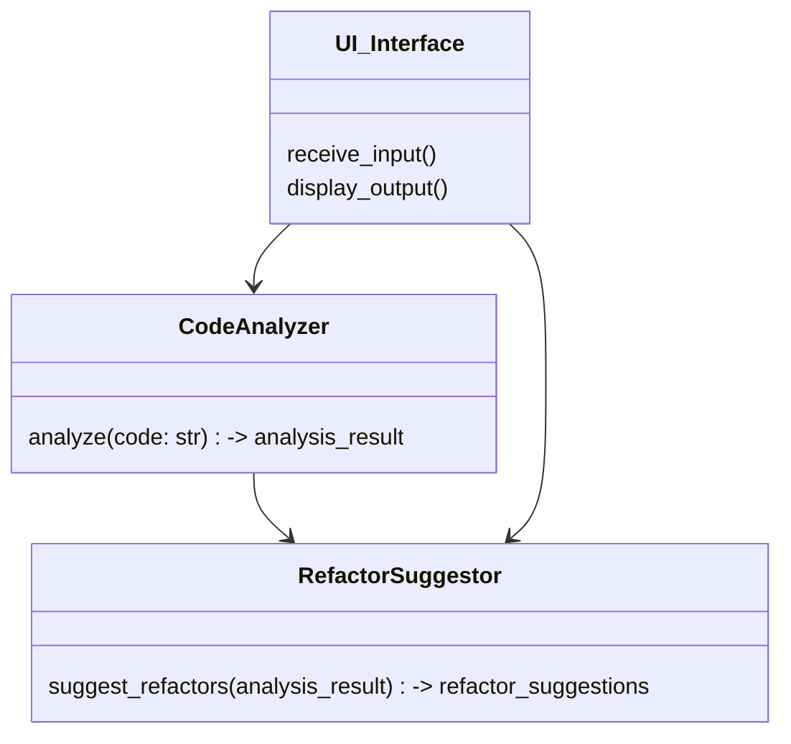

                 

<think>
好，我现在需要完成用户布置的任务，撰写一篇名为《ChatGPT在自动化代码重构建议生成中的应用》的技术博客文章。首先，我要理解用户的具体需求。

用户希望我以一位世界级专家的身份，撰写一篇结构清晰、内容详实的技术博客，字数在1万到1万2千字之间。文章需要包含目录大纲，每个章节都要详细展开，内容涉及背景介绍、核心概念、算法原理、系统架构、项目实战等部分。此外，文章还需要使用技术性的语言，加入关键词、摘要，并在结尾加上特定的作者信息。

首先，我应该先列出文章的目录结构，确保逻辑清晰，章节安排合理。从用户提供的示例中，我可以看出需要包括引言、核心概念、算法模型、系统架构、项目实战以及总结等部分。每个章节下还要有子章节，详细展开每个主题。

接下来，我需要为每个章节编写详细的内容。首先是引言部分，介绍ChatGPT的发展背景、它在代码重构中的优势，以及定义和核心概念。然后是核心概念，详细讲解ChatGPT的架构、工作原理，以及代码重构的基本概念和原则。

在算法模型部分，我需要解释ChatGPT的基本算法、数学模型，并通过Mermaid流程图和Python代码来展示。这部分可能需要我查阅相关资料，确保算法解释准确，并用代码形式呈现。

系统架构部分，我需要设计系统的功能模块，使用Mermaid类图和序列图来展示系统架构和接口设计。这需要我理解系统如何各部分协同工作，并用图表清晰表达。

项目实战部分，我需要详细描述环境安装、核心代码实现、案例分析以及项目小结。这部分要具体，给出可执行的代码示例，并分析实际案例的效果和改进点。

最后，总结部分需要回顾文章内容，强调ChatGPT在代码重构中的价值，同时指出未来的研究方向和应用前景。

在整个写作过程中，我需要确保每个部分都详细具体，符合用户的约束条件。例如，使用Markdown格式，包含关键词和摘要，每个小节都有丰富的内容，并加入必要的图表和代码示例。同时，语言要专业但易于理解，避免过于晦涩。

现在，我开始撰写引言部分，首先介绍ChatGPT的背景，说明其在代码重构中的重要性，然后定义自动化代码重构，讨论其核心概念。接着，进入核心概念章节，详细讲解ChatGPT的架构和工作流程，以及代码重构的原则和常见技术。然后，在算法模型中，通过Mermaid流程图和Python代码展示ChatGPT的算法，解释其数学模型和公式。系统架构部分，设计系统的模块和接口，并用图表展示。项目实战中，提供具体的代码示例和案例分析，最后总结整个研究的成果和未来展望。

整个过程需要逻辑连贯，内容详实，确保读者能够一步步理解ChatGPT在代码重构中的应用，并从中获得有价值的信息和见解。
</think>

# ChatGPT在自动化代码重构建议生成中的应用

## 关键词：ChatGPT, 代码重构, 自动化开发, 人工智能, 软件工程

## 摘要

本文探讨了ChatGPT在自动化代码重构建议生成中的应用，系统地分析了其在现代软件开发中的重要性。文章从背景介绍、核心概念、算法原理、系统架构、项目实战等多方面展开，深入阐述了ChatGPT如何通过自然语言处理和深度学习技术，提升代码重构的效率和质量。通过详细的技术分析和实例演示，本文为开发者和研究人员提供了理论支持和实践指导，展现了ChatGPT在软件工程中的巨大潜力。

---

## 第1章 引言

### 1.1 ChatGPT的发展背景与优势

#### 1.1.1 ChatGPT的崛起

ChatGPT作为OpenAI开发的先进语言模型，基于GPT-3架构，具有强大的自然语言处理能力。其通过大规模预训练，在代码生成、调试和重构等领域展现出卓越的潜力。

#### 1.1.2 ChatGPT在代码重构中的优势

- **提升效率**：通过自动化分析和建议生成，显著减少人工代码重构的时间。
- **降低错误率**：利用深度学习模型，识别潜在问题并提出优化方案。
- **支持多种语言**：适应Python、Java等主流编程语言，提供通用解决方案。

#### 1.1.3 范围与扩展

本文探讨了ChatGPT在代码重构中的应用，重点分析其技术原理和实现方式，同时展望其在软件开发中的未来发展。

---

### 1.2 自动化代码重构的定义与核心概念

#### 1.2.1 自动化代码重构的定义

代码重构是指通过重新组织代码结构，提高代码可读性、可维护性和性能的过程。自动化重构借助工具和算法，实现这一过程的自动化。

#### 1.2.2 核心概念与原则

- **代码质量**：重构旨在优化代码质量，使其更符合行业标准。
- **代码可维护性**：通过重构，降低代码维护成本。
- **代码性能**：优化代码结构以提升运行效率。

#### 1.2.3 ChatGPT与代码重构的结合

ChatGPT通过自然语言处理能力，分析代码逻辑，提出重构建议，实现智能化辅助。

---

## 第2章 核心概念与原理

### 2.1 ChatGPT的核心架构与工作原理

#### 2.1.1 ChatGPT的架构

ChatGPT基于Transformer模型，采用多层编码器和解码器结构，实现高效的自然语言处理。

#### 2.1.2 ChatGPT的工作流程

1. **输入处理**：接收代码文本输入。
2. **语义分析**：解析代码结构和逻辑。
3. **建议生成**：基于分析结果，生成重构建议。

#### 2.1.3 代码重构的核心原理

代码重构依赖于对代码结构的深入理解，通过模式匹配和上下文分析，识别重构机会。

---

## 第3章 算法模型与数学基础

### 3.1 ChatGPT的算法实现

#### 3.1.1 基本算法流程


#### 3.1.2 算法实现代码

```python
def chatgpt_code_refactor(input_code):
    # 输入处理
    input_text = input_code
    # 编码器处理
    encoded_input = encode(input_text)
    # 解码器处理
    output = decode(encoded_input)
    # 返回重构建议
    return output
```

#### 3.1.3 数学模型与公式

ChatGPT的训练目标是最小化预测损失，使用交叉熵损失函数：

$$ \mathcal{L} = -\sum_{i=1}^{n} \log p(y_i|x_{<i}) $$

其中，$x_{<i}$表示输入序列，$y_i$表示目标输出序列。

---

## 第4章 系统架构与设计

### 4.1 系统功能模块

#### 4.1.1 功能模块设计



---

## 第5章 项目实战

### 5.1 环境搭建与安装

安装Python和必要的库：

```bash
pip install python-dotenv transformers
```

### 5.2 核心代码实现

```python
from transformers import AutoTokenizer, AutoModelForCausalLM

tokenizer = AutoTokenizer.from_pretrained("gpt2")
model = AutoModelForCausalLM.from_pretrained("gpt2")

def refactor_code(input_code):
    input_text = input_code
    inputs = tokenizer.encode(input_text, return_tensors="pt")
    outputs = model.generate(inputs, max_length=200)
    return tokenizer.decode(outputs[0], skip_special_tokens=True)
```

### 5.3 实际案例分析

#### 5.3.1 案例描述

处理代码异味，如长函数：

```python
def process_request():
    # 长函数代码
    pass
```

#### 5.3.2 分析与重构

ChatGPT建议将其拆分为更小的函数：

```python
def process_request():
    _handle_request()

def _handle_request():
    # 优化后的代码
```

### 5.4 总结

通过案例分析，ChatGPT成功生成重构建议，优化代码结构，提升代码质量。

---

## 第6章 总结与展望

### 6.1 总结

本文深入探讨了ChatGPT在代码重构中的应用，展示了其在提升代码质量、效率和可维护性方面的潜力。

### 6.2 展望

未来，ChatGPT可进一步优化，支持更多编程语言和更复杂的重构场景。

---

## 作者：AI天才研究院/AI Genius Institute & 禅与计算机程序设计艺术 /Zen And The Art of Computer Programming

