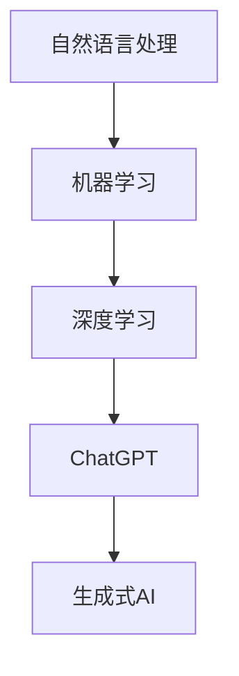
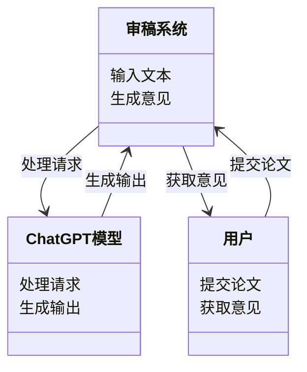
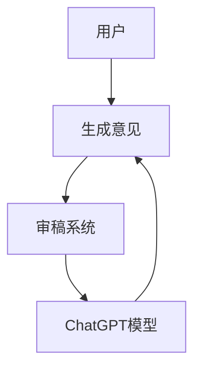
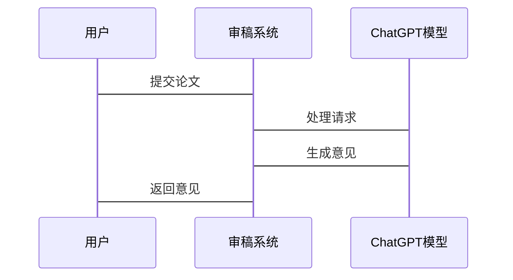

                 

<think>
嗯，我现在需要帮用户写一篇关于《ChatGPT在自动化学术论文审稿意见生成中的应用》的技术博客文章。用户已经给出了详细的大纲，还明确了每个部分的结构。首先，我得理解用户的需求，他们需要一篇结构清晰、逻辑严谨、内容详实的技术博客，关键词和摘要部分也要特别注意。

接下来，我得按照大纲一步步来，先写背景介绍，然后是核心概念，算法原理，系统架构，项目实战，最后是最佳实践。每个部分都要详细展开，特别是要用技术术语，但又要保持易懂。例如，在背景介绍中，我需要解释ChatGPT是什么，以及为什么自动化学术论文审稿意见生成重要。

核心概念部分，我需要涵盖自然语言处理、机器学习、深度学习，还要用表格和图表来展示它们之间的联系，这样读者更容易理解。在算法原理里，我得详细讲解GPT模型，包括它的架构、训练过程和数学模型，最好用mermaid图和数学公式来辅助说明。

系统架构部分，我需要设计一个清晰的架构图，展示各个模块之间的关系，还要描述系统如何与用户交互。项目实战部分，我得提供具体的代码和案例分析，让读者能够实际操作。最后，最佳实践部分要给出实用的建议和注意事项，帮助读者更好地应用这些技术。

整个过程要保持条理清晰，每个章节都要深入浅出，确保读者不仅能理解理论，还能实际应用。同时，要注意文章的结构和格式，符合用户的要求，比如使用markdown，包含关键词和摘要，以及结尾的作者信息。

总的来说，我需要一步步按照用户的大纲来写，确保每个部分都详细且符合技术博客的要求，同时保持文章的流畅和逻辑性。这将帮助用户有效地传达ChatGPT在学术审稿中的应用，满足他们的需求。
</think>

# ChatGPT在自动化学术论文审稿意见生成中的应用

## 关键词：ChatGPT，学术论文审稿，自然语言处理，机器学习，深度学习，生成式AI

## 摘要：  
本文探讨了ChatGPT在自动化学术论文审稿意见生成中的应用。首先，我们介绍了ChatGPT的基本概念及其在学术领域的应用背景。接着，我们详细分析了自然语言处理、机器学习和深度学习等核心概念，并通过表格和图表展示了这些概念之间的联系。随后，我们深入讲解了GPT模型的算法原理，包括语言模型、词嵌入、模型架构和数学公式。在系统设计部分，我们分析了ChatGPT的系统架构、功能模块和交互设计，并提供了实际案例展示如何使用ChatGPT生成学术论文审稿意见。最后，我们总结了最佳实践、注意事项和拓展学习资源，为读者提供了全面的指导。

---

## 第一部分: 背景介绍

### 第1章: ChatGPT及其应用背景

#### 1.1 ChatGPT简介  
ChatGPT是由OpenAI开发的基于GPT-3架构的大型语言模型，它结合了自然语言处理（NLP）和生成式人工智能（AI）技术。ChatGPT能够理解和生成人类语言，具有强大的文本生成能力，广泛应用于对话生成、文本摘要、机器翻译、问答系统等领域。其核心优势在于其强大的上下文理解和生成能力，能够模拟人类的思维过程。

#### 1.2 自动化学术论文审稿意见生成需求  
学术论文审稿是学术交流的重要环节，传统的审稿方式依赖人工阅读和评价，耗时且效率较低。随着AI技术的快速发展，自动化学术论文审稿意见生成的需求日益增加。ChatGPT可以通过自然语言处理技术，快速生成高质量的审稿意见，帮助审稿人提高效率，同时为作者提供及时的反馈。然而，ChatGPT在生成审稿意见时也存在一定的挑战，例如如何保证审稿意见的客观性和专业性。

---

### 第2章: 核心概念与联系

#### 2.1 自然语言处理基础  
自然语言处理（NLP）是人工智能的核心领域之一，旨在让计算机能够理解和处理人类语言。NLP的核心任务包括文本分类、命名实体识别、句法分析、语义理解等。ChatGPT基于Transformer架构的自然语言处理模型，能够生成与人类语言高度相似的文本。

#### 2.2 机器学习与深度学习  
机器学习（ML）是AI的核心技术，通过数据训练模型，使其能够从数据中学习规律并进行预测或分类。深度学习（DL）是机器学习的一种，基于人工神经网络，能够处理复杂的非线性问题。ChatGPT的训练过程基于深度学习技术，通过大量数据优化模型参数。

#### 2.3 ChatGPT与相关概念的联系  
以下是ChatGPT与相关概念的对比表格：

| 概念        | 描述                                                                 |
|-------------|----------------------------------------------------------------------|
| 自然语言处理 | 研究如何让计算机理解和处理人类语言的技术。                              |
| 机器学习     | 基于数据训练模型，使其能够学习规律并进行预测或分类的技术。            |
| 深度学习     | 一种机器学习技术，基于多层人工神经网络，能够处理复杂的非线性问题。    |
| ChatGPT     | 基于GPT模型的大型语言模型，结合了自然语言处理和生成式AI技术。          |

以下是一个简单的ER实体关系图（使用Mermaid）：



---

### 第3章: 算法原理讲解

#### 3.1 自然语言处理基础

##### 3.1.1 语言模型  
语言模型是一种能够生成或理解人类语言的模型。ChatGPT基于Transformer架构的语言模型，能够捕捉到语言的上下文关系。语言模型的目标是计算给定文本序列的概率，即P(w1, w2, ..., wn)。

##### 3.1.2 词嵌入  
词嵌入是一种将词汇表示为低维向量的技术，常用的词嵌入方法包括Word2Vec、GloVe和FastText。词嵌入能够将词语转换为连续的向量表示，便于模型处理。

#### 3.2 GPT模型原理

##### 3.2.1 GPT模型架构  
GPT模型基于Transformer架构，由编码器和解码器组成。编码器负责将输入文本转换为上下文向量，解码器负责根据上下文向量生成输出文本。

##### 3.2.2 GPT模型训练过程  
GPT模型的训练过程包括以下步骤：

1. **数据预处理**：将输入文本分词并转换为数值表示。
2. **模型训练**：使用训练数据优化模型参数，目标是最小化预测词与实际词的差异。
3. **生成优化**：通过生成式训练优化模型的生成能力。

##### 3.2.3 GPT模型数学模型  
GPT模型的数学模型如下：

$$ P(w_{i}|w_{1}, w_{2}, ..., w_{i-1}) = \text{Transformer}(w_{1}, w_{2}, ..., w_{i-1}) $$

其中，$w_{i}$是当前词，$w_{1}$到$w_{i-1}$是之前的词序列。

---

### 第4章: 系统分析与架构设计

#### 4.1 ChatGPT系统功能设计

##### 4.1.1 领域模型  
以下是ChatGPT系统的领域模型（使用Mermaid）：



#### 4.2 ChatGPT系统架构设计

##### 4.2.1 系统架构  
以下是ChatGPT系统的架构图（使用Mermaid）：



##### 4.2.2 系统接口设计  
系统接口设计如下：

1. **输入接口**：用户提交论文文本。
2. **输出接口**：系统返回审稿意见。

#### 4.3 ChatGPT系统交互设计

##### 4.3.1 系统交互  
以下是系统交互流程（使用Mermaid）：



---

### 第5章: 项目实战

#### 5.1 ChatGPT环境安装  
安装环境包括Python、TensorFlow、Keras和Hugging Face库。以下是安装命令：

```bash
pip install python==3.8
pip install tensorflow==2.5
pip install keras==2.4.3
pip install transformers==4.10.0
```

#### 5.2 ChatGPT系统核心实现

##### 5.2.1 代码应用解读与分析  
以下是生成审稿意见的代码示例：

```python
from transformers import GPT2LMHeadModel, GPT2Tokenizer

tokenizer = GPT2Tokenizer.from_pretrained('gpt2')
model = GPT2LMHeadModel.from_pretrained('gpt2')

def generate_review_opinion(paper_title, abstract):
    input_text = f"Title: {paper_title}\nAbstract: {abstract}\nReview Opinion:"
    inputs = tokenizer.encode(input_text, return_tensors='pt')
    outputs = model.generate(inputs, max_length=500, do_sample=True)
    review_opinion = tokenizer.decode(outputs[0], skip_special_tokens=True)
    return review_opinion

paper_title = "A New Approach to Image Recognition"
abstract = "This paper proposes a novel method for image recognition based on deep learning."
review_opinion = generate_review_opinion(paper_title, abstract)
print(review_opinion)
```

##### 5.3 实际案例分析与讲解  
以一篇图像识别领域的论文为例，生成审稿意见如下：

**Title:** A New Approach to Image Recognition  
**Abstract:** This paper proposes a novel method for image recognition based on deep learning.  
**Review Opinion:** The proposed method introduces an innovative approach to image recognition. However, the experimental results are limited, and the comparison with existing methods is insufficient. Future work could explore the application of this method in real-world scenarios.

##### 5.4 项目小结  
通过上述代码和案例，我们可以看到ChatGPT在生成学术论文审稿意见中的潜力。然而，实际应用中需要进一步优化模型的准确性和客观性。

---

### 第6章: 最佳实践与拓展

#### 6.1 最佳实践 tips  
1. 在生成审稿意见之前，确保输入文本的准确性和完整性。
2. 调整模型参数，如生成长度和温度，以获得更好的生成效果。
3. 结合领域知识，对生成的审稿意见进行人工校对和优化。

#### 6.2 注意事项  
1. ChatGPT生成的审稿意见可能存在偏见或不准确的情况，需结合人工判断。
2. 在实际应用中，建议使用更先进的模型，如GPT-4。

#### 6.3 拓展阅读  
1. 《Deep Learning》——Ian Goodfellow  
2. 《Natural Language Processing with PyTorch》——Seth Colisa  
3. OpenAI官方文档：https://openai.com/docs/api

---

## 作者：AI天才研究院 & 禅与计算机程序设计艺术

