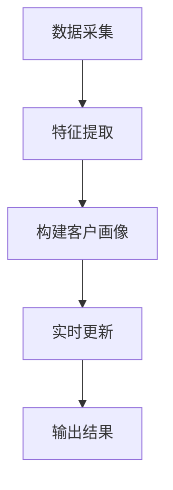
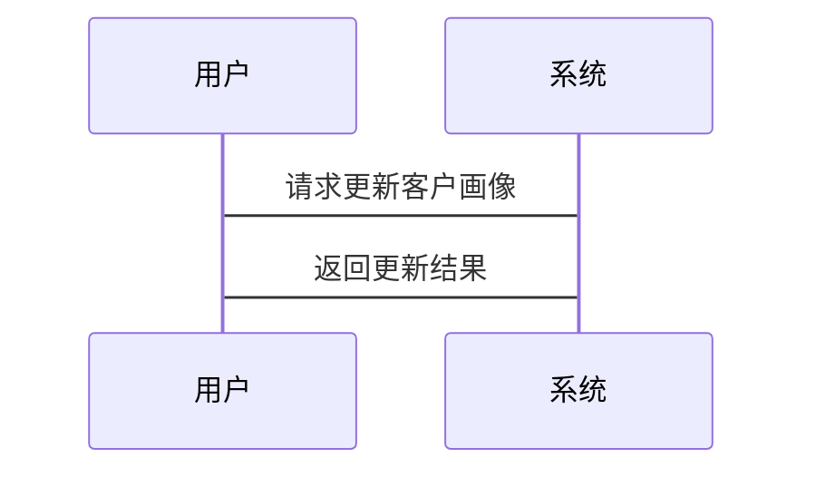
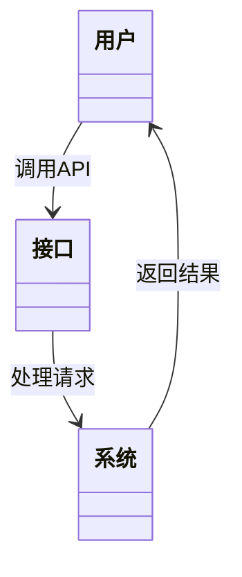

                 

<think>
嗯，用户让我写一篇关于“ChatGPT在自动化客户画像更新中的应用”的技术博客。首先，我需要理解用户的需求。他是一位技术专家，CTO级别的，所以文章需要专业、深入，同时结构清晰，逻辑严密。

用户提供的大纲已经很详细了，包括背景、核心概念、算法、系统设计、实战、最佳实践等部分。我需要确保每个章节都涵盖必要的内容，并且符合技术深度的要求。

首先，标题和关键词。标题已经确定，关键词应该是几个关键的技术点，比如客户画像、自动化更新、ChatGPT、自然语言处理等。摘要部分需要简洁地总结文章的核心内容，强调ChatGPT如何提升客户画像的效率和准确性。

接下来是背景介绍，这部分要说明为什么自动化客户画像更新重要，传统方法的局限性，以及ChatGPT的优势。我需要详细解释每个部分，比如手动更新效率低，数据准确性问题，实时性不足等。

然后是核心概念，需要详细描述ChatGPT的工作原理，自动化客户画像的构建过程，包括数据源、特征提取、标签设计等。这部分可能需要一些技术细节，比如模型的架构和训练方法。

算法部分，我需要用mermaid流程图展示ChatGPT的应用流程，包括数据采集、特征工程、实时更新等步骤。同时，给出数学模型，比如特征提取的公式和标签更新的策略，这部分要清晰且有实际例子。

系统设计章节，需要设计系统的架构，包括数据层、服务层、展示层。功能设计部分，描述客户画像管理、实时更新等功能。接口设计部分，详细说明接口规范和测试方法。交互设计部分，用序列图和类图展示系统如何工作。

项目实战部分，需要详细指导环境搭建，包括硬件和软件配置，然后一步步讲解数据导入和处理，以及系统核心实现。案例分析要具体，比如电商行业的应用，展示如何实施和效果如何。

最后，最佳实践部分，给出一些实用的建议，比如数据安全、模型调优等。小结部分总结全文，并展望未来的发展方向。

在写作过程中，我需要确保每个章节内容丰富，详细具体，同时语言专业但不过于复杂。此外，格式上要使用markdown，插入mermaid图表和latex公式，确保文章结构清晰，内容完整。

总的来说，我需要按照用户提供的大纲，逐一展开每个部分，确保技术深度和广度，同时保持逻辑性和可读性。这样，用户才能获得一篇高质量、有深度的技术博客文章。
</think>

# ChatGPT在自动化客户画像更新中的应用

> 关键词：ChatGPT，客户画像，自动化更新，自然语言处理，实时数据处理，机器学习

> 摘要：本文深入探讨了ChatGPT在自动化客户画像更新中的应用，分析了传统客户画像更新方式的局限性，详细阐述了ChatGPT的核心原理及其在客户画像构建中的应用流程。通过系统设计与实现、项目实战案例分析，展示了ChatGPT如何提升客户画像更新的效率与准确性。文章最后总结了最佳实践与未来发展方向。

---

## 第一部分：背景介绍

### 第1章：问题背景与核心概念

#### 1.1.1 问题背景
- **自动化客户画像的定义**：自动化客户画像是指通过技术手段自动收集、分析和更新客户数据，构建客户画像的过程。
- **客户画像在业务中的应用**：客户画像是企业进行精准营销、个性化服务和风险控制的重要工具。
- **现有客户画像更新方式的局限性**：
  - 手工更新效率低，难以实时反映客户变化。
  - 批量更新周期长，无法应对实时需求。
  - 数据来源分散，难以整合和分析。

#### 1.1.2 核心概念
- **ChatGPT概述**：ChatGPT是基于GPT模型的自然语言处理工具，具有强大的文本生成和理解能力。
- **自动化客户画像的概念**：通过自动化技术实时更新客户画像，保持画像的准确性和时效性。
- **客户画像要素与标签体系**：客户画像通常包括基本属性、行为特征、偏好标签等要素，标签体系是客户画像的核心组成部分。

#### 1.1.3 边界与外延
- **ChatGPT在客户画像中的应用边界**：主要用于文本理解和生成，不直接处理非文本数据。
- **自动化客户画像技术的应用外延**：广泛应用于金融、电商、医疗等领域。

### 第2章：现有技术回顾

#### 2.1.1 传统客户画像更新方法
- **手动更新**：依赖人工操作，效率低。
- **定期批量更新**：周期性更新，无法实时反映变化。
- **实时数据抽取与整合**：技术复杂，成本高。

#### 2.1.2 传统方法的不足
- **更新效率低**：无法满足实时需求。
- **数据准确性问题**：数据来源分散，难以保证准确性。
- **无法适应动态变化**：客户行为和偏好变化快，传统方法难以快速响应。

---

## 第二部分：核心概念与联系

### 第3章：ChatGPT原理与架构

#### 3.1.1 ChatGPT的基本原理
- **自然语言处理**：通过理解和生成人类语言，实现文本交互。
- **生成式预训练**：基于大规模数据的预训练，具备生成能力。
- **自适应学习能力**：通过微调任务特定数据，快速适应新场景。

#### 3.1.2 ChatGPT的架构
- **模型结构**：基于Transformer架构，支持大规模并行计算。
- **训练与推理流程**：预训练阶段学习语言模型，微调阶段适应特定任务。
- **可扩展性设计**：支持分布式训练和部署，适用于大规模数据处理。

#### 3.1.3 ChatGPT的应用特点
- **实时交互能力**：能够快速响应用户输入，适合实时更新场景。
- **自适应优化**：通过反馈机制不断优化生成结果。
- **大规模数据处理**：支持海量数据的处理和分析。

### 第4章：自动化客户画像构建

#### 4.1.1 客户画像要素抽取
- **数据源选择**：包括用户行为数据、交易数据、社交媒体数据等。
- **特征提取方法**：通过自然语言处理技术提取文本特征。
- **数据预处理**：清洗、归一化和特征工程。

#### 4.1.2 标签体系设计
- **标签定义**：定义客户画像中的关键标签，如年龄、性别、消费习惯等。
- **标签层次结构**：从宏观到微观，构建层次化的标签体系。
- **标签更新策略**：根据实时数据动态更新标签。

#### 4.1.3 客户画像更新机制
- **实时数据流处理**：通过流处理技术实时更新客户画像。
- **智能推荐算法**：基于机器学习算法推荐更新策略。
- **客户行为分析**：通过行为分析识别客户画像的变化点。

---

## 第三部分：算法原理讲解

### 第5章：算法流程与数学模型

#### 5.1.1 ChatGPT在客户画像中的应用流程
- **数据采集**：从多个数据源采集客户相关数据。
- **特征工程**：提取特征并构建客户画像。
- **实时更新**：基于实时数据动态调整客户画像。

#### 5.1.2 数学模型与公式
- **特征提取的数学公式**：
  $$ f(x) = \sum_{i=1}^{n} w_i x_i $$
  其中，\(w_i\) 是特征权重，\(x_i\) 是特征值。

- **标签更新的数学模型**：
  $$ y = \theta \cdot x + b $$
  其中，\(\theta\) 是模型参数，\(x\) 是输入特征，\(b\) 是偏置项。

- **客户画像的合并策略**：
  使用加权平均方法合并多个特征：
  $$ merged\_feature = \frac{\sum_{i=1}^{n} w_i x_i}{\sum_{i=1}^{n} w_i} $$

#### 5.1.3 算法流程图


---

## 第四部分：系统设计与实现

### 第6章：系统架构与功能设计

#### 6.1.1 系统架构设计
- **数据层**：存储客户数据和模型参数。
- **服务层**：处理数据和调用ChatGPT模型。
- **展示层**：展示客户画像和更新结果。

#### 6.1.2 系统功能设计
- **客户画像管理**：支持创建、更新和查询客户画像。
- **实时更新与同步**：实现客户画像的实时更新和数据同步。
- **用户行为分析**：分析客户行为并生成更新策略。

#### 6.1.3 接口设计与实现
- **接口规范**：定义RESTful API接口。
- **接口实现**：基于Python Flask框架实现接口。
- **接口测试**：使用Postman进行功能测试。

#### 6.1.4 系统交互设计
- **序列图**：


- **类图**：


---

## 第五部分：项目实战

### 第7章：项目环境搭建

#### 7.1.1 环境准备
- **硬件配置**：推荐使用8核以上CPU，16GB以上内存。
- **软件安装**：安装Python、Flask、TensorFlow等工具。
- **数据库配置**：选择MySQL或MongoDB作为存储数据库。

#### 7.1.2 数据导入
- **数据预处理**：清洗数据并提取特征。
- **数据导入流程**：从数据源导入数据并存储。

### 第8章：系统核心实现

#### 8.1.1 客户画像构建
- **数据采集与处理**：从数据库中读取客户数据。
- **客户画像构建流程**：提取特征并构建标签体系。

#### 8.1.2 实时更新
- **ChatGPT模型训练**：基于实时数据微调模型。
- **实时更新策略**：根据模型输出动态更新客户画像。

#### 8.1.3 代码应用解读与分析
- **源代码解读**：
  ```python
  def update_customer_profile(customer_id):
      # 数据预处理
      data = preprocess_data(customer_id)
      # 调用ChatGPT模型
      result = chatgpt_api(data)
      return result
  ```

- **算法应用分析**：通过实时数据更新客户画像，提升准确性和时效性。

### 第9章：案例分析与实战剖析

#### 9.1.1 案例背景
- **案例介绍**：以电商行业为例，构建客户画像。
- **案例目标**：实现客户画像的实时更新和精准营销。

#### 9.1.2 实施步骤
- **数据处理**：清洗和整合客户数据。
- **客户画像构建**：提取特征并构建标签体系。
- **结果分析**：评估客户画像的准确性和更新效率。

#### 9.1.3 案例总结与反思
- **案例成果**：实现了客户画像的实时更新，提升了精准营销效果。
- **经验与教训**：数据质量和模型调优是关键，需要持续优化。

---

## 第六部分：最佳实践与拓展

### 第10章：最佳实践与技巧

#### 10.1.1 实践技巧
- **数据处理**：确保数据质量，合理选择数据源。
- **模型调优**：通过微调和优化参数提升模型性能。
- **部署与维护**：采用容器化部署，定期监控和维护系统。

#### 10.1.2 注意事项
- **数据安全**：保护客户数据隐私，防止数据泄露。
- **模型可靠性**：确保模型输出的准确性和稳定性。
- **性能优化**：通过并行计算和缓存技术提升系统性能。

### 第11章：小结与展望

#### 11.1.1 小结
- **主要内容回顾**：详细介绍了ChatGPT在自动化客户画像更新中的应用，包括技术背景、系统设计和项目实战。
- **技术挑战与解决**：通过实时数据处理和模型优化解决了传统方法的不足。

#### 11.1.2 展望未来
- **自动化客户画像技术的演进**：结合更多AI技术，进一步提升更新效率和准确性。
- **ChatGPT在更多业务场景的应用**：探索其在金融、医疗等领域的潜力。
- **未来的研究方向**：研究更高效的数据处理和模型优化方法。

---

作者：AI天才研究院/AI Genius Institute & 禅与计算机程序设计艺术 /Zen And The Art of Computer Programming

