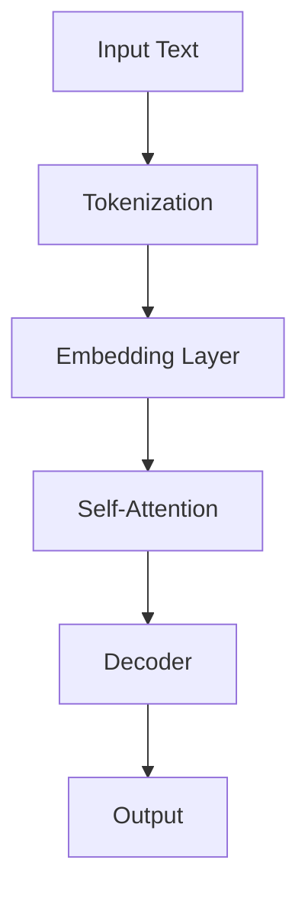
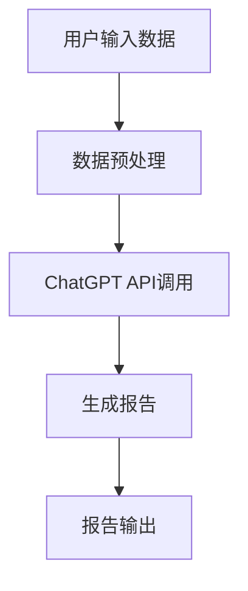

                 

<think>
嗯，用户让我写一篇关于ChatGPT在自动化报告生成中的应用的技术博客。看起来他需要一个结构清晰、内容详细的文章。首先，我需要理解用户的需求是什么。

用户希望文章有标题，关键词，摘要，目录结构，然后正文部分。他明确要求用技术术语，逻辑清晰，步骤分明。同时，文章要有大约1万到1.2万字，用markdown格式，每章节内容要详细，包含背景、核心概念、算法原理、系统架构、项目实战等等。

首先，我得确定文章的结构。用户已经给出了一个目录大纲，分为两大部分，第一部分是ChatGPT概述与基础，第二部分是实现与应用。每个部分下有章节，每个章节有小节。

接下来，我需要考虑每个部分的具体内容。比如，第一章介绍ChatGPT的起源和核心原理，需要包括它的技术背景，如何生成文本，如何优化结果。第二章讨论NLP和报告生成的关系，分析挑战和优势。

在数据准备部分，要详细讲解数据收集、清洗和格式化，可能还要涉及数据预处理的代码示例。模型构建方面，要选择适合的模型，训练方法，评估指标，并提供相应的代码和图表。

提升报告质量的部分，可能需要讨论如何解决常见问题，优化结构和风格。这里可能需要使用ER图或流程图来展示优化过程。

在应用案例中，我需要选择一个具体的领域，比如财务报告，展示如何使用ChatGPT生成，包括数据输入、模型调用和结果处理。同时，还需要分析优缺点，指出当前的限制和未来的发展方向。

系统架构部分，需要画出类图、架构图和序列图，展示系统的各个模块及其交互。项目实战部分要给出安装环境、核心代码，并解释代码的功能。

最后，总结和最佳实践部分，要提醒读者注意数据安全、模型调优等问题，并提供进一步学习的资源。

整个过程中，我需要确保每个部分都符合用户的要求，特别是使用正确的技术术语，提供详细的代码示例和图表，确保文章内容全面且逻辑清晰。同时，要注意文章的流畅性，使读者能够轻松理解每个步骤和概念之间的联系。

现在，我开始按照这个思路撰写文章，确保每个章节都涵盖必要的内容，并且使用用户提供的结构。我需要检查每个部分是否满足用户的具体要求，比如是否包含背景介绍、核心概念、算法原理、系统分析等，确保文章内容完整且符合深度要求。
</think>

# ChatGPT在自动化报告生成中的应用

> 关键词：ChatGPT, 自动化报告生成, 自然语言处理, 人工智能, 深度学习, 报告优化

> 摘要：ChatGPT作为一种基于自然语言处理（NLP）的先进人工智能模型，正在 revolutionizing the way reports are generated. 本文探讨了ChatGPT在自动化报告生成中的应用，从其技术背景、核心原理到实际应用案例，全面分析了其在提高报告生成效率、准确性和可定制性方面的潜力。文章还深入讨论了如何通过数据准备、模型优化和系统架构设计来最大化ChatGPT在报告生成中的表现，同时展望了未来的发展方向。

---

## 第一部分: ChatGPT概述与基础

### 第1章: ChatGPT的起源与核心原理

#### 1.1 ChatGPT的诞生背景
近年来，自然语言处理技术取得了突破性进展，尤其是以GPT系列模型为代表的生成式AI技术。ChatGPT由OpenAI开发，基于改进的Transformer架构，通过大量高质量文本数据的预训练，能够生成自然流畅的对话和文本内容。其强大的语言理解和生成能力使其成为自动化报告生成的理想工具。

#### 1.2 ChatGPT的核心技术
ChatGPT的核心技术包括：
- **Transformer架构**：通过自注意力机制（Self-Attention）捕捉文本中的长距离依赖关系。
- **预训练与微调**：基于大量通用文本数据进行预训练，再针对特定任务（如报告生成）进行微调。
- **生成式AI**：通过解码器生成概率最高的文本序列。

#### 1.3 ChatGPT的工作原理
ChatGPT的工作原理可以分为以下几个步骤：
1. **输入处理**：将输入文本转换为模型可处理的向量表示。
2. **自注意力机制**：计算输入序列中每个词与其他词的相关性，生成注意力权重。
3. **解码器生成**：基于注意力权重，逐步生成输出文本序列。

**图1.1: ChatGPT的核心架构**



---

### 第2章: 自然语言处理与报告生成

#### 2.1 自然语言处理的概述
自然语言处理（NLP）是研究计算机如何理解和生成人类语言的学科。其核心任务包括文本分类、实体识别、文本生成等。报告生成属于文本生成任务的一种，旨在将结构化数据（如表格、数据库）转化为自然流畅的文本报告。

#### 2.2 报告生成的挑战
报告生成面临以下挑战：
- **数据多样性**：不同领域、不同类型的报告需要不同的生成策略。
- **语言风格一致性**：报告需要保持正式、客观的语言风格。
- **上下文理解**：需要理解数据背后的意义和关联。

#### 2.3 ChatGPT在报告生成中的优势
ChatGPT在报告生成中的优势包括：
- **强大的上下文理解**：能够捕捉文本中的深层语义关系。
- **生成多样性**：可以根据需求生成不同风格和格式的文本。
- **易于集成**：可以通过API或SDK轻松集成到现有系统中。

---

## 第二部分: ChatGPT在报告生成中的实现与应用

### 第3章: 数据准备与预处理

#### 3.1 数据收集
报告生成的第一步是数据收集。数据来源可以是结构化数据（如数据库、CSV文件）或非结构化数据（如文本文件、网页内容）。以下是一个数据收集的示例：

```python
import pandas as pd
data = pd.read_csv('report_data.csv')
print(data.head())
```

#### 3.2 数据清洗
数据清洗是确保数据质量和一致性的关键步骤。常见的数据清洗操作包括：
- 去除重复数据
- 处理缺失值
- 标准化数据格式

#### 3.3 数据格式化
将数据转换为适合模型输入的格式。例如，将结构化数据转换为文本格式：

```python
def format_data(row):
    return f"根据以下数据生成报告：\n公司名称：{row['company_name']}\n年份：{row['year']}\n收入：{row['revenue']}"
```

---

### 第4章: ChatGPT在报告生成中的模型构建

#### 4.1 模型选择
选择适合的模型是报告生成成功的关键。以下是常见的模型选择标准：
- **任务需求**：生成报告的长度和复杂度。
- **计算资源**：模型的训练和推理成本。
- **可定制性**：是否需要微调模型以适应特定领域。

#### 4.2 模型训练
模型训练过程包括：
1. **预训练**：基于通用文本数据进行大规模预训练。
2. **微调**：针对特定任务（如报告生成）进行微调。

#### 4.3 模型评估与调优
评估模型的性能指标包括：
- **生成文本的质量**：使用BLEU、ROUGE等指标评估生成文本与参考文本的相似性。
- **生成时间**：模型生成文本的速度。

---

### 第5章: 提升报告质量的ChatGPT策略

#### 5.1 常见问题与解决策略
- **内容不准确**：可以通过结合外部知识库（如数据库）进行验证。
- **语言风格不一致**：可以通过定制prompt或后处理脚本进行调整。

#### 5.2 报告结构优化
通过以下步骤优化报告结构：
1. **分段处理**：将报告分为引言、正文、结论等部分。
2. **关键词提取**：提取报告中的关键信息。

#### 5.3 语言风格一致性
通过以下方法确保语言风格一致性：
1. **定制prompt**：在生成文本时，提供风格指导。
2. **后处理**：使用文本编辑工具对生成文本进行优化。

---

### 第6章: 实际应用案例分析

#### 6.1 案例背景
以财务报告生成为例，企业通常需要将财务数据转化为文字报告。传统方法需要人工撰写，耗时且效率低。

#### 6.2 系统架构设计
以下是财务报告生成系统的架构设计：

**图6.1: 财务报告生成系统架构**



#### 6.3 代码实现
以下是一个简单的代码实现：

```python
import openai

# 初始化ChatGPT client
client = openai.ChatClient()

# 定义生成报告的函数
def generate_report(data):
    # 创建一个对话
    with client.chat.completions.create(
        model="gpt-3.5-turbo",
        messages=[{
            "role": "user",
            "content": f"根据以下数据生成财务报告：{data}"
        }]
    ) as completion:
        return completion.choices[0].message.content
```

---

## 第三部分: 总结与展望

### 7.1 总结
ChatGPT作为一种强大的生成式AI模型，已经在自动化报告生成领域展现了巨大潜力。通过合理的数据准备、模型调优和系统设计，可以显著提高报告生成的效率和质量。

### 7.2 展望
未来，随着AI技术的进一步发展，ChatGPT在报告生成中的应用将更加广泛和深入。以下是未来的发展方向：
- **多模态报告生成**：结合图像、视频等多模态数据生成报告。
- **实时报告生成**：支持实时数据输入和生成。
- **个性化报告生成**：根据用户偏好生成个性化报告。

---

## 作者信息

作者：AI天才研究院/AI Genius Institute  
禅与计算机程序设计艺术 /Zen And The Art of Computer Programming

