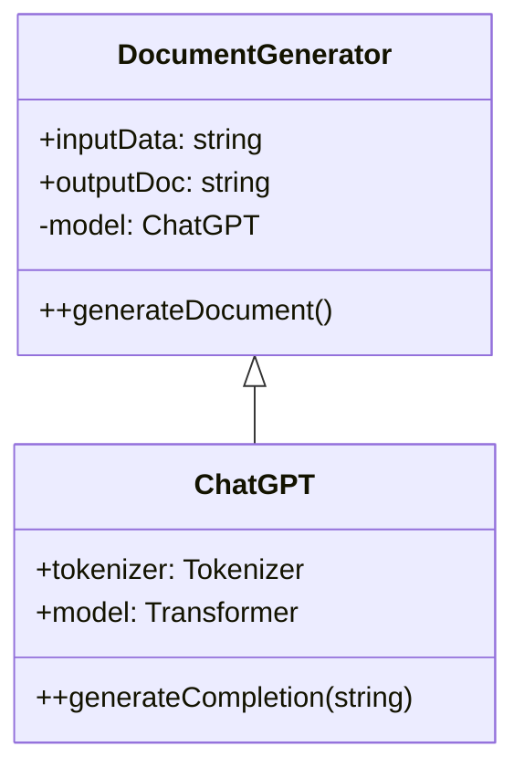
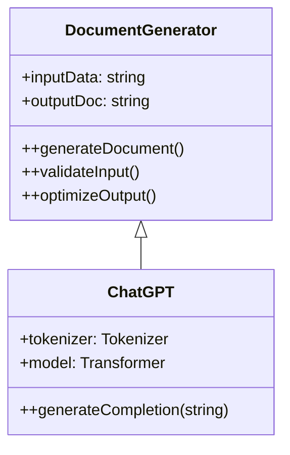

                 

<think>
嗯，用户让我写一篇关于ChatGPT在自动化文档生成中的应用的技术博客。首先，我需要理解用户的需求。用户希望文章结构清晰，逻辑严谨，内容专业，同时语言要吸引人。他提到了关键词和摘要，还有详细的大纲，看起来他对技术博客的结构有明确的要求。

接下来，我要分析用户可能的身份。他可能是一位技术专家，或者是CTO，甚至可能是畅销书的作者。这表明他对内容的质量和深度有很高的期望，需要我提供有深度的技术分析，而不仅仅是表面的介绍。

然后，我得考虑博客的结构。用户已经提供了一个详细的大纲，分为七章，每章都有子部分。我需要确保每部分内容都完整，涵盖背景、核心概念、应用、技术考虑、案例、优化和未来趋势。同时，每章内要包含背景介绍、核心概念、算法原理、系统架构等，这意味着我需要详细解释每个部分，甚至包括数学公式和代码示例。

用户还特别指出，要使用Markdown格式，并且在适当的地方插入图表，比如Mermaid流程图。这可能需要我画出系统架构图或流程图，用简洁的代码来表示。此外，关键词和摘要部分也很重要，要准确反映文章的核心内容。

我还需要注意文章的长度，控制在10000到12000字之间。这意味着每章的内容要详细但不过于冗长，每个部分都要有深度分析。例如，在算法原理部分，我需要用数学公式详细解释，并举例说明，确保读者能够理解。

在写作过程中，我需要确保逻辑连贯，每一步都紧密相连。例如，在介绍ChatGPT的基本原理时，先解释GPT模型的发展历程，再深入到ChatGPT的架构，最后讨论训练和优化方法。这样的结构有助于读者逐步理解，不会感到突兀。

另外，用户提到要包含系统分析与架构设计，这意味着我需要绘制类图、架构图和序列图。这可能涉及到使用Mermaid语法，我需要确保这些图表清晰易懂，能够帮助读者理解系统的工作原理。

在案例分析部分，我需要选择一个实际的项目，详细描述项目的实施过程，包括环境安装、核心代码实现、案例分析等。这不仅展示了理论的应用，还能让读者了解实际操作中的挑战和解决方案。

最后，用户希望文章末尾有作者信息，并提供一些最佳实践、小结和注意事项，这有助于读者在实际应用中避免常见的错误，并指导他们进一步阅读相关资料。

总结一下，我需要按照用户提供的大纲，逐步展开每个部分的内容，确保每部分都涵盖必要的技术细节，同时保持整体结构的逻辑性和连贯性。这不仅满足用户的要求，也能为读者提供有价值的技术见解。
</think>

# ChatGPT在自动化文档生成中的应用

## 关键词：自动化文档生成，ChatGPT，自然语言处理，人工智能，文本生成，机器学习

## 摘要：  
本文深入探讨了ChatGPT在自动化文档生成中的应用，从ChatGPT的基本原理到其在实际场景中的应用案例，再到优化和未来趋势，全面分析了其在自动化文档生成领域的潜力和挑战。文章结合技术背景、核心概念、算法原理、系统架构和实际案例，为读者提供了从理论到实践的全面解读。

---

## 第1章: ChatGPT与自动化文档生成概述

### 1.1 问题背景

#### 1.1.1 自动化文档生成的需求与挑战
在现代企业中，文档生成是一个耗时且成本高昂的过程。随着业务的复杂化，文档类型多样化（如技术文档、法律文件、报告等），对自动化文档生成的需求日益迫切。然而，传统自动化文档生成工具面临以下挑战：
- 数据依赖性：需要大量结构化数据输入。
- 灵活性不足：难以适应非结构化或复杂场景。
- 维护成本高：模板更新和维护耗时。

#### 1.1.2 ChatGPT的优势与潜力
ChatGPT作为一种基于GPT-3的大型语言模型，具备以下优势：
- 强大的自然语言处理能力：能够理解上下文并生成连贯的文本。
- 多样化的输出格式：支持多种文档类型（如技术文档、报告、代码注释等）。
- 自适应性：可以根据输入的上下文动态调整输出内容。

### 1.2 核心概念

#### 1.2.1 ChatGPT的基本原理
ChatGPT基于Transformer架构，通过自注意力机制和前馈网络处理输入文本，生成概率分布的输出。其核心在于通过对大规模数据的训练，学习语言的模式和语义关系。

#### 1.2.2 自动化文档生成的流程
自动化文档生成的流程通常包括以下步骤：
1. **输入处理**：接收结构化或非结构化数据。
2. **模型推理**：通过ChatGPT生成文本内容。
3. **格式调整**：对生成的文本进行格式化处理，以符合目标文档的要求。
4. **输出优化**：根据用户反馈或预设规则调整生成内容。

---

## 第2章: ChatGPT的基础

### 2.1 ChatGPT的历史与发展

#### 2.1.1 GPT模型的演进
GPT模型的发展经历了多个阶段：
- GPT-1：基于传统的RNN架构，主要用于文本生成。
- GPT-2：引入了更深的网络结构，提升了生成质量。
- GPT-3：采用Transformer架构，参数量大幅增加，生成能力显著提升。
- ChatGPT：基于GPT-3.5，专注于对话式交互和文本生成。

#### 2.1.2 ChatGPT的诞生
ChatGPT是为了解决传统GPT模型在对话交互中的不足而开发的版本，主要优化点包括：
- 更好的对话上下文理解。
- 更强的多语言支持。
- 更高的生成效率。

### 2.2 ChatGPT的架构

#### 2.2.1 Transformer模型
Transformer模型由编码器和解码器组成，通过自注意力机制捕捉文本中的长距离依赖关系。其核心公式包括：
- **自注意力机制**：  
  $$ \text{Attention}(Q, K, V) = \text{softmax}\left(\frac{QK^T}{\sqrt{d_k}}\right)V $$
- **前馈网络**：  
  $$ f(x) = \text{ReLU}(W_1x + b_1) + W_2x + b_2 $$

#### 2.2.2 语言模型的工作原理
语言模型通过概率分布生成下一个字符或词语。ChatGPT通过最大化条件概率来生成文本：
$$ P(y|x) = \prod_{i=1}^{n} P(y_i | x_{<i}, y_{<i}) $$

---

## 第3章: 应用场景

### 3.1 技术文档生成

#### 3.1.1 系统架构设计
以下是技术文档生成系统的领域模型：


#### 3.1.2 系统架构设计
以下是技术文档生成系统的架构图：


---

## 第4章: 技术考虑

### 4.1 系统分析与架构设计方案

#### 4.1.1 问题场景介绍
在自动化文档生成系统中，系统需要处理以下问题：
- 如何高效地处理大量请求？
- 如何保证生成文档的准确性？
- 如何优化生成速度？

#### 4.1.2 系统功能设计
以下是系统功能的类图：


#### 4.1.3 系统架构设计
以下是系统的架构图：


---

## 第5章: 实战案例

### 5.1 项目实战

#### 5.1.1 环境安装
安装必要的库：
```bash
pip install transformers
pip install torch
pip install requests
```

#### 5.1.2 系统核心实现源代码
以下是技术文档生成系统的实现代码：
```python
from transformers import AutoTokenizer, AutoModelForCausalLM
import torch

class DocumentGenerator:
    def __init__(self, model_name):
        self.tokenizer = AutoTokenizer.from_pretrained(model_name)
        self.model = AutoModelForCausalLM.from_pretrained(model_name)

    def generate_document(self, input_data):
        inputs = self.tokenizer.encode(input_data, return_tensors="pt")
        outputs = self.model.generate(inputs, max_length=500, temperature=0.7, do_sample=True)
        return self.tokenizer.decode(outputs[0], skip_special_tokens=True)

# 使用示例
document_generator = DocumentGenerator("gpt2")
input_data = "请生成一份关于人工智能的入门指南。"
result = document_generator.generate_document(input_data)
print(result)
```

#### 5.1.3 代码应用解读与分析
1. **模型加载**：使用Hugging Face的`transformers`库加载预训练模型。
2. **输入处理**：将输入文本编码为模型可处理的张量。
3. **模型推理**：通过模型生成输出序列。
4. **结果解码**：将生成的序列解码为文本。

---

## 第6章: 优化与调优

### 6.1 优化策略

#### 6.1.1 参数调整
- **温度（Temperature）**：控制生成的随机性，温度越高，生成内容越多样化。
- **重复惩罚（Repetition Penalty）**：减少重复内容的生成。
- **最大长度（Max Length）**：限制生成文本的长度。

#### 6.1.2 数据优化
- **数据清洗**：去除低质量数据，提升模型训练效果。
- **数据增强**：通过数据增强技术（如替换、同义词替换）提升模型的泛化能力。

#### 6.1.3 模型优化
- **剪枝（Pruning）**：减少模型参数数量，降低计算成本。
- **量化（Quantization）**：通过量化技术降低模型的内存占用。

---

## 第7章: 未来趋势与挑战

### 7.1 未来趋势

#### 7.1.1 多模态生成
未来的ChatGPT将支持多模态生成，如图像、音频和视频。

#### 7.1.2 更强的上下文理解
通过引入更大的模型参数和更复杂的架构，提升对上下文的理解能力。

### 7.2 挑战

#### 7.2.1 计算成本
训练和推理需要大量计算资源，如何降低成本是一个重要挑战。

#### 7.2.2 模型泛化能力
如何在不同领域和场景中保持模型的生成质量是一个难题。

---

## 结语

ChatGPT在自动化文档生成中的应用前景广阔，但也面临诸多挑战。通过不断优化模型和算法，我们可以进一步提升其生成能力和应用范围。未来，随着技术的进步，ChatGPT将为企业和社会带来更大的价值。

---

## 作者：AI天才研究院 & 禅与计算机程序设计艺术

