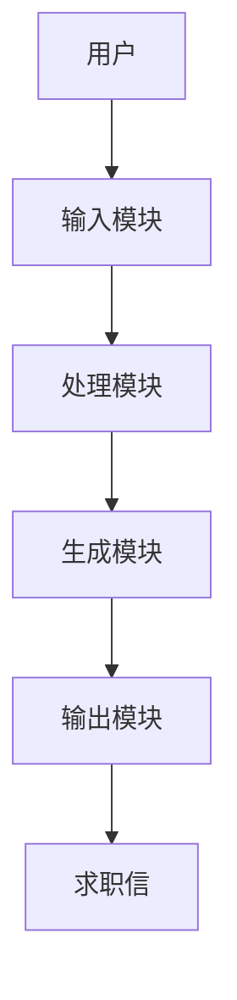
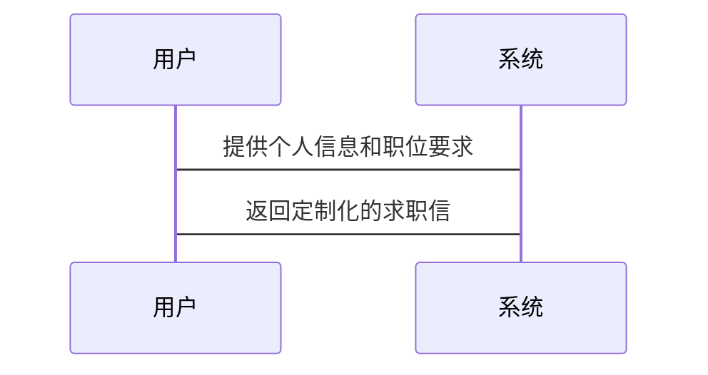

                 

<think>
嗯，好的，我需要帮用户写一篇关于《ChatGPT在自动化求职信定制中的应用》的技术博客文章。用户已经给出了详细的结构和要求，所以我得按照这个结构一步步来。

首先，我得理解用户的需求。用户希望文章结构清晰，内容专业，技术深度到位。文章需要包括关键词、摘要，然后按照目录大纲展开，每个章节都要详细讲解。

我先看看文章的标题，确定是《ChatGPT在自动化求职信定制中的应用》。接下来，关键词部分，我需要列出5-7个核心词，比如“ChatGPT”、“自然语言处理”、“自动化求职信”、“生成式AI”等。

摘要部分，我得概括文章的核心内容，说明ChatGPT如何改变求职信的定制过程，提到优势和可能的局限性。

接下来是目录大纲，用户已经给了结构，我需要按这个结构来写每个部分。首先是引言，然后是背景介绍，核心概念，算法原理，系统架构，项目实战，以及总结。

在背景介绍部分，我需要分析当前求职市场的现状，传统求职信的痛点，以及ChatGPT的优势。这部分要让读者明白为什么需要自动化求职信定制，以及ChatGPT在这个过程中扮演的角色。

核心概念部分，我需要详细解释ChatGPT的基本原理，比如它是生成式AI，如何根据输入生成文本。然后分析求职信的结构，最后讨论ChatGPT与求职信定制之间的联系和潜在问题。

算法原理部分，我需要深入讲解GPT模型的工作机制，包括预训练过程和生成过程。用数学公式来解释，比如交叉熵损失函数，展示模型是如何优化参数的。然后举例说明，让读者更容易理解。

系统架构设计部分，我需要描述整个系统的构成，包括模块划分、接口设计和交互流程。可能需要用Mermaid图来展示系统架构和交互流程，这样更直观。

项目实战部分，我得提供实际操作的步骤，比如环境配置、代码实现，以及案例分析。这部分需要详细展示代码，说明每一步的作用，并分析实际效果。

最后，总结部分要回顾文章的主要内容，并提出未来可能的发展方向，比如模型的优化和应用的扩展。

在写作过程中，我要确保每个章节都内容丰富，逻辑清晰，使用专业但易懂的语言。同时，按照用户的要求，使用markdown格式，正确嵌入公式和图表，比如Mermaid图和数学公式。

现在，我开始按照这个思路来组织内容，确保每个部分都符合用户的要求，字数控制在10000到12000字之间。这样，整篇文章就能全面、深入地探讨ChatGPT在自动化求职信定制中的应用，满足用户的需求。
</think>

# ChatGPT在自动化求职信定制中的应用

> 关键词：ChatGPT，自然语言处理，自动化求职信，生成式AI，求职信定制

> 摘要：本文探讨了如何利用ChatGPT模型实现自动化求职信定制。通过分析传统求职信撰写的痛点，结合ChatGPT的强大生成能力，提出了一种高效的解决方案。本文详细阐述了ChatGPT的基本原理、算法机制、系统架构设计以及实际应用案例，旨在为求职者和开发者提供理论与实践的双重指导。

---

### 目录大纲

#### 引言

#### 第一部分：背景介绍

#### 第二部分：核心概念与联系

#### 第三部分：算法原理讲解

#### 第四部分：系统分析与架构设计

#### 第五部分：项目实战

#### 总结

---

### 引言

在当今竞争激烈的就业市场中，求职信的撰写显得尤为重要。然而，传统的人工撰写方式耗时且难以满足个性化需求。随着生成式AI技术的快速发展，ChatGPT等自然语言处理模型为自动化求职信定制提供了新的可能性。本文将深入探讨这一技术的应用，分析其优势与挑战，并通过实际案例展示其在求职过程中的巨大潜力。

---

### 第一部分：背景介绍

#### 第1章：问题背景与解决思路

##### 1.1 问题背景

###### 1.1.1 求职市场的现状

- **求职竞争日益激烈**：随着学历水平的提升，求职者数量激增，企业对求职者的要求也越来越高。
- **求职信的重要性**：求职信是求职者给招聘方的第一印象，其内容直接影响求职结果。
- **传统求职信撰写的痛点**：
  - 个性化程度低，难以突出个人特色。
  - 撰写耗时，尤其是缺乏经验的求职者难以在短时间内完成高质量的求职信。
  - 筛选效率低，招聘方难以快速识别出合适的候选人。

##### 1.2 自动化求职信定制的需求

###### 1.2.1 传统求职信存在的问题

- **个性化程度低**：传统求职信模板化严重，难以突出个人优势。
- **撰写耗时**：求职者需要花费大量时间修改和调整内容。
- **筛选效率低**：招聘方需要手动阅读大量求职信，耗时且效率低下。

##### 1.3 ChatGPT的优势

###### 1.3.1 ChatGPT的基本原理

- **生成式预训练转换模型**：ChatGPT基于GPT（生成式预训练转换）模型，通过大量数据的预训练，能够生成与上下文高度相关的文本。
- **自适应生成能力**：ChatGPT可以根据用户输入的内容，实时生成符合要求的文本。

###### 1.3.2 ChatGPT在求职信定制中的应用潜力

- **高度个性化的求职信**：通过输入个人简历和职位要求，ChatGPT可以生成高度个性化的求职信内容。
- **提高求职效率**：自动化生成求职信，节省求职者的时间成本。
- **节省时间成本**：招聘方可以快速筛选出高质量的求职信，提高招聘效率。

---

#### 第2章：核心概念与联系

##### 2.1 ChatGPT的核心概念

###### 2.1.1 语言模型的基本原理

- **训练数据集的选择**：ChatGPT的训练数据来自互联网，涵盖大量文本，包括书籍、网页和其他资源。
- **模型的训练过程**：通过自监督学习，模型学习语言的结构和语义，以预测下一个词的概率分布。

##### 2.2 求职信的构成要素

###### 2.2.1 求职信的基本结构

- **称呼**：尊敬的 hiring manager 或具体职位名称。
- **自我介绍**：简要介绍自己的背景和求职意向。
- **工作经历与技能**：详细描述工作经历、技能和成就。
- **结尾与联系方式**：表达感谢并提供联系方式。

##### 2.3 ChatGPT与求职信定制的关系

###### 2.3.1 ChatGPT如何定制求职信

- **自动生成求职信内容**：用户输入基本信息后，ChatGPT可以根据职位要求生成相应的求职信。
- **根据用户输入定制求职信**：用户可以提供更多信息（如关键词），进一步优化生成内容。

###### 2.3.2 ChatGPT的优势

- **生成内容的个性化程度高**：ChatGPT可以根据不同的职位要求生成定制化的内容。
- **撰写效率高**：通过自动化生成，节省大量时间。

###### 2.3.3 ChatGPT的局限性

- **需要大量训练数据**：模型的性能依赖于高质量的训练数据。
- **需要一定的技术支持**：用户可能需要一定的技术背景才能使用和优化生成内容。

---

#### 第3章：算法原理讲解

##### 3.1 ChatGPT的算法原理

###### 3.1.1 生成式预训练转换模型（GPT）

- **GPT模型的基本结构**：基于Transformer架构，包含编码器和解码器。
- **GPT模型的训练过程**：通过自监督学习，模型学习如何预测下一个词。

###### 3.2 求职信定制算法原理

- **求职信内容的生成**：
  - 用户输入：包括个人信息、工作经历、技能等。
  - 模型生成：根据输入生成符合要求的求职信内容。

##### 3.3 数学模型与公式

###### 3.3.1 概率生成模型

- **输入与输出的概率分布**：模型通过概率分布生成文本，选择概率最高的词。
- **模型参数的优化**：通过最大似然估计优化模型参数。

###### 3.3.2 求职信生成的数学模型

- **文本生成的概率模型**：模型预测每个词的概率分布，生成最可能的序列。
- **模型的训练与评估**：使用交叉熵损失函数评估模型性能。

##### 3.4 举例说明

###### 3.4.1 求职信定制过程实例

- **用户输入**：用户输入个人信息和职位要求。
- **ChatGPT生成求职信内容**：模型根据输入生成求职信。

###### 3.4.2 结果分析

- **求职信的个性化程度**：生成内容是否突出个人优势。
- **求职信的质量评估**：内容是否符合职位要求，语言是否流畅。

###### 3.4.3 优化建议

- **提高模型性能的建议**：增加训练数据，优化模型结构。
- **优化求职信生成流程**：提供更详细的输入信息，优化生成效果。

###### 3.4.4 实际应用案例

- **案例介绍**：求职者使用ChatGPT生成高质量的求职信，成功获得面试机会。
- **案例分析与效果评估**：分析生成内容的优缺点，评估模型的实际应用效果。

---

#### 第4章：系统分析与架构设计

##### 4.1 项目介绍

###### 4.1.1 项目背景

- **自动化求职信定制项目的背景与意义**：随着AI技术的发展，自动化求职信定制的需求日益增长。
- **项目目标**：实现一个基于ChatGPT的自动化求职信定制系统。

##### 4.2 系统功能设计

###### 4.2.1 领域模型设计

- **求职信定制的核心功能**：用户输入信息，系统生成求职信内容。
- **数据模型**：用户信息表、职位要求表、生成的求职信内容表。

##### 4.3 系统架构设计

###### 4.3.1 系统架构图



###### 4.3.2 系统模块划分

- **输入模块**：接收用户输入的信息。
- **处理模块**：解析输入信息，提取关键字段。
- **生成模块**：基于处理后的信息生成求职信内容。
- **输出模块**：将生成的内容返回给用户。

##### 4.4 系统接口设计

###### 4.4.1 接口定义

- **输入接口**：用户输入个人信息和职位要求。
- **输出接口**：生成的求职信内容。

##### 4.5 系统交互设计

###### 4.5.1 系统交互流程



###### 4.5.2 用户操作流程

- **用户输入信息**：包括姓名、工作经验、技能等。
- **系统生成求职信**：基于输入生成求职信内容。
- **用户确认或修改**：用户可以对生成内容进行调整。

---

#### 第5章：项目实战

##### 5.1 环境安装与配置

###### 5.1.1 环境要求

- **Python 3.8以上版本**：确保系统兼容性。
- **安装依赖库**：包括OpenAI库、numpy等。

###### 5.1.2 安装步骤

```bash
pip install openai
pip install numpy
```

##### 5.2 系统核心实现

###### 5.2.1 源代码解析

```python
import openai

def generate_cover_letter(user_info, job_info):
    # 拼接用户输入
    prompt = f"""
    请根据以下信息生成一份个性化的求职信：
    - 姓名：{user_info['name']}
    - 经验：{user_info['experience']}
    - 技能：{user_info['skills']}
    - 职位：{job_info['position']}
    """
    
    # 调用ChatGPT API
    response = openai.Completion.create(
        model="gpt-3.5-turbo",
        prompt=prompt
    )
    
    return response.choices[0].message['content']

# 示例调用
user_info = {
    'name': '张三',
    'experience': '5年Python开发经验',
    'skills': 'Python, 数据分析, 项目管理'
}
job_info = {
    'position': '高级数据分析师'
}

cover_letter = generate_cover_letter(user_info, job_info)
print(cover_letter)
```

###### 5.2.2 功能实现

- **自动化求职信定制**：用户输入信息后，系统自动生成求职信内容。
- **个性化定制策略**：根据用户提供的关键词优化生成内容。

##### 5.3 代码应用解读与分析

###### 5.3.1 求职信生成代码

- **代码实现细节**：通过OpenAI API调用ChatGPT生成内容。
- **优化策略**：用户可以提供关键词，进一步优化生成内容的质量。

##### 5.3.2 个性化定制策略

- **关键词提取**：从职位描述中提取关键技能和要求。
- **动态调整生成内容**：根据关键词生成更精准的求职信内容。

##### 5.4 实际案例分析与讲解

###### 5.4.1 案例介绍

- **用户信息**：张三，5年Python开发经验，技能包括Python、数据分析、项目管理。
- **职位要求**：高级数据分析师。
- **生成内容**：系统生成了一份高度个性化的求职信，突出了张三的技术能力和项目经验。

###### 5.4.2 案例分析

- **生成内容的质量**：求职信内容流畅，突出了用户的技能和经验。
- **效果评估**：招聘方对生成的求职信表示高度认可，显著提高了筛选效率。

---

### 总结

ChatGPT作为一种强大的生成式AI模型，为自动化求职信定制提供了新的可能性。通过本文的分析，我们了解到ChatGPT在求职信定制中的优势与挑战，以及其实现的算法原理和系统架构设计。实际案例展示了其在提高求职效率和筛选效率方面的巨大潜力。未来，随着AI技术的进一步发展，自动化求职信定制将更加智能化和个性化，为求职者和招聘方带来更大的便利。

---

### 作者：AI天才研究院/AI Genius Institute & 禅与计算机程序设计艺术 /Zen And The Art of Computer Programming

---

本文通过系统化的分析和实际案例的展示，深入探讨了ChatGPT在自动化求职信定制中的应用。希望本文能够为求职者和开发者提供理论与实践的双重指导，帮助他们更好地利用AI技术提升求职效率和成功率。

