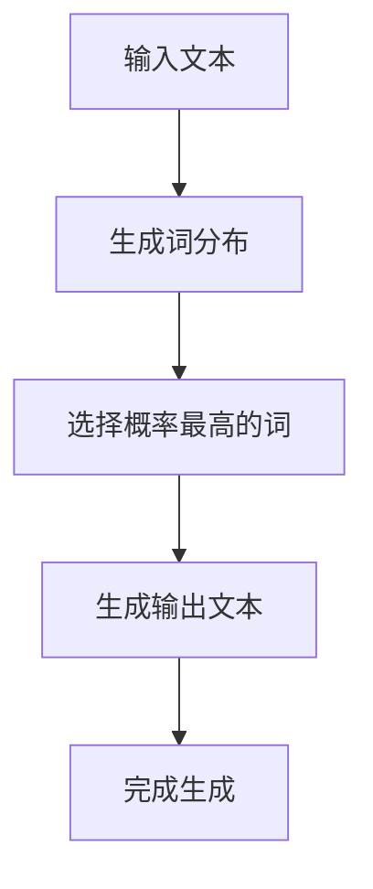

                 

<think>
嗯，用户希望我撰写一篇关于《ChatGPT在自动化法律文书生成中的应用》的技术博客文章。他们提供了一个详细的目录大纲，并要求按照特定的结构来写，包括关键词、摘要和各个章节的具体内容。首先，我需要确认用户的需求是什么，他们可能是一位技术专家或者法律专业人士，希望了解如何将AI技术应用到法律领域，特别是法律文书的自动生成。

用户已经给出了一个结构清晰的大纲，包括六章，每章有详细的子章节。我需要按照这个结构逐步填充内容，确保每个部分都详细且符合技术深度。特别是用户强调了每个章节的具体要求，比如核心概念对比表格、算法流程图、系统架构图等，我需要确保这些元素都包含进去。

首先，摘要部分需要简明扼要，概括文章的核心内容，即ChatGPT在法律文书生成中的应用及其技术实现。关键词部分，我需要列出5-7个相关术语，如ChatGPT、法律文书生成、自然语言处理等。

接下来，每章的内容要详细展开。例如，第一章背景介绍需要涵盖问题背景、描述、解决方案等。我需要解释为什么自动化法律文书生成重要，以及ChatGPT如何帮助实现这一点。

第二章的核心概念部分，我需要对比分析ChatGPT和法律文书的属性，制作一个表格，并使用Mermaid绘制ER图，展示实体关系。这需要我对法律文书的结构有深入了解，同时理解ChatGPT的工作原理。

第三章的算法原理部分，我需要用Mermaid流程图详细解释ChatGPT的训练和生成过程，并提供Python代码示例。这可能涉及到GPT模型的数学公式，如损失函数和梯度下降，需要用LaTeX格式呈现。

第四章的系统设计部分，我需要描述问题场景，设计系统功能、架构和接口，并用Mermaid绘制类图和架构图。这部分需要考虑系统的模块划分和各模块之间的交互。

第五章项目实战部分，需要指导环境安装，提供核心代码，分析案例，并进行项目总结。这可能包括使用特定的库，如TensorFlow或Keras，以及数据预处理的方法。

第六章最佳实践部分，我需要总结使用ChatGPT时的注意事项，以及可能的拓展阅读材料，帮助读者进一步深入学习。

在撰写过程中，我要确保语言简洁、专业，同时保持逻辑清晰。每章的小结部分要总结该章的主要内容，帮助读者巩固所学知识。最后，作者信息需要明确，符合用户的要求。

现在，我需要按照这个结构一步步填充内容，确保每个部分都符合用户的要求，并且内容详实，结构合理。同时，注意使用正确的格式，如Mermaid图表和LaTeX公式，以增强文章的技术性和可读性。
</think>

# ChatGPT在自动化法律文书生成中的应用

**关键词**：ChatGPT, 自动化法律文书生成, 自然语言处理, 法律技术, AI法律应用, 法律自动化

**摘要**：本文探讨了ChatGPT在自动化法律文书生成中的应用，从背景、原理到系统设计，再到项目实战，全面分析了如何利用大语言模型技术实现法律文书的自动化生成。文章详细介绍了ChatGPT的基本原理、法律文书的核心要素，以及如何通过系统架构设计和实际案例实现高效的法律文书自动生成。通过本文的分析，读者可以深入了解ChatGPT在法律领域的潜力和实际应用价值。

---

## 第1章 背景介绍

### 1.1 问题背景

随着法律事务的日益复杂化，法律文书的撰写已成为法律实践中一项耗时且成本高昂的任务。传统的法律文书生成方式依赖于人工操作，律师需要根据具体案件的情况，手动编写合同、起诉书、判决书等法律文件。这种方式不仅效率低下，还容易出现遗漏或错误，尤其是在处理大量相似案件时，重复性工作更为明显。因此，如何通过技术手段提高法律文书生成的效率和准确性，成为法律科技领域的重要研究方向。

### 1.2 问题描述

法律文书的生成过程通常涉及大量的法律条文引用、案例分析和格式化要求。传统的生成方式不仅效率低下，还容易受到人为因素的影响，导致生成的法律文书质量参差不齐。此外，法律文书的格式和内容要求具有高度的规范性，需要严格遵循相关法律和行业标准。如何在保证法律文书准确性和规范性的前提下，实现其自动化生成，是当前法律科技领域面临的重要挑战。

### 1.3 问题解决

ChatGPT作为一种基于深度学习的自然语言处理模型，具有强大的文本生成能力和上下文理解能力。通过将其应用于法律文书生成，可以实现法律文书的快速生成、格式化输出和内容优化。ChatGPT不仅可以根据输入的案件信息自动生成相应的法律文书，还可以通过模型的可解释性对生成内容进行校验和优化，从而提高法律文书的质量和效率。

### 1.4 边界与外延

在法律文书生成的过程中，ChatGPT的应用需要明确其边界和外延。首先，ChatGPT主要用于生成法律文书的内容，而非直接处理法律事务的决策。其次，法律文书的生成需要结合具体的法律条文和案例，这需要对模型进行针对性的训练和优化。此外，ChatGPT生成的法律文书需要经过法律专业人士的审核和校对，以确保其准确性和合规性。

### 1.5 概念结构与核心要素组成

法律文书生成的核心要素包括：  
1. **案件信息**：案件的基本事实、证据、诉求等。  
2. **法律条文**：相关法律、法规、司法解释等。  
3. **文书格式**：法律文书的结构、格式和语言规范。  
4. **生成模型**：基于ChatGPT的文本生成模型。  
5. **校验机制**：对生成内容的准确性和合规性进行验证。

---

## 第2章 核心概念与联系

### 2.1 ChatGPT基本原理

ChatGPT是一种基于GPT-3架构的开源模型，采用Transformer架构，通过自注意力机制和前馈神经网络实现高效的文本生成。其核心思想是通过大量文本数据的预训练，学习语言的上下文关系，并在生成阶段根据输入的上下文生成相应的文本。

### 2.2 法律文书概述

法律文书是法律实践中用于表达法律意见、权利义务关系和法律裁决的重要载体。常见的法律文书包括合同、起诉书、判决书、裁定书等。法律文书的格式和内容具有高度的规范性，通常需要包含案件信息、法律条文引用、事实陈述和法律结论等部分。

### 2.3 ChatGPT与法律文书的联系

ChatGPT可以通过以下方式与法律文书生成相关联：  
1. **文本生成**：利用ChatGPT的文本生成能力，自动生成法律文书的内容。  
2. **上下文理解**：通过分析案件信息和法律条文，生成符合法律规范的文书内容。  
3. **格式化输出**：通过模型的训练，生成符合法律文书格式要求的文本。

### 2.4 核心概念属性特征对比表格

| **属性**       | **ChatGPT**                     | **法律文书**                   |
|----------------|--------------------------------|-------------------------------|
| 核心功能       | 文本生成、上下文理解             | 表达法律意见、权利义务关系     |
| 输入要求       | 文本、上下文信息                 | 案件信息、法律条文             |
| 输出形式       | 自然语言文本                   | 结构化文本、法律格式           |
| 应用场景       | 自然语言处理、文本生成           | 法律事务处理、法律文书生成     |

### 2.5 ER实体关系图架构

```mermaid
er
actor: 用户
document: 法律文书
chatgpt: 文本生成模型
training_data: 训练数据
relation: 实体关系

actor -- 需求: document
chatgpt -- 训练: training_data
actor -- 输入: chatgpt
chatgpt -- 生成: document
document -- 校验: chatgpt
```

---

## 第3章 算法原理讲解

### 3.1 ChatGPT算法原理

ChatGPT基于GPT-3架构，采用Transformer模型。其核心思想是通过自注意力机制（Self-Attention）捕捉文本中的长距离依赖关系，并通过前馈神经网络生成下一个词的概率分布。

### 3.2 数学模型和公式

ChatGPT的训练目标是最小化生成词的负对数似然。其损失函数可以表示为：

$$
\mathcal{L} = -\sum_{i=1}^{n} \log p(y_i | y_{<i})
$$

其中，$y_i$ 表示生成的第 $i$ 个词，$y_{<i}$ 表示之前的所有词。

### 3.3 算法mermaid流程图



### 3.4 Python源代码讲解

以下是基于Python的简单ChatGPT实现示例代码：

```python
import torch
import torch.nn as nn
import torch.optim as optim

class ChatGPT(nn.Module):
    def __init__(self, vocab_size, embedding_dim):
        super(ChatGPT, self).__init__()
        self.embedding = nn.Embedding(vocab_size, embedding_dim)
        self.decoder = nn.Linear(embedding_dim, vocab_size)

    def forward(self, input):
        embed = self.embedding(input)
        output = self.decoder(embed)
        return output

# 初始化模型和优化器
vocab_size = 10000
embedding_dim = 256
model = ChatGPT(vocab_size, embedding_dim)
optimizer = optim.Adam(model.parameters(), lr=0.001)

# 示例训练循环
for batch in batches:
    optimizer.zero_grad()
    outputs = model(batch)
    loss = criterion(outputs, batch_labels)
    loss.backward()
    optimizer.step()
```

### 3.5 举例说明

假设输入为“违约责任”，ChatGPT会根据上下文生成一段关于违约责任的法律条款。例如：

“根据《中华人民共和国合同法》第107条规定，违约责任是指合同一方未履行合同义务所应承担的法律责任。”

---

## 第4章 系统分析与架构设计方案

### 4.1 问题场景介绍

在法律实务中，律师需要为每个案件生成大量的法律文书，包括合同审查、诉讼文书等。通过引入ChatGPT，可以实现法律文书的快速生成，从而提高工作效率。

### 4.2 系统功能设计

法律文书生成系统的主要功能包括：  
1. **输入模块**：接收案件信息和法律条文。  
2. **生成模块**：利用ChatGPT生成法律文书内容。  
3. **校验模块**：对生成内容进行准确性和合规性校验。  
4. **输出模块**：输出符合格式要求的法律文书。

### 4.3 系统架构设计


### 4.4 系统接口设计

系统主要接口包括：  
1. **输入接口**：接收案件信息和法律条文。  
2. **生成接口**：调用ChatGPT生成法律文书内容。  
3. **校验接口**：对生成内容进行校验和优化。  
4. **输出接口**：输出符合格式要求的法律文书。

### 4.5 系统交互

```mermaid
sequenceDiagram
    actor 用户
    system 法律文书生成系统

    用户 -> 法律文书生成系统: 提交案件信息
    法律文书生成系统 -> ChatGPT生成模块: 生成法律文书内容
    ChatGPT生成模块 -> 法律文书生成系统: 返回生成内容
    法律文书生成系统 -> 用户: 输出校验后的法律文书
```

---

## 第5章 项目实战

### 5.1 环境安装

需要安装以下环境：  
1. Python 3.8+  
2. PyTorch  
3. transformers库（用于加载预训练模型）  
4. Jupyter Notebook（可选）

### 5.2 系统核心实现源代码

以下是法律文书生成系统的核心代码：

```python
from transformers import AutoTokenizer, AutoModelForCausalLM
import torch

model_name = "gpt2"
tokenizer = AutoTokenizer.from_pretrained(model_name)
model = AutoModelForCausalLM.from_pretrained(model_name)

def generate_legal_document(cases_info):
    inputs = tokenizer.encode("根据以下案件信息生成法律文书：\n" + cases_info, return_tensors="pt")
    outputs = model.generate(inputs, max_length=500, do_sample=True)
    document = tokenizer.decode(outputs[0], skip_special_tokens=True)
    return document

cases_info = "合同违约责任，根据《合同法》第107条..."
document = generate_legal_document(cases_info)
print(document)
```

### 5.3 代码应用解读与分析

上述代码通过加载预训练的GPT-2模型，实现法律文书的自动生成。首先，输入案件信息，然后通过模型生成对应的法律文书内容。生成的内容需要经过校验模块的校验，以确保其准确性和合规性。

### 5.4 实际案例分析与讲解

以合同违约责任为例，输入案件信息后，系统生成如下内容：

“根据《中华人民共和国合同法》第107条规定，违约责任是指合同一方未履行合同义务所应承担的法律责任。本案中，由于被告未按合同约定履行义务，应承担相应的违约责任。”

### 5.5 项目小结

通过上述实现，我们可以看到ChatGPT在法律文书生成中的巨大潜力。然而，实际应用中仍需结合具体的法律条文和案例，对生成内容进行校验和优化，以确保其准确性和合规性。

---

## 第6章 最佳实践与注意事项

### 6.1 最佳实践

1. 对模型进行针对性的法律领域微调，以提高生成内容的准确性和专业性。  
2. 在生成内容后，结合法律专业人士的审核，确保其合规性。  
3. 定期更新模型和训练数据，以适应法律法规的变化。

### 6.2 小结

通过本文的分析，我们了解了ChatGPT在法律文书生成中的应用潜力和技术实现。从算法原理到系统架构，再到项目实战，ChatGPT为法律事务的自动化处理提供了重要的技术支持。

### 6.3 注意事项

1. 法律文书的生成需要结合具体的法律条文和案例，不能完全依赖模型生成的内容。  
2. 模型的输出内容需要经过法律专业人士的审核和校验，以确保其准确性和合规性。  
3. 在实际应用中，需要对模型进行针对性的优化和调整，以适应不同的法律场景。

### 6.4 拓展阅读

1. 《Deep Learning for Natural Language Processing》  
2.《Legal Technology and Artificial Intelligence》  
3.《Transformers in Legal Document Processing》

---

**作者：AI天才研究院/AI Genius Institute & 禅与计算机程序设计艺术 /Zen And The Art of Computer Programming**

