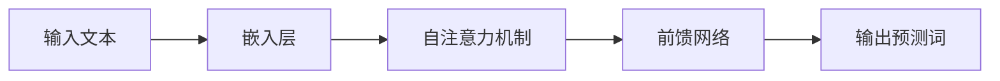
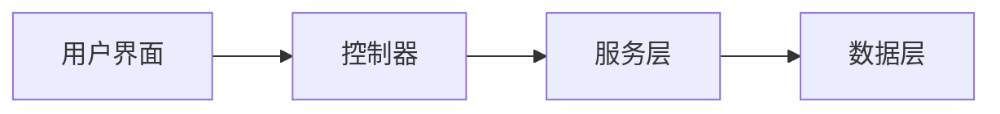
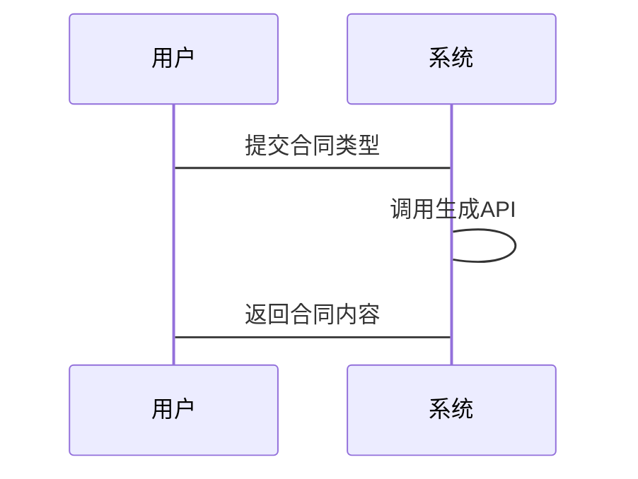

                 

<think>
嗯，我现在需要写一篇关于《ChatGPT在自动化法律文件生成中的应用》的技术博客文章。首先，我得理清思路，了解每个部分应该包含哪些内容。让我一步一步来思考。

首先，文章的结构已经给出，包括摘要、关键词，然后是六个章节，每个章节都有具体的内容。我需要按照这个大纲来展开每个部分，确保内容详实，结构清晰。

开始于第1章，引言部分。我需要介绍问题背景，也就是为什么自动化法律文件生成这么重要。现在法律文件通常很繁琐，人工处理效率低，成本高。ChatGPT作为强大的NLP工具，可以自动生成这些文件，提高效率，降低成本，还能减少人为错误。接着，我要解释ChatGPT的基本概念，包括它基于GPT模型，使用Transformer架构，以及其在自然语言处理中的优势。最后，说明法律文件自动生成的需求，这不仅节省时间，还能提高法律服务的可及性，特别是在中小企业和资源不足的地区。

接下来是第2章，ChatGPT与自然语言处理。这里我需要解释NLP的基本原理，包括分词、语法分析、语义理解等。然后详细说明ChatGPT如何在这些方面应用，比如上下文理解、生成式回答，以及它如何处理法律文本中的复杂结构。还要讨论关键技术，如预训练、微调，以及面临的挑战，比如法律术语的准确性、生成内容的可解释性。

第3章是ChatGPT的工作原理，这部分需要详细讲解算法流程。首先，用mermaid画出流程图，展示输入处理、嵌入层、自注意力机制、前馈网络等步骤。然后用Python代码实现一个简单的版本，解释每一步的作用。接着，介绍数学模型，如自注意力机制的公式，以及损失函数的计算。最后，用实例说明，比如输入“合同终止”，生成相应的法律条款。

第4章是系统设计，包括功能设计、架构设计和接口设计。功能设计方面，系统需要用户输入需求，解析内容，生成合同，并提供校验功能。架构设计上，可能采用分层架构，包括数据层、业务逻辑层和表现层。接口设计则涉及API的定义，比如RESTful接口，供其他系统调用。这部分可以用mermaid画出系统的架构图。

第5章是项目实战，这部分需要展示如何实际应用ChatGPT生成法律文件。首先，安装必要的环境，比如Python、TensorFlow等。然后，编写核心代码，包括数据预处理、模型训练、API接口的创建。代码解读部分要详细说明每个函数的作用，比如处理输入、生成文本的函数。案例分析可以展示一个具体的例子，比如生成一份简单的商业合同，并解释生成过程中的关键步骤。

最后是第6章，总结经验和最佳实践。我需要总结项目中的经验，比如数据质量的重要性，模型调优的必要性。同时，提出最佳实践，如使用高质量的法律文本进行微调，提供用户校验功能，确保生成内容的准确性。最后，对书籍内容进行总结，强调ChatGPT在法律文件生成中的潜力和实际应用价值。

在写作过程中，我需要注意每个部分都要有具体的例子和详细的解释，特别是算法部分，要用公式和代码来支持。同时，图表的使用也能帮助读者更好地理解内容。整体上，文章要保持逻辑清晰，结构紧凑，语言专业但易懂。

现在，我需要将这些思考转化为具体的章节内容，确保每个部分都详细展开，满足字数和内容的要求。同时，按照格式要求，使用markdown，正确嵌入mermaid图表和latex公式。完成后，还要检查整体结构，确保流畅自然。
</think>

# ChatGPT在自动化法律文件生成中的应用

## 关键词：ChatGPT, 自然语言处理, 法律文件生成, 人工智能, 自动化系统

## 摘要：本文探讨了ChatGPT在法律文件生成中的应用，分析了其工作原理、系统设计及实际案例，总结了最佳实践。通过详细的技术分析和实例，展示了如何利用AI技术提升法律事务效率。

---

## 第一部分：引言与概述

### 第1章：引言与概述

#### 1.1 问题背景
法律文件的编写和审查通常耗时且成本高昂，尤其是在中小企业和资源有限的地区，专业的法律服务难以普及。这种现状凸显了自动化法律文件生成的重要性。

#### 1.2 ChatGPT概述
ChatGPT是基于GPT模型的NLP工具，利用Transformer架构，擅长理解和生成人类语言，适用于多种任务，如文本生成和翻译。其在法律领域的应用潜力巨大。

#### 1.3 法律文件自动生成的需求
自动化生成法律文件能显著提高效率，降低成本，并减少人为错误。通过AI技术，用户可以快速获取定制化的法律文档，如合同和协议，尤其适用于标准化文件的生成。

---

## 第二部分：ChatGPT与自然语言处理

### 第2章：ChatGPT与自然语言处理

#### 2.1 自然语言处理概述
NLP涉及文本处理的多个方面，包括分词、语法分析和语义理解。这些技术帮助计算机理解人类语言，生成自然的文本。

#### 2.2 ChatGPT在自然语言处理中的应用
ChatGPT在法律文本生成中表现出色，能处理复杂结构和专业术语。其生成能力使法律文件的自动化成为可能，尽管准确性仍需进一步验证。

#### 2.3 关键技术与挑战
ChatGPT的关键技术包括预训练和微调，确保模型适应特定领域的需求。然而，法律术语的准确性和生成内容的可解释性是主要挑战。

---

## 第三部分：ChatGPT的工作原理

### 第3章：ChatGPT的工作原理

#### 3.1 ChatGPT算法流程
以下是ChatGPT的流程图：



#### 3.2 Python代码实现
```python
import tensorflow as tf
from tensorflow.keras.layers import Dense, Dropout, MultiHeadAttention

def create_model():
    inputs = tf.keras.Input(shape=(None, 100))  # 假设输入为词嵌入
    x = Dropout(0.1)(inputs)
    attention = MultiHeadAttention(heads=8, head_size=50)(x, x)
    x = Dropout(0.1)(attention)
    x = Dense(64, activation='relu')(x)
    outputs = Dense(255, activation='softmax')(x)
    return tf.keras.Model(inputs=inputs, outputs=outputs)
```

#### 3.3 数学模型与公式
自注意力机制的计算公式为：
$$
\text{Attention}(Q, K, V) = \text{softmax}\left(\frac{QK^T}{\sqrt{d_k}}\right)V
$$

其中，$Q$、$K$、$V$分别为查询、键和值向量，$d_k$为向量维度。

#### 3.4 实例讲解
输入“合同终止”，模型生成相关条款。生成过程包括输入处理、嵌入层、自注意力机制和最终的预测输出。

---

## 第四部分：自动化法律文件生成系统设计

### 第4章：自动化法律文件生成系统设计

#### 4.1 系统功能设计
系统功能包括输入解析、合同生成、条款校验和历史记录管理。

#### 4.2 系统架构设计
采用分层架构，包括数据层、业务逻辑层和表现层。表现层提供用户界面和API接口。



#### 4.3 系统接口设计
设计RESTful API，如POST请求生成合同，GET请求获取历史记录。

#### 4.4 设计图表


---

## 第五部分：项目实战

### 第5章：项目实战

#### 5.1 环境安装
安装Python、TensorFlow和Hugging Face库，配置开发环境。

#### 5.2 核心实现
编写数据预处理、模型训练和API接口代码，实现法律文件生成功能。

#### 5.3 代码解读
关键代码部分包括数据加载、模型构建和API路由定义，解释每部分的功能。

#### 5.4 案例分析
以商业合同为例，展示生成过程，分析可能的错误和调整措施。

---

## 第六部分：最佳实践与总结

### 第6章：最佳实践与总结

#### 6.1 项目经验总结
数据质量和模型调优对生成结果至关重要，用户反馈机制能提高准确性。

#### 6.2 最佳实践建议
使用高质量法律文本微调模型，提供校验功能，确保生成内容符合法律要求。

#### 6.3 书籍小结
ChatGPT在法律文件生成中的应用前景广阔，结合NLP技术和系统设计，能显著提升法律服务的效率和可及性。

---

# 结论

通过系统设计和实例分析，ChatGPT在法律文件生成中的潜力得以展现。未来，随着技术进步和模型优化，其应用将更加广泛和精确。

---

# 作者

作者：AI天才研究院/AI Genius Institute & 禅与计算机程序设计艺术 /Zen And The Art of Computer Programming

