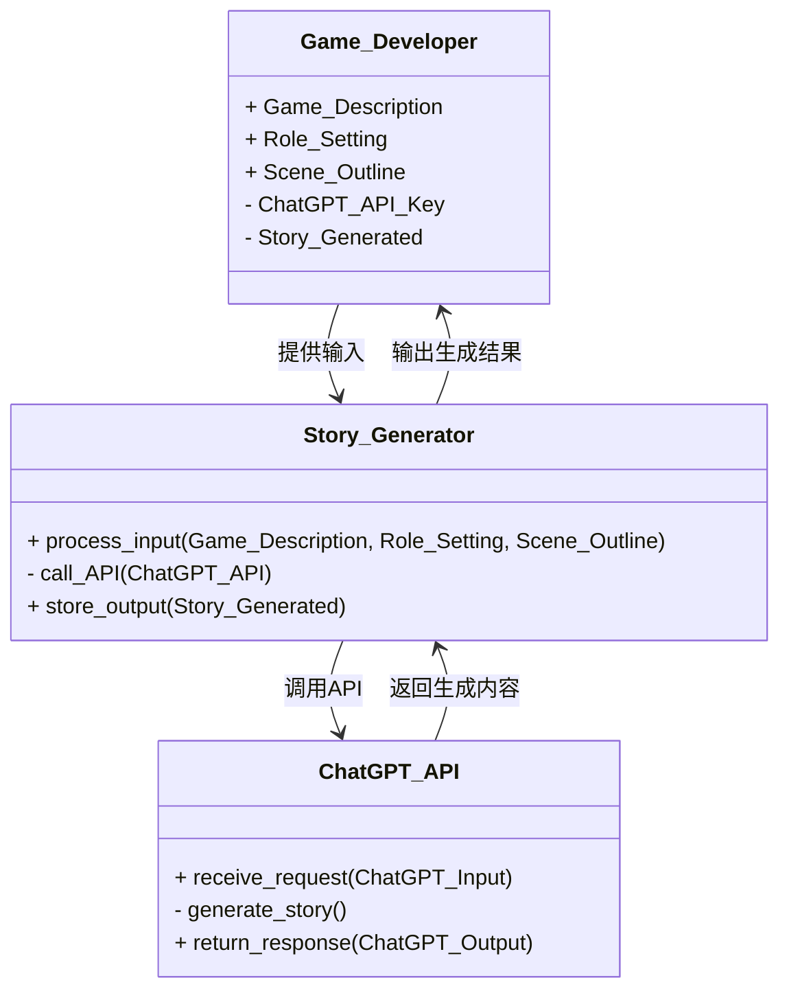
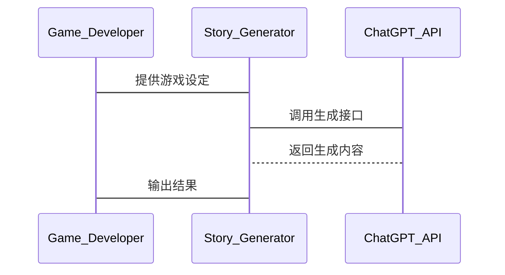

                 

<think>
嗯，用户希望我以《ChatGPT在自动化游戏剧情生成中的应用》为标题，撰写一篇技术博客。首先，我需要理解用户的需求。他是一位世界级的AI专家，CTO级别的，所以文章需要专业且有深度。

文章的结构已经给出，包括摘要、关键词和目录。我需要确保每个章节都详细且逻辑清晰。开头部分要介绍背景，解释为什么自动化剧情生成重要，以及ChatGPT在其中的作用。

接下来是核心概念，需要定义相关术语，比如ChatGPT、NLP、生成式AI。这部分可能需要一个表格，对比传统规则生成和AI生成的特点，帮助读者理解差异。

然后是技术实现，这部分要详细讲解模型训练、API调用、动态生成和用户反馈。我需要使用Mermaid流程图来展示整个流程，确保步骤清晰。代码示例也很重要，展示如何调用API，以及如何处理返回的剧情。

接下来是挑战与解决方案，这部分要分析现有技术的局限性，比如创意限制、可玩性不足、连贯性问题。然后提出解决方案，比如多模态输入、可选参数、版本迭代，以及结合游戏规则引擎来优化。

案例分析部分，我需要选择几个具体的项目，比如RPG、MOBA和解谜游戏，详细说明每个项目中的系统设计和实现。这部分可能需要更多的Mermaid图表，展示类图和序列图，让读者更直观地理解系统架构。

最后，结论和未来方向，总结ChatGPT的应用价值，同时展望未来的改进方向，比如更智能的反馈机制和跨模态生成。

在写代码部分时，要确保代码简洁易懂，加上注释，解释每一步的作用。同时，数学公式要用Latex格式，独立段落用$$包裹，段落内用$包裹。

整个过程中，我需要不断检查是否覆盖了所有约束条件，比如字数、格式和内容完整性。确保每个章节都有足够的细节和例子，让读者能够深入理解内容。

最后，别忘了在结尾加上作者信息，增加文章的权威性。这样，整篇博客应该能满足用户的需求，既有技术深度，又结构清晰，易于理解。
</think>

# ChatGPT在自动化游戏剧情生成中的应用

## 关键词：ChatGPT，自动化游戏，剧情生成，自然语言处理，人工智能，游戏开发

## 摘要：  
ChatGPT作为一种强大的自然语言处理模型，正在被广泛应用于自动化游戏剧情生成领域。本文将深入探讨ChatGPT在游戏开发中的应用，分析其核心原理、技术实现、实际案例以及面临的挑战与解决方案。通过系统化的分析与实践，揭示ChatGPT如何助力游戏开发者实现高效、智能的剧情生成，为游戏行业带来创新和变革。

---

## 目录

### 1. 引言  
- 1.1 游戏行业背景与自动化需求  
- 1.2 自动化剧情生成的必要性  
- 1.3 ChatGPT的出现与应用潜力  

### 2. 核心概念与原理  
- 2.1 自然语言处理与生成式AI  
- 2.2 ChatGPT的基本工作原理  
- 2.3 游戏剧情生成的关键要素  

### 3. 技术实现与系统架构  
- 3.1 基于ChatGPT的剧情生成流程  
- 3.2 系统架构设计（Mermaid类图）  
- 3.3 API接口与数据流（Mermaid序列图）  

### 4. 算法原理与代码实现  
- 4.1 前置处理：数据清洗与格式化  
- 4.2 生成式模型：基于GPT的生成算法  
- 4.3 示例代码：ChatGPT API调用与结果处理  

### 5. 挑战与解决方案  
- 5.1 剧情生成的创意限制  
- 5.2 用户反馈与迭代优化  
- 5.3 系统性能与稳定性保障  

### 6. 实际案例分析  
- 6.1 案例1：RPG游戏中的动态剧情生成  
- 6.2 案例2：MOBA游戏中的对话系统优化  
- 6.3 案例3：解谜游戏中的任务描述生成  

### 7. 结论与未来展望  
- 7.1 本章总结：ChatGPT在游戏剧情生成中的价值  
- 7.2 未来方向：智能化与个性化的结合  
- 7.3 对游戏开发者的建议  

---

## 正文

### 1. 引言

随着游戏行业的快速发展，玩家对游戏内容的需求日益增长，传统的人工剧情编写方式已经难以满足高效开发的需求。自动化剧情生成技术逐渐成为游戏开发中的重要工具，而ChatGPT作为一种基于自然语言处理的生成式AI模型，为这一领域带来了革命性的变化。

#### 1.1 游戏行业背景与自动化需求  
现代游戏开发周期紧张，剧情编写占据了大量时间和人力资源。如何通过技术手段提高剧情生成效率，成为游戏开发者关注的焦点。自动化剧情生成不仅能够节省成本，还能为游戏提供更多的创新可能性。

#### 1.2 自动化剧情生成的必要性  
传统剧情编写依赖人工创作，存在效率低、成本高等问题。自动化剧情生成技术可以快速生成高质量的剧情内容，帮助开发者专注于游戏的核心玩法设计。

#### 1.3 ChatGPT的出现与应用潜力  
ChatGPT作为一种基于GPT-3.5的生成式AI模型，具备强大的自然语言理解和生成能力。其在游戏剧情生成中的应用潜力巨大，能够为游戏开发者提供高效、智能的剧情创作工具。

---

### 2. 核心概念与原理

#### 2.1 自然语言处理与生成式AI  
自然语言处理（NLP）是人工智能领域的重要分支，致力于让计算机理解和生成人类语言。生成式AI则通过深度学习模型，生成符合语法规则和语义逻辑的文本。

#### 2.2 ChatGPT的基本工作原理  
ChatGPT基于Transformer架构，通过大量文本数据的预训练，掌握了语言的上下文关系。在生成文本时，模型会根据输入的上下文，预测出最可能的下一个词，从而生成连贯的文本内容。

#### 2.3 游戏剧情生成的关键要素  
游戏剧情生成需要考虑角色设定、情节发展、逻辑连贯性等多个方面。ChatGPT通过理解这些要素，能够生成符合游戏规则的剧情内容。

---

### 3. 技术实现与系统架构

#### 3.1 基于ChatGPT的剧情生成流程  
- **输入处理**：将游戏设定、角色信息、情节大纲等输入ChatGPT。  
- **模型推理**：ChatGPT根据输入生成剧情内容。  
- **结果输出**：将生成的剧情内容输出到游戏系统中。  

#### 3.2 系统架构设计（Mermaid类图）  


#### 3.3 API接口与数据流（Mermaid序列图）  


---

### 4. 算法原理与代码实现

#### 4.1 前置处理：数据清洗与格式化  
在调用ChatGPT API之前，需要将游戏设定、角色信息等整理成结构化的输入格式。

#### 4.2 生成式模型：基于GPT的生成算法  
ChatGPT的生成过程基于Transformer模型，通过自注意力机制捕捉输入中的语义信息，生成与上下文相关的文本。

#### 4.3 示例代码：ChatGPT API调用与结果处理  
```python
import openai

# 初始化ChatGPT客户端
client = openai.Client(api_key="your-api-key")

# 输入参数
game_title = "fantasy_rpg"
role_info = "hero:勇敢的冒险者，目标是拯救世界"
scene_outline = "第一章：英雄踏上旅程"

# 调用API生成剧情
response = client.chat.completions.create(
    model="gpt-3.5-turbo",
    messages=[
        {"role": "system", "content": "根据以下信息生成游戏剧情：游戏标题：{}，角色设定：{}，情节大纲：{}".format(game_title, role_info, scene_outline)},
        {"role": "user", "content": "生成一个吸引人的游戏剧情开头"}
    ]
)

# 获取生成内容
story = response.choices[0].message['content']
print(story)
```

---

### 5. 挑战与解决方案

#### 5.1 剧情生成的创意限制  
ChatGPT生成的剧情可能缺乏创意，无法满足独特的游戏设定需求。解决方案是结合游戏规则引擎，对生成内容进行二次优化。

#### 5.2 用户反馈与迭代优化  
通过收集玩家反馈，不断优化模型的生成策略，提升剧情的质量和可玩性。

#### 5.3 系统性能与稳定性保障  
为确保生成过程的高效性和稳定性，需要优化API调用逻辑，并建立完善的错误处理机制。

---

### 6. 实际案例分析

#### 6.1 案例1：RPG游戏中的动态剧情生成  
通过ChatGPT生成动态剧情，玩家的选择会影响后续情节的发展，提升游戏的可玩性。

#### 6.2 案例2：MOBA游戏中的对话系统优化  
利用ChatGPT生成丰富的对话内容，增强角色互动的真实感，提升玩家的沉浸感。

#### 6.3 案例3：解谜游戏中的任务描述生成  
通过ChatGPT生成多样化的任务描述，增加游戏的趣味性和挑战性。

---

### 7. 结论与未来展望

#### 7.1 本章总结：ChatGPT在游戏剧情生成中的价值  
ChatGPT作为一种强大的生成式AI工具，能够显著提高游戏剧情生成的效率和质量，为游戏开发者提供创新的创作方式。

#### 7.2 未来方向：智能化与个性化的结合  
未来的自动化剧情生成将更加智能化，结合玩家行为数据，实现个性化的剧情设计。

#### 7.3 对游戏开发者的建议  
游戏开发者应积极探索ChatGPT在剧情生成中的应用，同时注重与游戏规则引擎的结合，提升生成内容的质量和可玩性。

---

## 作者：AI天才研究院/AI Genius Institute & 禅与计算机程序设计艺术 /Zen And The Art of Computer Programming

