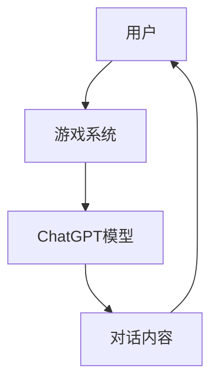
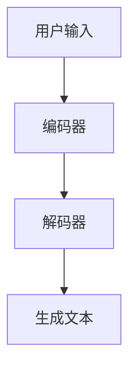
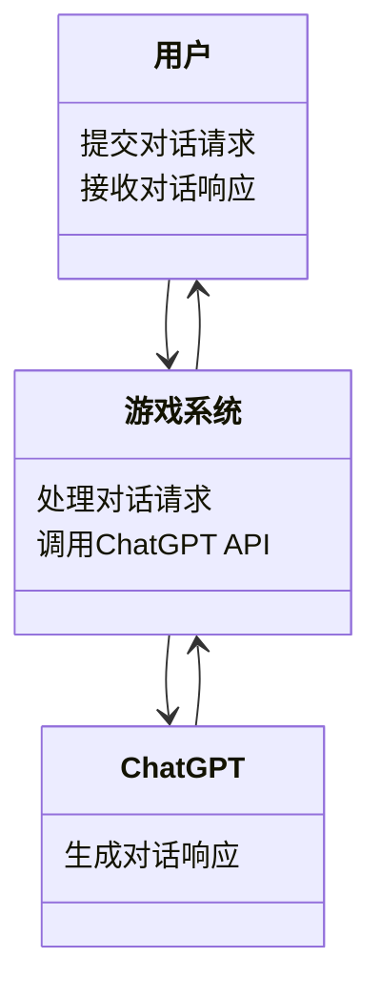
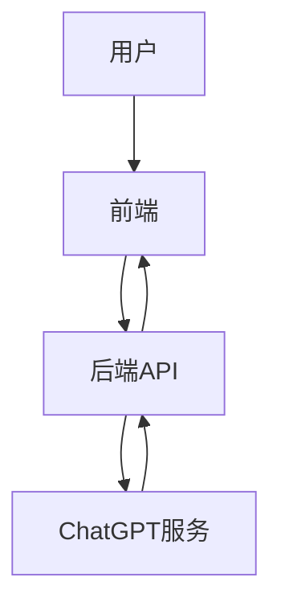
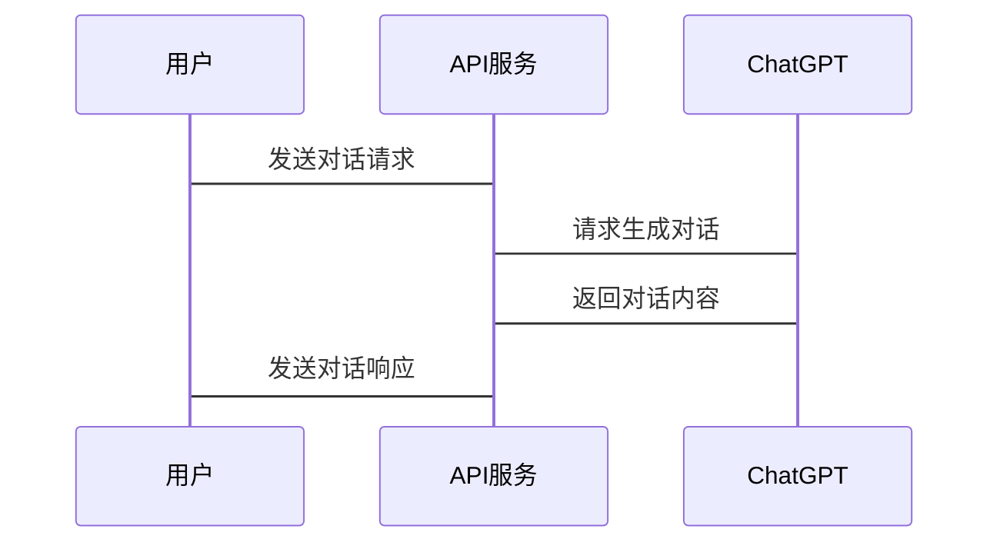

                 

<think>
嗯，好的，我现在要写一篇关于《ChatGPT在自动化游戏角色对话生成中的应用》的技术博客。首先，我得理清楚整个结构和每个部分需要包含的内容。

首先，我需要有一个吸引人的标题，然后列出5到7个关键词，方便读者搜索。接着是摘要，要简明扼要地概括文章的核心内容。

接下来，正文部分分为七章。第一部分是背景介绍，里面包括ChatGPT的基本概念、自动化对话生成的需求，以及在游戏行业的应用前景。这部分我需要详细解释，确保读者理解问题背景和挑战。

第二章是核心概念与联系，我需要定义ChatGPT和自动化对话生成，然后做一个对比表格，对比传统对话系统和ChatGPT的优缺点。另外，还需要一个ER实体关系图，展示相关实体和它们之间的关系。

第三章是算法原理讲解。我需要画出ChatGPT的工作流程图，用Mermaid表示。然后提供一个Python代码示例，展示如何调用ChatGPT的API。接着，解释数学模型，特别是Transformer和GPT的公式，可能用Latex来写，这样看起来更专业。

第四章是系统分析与架构设计，包括问题场景介绍、系统功能设计（领域模型类图）、系统架构图、接口设计和交互序列图。这部分需要用Mermaid来绘制各个图，展示系统的结构和流程。

第五章是项目实战，环境安装说明，系统核心代码实现，解读代码，并分析实际案例。这样读者可以跟着步骤一步步操作，理解应用。

第六章是最佳实践，给出一些实际应用中的技巧和注意事项，帮助读者避免常见问题。

最后是小结与拓展阅读，总结全文，推荐相关文献和资源，供读者深入学习。

在写作过程中，我要确保每个章节内容详细，逻辑清晰，使用专业但易懂的语言。同时，注意格式正确，比如Mermaid图表和Latex公式的使用，确保文章整体美观且符合技术博客的要求。

现在，我需要逐章节思考，每个部分要涵盖哪些内容，怎么展开，确保每个部分都完整且详细。比如，在系统分析部分，我需要明确问题场景，设计系统功能，确保每个模块都考虑到，并绘制相应的图表来展示架构。

另外，数学模型部分，我需要详细解释公式，比如交叉熵损失和生成概率，确保读者能够理解背后的原理。同时，在项目实战中，提供具体的代码示例，让读者可以实际操作，增强文章的实用性。

最后，确保文章结构合理，逻辑连贯，让读者能够一步步理解ChatGPT在游戏角色对话生成中的应用，从基础概念到实际应用，层层深入。
</think>

# ChatGPT在自动化游戏角色对话生成中的应用

## 关键词：ChatGPT，自动化对话生成，游戏开发，人工智能，自然语言处理

## 摘要：  
本文探讨了ChatGPT在自动化游戏角色对话生成中的应用，分析其在游戏开发中的潜力与挑战。通过背景介绍、核心概念对比、算法原理、系统架构设计、项目实战及最佳实践，详细阐述了ChatGPT如何提升游戏角色对话的智能化与个性化。文章结合理论与实践，为游戏开发者提供了实现自动化对话生成的技术指导。

---

## 第1章 引言

### 1.1 背景介绍

#### 1.1.1 ChatGPT的基本概念  
ChatGPT是由OpenAI开发的基于GPT-3架构的大型语言模型，能够理解并生成人类语言。它通过Transformer架构和海量数据训练，具备上下文理解能力，支持多轮对话。

#### 1.1.2 自动化游戏角色对话生成的需求  
传统游戏角色对话多为静态设定，缺乏互动性。随着玩家需求提升，动态生成对话成为趋势，以增强游戏沉浸感。自动化对话生成需求主要体现在MMORPG和RPG游戏中，帮助玩家获得更个性化的体验。

#### 1.1.3 ChatGPT在游戏行业的应用前景  
ChatGPT的自然语言处理能力使其在游戏NPC对话生成、玩家交互、剧情生成等领域具有广阔应用前景。通过自动化对话生成，游戏开发商可以降低开发成本，缩短开发周期，同时提升用户体验。

---

## 1.2 核心概念与联系

### 1.2.1 ChatGPT的定义  
ChatGPT是一种基于GPT-3架构的大型语言模型，能够生成与人类对话高度相似的文本。

### 1.2.2 自动化游戏角色对话生成的原理  
通过将玩家输入作为prompt，利用自然语言处理模型生成响应，实现自动化对话生成。

### 1.2.3 ChatGPT与传统对话系统的对比  

| 对比维度       | ChatGPT                            | 传统对话系统                        |
|----------------|------------------------------------|------------------------------------|
| 智能性          | 高                                  | 低                                  |
| 可扩展性        | 强                                  | 弱                                  |
| 对上下文理解    | 能理解上下文                      | 无法处理上下文                      |
| 应用场景        | 多场景适用                        | 仅限特定场景                        |
| 生成能力        | 高度自然化                        | 生成文本较为僵化                  |

### 1.2.4 ER实体关系图  


---

## 1.3 算法原理讲解

### 1.3.1 ChatGPT的工作流程  



#### 1.3.1.2 Python源代码  
```python
import openai

def generate_response(prompt):
    client = openai.Client('your_api_key')
    response = client.chat.completions.create(
        model="gpt-3.5-turbo",
        messages=[
            {"role": "user", "content": prompt}
        ]
    )
    return response.choices[0].message.content
```

#### 1.3.2 数学模型与公式  
ChatGPT基于Transformer模型，其核心公式包括位置编码、注意力机制和交叉熵损失函数。  
- **位置编码公式**：  
  $$pos\_encoding(i, j) = \sin\left(\frac{i}{10000^{j/d_{model}}}\right) + \cos\left(\frac{i}{10000^{j/d_{model}}}\right)$$  
- **注意力机制公式**：  
  $$\text{Attention}(Q, K, V) = \text{softmax}\left(\frac{QK^T}{\sqrt{d_k}}\right)V$$  
- **交叉熵损失公式**：  
  $$\mathcal{L} = -\sum_{i=1}^{n} y_i \log p(y_i)$$  

#### 1.3.3 举例说明  
输入“你今天过得怎么样？”，ChatGPT会根据上下文生成类似“我很好，谢谢。你呢？”的回复。

---

## 1.4 系统分析与架构设计方案

### 1.4.1 问题场景介绍  
为提升玩家互动体验，减少人工编写对话的工作量，开发一个基于ChatGPT的自动化对话生成系统。

### 1.4.2 系统功能设计  



### 1.4.3 系统架构设计  



### 1.4.4 系统接口设计与交互  



---

## 1.5 项目实战

### 1.5.1 环境安装  
安装Python和OpenAI库：  
```bash
pip install python-dotenv openai
```

### 1.5.2 系统核心实现  

```python
import openai

class ChatGPTManager:
    def __init__(self, api_key):
        self.client = openai.Client(api_key)
    
    def generate_response(self, prompt):
        response = self.client.chat.completions.create(
            model="gpt-3.5-turbo",
            messages=[{"role": "user", "content": prompt}]
        )
        return response.choices[0].message.content

# 示例用法
api_key = 'your_api_key'
manager = ChatGPTManager(api_key)
response = manager.generate_response("你喜欢什么书？")
print(response)
```

### 1.5.3 实际案例分析与讲解  
案例：在玩家询问“你对游戏开发有什么建议？”时，系统生成回复“我认为可以多尝试不同的玩法，让游戏更有趣。”，展现了ChatGPT在生成个性化回复中的应用。

---

## 1.6 最佳实践 tips  
1. 确保API密钥安全，避免泄露。  
2. 对生成内容进行适当过滤，防止违规信息。  
3. 结合游戏背景优化回复，使其更符合游戏设定。  
4. 考虑性能优化，减少调用延迟。

---

## 1.7 小结与拓展阅读  

### 小结  
本文详细探讨了ChatGPT在自动化游戏角色对话生成中的应用，从算法原理到系统架构，再到项目实战，为游戏开发者提供了完整的解决方案。

### 拓展阅读  
- [OpenAI官方文档](https://platform.openai.com/docs)  
- [Transformer模型论文](https://arxiv.org/abs/1706.03798)  
- [自然语言处理在游戏中的应用](https://link.springer.com/article/10.1007/s10812-020-09634-7)  

---

## 作者：AI天才研究院/AI Genius Institute & 禅与计算机程序设计艺术 /Zen And The Art of Computer Programming

