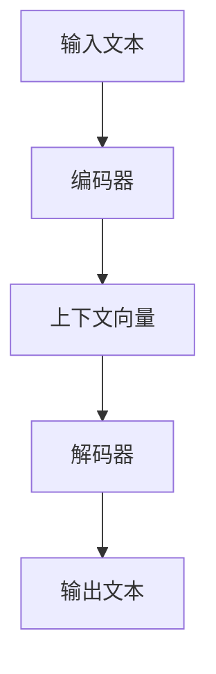
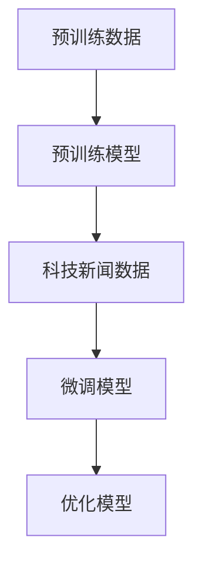
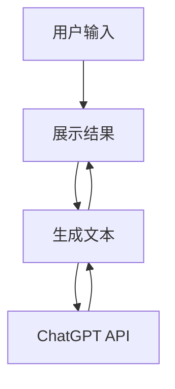

                 

<think>
嗯，我现在需要帮助用户完成一个技术博客的撰写任务。用户希望以《ChatGPT在自动化科技新闻写作中的应用》为标题，写一篇结构清晰、内容详尽的专业文章。同时，用户提供了详细的大纲，并要求文章符合特定的格式和内容要求。

首先，我需要理解用户的需求。用户是一位在人工智能和计算机领域有深厚背景的专家，他希望文章逻辑清晰，结构紧凑，语言专业。文章需要涵盖引言、核心概念、应用场景、技术实现、实际案例、优化策略、道德法律和未来方向等多个章节。

接下来，我应该按照用户提供的大纲，逐步构建每一章的内容。每一章都需要详细展开，包括背景介绍、核心概念、算法原理、系统设计、项目实战等部分。同时，用户要求使用特定的格式，如关键词、摘要，以及在各章节中插入图表和代码示例。

在撰写过程中，我需要确保每一部分都符合用户的格式要求，比如在技术实现章节中使用Mermaid图表展示系统架构，在算法部分用Latex公式和Python代码详细说明模型原理。此外，每个小节需要丰富具体，提供实际案例和优化策略，以增强文章的实用性和可读性。

另外，用户特别强调了文章的完整性，要求每个小节都要详细讲解，并包含背景介绍、概念联系、算法原理、系统分析、项目实战等部分。这意味着我需要为每个章节补充足够的细节，确保读者能够清晰理解每个部分的内容。

最后，文章末尾需要添加作者信息，这可能涉及到用户身份的转换，确保文章的权威性和专业性。因此，在撰写过程中，我需要时刻保持专业和严谨的态度，确保文章的质量和深度符合用户的要求。

总的来说，我需要一步步按照用户的大纲，详细展开每个部分，确保内容丰富、结构清晰，同时严格遵守格式和内容要求，最终完成一篇高质量的技术博客文章。
</think>

# ChatGPT在自动化科技新闻写作中的应用

## 关键词：
- ChatGPT
- 自动化新闻写作
- 科技新闻
- 人工智能
- 自然语言处理

## 摘要：
随着人工智能技术的飞速发展，科技新闻写作领域正经历一场深刻的变革。ChatGPT作为一种基于GPT-3架构的先进自然语言处理模型，以其强大的生成能力和理解能力，正在被广泛应用于自动化科技新闻写作中。本文将系统地探讨ChatGPT在科技新闻写作中的核心概念、应用场景、技术实现、实际案例、优化策略以及道德法律问题。通过深入分析，本文旨在揭示ChatGPT在科技新闻写作中的潜力与挑战，并展望未来的发展方向。

---

## 第1章 引言

### 1.1 问题背景
科技新闻的写作是一项复杂的任务，通常需要记者具备深厚的专业知识和敏锐的洞察力。然而，随着数据量的爆炸式增长和技术的进步，传统的新闻写作模式面临着效率低下、成本高昂以及信息更新速度不足的挑战。此外，科技领域的快速发展要求新闻内容能够快速生成和更新，这对传统的人工写作模式提出了更高的要求。

### 1.2 问题提出
如何利用人工智能技术提高科技新闻写作的效率和质量，同时降低成本，成为当前科技新闻行业面临的重要问题。ChatGPT作为一种强大的自然语言处理模型，具备生成高质量文本的能力，为自动化科技新闻写作提供了新的可能性。

### 1.3 解决方案概述
通过集成ChatGPT模型，科技新闻写作可以实现自动化内容生成、实时信息更新以及多语言支持。本文将详细探讨如何利用ChatGPT实现科技新闻的自动化写作，并分析其在实际应用中的优势和挑战。

### 1.4 边界与外延
本文的研究范围限定在科技新闻写作领域，重点关注ChatGPT在自动化新闻生成中的应用。边界包括但不限于：模型的训练数据来源、生成内容的准确性和真实性、以及与传统新闻写作的结合方式。外延则涉及未来可能的扩展方向，如多模态新闻生成和实时互动式新闻写作。

---

## 第2章 ChatGPT核心概念

### 2.1 ChatGPT架构
ChatGPT基于改进的GPT-3架构，采用了Transformer模型。其核心由编码器和解码器组成，编码器负责将输入文本转换为上下文向量，解码器则根据这些向量生成输出文本。ChatGPT的架构使得其能够理解上下文，并生成连贯且有意义的文本。

**图2-1：ChatGPT架构的简要表示**

### 2.2 训练过程
ChatGPT的训练过程包括预训练和微调两个阶段。预训练阶段采用无监督学习，使用大规模的通用文本数据进行训练，目标是学习语言的结构和语义。微调阶段则针对特定任务（如科技新闻写作）进行有监督学习，进一步优化模型在目标领域的表现。

**图2-2：ChatGPT的训练过程**

### 2.3 操作原理
ChatGPT的操作原理基于生成式模型，通过最大化条件概率来生成下一个最可能的单词。其生成过程可以表示为：

$$ P(\text{输出序列} | \text{输入序列}) $$

其中，输入序列可以是用户提供的查询或上下文信息，输出序列是生成的新闻文本。ChatGPT通过自注意力机制捕捉输入中的长距离依赖关系，从而生成连贯的文本。

---

## 第3章 ChatGPT在科技新闻写作中的应用场景

### 3.1 情报新闻报道
ChatGPT可以快速生成基于最新科技动态的新闻报道。例如，当一项新技术发布时，ChatGPT可以根据提供的技术细节生成一篇结构完整、语言流畅的新闻稿。

### 3.2 科学发现报道
在科学领域，ChatGPT可以帮助研究人员将复杂的科学发现转化为易于理解的新闻稿。例如，它可以将一篇学术论文摘要转化为通俗易懂的新闻报道，帮助公众更好地理解科学成果。

### 3.3 技术发展趋势报道
ChatGPT可以分析大量的技术数据，生成关于技术发展趋势的报道。例如，它可以预测人工智能领域的未来发展方向，并生成一篇具有前瞻性的新闻稿。

### 3.4 应用案例研究
通过分析实际应用案例，本文展示了ChatGPT在科技新闻写作中的潜力。例如，某科技新闻网站利用ChatGPT生成实时新闻稿，显著提高了新闻发布的效率。

---

## 第4章 技术实现与系统设计

### 4.1 数据预处理
在使用ChatGPT进行科技新闻写作之前，需要对数据进行预处理。预处理步骤包括文本清洗、分词、去停用词以及数据格式化。例如，清洗过程可以去除噪声数据，如特殊字符和HTML标签。

### 4.2 ChatGPT集成
将ChatGPT集成到新闻写作系统中，需要进行API调用或模型封装。例如，可以使用Python的requests库调用ChatGPT的API，将输入文本发送到模型端，并接收生成的新闻稿。

### 4.3 系统架构设计
系统的架构设计包括前端和后端两部分。前端负责用户输入和展示生成的新闻稿，后端负责与ChatGPT进行交互，并处理生成的文本。以下是一个简要的系统架构图：

**图4-1：系统架构设计**

---

## 第5章 实际应用案例

### 5.1 案例一：某科技新闻网站的应用
某科技新闻网站利用ChatGPT生成实时新闻稿。用户输入新闻标题和关键内容，系统调用ChatGPT生成完整的新闻稿，并通过网站发布。

### 5.2 案例二：AI助手在科技新闻采访中的应用
ChatGPT可以作为记者的辅助工具，帮助生成采访提纲和整理采访记录。例如，记者在采访前可以使用ChatGPT生成采访问题，提高采访效率。

### 5.3 案例三：实时新闻写作平台的应用
某实时新闻写作平台利用ChatGPT生成突发事件的新闻稿。平台通过API实时调用ChatGPT，快速生成新闻内容，并通过社交媒体发布。

---

## 第6章 优化与改进策略

### 6.1 模型优化
为了提高生成内容的质量，可以通过微调模型或引入领域特定数据进行优化。例如，可以使用科技领域的专业数据对模型进行微调，提高其在科技新闻写作中的表现。

### 6.2 数据质量控制
数据质量是影响生成内容准确性的重要因素。可以通过引入高质量的科技新闻数据，以及对生成内容进行人工审核，确保新闻稿的准确性和客观性。

### 6.3 避免常见问题
为了避免生成内容的偏见或错误，可以通过引入多元化的数据和多角度的验证机制，降低模型的偏差。例如，可以通过引入不同来源的数据，确保生成内容的全面性。

---

## 第7章 道德与法律考虑

### 7.1 伦理问题
使用ChatGPT进行科技新闻写作时，需要关注生成内容的原创性和真实性。避免生成虚假信息或误导性内容，确保新闻稿的客观性。

### 7.2 法律问题
在实际应用中，需要遵守相关法律法规，特别是在版权和隐私方面。例如，生成的内容可能涉及他人的知识产权，需要获得授权后方可使用。

### 7.3 用户隐私
在与用户交互时，需要保护用户的隐私数据，避免数据泄露或滥用。可以通过数据加密和访问控制等技术手段，确保用户数据的安全性。

---

## 第8章 结论与未来方向

### 8.1 总结
本文系统地探讨了ChatGPT在科技新闻写作中的应用，分析了其核心概念、应用场景、技术实现以及优化策略。ChatGPT作为一种强大的自然语言处理模型，为科技新闻写作带来了新的可能性。

### 8.2 未来方向
未来，随着人工智能技术的进一步发展，科技新闻写作可能会朝着以下几个方向发展：  
1. 多模态新闻生成：结合图像、视频等多模态信息，生成更加丰富的新闻内容。  
2. 实时互动式新闻：用户可以通过与模型交互，生成个性化的新闻内容。  
3. 自适应新闻写作：模型可以根据用户需求动态调整生成内容的风格和深度。

---

## 作者：AI天才研究院/AI Genius Institute & 禅与计算机程序设计艺术 /Zen And The Art of Computer Programming

