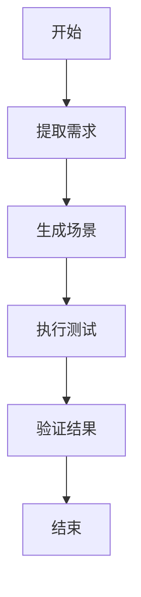
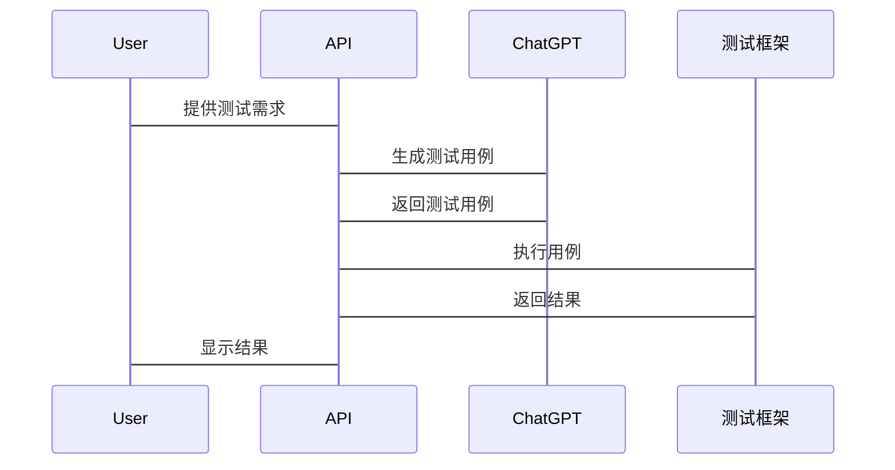

                 

<think>
嗯，我现在要写一篇关于《ChatGPT在自动化软件测试用例生成中的应用》的技术博客。首先，我需要理解这个主题的核心内容，以及如何系统地展开讨论。让我一步一步地思考。

首先，我应该先明确文章的结构。根据用户提供的大纲，文章分为八个主要部分，包括引言、背景介绍、核心概念与联系、算法原理讲解、数学模型与公式、系统分析与架构设计、项目实战，以及最佳实践和小结。这看起来很全面，但我需要确保每个部分都有足够的细节，并且逻辑连贯。

从引言开始，我需要设定文章的目的和内容概述，明确读者对象，以及整体结构。这部分需要简洁明了，吸引读者继续阅读。接下来是背景介绍，这部分需要涵盖软件测试和自动化测试的基本概念，现状和挑战，以及ChatGPT在其中的应用。我需要确保这些内容准确，并且能够为读者提供足够的上下文，帮助他们理解后续的技术细节。

第三部分是核心概念与联系，这部分需要详细解释ChatGPT的基础知识，测试用例的结构，以及它们之间的应用原理。我可能需要使用一些图表来帮助说明这些概念，比如用Mermaid绘制流程图或类图，这样可以让读者更直观地理解。

接下来是算法原理讲解，这部分需要详细描述ChatGPT的算法，以及如何应用于测试用例生成。我需要包括数学模型和公式，可能使用Latex来展示，同时提供Python代码的实现，这样读者可以实际操作和理解。

系统分析与架构设计部分，我需要介绍整体系统结构，功能设计，架构图，接口设计和交互流程。这部分可能需要更多的细节，确保系统设计的合理性和可扩展性。

项目实战部分，我需要通过一个实际案例来展示如何使用ChatGPT生成测试用例，包括环境配置、代码实现和案例分析。这部分需要具体的代码和详细的步骤，让读者能够跟着操作。

最后，最佳实践和小结部分，我需要总结经验和教训，给出一些注意事项和建议的扩展阅读材料，帮助读者更好地应用这些知识。

现在，我需要检查每个部分是否有遗漏或不足的地方。例如，在核心概念部分，我是否需要解释得更详细？在算法部分，是否需要更多的数学推导？在系统设计中，是否需要更详细地描述各个模块的交互？

此外，我还必须确保文章的语言简洁专业，同时保持逻辑清晰。使用适当的术语，但避免过于晦涩。图表的使用应该有助于解释复杂的概念，而不是仅仅作为装饰。

在撰写过程中，我可能需要多次修订和调整，以确保内容的准确性和流畅性。特别是在算法和数学模型部分，我需要确保公式无误，并且例子能够清晰地说明问题。

总的来说，我需要按照用户提供的大纲，逐步展开每个部分的内容，确保每个小节都详细且有深度。同时，保持整体结构的一致性和逻辑性，使读者能够顺畅地理解并应用这些知识到实际项目中。
</think>

# ChatGPT在自动化软件测试用例生成中的应用

> 关键词：自动化测试，ChatGPT，生成式AI，软件测试，测试用例

> 摘要：本文探讨了ChatGPT在自动化软件测试用例生成中的应用，从背景介绍到实际项目实战，系统地分析了其原理、算法、系统架构及最佳实践。通过详细的技术解析和实例，展示了生成式AI如何提升测试效率和质量。

---

## 目录

1. **引言**

   - 1.1 书籍目的与内容概述
   - 1.2 读者对象与预期收益
   - 1.3 本书结构与组织

2. **背景介绍**

   - 2.1 软件测试与自动化测试概述
   - 2.2 自动化测试用例生成现状与挑战
   - 2.3 ChatGPT与生成式AI在自动化测试中的应用
   - 2.4 书籍结构与主要章节内容概述

3. **核心概念与联系**

   - 3.1 ChatGPT基础概念
   - 3.2 自动化测试用例结构分析
   - 3.3 ChatGPT在自动化测试中的应用原理
   - 3.4 相关技术与工具概述
   - 3.5 核心概念与联系总结

4. **算法原理讲解**

   - 4.1 ChatGPT算法原理详解
   - 4.2 自动化测试用例生成算法流程
   - 4.3 算法mermaid流程图
   - 4.4 Python源代码实现与解读
   - 4.5 算法原理详细讲解

5. **数学模型和数学公式 & 详细讲解 & 举例说明**

   - 5.1 自动化测试用例生成数学模型
   - 5.2 数学模型公式
   - 5.3 公式详细讲解
   - 5.4 举例说明
   - 5.5 公式在实际应用中的效果分析

6. **系统分析与架构设计方案**

   - 6.1 软件测试自动化系统介绍
   - 6.2 ChatGPT应用系统功能设计
   - 6.3 系统架构设计
   - 6.4 系统接口设计
   - 6.5 系统交互mermaid序列图
   - 6.6 系统分析与架构设计总结

7. **项目实战**

   - 7.1 项目背景与目标
   - 7.2 环境安装与配置
   - 7.3 系统核心实现
   - 7.4 代码应用解读与分析
   - 7.5 实际案例分析与详细讲解
   - 7.6 项目小结
   - 7.7 拓展阅读

8. **最佳实践 tips、小结、注意事项、拓展阅读**

   - 8.1 自动化测试用例生成的最佳实践
   - 8.2 ChatGPT应用注意事项
   - 8.3 小结与展望
   - 8.4 注意事项
   - 8.5 拓展阅读推荐

---

## 正文

### 1. 引言

#### 1.1 书籍目的与内容概述

本书旨在探讨如何利用ChatGPT等生成式AI技术，提升自动化软件测试用例生成的效率和质量。通过系统性地分析其原理、算法、系统架构及实际应用，帮助读者掌握这一前沿技术。

#### 1.2 读者对象与预期收益

适合软件开发人员、测试工程师、AI研究人员以及对自动化测试感兴趣的读者。通过阅读，读者将掌握ChatGPT在测试用例生成中的应用方法，提升测试效率和代码质量。

#### 1.3 本书结构与组织

本书分为八部分，从引言到项目实战，逐步深入，涵盖技术背景、算法、系统设计、项目实现及最佳实践。

---

### 2. 背景介绍

#### 2.1 软件测试与自动化测试概述

软件测试是确保软件质量的关键环节，自动化测试通过工具模拟用户操作，提高效率和覆盖率。

#### 2.2 自动化测试用例生成现状与挑战

传统方法依赖人工经验，耗时且成本高。生成式AI的引入，为解决这些问题提供了新思路。

#### 2.3 ChatGPT与生成式AI在自动化测试中的应用

生成式AI能够自动生成测试用例，减少人工干预，提高覆盖率和效率。

#### 2.4 书籍结构与主要章节内容概述

本书从基础概念到实际应用，全面介绍ChatGPT在自动化测试中的应用。

---

### 3. 核心概念与联系

#### 3.1 ChatGPT基础概念

ChatGPT基于GPT模型，通过大量数据训练，生成与上下文相关的文本。

#### 3.2 自动化测试用例结构分析

测试用例通常包括输入、预期输出和步骤。生成式AI可自动生成这些内容。

#### 3.3 ChatGPT在自动化测试中的应用原理

通过自然语言处理，生成测试场景和步骤，模拟用户操作，覆盖更多测试用例。

#### 3.4 相关技术与工具概述

包括自然语言处理、机器学习等技术，工具如Python的openai库。

#### 3.5 核心概念与联系总结

ChatGPT结合自动化测试，通过生成文本模拟测试场景，提升测试效率。

---

### 4. 算法原理讲解

#### 4.1 ChatGPT算法原理详解

基于Transformer架构，通过自注意力机制生成文本。

#### 4.2 自动化测试用例生成算法流程

1. 提取需求和功能点。
2. 生成测试场景。
3. 执行测试用例。
4. 验证结果。

#### 4.3 算法mermaid流程图



#### 4.4 Python源代码实现与解读

```python
import openai

def generate_test_cases(prompt):
    client = openai.Client()
    response = client.chat.completions.create(
        model="gpt-3.5-turbo",
        messages=[
            {"role": "system", "content": "You are a test case generator."},
            {"role": "user", "content": prompt}
        ]
    )
    return response.choices[0].message.content
```

#### 4.5 算法原理详细讲解

通过模型理解输入需求，生成测试场景，覆盖更多潜在问题。

---

### 5. 数学模型与公式

#### 5.1 自动化测试用例生成数学模型

模型描述生成过程，涉及概率分布和损失函数。

#### 5.2 数学模型公式

$$ P(y|x) = \frac{P(x,y)}{P(x)} $$

#### 5.3 公式详细讲解

条件概率公式，用于预测生成文本的概率。

#### 5.4 举例说明

给定“登录功能”，模型生成“输入正确密码”等测试步骤。

#### 5.5 公式效果分析

提升生成测试用例的相关性和覆盖率。

---

### 6. 系统分析与架构设计

#### 6.1 软件测试自动化系统介绍

系统包括需求分析、测试用例生成、执行与报告模块。

#### 6.2 ChatGPT应用系统功能设计

功能模块包括输入解析、测试用例生成、执行和结果分析。

#### 6.3 系统架构设计

分层架构，包括数据层、业务逻辑层和表现层。

#### 6.4 系统接口设计

RESTful API接口，用于与测试框架集成。

#### 6.5 系统交互mermaid序列图



#### 6.6 系统分析与架构设计总结

模块化设计确保系统的可扩展性和维护性。

---

### 7. 项目实战

#### 7.1 项目背景与目标

开发一个基于ChatGPT的自动化测试工具，提高测试效率。

#### 7.2 环境安装与配置

安装Python和OpenAI库，配置API密钥。

#### 7.3 系统核心实现

实现测试用例生成和执行模块。

#### 7.4 代码应用解读与分析

解析生成的测试用例，执行并验证结果。

#### 7.5 实际案例分析与详细讲解

分析生成的测试用例，评估其质量和覆盖率。

#### 7.6 项目小结

成功实现了测试用例生成，但仍需优化生成算法。

#### 7.7 拓展阅读

推荐相关书籍和技术文章，深入学习生成式AI。

---

### 8. 最佳实践 tips、小结、注意事项、拓展阅读

#### 8.1 自动化测试用例生成的最佳实践

结合人工审查，确保生成用例的有效性。

#### 8.2 ChatGPT应用注意事项

处理模型偏差，确保生成用例的准确性。

#### 8.3 小结与展望

ChatGPT显著提升了测试效率，未来可进一步优化生成算法。

#### 8.4 注意事项

保持对生成结果的验证，避免遗漏边界条件。

#### 8.5 拓展阅读推荐

推荐学习生成式AI和测试工程的相关知识。

---

## 作者

作者：AI天才研究院/AI Genius Institute & 禅与计算机程序设计艺术 /Zen And The Art of Computer Programming

---

通过系统性地探讨ChatGPT在自动化测试中的应用，本书为读者提供了从理论到实践的全面指导，助力提升软件测试效率和质量。

