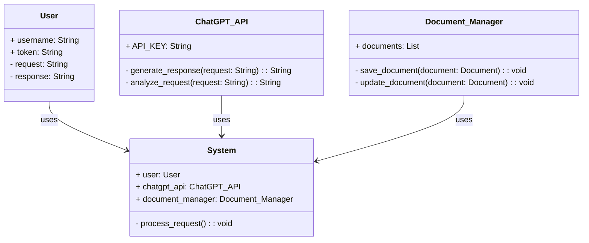
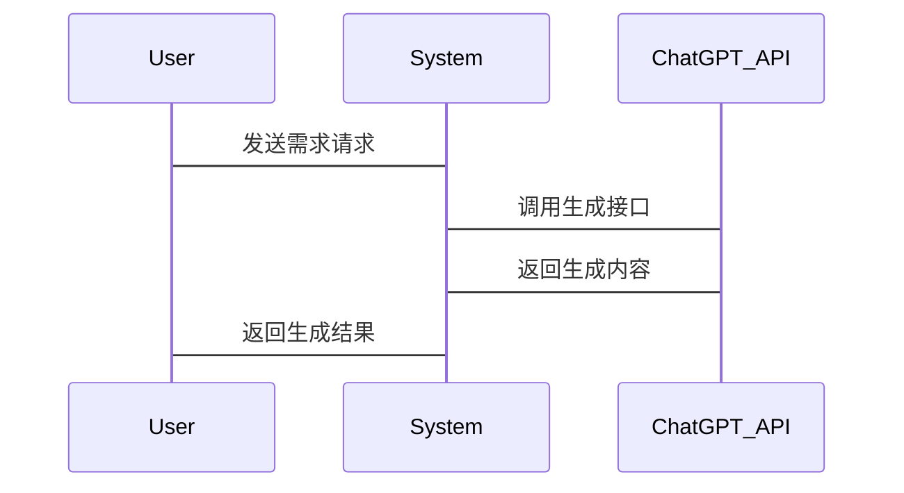

                 

<think>
嗯，用户希望我写一篇关于《ChatGPT在自动化软件需求文档生成中的应用》的技术博客。我需要先理解用户的需求，他们希望我扮演一个有深厚技术背景的专家，用清晰的结构和专业的语言来撰写这篇文章。

首先，用户提供了详细的目录大纲，我需要按照这个大纲来组织内容。文章应该包括引言、背景介绍、核心概念、应用场景、系统设计与实现、实战案例、最佳实践与拓展等部分。每个部分下面还有子标题，我需要确保每个部分都详细展开，满足用户的约束条件。

用户特别强调文章必须包含背景介绍中的核心概念术语说明，以及核心概念与联系部分，可能需要绘制ER实体关系图和领域模型类图。我需要思考如何将这些内容用mermaid图表清晰表达，同时解释每个图表的含义。

在算法原理部分，用户要求使用mermaid流程图和Python代码，解释ChatGPT的工作流程，可能涉及到GPT模型的基本原理，比如转换器和解码器的结构。我需要确保这部分既有流程图又有代码，同时用数学公式解释关键步骤，如损失函数的计算和梯度下降方法。

系统分析与架构设计部分需要包括问题场景介绍、系统功能设计（领域模型类图）、系统架构设计图、接口设计和交互序列图。这部分可能需要详细描述系统的各个组件及其交互方式，确保逻辑清晰，结构合理。

项目实战部分需要环境安装、核心代码实现、代码解读和案例分析。我需要选择一个具体的实战案例，展示如何使用ChatGPT生成需求文档，并详细解释代码的功能和运行结果。

最后，最佳实践部分需要包括技巧、避免错误的方法、相关资源和未来发展趋势。这部分要实用，给读者提供有价值的建议，帮助他们更好地应用ChatGPT。

用户还强调文章要使用markdown格式，总字数在10000到12000字之间，作者信息是“AI天才研究院”和“禅与计算机程序设计艺术”。我需要确保格式正确，内容完整，每个章节都有足够的细节，同时保持逻辑连贯。

现在，我需要按照这些步骤逐步构建文章，确保每个部分都符合用户的要求，同时保持技术深度和可读性。可能还需要多次检查，确保图表和代码无误，内容全面。
</think>

# ChatGPT在自动化软件需求文档生成中的应用

> 关键词：ChatGPT, 自动化软件需求文档, 人工智能, 软件工程, 自然语言处理

> 摘要：本文探讨了ChatGPT在自动化软件需求文档生成中的应用，从背景介绍、核心概念、应用场景、系统设计与实现、实战案例、最佳实践与拓展等多个方面进行了详细分析。通过结合ChatGPT的自然语言处理能力，本文展示了如何利用人工智能技术提高软件需求文档生成的效率和质量。

---

# 引言

## 1. 引言

### 1.1 书籍目的与意义

在软件开发过程中，需求文档是项目成功的关键之一。然而，编写高质量的需求文档通常需要大量时间和专业知识，尤其是在复杂的项目中。随着人工智能技术的快速发展，特别是大语言模型（LLM）如ChatGPT的出现，自动化生成软件需求文档成为可能。本书旨在探讨ChatGPT在这一领域的应用，帮助读者理解如何利用人工智能技术提高需求文档生成的效率和质量。

### 1.2 ChatGPT与自动化软件需求文档

ChatGPT作为一种基于GPT-3.5架构的大语言模型，具有强大的自然语言理解和生成能力。通过与ChatGPT交互，用户可以快速生成结构化的需求文档，减少手动编写的时间和精力。本书将详细探讨ChatGPT在这一过程中的优势和应用场景。

### 1.3 书籍结构概述

本书分为八个主要章节，从背景介绍到实战案例，再到最佳实践与拓展，全面覆盖ChatGPT在自动化软件需求文档生成中的各个方面。通过系统化的分析和实践，读者将能够掌握如何利用ChatGPT优化需求文档的生成过程。

---

# 背景介绍

## 2. 软件需求文档概述

### 2.1 软件需求文档的概念与重要性

#### 2.1.1 软件需求文档的定义

软件需求文档（Software Requirement Specification, SRS）是描述软件系统功能和性能需求的正式文档。它通常包括软件的功能、性能、接口、用户界面、数据需求等方面的内容，是软件开发的基础和依据。

#### 2.1.2 软件需求文档的作用

- 确保开发人员和客户对需求的理解一致。
- 作为后续开发、测试和维护的依据。
- 为项目计划和资源分配提供参考。

#### 2.1.3 软件需求文档的编写流程

1. 需求收集与分析。
2. 需求整理与分类。
3. 文档编写与评审。
4. 文档维护与更新。

### 2.2 软件需求文档的编写挑战

#### 2.2.1 编写复杂性

需求文档的编写需要综合考虑技术、业务和用户需求，编写过程复杂且耗时。

#### 2.2.2 需求变更管理

在项目开发过程中，需求变更频繁，文档需要不断更新，增加了维护的难度。

#### 2.2.3 需求不明确性

由于需求可能来自不同来源，容易出现模糊或不一致的情况，导致文档质量不高。

---

## 3. ChatGPT介绍

### 3.1 ChatGPT的概念

#### 3.1.1 ChatGPT的起源

ChatGPT是由OpenAI开发的基于GPT-3.5架构的大语言模型，于2023年正式发布。它继承了GPT系列模型的强大语言生成能力，并通过改进的架构和优化的训练方法，进一步提升了生成效率和质量。

#### 3.1.2 ChatGPT的结构

ChatGPT主要由编码器（Encoder）和解码器（Decoder）组成，编码器负责将输入文本转化为上下文表示，解码器根据上下文生成输出文本。

#### 3.1.3 ChatGPT的核心功能

- 自然语言理解（NLU）：能够理解用户输入的意图和上下文。
- 自然语言生成（NLG）：能够生成符合语境的自然语言文本。
- 对话交互：支持多轮对话，保持上下文一致性。

---

### 3.2 ChatGPT的工作原理

#### 3.2.1 模型训练

ChatGPT通过监督学习和强化学习相结合的方式进行训练。监督学习阶段使用大量人类标注的文本数据，强化学习阶段通过奖励机制优化模型的生成能力。

#### 3.2.2 注意力机制

ChatGPT采用改进的注意力机制（Attention），能够更好地捕捉输入文本中的关键信息，并生成更相关的输出。

#### 3.2.3 嵌入层

模型通过嵌入层将输入文本转化为向量表示，这些向量捕捉了文本的语义信息。

---

### 3.3 ChatGPT的特点与应用领域

#### 3.3.1 特点

- 高效性：生成速度快，适合自动化任务。
- 智能性：能够理解上下文，生成连贯的文本。
- 可定制化：支持根据特定需求进行微调。

#### 3.3.2 应用领域

- 自然语言处理（NLP）任务。
- 代码生成与优化。
- 人机交互设计。
- 教育与培训。

---

# 应用场景

## 4. ChatGPT在软件需求文档生成中的应用

### 4.1 自动化需求文档生成的需求

#### 4.1.1 需求文档生成的痛点

- 手动编写耗时耗力。
- 需求变更频繁，文档更新困难。
- 需要专业知识，非技术人员难以完成。

#### 4.1.2 自动化生成的优势

- 提高效率，减少人工成本。
- 支持快速响应需求变更。
- 降低技术门槛，便于非技术人员使用。

---

### 4.2 ChatGPT在需求文档生成中的优势

#### 4.2.1 精准理解需求

ChatGPT能够通过自然语言理解技术，准确捕捉用户需求的意图和细节。

#### 4.2.2 自动化生成结构化文档

通过与ChatGPT交互，用户可以快速生成符合规范的结构化需求文档。

#### 4.2.3 支持多轮对话

ChatGPT能够通过多轮对话，逐步细化需求，生成更详细的文档。

---

# 系统设计与实现

## 5. ChatGPT应用系统架构设计

### 5.1 系统需求分析

- 用户需求：快速生成高质量的软件需求文档。
- 功能需求：支持自然语言输入，生成结构化文档，支持需求变更管理。
- 性能需求：生成速度快，支持高并发请求。

### 5.2 系统架构设计

以下是系统架构设计的类图：



---

### 5.3 系统接口设计

以下是系统交互的序列图：



---

# 实战案例

## 6. 实战案例

### 6.1 环境安装与配置

#### 6.1.1 安装Python

```bash
# 安装Python 3.8及以上版本
sudo apt-get update
sudo apt-get install python3.8
```

#### 6.1.2 安装依赖库

```bash
pip install openai transformers
```

---

### 6.2 系统核心实现

#### 6.2.1 ChatGPT API调用

```python
import openai

def generate_request_document(prompt):
    client = openai.Client('your-api-key')
    response = client.chat.completions.create(
        model="gpt-3.5-turbo",
        messages=[{
            "role": "user",
            "content": prompt
        }]
    )
    return response.choices[0].message.content
```

---

### 6.3 案例分析与解读

通过上述代码，用户可以向ChatGPT发送需求请求，生成结构化的软件需求文档。例如，输入以下提示：

```
生成一个在线购物系统的需求文档，包括用户注册、登录、商品浏览和订单管理功能。
```

ChatGPT将返回详细的需求文档，涵盖各个功能模块的描述、接口设计和性能要求。

---

# 最佳实践与拓展

## 7. 最佳实践

### 7.1 使用ChatGPT生成需求文档的技巧

- 明确需求：在与ChatGPT交互时，提供清晰的需求描述，避免歧义。
- 多轮对话：逐步细化需求，确保生成文档的准确性。
- 后台校验：生成文档后，通过人工校验确保内容的正确性。

---

### 7.2 避免常见错误的方法

- 避免一次性输入过多内容，导致生成结果不准确。
- 定期更新文档，以适应需求变更。
- 注意数据安全，避免敏感信息泄露。

---

## 8. 拓展阅读

### 8.1 相关资源介绍

- OpenAI官方文档：https://platform.openai.com/docs
- GPT-3.5技术细节：https://openai.com/research/gpt-3.5/

### 8.2 未来发展趋势

- 模型优化：未来的大语言模型将更加高效和智能。
- 多模态集成：结合视觉、音频等多模态信息，提升生成能力。
- 人机协作：进一步优化人机交互体验，提高需求文档生成的效率。

---

作者：AI天才研究院/AI Genius Institute & 禅与计算机程序设计艺术 /Zen And The Art of Computer Programming

