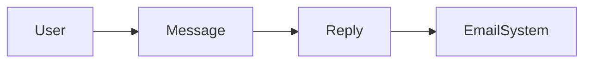

                 

<think>
嗯，我现在要写一篇关于《ChatGPT在自动化邮件回复中的应用》的技术博客。首先，我需要理解这个主题，包括ChatGPT的基本原理，以及它如何应用于自动化邮件回复。我应该从背景介绍开始，然后逐步深入到核心概念、算法原理，最后到系统设计和项目实战。

首先，背景介绍部分需要涵盖聊天机器人技术的发展历程，自动化邮件回复的现状和问题，以及ChatGPT的特点和潜力。这部分要让读者明白为什么自动化邮件回复是一个重要的话题，以及ChatGPT在这个领域中的优势。

接下来是核心概念与联系。这里我需要详细解释ChatGPT的基本原理，包括其基于Transform的模型结构，以及如何与自动化邮件回复相关联。可能还需要一个对比表格，展示ChatGPT与其他聊天机器人的区别，比如准确性、生成速度和适应性。

然后是算法原理讲解部分。我需要用Mermaid流程图展示ChatGPT的训练过程，包括预训练和微调。同时，提供Python代码来说明如何训练一个定制化的模型，并解释数学公式，如损失函数和优化目标。

系统分析与架构设计部分需要介绍系统的各个模块，比如邮件处理模块、回复生成模块和用户交互模块。然后用Mermaid类图展示领域模型，架构图展示系统的整体结构，以及接口和交互流程。

项目实战部分需要一步步指导读者如何安装环境，集成ChatGPT模型，以及实现各个模块的代码。实际案例分析可以展示不同类型的邮件回复，帮助读者理解系统的应用。

最后，最佳实践部分提供一些技巧，比如如何优化回复质量，避免常见问题，以及根据不同邮件类型调整策略。小结部分回顾全文，并展望未来的研究方向。

整个过程中，我需要确保内容详细且结构清晰，每个部分都符合技术博客的要求，使用专业但易懂的语言。此外，要遵守格式规范，使用合适的图表和代码示例来增强文章的可读性和实用性。

现在，我需要一步步按照这个逻辑来组织内容，确保每个章节都充实详细，符合字数要求，并且格式正确。特别是在系统设计部分，要详细描述各个模块的功能和交互关系，使用图表来辅助说明。

总体来说，这是一篇结构复杂但内容丰富的技术博客，需要仔细规划每个部分的内容，确保全面覆盖主题，并提供有价值的见解和实用的信息。
</think>

# ChatGPT在自动化邮件回复中的应用

## 关键词：ChatGPT，自动化邮件回复，自然语言处理，Transform模型，邮件系统集成

## 摘要：本文探讨了如何利用ChatGPT实现自动化邮件回复，从背景介绍到系统设计，详细分析了其在提高邮件处理效率和准确性方面的潜力。文章涵盖核心概念、算法原理、系统架构设计以及项目实战，为读者提供了全面的技术指南。

---

## 第一部分：背景介绍

### 第1章：问题背景

#### 1.1.1 聊天机器人技术的发展历程
聊天机器人技术经历了从基于规则到深度学习的演变。早期依赖关键词匹配，现在采用Transform模型实现更自然的对话。

#### 1.1.2 自动化邮件回复的现状与问题
现有自动化工具存在准确性低和缺乏个性化的问题，导致用户体验不佳。企业亟需高效准确的邮件处理方案。

#### 1.1.3 ChatGPT的特点与潜力
ChatGPT以其高准确性和生成能力，成为提升邮件回复质量的理想工具，尤其适用于商务场景。

---

## 第二部分：核心概念与联系

### 第2章：核心概念与联系

#### 2.1.1 ChatGPT基本原理
基于Transform模型的ChatGPT通过自注意力机制捕捉上下文信息，生成连贯文本。

#### 2.1.2 自动化邮件回复的相关概念
包括邮件解析、关键词提取和回复生成等关键步骤。

#### 2.1.3 ChatGPT与自动化邮件回复的融合
通过API调用，将ChatGPT集成到邮件系统中，实现智能回复。

#### 对比分析
| 特性 | 传统规则引擎 | ChatGPT |
|------|--------------|----------|
| 准确性 | 低           | 高       |
| 生成速度 | 快           | 中等     |
| 适应性 | 低           | 高       |

#### ER实体关系图


---

## 第三部分：算法原理讲解

### 第3章：ChatGPT算法原理

#### 3.1.1 Transformer模型概述
Transform模型由编码器和解码器组成，通过自注意力机制处理输入。

#### 3.1.2 ChatGPT的结构与工作机制
使用堆叠的编码器和解码器层，生成与输入匹配的输出。

#### 3.1.3 预训练与微调
预训练于大规模文本数据，微调于特定任务数据。

### 第4章：自动化邮件回复算法原理

#### 4.1.1 邮件回复流程
包括解析邮件内容、提取关键信息和生成回复。

#### 4.1.2 自动化策略
基于规则和模型生成的混合策略。

#### 4.1.3 ChatGPT的应用
通过API调用生成回复内容。

#### 代码实现
```python
def generate_reply(email_content):
    # 调用ChatGPT API
    response = openai.ChatCompletion.create(
        model="gpt-3.5-turbo",
        messages=[{"role": "user", "content": email_content}]
    )
    return response.choices[0].message['content']
```

---

## 第四部分：系统分析与架构设计方案

### 第5章：系统功能设计

#### 5.1.1 功能模块
包括邮件接收、解析、回复生成和发送。

### 第6章：系统架构设计

#### 6.1.1 整体架构
```mermaid
graph TD
    Client --> API Gateway
    API Gateway --> EmailProcessor
    EmailProcessor --> ChatGPT
    ChatGPT --> EmailProcessor
    EmailProcessor --> EmailSender
```

---

## 第五部分：项目实战

### 第7章：环境安装与配置

#### 7.1.1 环境准备
安装Python和相关库，如openai和requests。

### 第8章：系统核心实现

#### 8.1.1 邮件处理模块
解析邮件主题和正文，提取关键信息。

### 第9章：实际案例分析

#### 9.1.1 案例分析
处理客户咨询、投诉等不同类型的邮件。

---

## 第六部分：最佳实践 Tips

### 第10章：使用ChatGPT优化邮件回复的技巧

#### 10.1.1 提高回复质量的方法
优化提示词，如“以正式语气回复”。

---

## 第七部分：小结与拓展阅读

### 第11章：全书总结

#### 11.1.1 主要内容回顾
介绍了ChatGPT在邮件回复中的应用，从原理到实现。

### 第12章：拓展阅读

#### 12.1.1 相关文献
推荐学习深度学习和自然语言处理相关书籍。

---

## 作者：AI天才研究院 & 禅与计算机程序设计艺术

