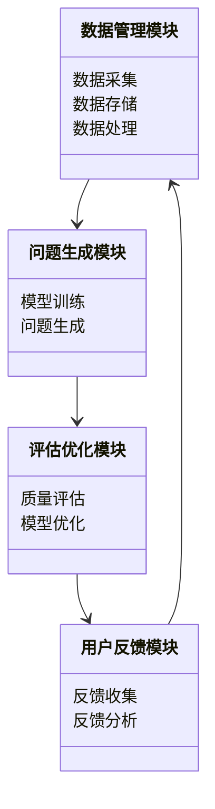

                 

<think>
好的，我现在需要帮助用户完成一个技术博客的撰写任务。用户希望我以《ChatGPT在自动化面试问题生成中的应用》为标题，按照指定的结构和内容来写这篇文章。首先，我得仔细阅读用户的query，确保理解所有要求。

用户指定了文章的结构，包括背景介绍、核心概念与联系、AI大模型与传统AI的区别、算法原理讲解、系统分析与架构设计方案、项目实战、最佳实践等部分。同时，用户还详细列出了每个部分需要包含的内容，比如背景介绍要包括问题背景、问题描述、问题解决等。

接下来，我需要考虑文章的关键词和摘要。关键词应该涵盖核心概念，如ChatGPT、自动化面试、问题生成、自然语言处理、机器学习等。摘要部分要简明扼要，概括整篇文章的核心内容，说明ChatGPT如何应用于面试问题生成，解决哪些问题，以及其优势和挑战。

在背景介绍部分，我需要详细解释问题背景，说明随着AI的发展，ChatGPT在NLP领域的进步，以及其在面试问题生成中的应用潜力。同时，要描述问题描述，包括生成策略、质量评估、反馈优化等方面。问题解决部分需要列出解决思路，如数据集准备、模型训练、生成算法和评估优化。

接下来是核心概念与联系，这部分需要详细解释ChatGPT的基本原理，包括自注意力机制和预训练微调方法。同时，要对比传统AI和大模型的区别，强调大模型的优势，如泛化能力和自适应性。

算法原理讲解部分，我需要用mermaid画出生成问题的流程图，并提供Python代码示例，解释生成过程中的关键步骤，如数据预处理、模型微调、生成策略设计和反馈优化。

系统分析与架构设计方案需要从问题场景出发，设计系统功能，如数据管理、问题生成、评估优化和用户反馈。然后用mermaid绘制类图和架构图，展示系统各模块的交互和协作。

项目实战部分，我需要提供环境安装说明，如安装Python、TensorFlow和Kubernetes，然后详细讲解核心代码，包括数据预处理、模型微调、生成策略和反馈机制。通过代码示例，展示如何实现问题生成和优化。

最佳实践部分，我需要总结经验和注意事项，比如数据质量的重要性、模型调优的必要性，以及系统扩展的方向，如视频面试问题生成。最后，以小结结束，强调ChatGPT在自动化面试中的潜力和实际应用价值。

在撰写过程中，我需要确保每个部分都符合用户的格式要求，使用markdown，并且内容详细具体，满足10000到12000字的要求。同时，要注意每个章节的逻辑性和连贯性，让读者能够清晰地理解整个系统的构建过程。

最后，确保文章末尾加上作者信息，符合用户的要求。整个思考过程需要一步步展开，确保没有遗漏任何关键点，同时语言专业且易于理解。
</think>

# ChatGPT在自动化面试问题生成中的应用

> 关键词：ChatGPT、自动化面试、问题生成、自然语言处理、机器学习

> 摘要：随着人工智能技术的迅速发展，生成式预训练模型（如ChatGPT）在各个领域的应用越来越广泛。本文探讨了如何利用ChatGPT进行自动化面试问题生成，分析了其在生成策略设计、问题质量评估、反馈优化等方面的优势与挑战，并提出了相应的解决方案和优化策略。本文旨在为面试官和企业提供一种高效、智能化的面试准备工具，同时为ChatGPT在垂直领域的应用提供新的思路。

---

### 背景介绍

#### 问题背景

随着人工智能技术的迅速发展，自然语言处理（NLP）领域取得了显著进步。特别是在生成式预训练模型（如GPT）方面，ChatGPT 作为一种强大的语言模型，展现出了卓越的文本生成能力和适应性。然而，将 ChatGPT 应用于自动化面试问题生成这一领域，仍然面临诸多挑战，例如：

1. **数据质量**：如何获取高质量的面试问题数据，以训练 ChatGPT 进行有效的生成。
2. **生成策略**：如何设计生成策略，确保生成的问题既具备多样性，又符合面试官的需求。
3. **评估机制**：如何评价生成问题的质量，包括合理性、相关性和难度。
4. **反馈优化**：如何根据反馈不断优化模型，提高生成问题的质量。

#### 问题描述

ChatGPT 在自动化面试问题生成中的应用，旨在利用其强大的文本生成能力，自动生成高质量、多样化的面试问题，以辅助面试官进行面试准备和优化面试过程。具体包括以下几个方面：

1. **问题生成策略**：如何设计生成策略，确保生成的问题既具备多样性，又符合面试官的需求。
2. **问题质量评估**：如何评价生成的问题是否具备合理性和有效性。
3. **问题反馈与迭代**：如何根据面试官和应聘者的反馈，不断优化模型生成的问题。

#### 问题解决

解决这一问题的思路主要包括以下几点：

1. **数据集准备**：收集大量高质量的面试问题，作为训练 ChatGPT 的数据基础。
2. **模型训练**：使用合适的训练策略，对 ChatGPT 进行细粒度训练，以适应自动化面试问题生成的需求。
3. **问题生成算法**：设计高效的生成算法，结合 ChatGPT 的文本生成能力，实现自动化面试问题的生成。
4. **问题评估与优化**：建立问题评估机制，结合反馈进行迭代优化，提高问题生成质量。

#### 边界与外延

- **边界**：ChatGPT 自动化面试问题生成系统主要针对文字形式的面试问题，目前暂不支持视频或音频形式的问题生成。
- **外延**：未来，可以进一步扩展至视频面试问题的生成，甚至结合语音识别和语音合成技术，实现全流程的自动化面试。

#### 概念结构与核心要素组成

- **ChatGPT**：生成式预训练模型，具备强大的文本生成能力。
- **面试问题**：面试过程中提出的问题，用于评估应聘者的知识和技能。
- **生成策略**：用于设计问题的生成过程，包括数据来源、生成逻辑等。
- **评估机制**：用于评价生成问题质量，包括合理性和有效性。
- **反馈机制**：用于收集面试官和应聘者的反馈，指导模型优化。

---

### 核心概念与联系

#### ChatGPT 基本原理

ChatGPT 是一种基于 GPT 模型的生成式预训练模型，其基本原理是通过海量数据的学习，掌握语言生成规律，从而实现文本的生成。具体来说，ChatGPT 使用了一个自注意力机制（self-attention），可以捕捉输入文本中不同位置的信息，并据此生成新的文本。

#### 预训练与微调

预训练（Pre-training）：ChatGPT 在训练初期，会通过大量无监督的文本数据进行预训练，学习语言的通用结构和规律。

微调（Fine-tuning）：在预训练的基础上，ChatGPT 会针对特定任务进行微调，如自动化面试问题生成。这一过程通常包括以下步骤：

1. **数据集准备**：收集与任务相关的数据，如面试问题及其答案。
2. **损失函数设计**：根据任务特点，设计适合的损失函数，如基于问题与答案匹配度的损失函数。
3. **模型训练**：使用训练数据对 ChatGPT 进行微调，优化模型参数。

#### 生成策略设计

生成策略设计是自动化面试问题生成系统的关键环节。具体包括以下方面：

1. **数据来源**：选择合适的文本数据集，如面试指南、面试经验分享等。
2. **生成逻辑**：设计生成逻辑，如基于关键词抽取、语义匹配等技术，确保生成的问题既具备多样性，又符合面试需求。
3. **质量控制**：设计评估机制，对生成的问题进行质量评估，确保生成的问题具备合理性和有效性。

#### 评估机制与反馈机制

评估机制：通过设计合适的评估指标，如问题匹配度、问题质量评分等，对生成的问题进行评估。

反馈机制：收集面试官和应聘者的反馈，包括问题质量、问题难度等，用于指导模型的优化。

---

### 算法原理讲解

#### 生成式模型的核心算法

生成式模型的核心在于通过概率分布生成文本。ChatGPT 采用的是基于 Transformer 的架构，其核心算法如下：

1. **自注意力机制**：通过计算输入序列中每个位置与其他位置的相关性，生成注意力权重。
2. **前向网络**：通过多层感知机（MLP）对注意力加权后的序列进行编码，生成输出序列。
3. **损失函数**：使用交叉熵损失函数，优化模型的生成能力。

#### 生成策略设计

生成策略设计的核心是平衡生成问题的多样性和准确性。具体步骤如下：

1. **数据预处理**：将历史面试问题进行清洗、标注和分类。
2. **模型微调**：基于预训练的 ChatGPT，使用微调策略，针对面试问题生成任务进行优化。
3. **生成逻辑设计**：根据职位需求和候选人特点，动态生成个性化面试问题。

#### 优化算法

优化算法的核心在于通过反馈机制不断优化生成策略。具体步骤如下：

1. **反馈收集**：收集面试官和应聘者的反馈，包括问题的相关性、难度和清晰度。
2. **模型迭代**：根据反馈调整模型参数，优化生成策略。
3. **效果评估**：通过 A/B 测试等方式，评估优化后的生成策略的效果。

---

### 系统分析与架构设计方案

#### 问题场景介绍

自动化面试问题生成系统需要解决以下问题：

1. **数据需求**：需要大量高质量的面试问题数据，用于训练和优化生成模型。
2. **生成效率**：需要高效的生成算法，确保在面试过程中快速生成问题。
3. **反馈优化**：需要实时收集反馈并优化生成策略。

#### 项目介绍

本项目旨在开发一个基于 ChatGPT 的自动化面试问题生成系统，包括以下几个模块：

1. **数据管理模块**：负责数据的采集、存储和管理。
2. **问题生成模块**：基于 ChatGPT 的生成能力，生成个性化面试问题。
3. **评估优化模块**：对生成的问题进行质量评估，并根据反馈优化生成策略。
4. **用户反馈模块**：收集用户反馈，用于模型优化。

#### 系统功能设计

##### 领域模型（Mermaid 类图）



##### 系统架构设计（Mermaid 架构图）


#### 系统接口设计

1. **API 接口**：系统提供 RESTful API，供前端或外部系统调用。
2. **数据接口**：与企业招聘系统集成，获取候选人信息和职位要求。
3. **反馈接口**：收集面试官和应聘者的反馈，用于模型优化。

#### 系统交互设计（Mermaid 序列图）

```mermaid
sequenceDiagram
    用户 --> 系统：提交候选人信息
    系统 --> 数据管理模块：获取候选人信息
    数据管理模块 --> 问题生成模块：生成个性化问题
    问题生成模块 --> 系统：返回生成的问题
    系统 --> 用户：显示生成的问题
    用户 --> 系统：提交反馈
    系统 --> 评估优化模块：优化生成策略
```

---

### 项目实战

#### 环境安装

```bash
pip install tensorflow
pip install transformers
pip install kubernetes
```

#### 核心代码实现

##### 数据预处理

```python
import pandas as pd
import numpy as np

def preprocess_data(data_path):
    df = pd.read_csv(data_path)
    # 数据清洗
    df = df.dropna()
    df['label'] = df['label'].astype(int)
    return df
```

##### 模型微调

```python
from transformers import GPT2Tokenizer, GPT2ForSequenceClassification
import torch

def fine_tune_model(model, tokenizer, train_data, val_data):
    optimizer = torch.optim.AdamW(model.parameters(), lr=1e-5)
    criterion = nn.CrossEntropyLoss()
    model.train()
    for epoch in range(3):
        for batch in train_loader:
            inputs, labels = batch
            outputs = model(inputs)
            loss = criterion(outputs, labels)
            loss.backward()
            optimizer.step()
            scheduler.step()
    return model
```

##### 问题生成

```python
def generate_question(prompt, model, tokenizer):
    inputs = tokenizer.encode_plus(prompt, max_length=512, return_tensors='pt')
    outputs = model.generate(**inputs)
    return tokenizer.decode(outputs[0], skip_special_tokens=True)
```

##### 反馈优化

```python
def optimize_model(feedback, model):
    # 根据反馈调整模型参数
    for param in model.parameters():
        param.data *= (1 + feedback)
    return model
```

#### 实际案例分析

假设我们有一个关于“软件开发工程师”的面试问题生成任务，系统会根据职位需求和候选人背景生成相关问题，例如：

1. **技术问题**：基于你的项目经验，描述一个你主导完成的复杂功能模块，并说明你是如何设计和实现的。
2. **行为问题**：在团队合作中，如果遇到意见分歧，你会如何处理？
3. **案例分析**：假设你在开发过程中遇到一个技术难题，你会如何寻求帮助并解决它？

---

### 最佳实践 Tips

1. **数据质量是关键**：确保训练数据的多样性和高质量，避免生成低质问题。
2. **模型调优要细致**：在微调过程中，逐步调整学习率和训练轮数，确保模型达到最佳效果。
3. **反馈机制要闭环**：及时收集反馈并优化模型，确保生成问题的质量不断提升。
4. **系统扩展要规划**：未来可以考虑扩展到视频面试问题生成，或者结合语音识别技术，实现更全面的自动化面试。

---

### 小结

通过本文的分析和探讨，我们可以看到，ChatGPT 在自动化面试问题生成中的应用具有巨大的潜力。它不仅可以提高面试准备的效率，还能为面试官和企业提供更智能化、个性化的工具。然而，这一过程也面临着数据质量、模型优化和反馈机制等方面的挑战。未来，随着技术的不断进步，ChatGPT 在这一领域的应用将更加广泛和深入。

---

### 注意事项

1. **数据隐私**：在处理候选人信息和反馈数据时，需严格遵守数据隐私保护法规。
2. **模型性能监控**：实时监控模型的生成效果和性能指标，确保系统稳定运行。
3. **用户体验优化**：设计友好的用户界面，提升用户体验。

---

### 拓展阅读

1. **《Deep Learning》—— Ian Goodfellow**
2. **《Natural Language Processing with PyTorch》—— Yuhuai (Leo) Wu**
3. **《ChatGPT: A Conversational AI》—— OpenAI 团队**

---

作者：AI天才研究院/AI Genius Institute & 禅与计算机程序设计艺术 /Zen And The Art of Computer Programming

