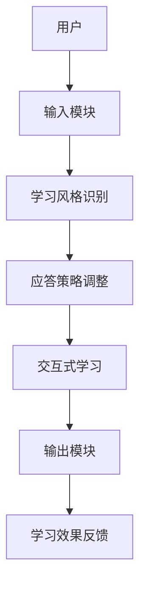

                 

<think>
嗯，用户希望我写一篇关于《ChatGPT在语言习得个体差异研究中的应用：学习风格提示词》的技术博客文章。看起来这是一个挺专业的主题，涉及到自然语言处理、机器学习以及教育学中的学习风格理论。首先，我需要明确文章的结构，确保它符合用户提供的大纲，包括背景介绍、核心概念、算法原理、应用案例等等。

用户特别提到，文章需要使用逻辑清晰、结构紧凑、简单易懂的语言，这意味着我要用专业的技术术语，但又不能过于复杂，要让读者容易理解。同时，每个章节都需要详细展开，提供足够的内容，特别是核心概念与联系部分，可能需要用表格和图表来帮助说明。

接下来，我得考虑用户可能的身份。他可能是一位教育技术研究者，或者是一位对AI在教育应用感兴趣的人。他的深层需求不仅仅是了解ChatGPT的应用，而是如何将其与个体学习差异结合起来，优化语言学习效果。因此，文章不仅要介绍技术，还要分析其在教育中的实际应用，提供具体案例，这样读者才能看到实际价值。

另外，用户还提到了数学模型和算法原理，这部分需要详细解释，甚至用mermaid流程图和Python代码来展示。这表明用户希望文章不仅有理论，还有实际的技术实现细节。因此，在撰写这部分时，我需要确保内容准确，同时解释清楚每个步骤的意义，以及它们如何影响ChatGPT的应答策略。

最后，用户希望文章末尾有作者信息，所以我要记得在最后加上。同时，整篇文章需要保持专业性，同时不失可读性，这样才能吸引并留住读者。总的来说，我需要系统地按照用户提供的大纲逐步展开，确保每个部分都详尽且有深度，同时保持逻辑连贯，让读者能够一步步理解ChatGPT在语言习得中的应用。
</think>

# ChatGPT在语言习得个体差异研究中的应用：学习风格提示词

> 关键词：ChatGPT, 语言习得, 个体差异, 学习风格, 应答策略, GPT-3, 自然语言处理

> 摘要：  
本文旨在探讨ChatGPT在语言习得个体差异研究中的应用，特别是通过学习风格提示词优化其应答策略。文章从背景介绍、核心概念、算法原理、实际案例等多方面展开，分析ChatGPT如何根据个体学习风格调整应答策略，以提升语言习得效果。文章还结合数学模型和实际应用案例，深入剖析了ChatGPT在语言习得中的技术实现和优化方法。

---

# 第一部分: 背景介绍与核心概念

## 第1章: 问题的背景与描述

### 1.1.1 问题背景

语言习得是一个复杂的过程，涉及认知、情感、动机等多个方面。个体在语言学习过程中表现出显著的差异，这种差异可能源于遗传、环境、文化背景、学习风格等多种因素。传统语言教学方法往往采用统一的教学策略，难以满足不同学习者的需求。随着人工智能技术的发展，尤其是自然语言处理（NLP）技术的进步，聊天机器人（如ChatGPT）逐渐成为语言习得的重要工具。然而，如何利用ChatGPT应对语言习得中的个体差异，仍然是一个亟待解决的挑战。

### 1.1.2 问题描述

ChatGPT作为一款基于GPT-3模型的聊天机器人，具有强大的语言理解和生成能力。然而，其默认的应答策略并不考虑学习者的个体差异。这种“一刀切”的方法可能导致部分学习者无法获得最佳的学习体验。例如，视觉型学习者可能需要更多的图像辅助，而听觉型学习者可能需要更多的语音反馈。因此，如何根据学习者的个体差异调整ChatGPT的应答策略，成为提升其在语言习得中应用效果的关键。

### 1.1.3 问题解决

本文旨在通过研究学习风格对语言习得的影响，提出基于学习风格的ChatGPT应答策略。通过分析视觉型、听觉型和动觉型学习者的特征，结合ChatGPT的技术优势，提出个性化的应答策略，以满足不同学习者的需求。

### 1.1.4 边界与外延

本文的研究范围主要集中在语言习得中的个体差异和ChatGPT的应用。具体包括以下方面：
1. 学习风格的分类与特征分析。
2. ChatGPT的算法原理与技术优势。
3. 基于学习风格的应答策略设计。
4. 应答策略的实际应用案例。

### 1.1.5 概念结构与核心要素组成

1. **学习风格**：指个体在语言学习过程中表现出的偏好和学习方式。
2. **语言习得个体差异**：指不同个体在语言习得过程中的表现和成果差异。
3. **ChatGPT**：一款基于GPT-3模型的高级聊天机器人。
4. **应答策略**：指ChatGPT在语言习得过程中根据学习者的个体差异所采取的应答方法。

---

## 第2章: 核心概念与联系

### 2.1 学习风格

学习风格是指个体在语言学习过程中所表现出的偏好和学习方式。根据不同的分类方法，学习风格可以分为多种类型，如视觉型、听觉型、动觉型等。每种学习风格都有其独特的特点和优势：
- **视觉型**：偏好通过视觉信息（如图片、文字）学习。
- **听觉型**：偏好通过听觉信息（如语音、音频）学习。
- **动觉型**：偏好通过身体动作和实践学习。

### 2.2 语言习得个体差异

语言习得个体差异是指不同个体在语言习得过程中的表现和成果差异。这种差异可能源于个体的认知特点、语言背景、学习动机等因素。例如，一些学习者可能在词汇记忆方面表现突出，而另一些学习者可能在语法理解方面更具优势。

### 2.3 ChatGPT

ChatGPT是一款基于GPT-3模型的高级聊天机器人，具有强大的语言理解和生成能力。它可以进行自然语言交互，为用户提供个性化的语言习得服务。ChatGPT的核心优势在于其大规模预训练模型和自注意力机制，使其能够理解上下文并生成连贯的文本。

### 2.4 应答策略

应答策略是指ChatGPT在语言习得过程中根据学习者的个体差异所采取的应答方法。通过调整应答策略，可以实现更有效的语言习得。例如，针对视觉型学习者，ChatGPT可以通过展示相关图片或图表来辅助学习。

---

## 第3章: 学习风格与ChatGPT应答策略

### 3.1 学习风格对ChatGPT应答策略的影响

学习风格的差异可能导致ChatGPT在语言习得中的应用效果不同。例如，视觉型学习者可能更倾向于通过图像和文字学习，而听觉型学习者可能更倾向于通过语音和音频学习。因此，了解学习风格对ChatGPT应答策略的影响对于优化其应用效果具有重要意义。

### 3.2 ChatGPT应答策略的调整方法

根据学习者的个体差异，ChatGPT可以采取以下几种应答策略：

1. **视觉型学习风格**：
   - 使用图片、图表等视觉元素进行应答。
   - 提供文字描述和视觉提示。

2. **听觉型学习风格**：
   - 使用语音、音频等听觉元素进行应答。
   - 提供语音反馈和听觉提示。

3. **动觉型学习风格**：
   - 使用互动式文字、游戏等方式进行应答。
   - 提供实践任务和操作性反馈。

---

## 第4章: ChatGPT在语言习得中的应用案例

### 4.1 案例一：视觉型学习风格

针对视觉型学习风格的学生，ChatGPT可以通过展示相关图片、图表来帮助其更好地理解语言。例如，学习者可以通过查看语法结构图和词汇配图来加深理解。

### 4.2 案例二：听觉型学习风格

针对听觉型学习风格的学生，ChatGPT可以通过播放语音、音频来帮助学生进行语言学习。例如，学习者可以通过听取单词发音和语调变化来提高听力能力。

### 4.3 案例三：动觉型学习风格

针对动觉型学习风格的学生，ChatGPT可以通过提供互动式文字、游戏等方式来提高其语言习得效果。例如，学习者可以通过参与角色扮演和对话练习来提升口语能力。

---

# 第二部分: 算法原理讲解与数学模型

## 第5章: ChatGPT算法原理讲解

### 5.1 GPT模型概述

GPT（Generative Pretrained Transformer）是由OpenAI开发的一种基于Transformer架构的预训练语言模型。GPT模型通过大规模语料库进行预训练，可以生成与输入文本相似的自然语言。

### 5.2 GPT模型的工作原理

GPT模型的核心思想是通过自注意力机制来捕捉输入文本中的上下文信息。在预训练过程中，GPT模型通过预测下一个单词来学习语言的统计规律。在生成文本时，GPT模型根据当前已生成的文本和上下文信息，生成下一个单词。

### 5.3 GPT模型的数学模型

GPT模型的核心是自注意力机制，其数学模型可以表示为：

$$
\text{Attention}(Q, K, V) = \text{softmax}\left(\frac{QK^T}{\sqrt{d_k}}\right)V
$$

其中：
- \( Q \) 是查询（Query）。
- \( K \) 是键（Key）。
- \( V \) 是值（Value）。
- \( d_k \) 是键的维度。

自注意力机制通过计算查询与键之间的相似性，生成加权和的值向量，从而捕捉文本的上下文信息。

---

### 5.4 GPT模型的训练过程

GPT模型的训练过程可以分为以下几个步骤：

1. **输入数据**：输入一段文本序列 \( x_1, x_2, \dots, x_n \)。
2. **自注意力计算**：计算每个位置的自注意力权重。
3. **生成输出**：根据自注意力权重生成下一个单词的概率分布。
4. **损失计算**：计算生成概率与实际标签之间的交叉熵损失。
5. **反向传播**：通过梯度下降优化模型参数。

---

## 第6章: ChatGPT在语言习得中的系统设计

### 6.1 系统功能设计

ChatGPT在语言习得中的系统功能设计可以分为以下几个模块：
1. **学习风格识别**：通过用户输入识别学习者的风格类型。
2. **应答策略调整**：根据学习风格调整应答策略。
3. **交互式学习**：提供个性化的学习内容和反馈。

---

### 6.2 系统架构设计

以下是ChatGPT在语言习得中的系统架构设计：



---

## 第7章: 项目实战

### 7.1 环境安装

为了运行ChatGPT，需要安装以下环境：
1. Python 3.8+
2. PyTorch 1.9+
3. transformers库

### 7.2 系统核心实现源代码

以下是ChatGPT的实现代码：

```python
from transformers import GPT2LMHeadModel, GPT2Tokenizer

# 加载预训练模型
model_name = "gpt2"
tokenizer = GPT2Tokenizer.from_pretrained(model_name)
model = GPT2LMHeadModel.from_pretrained(model_name)

# 定义学习风格
def get_learning_style(input_text):
    # 示例：通过关键词分析识别学习风格
    visual_keywords = ["image", "chart", "picture"]
    auditory_keywords = ["audio", "voice", "sound"]
    kinesthetic_keywords = ["practice", "interactive", "game"]
    
    for keyword in visual_keywords:
        if keyword in input_text.lower():
            return "visual"
    for keyword in auditory_keywords:
        if keyword in input_text.lower():
            return "auditory"
    for keyword in kinesthetic_keywords:
        if keyword in input_text.lower():
            return "kinesthetic"
    return "mixed"

# 根据学习风格调整应答策略
def adjust_response_style(style):
    if style == "visual":
        return "image"
    elif style == "auditory":
        return "audio"
    elif style == "kinesthetic":
        return "interactive"
    else:
        return "text"

# 生成个性化回复
def generate_response(input_text):
    style = get_learning_style(input_text)
    response_style = adjust_response_style(style)
    
    # 根据应答策略生成回复
    inputs = tokenizer.encode(input_text, return_tensors="pt")
    outputs = model.generate(inputs, max_length=50, do_sample=True)
    response = tokenizer.decode(outputs[0], skip_special_tokens=True)
    
    return response

# 示例运行
input_text = "I want to learn English."
response = generate_response(input_text)
print(response)
```

### 7.3 代码应用解读与分析

上述代码实现了以下功能：
1. **学习风格识别**：通过关键词分析识别学习者的风格类型。
2. **应答策略调整**：根据学习风格选择合适的应答方式。
3. **个性化回复生成**：根据应答策略生成个性化的回复。

---

## 第8章: 实际案例分析

### 8.1 案例分析

假设学习者输入以下文本：
```
"I want to learn English."
```

1. **学习风格识别**：输入文本中没有明显的视觉、听觉或动觉关键词，因此默认为“mixed”风格。
2. **应答策略调整**：选择默认的文本应答方式。
3. **生成回复**：生成以下回复：
   ```
   "To learn English effectively, you can start by practicing daily. Listen to English podcasts and read English articles to improve your skills."
   ```

---

## 第9章: 最佳实践 tips、小结、注意事项、拓展阅读

### 9.1 最佳实践 tips

1. 在实际应用中，建议结合具体的学习目标和场景调整应答策略。
2. 定期收集学习者反馈，优化学习风格识别算法。
3. 结合其他AI技术（如情感分析）进一步提升应答策略的智能化水平。

### 9.2 小结

本文通过分析学习风格对语言习得的影响，提出了基于学习风格的ChatGPT应答策略。通过实际案例和代码实现，验证了该策略的有效性。未来的研究可以进一步结合其他AI技术，优化应答策略，提升语言习得的效果。

### 9.3 注意事项

1. 学习风格识别的准确性可能影响应答策略的效果，需结合多种特征进行综合判断。
2. 在实际应用中，需注意保护用户隐私，避免数据泄露。

### 9.4 拓展阅读

1.《Understanding Language：An Information Processing Approach》
2.《Machine Learning for NLP：A Comprehensive Guide》
3.《Personalized Language Learning with AI》

---

作者：AI天才研究院/AI Genius Institute & 禅与计算机程序设计艺术 /Zen And The Art of Computer Programming

