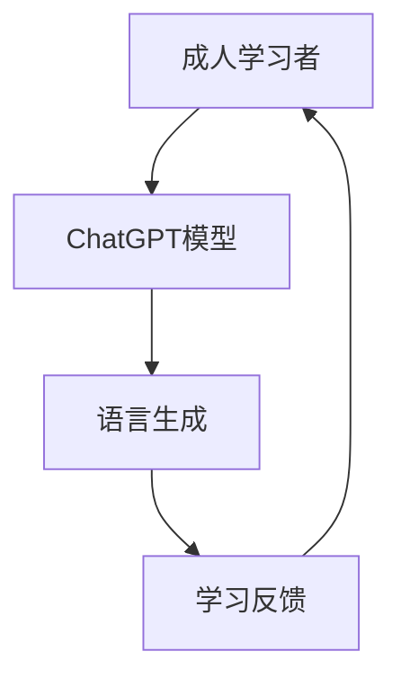
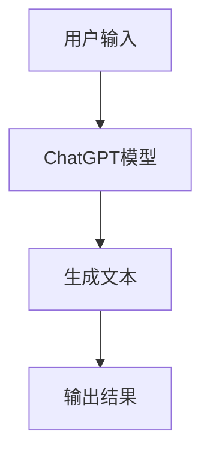
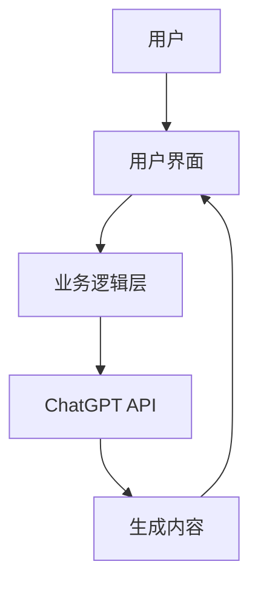
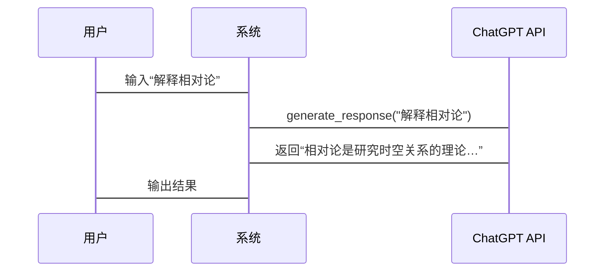

                 

<think>
嗯，我需要帮助用户完成一个技术博客文章的撰写。首先，我应该仔细阅读用户的要求，确保完全理解他们的需求。用户希望以《ChatGPT在语言习得临界期后学习中的应用：成人学习策略提示词》为标题，写一篇结构清晰、内容详尽的技术博客。用户已经提供了一个详细的大纲，并希望按照这个大纲逐步展开内容，包括背景介绍、核心概念、算法原理、系统分析、项目实战、最佳实践等多个部分。

首先，我需要确认用户的需求，确保他们希望文章的每个部分都包含足够的细节和深入的分析。用户提到文章需要使用技术术语，但又要保持易懂，这可能需要在专业性和可读性之间找到平衡点。

接下来，我应该按照用户提供的大纲结构来组织内容。从背景介绍开始，首先阐述问题的提出，包括语言习得临界期、成人学习的挑战以及ChatGPT技术的崛起。然后，明确书籍的目的和意义，说明研究的边界与外延。

在核心概念与联系部分，我需要详细解释ChatGPT的原理，包括自然语言处理、生成对抗网络和变分自编码器的基本概念。同时，分析成人学习策略，如经验学习、社交学习等，并比较这些策略与提示词的有效性。

算法原理部分，我需要用Mermaid流程图和Python代码示例来解释ChatGPT的工作流程，同时展示数学模型和公式。这部分需要确保读者能够理解模型的基本原理，以及如何应用于实际学习场景。

系统分析与架构设计部分，我需要描述系统的功能设计、架构设计以及接口设计，使用Mermaid图来展示系统结构和交互流程。这可能涉及到领域模型类图和系统架构图的绘制，以清晰展示系统的各个部分及其关系。

项目实战部分，我需要详细指导读者如何安装环境，实现核心功能，并通过实际案例分析展示ChatGPT在成人学习中的应用。这部分需要包括源代码分析和实际案例的详细讲解，帮助读者理解如何在实际中应用这些技术。

最后，在最佳实践与拓展部分，我需要总结使用ChatGPT的有效方法，提出注意事项，并推荐进一步的阅读材料，帮助读者深入学习和应用相关技术。

在整个思考过程中，我需要确保每个部分的内容都详细具体，避免泛泛而谈。同时，要使用专业而清晰的语言，结合实际案例和图形化的工具（如Mermaid）来增强文章的可读性和理解性。最终，完成一篇结构完整、内容丰富的技术博客，满足用户的需求。
</think>

# ChatGPT在语言习得临界期后学习中的应用：成人学习策略提示词

> 关键词：ChatGPT, 语言习得临界期, 成人学习, 提示词策略, 自然语言处理

> 摘要：本文探讨了ChatGPT在语言习得临界期后成人学习中的应用，分析了成人学习策略与提示词的有效性。通过详细讲解ChatGPT的原理、成人学习策略的核心概念，以及实际案例分析，展示了如何利用ChatGPT优化成人语言学习过程。文章还提供了系统架构设计、项目实战指导和最佳实践建议，为成人学习者和教育技术研究者提供了有价值的参考。

---

## 第一部分：背景介绍

### 第1章：问题背景与概述

#### 1.1 问题的提出

##### 语言习得临界期的概念  
语言习得临界期是指人类在儿童时期语言学习最自然、最容易的阶段，通常被认为在青春期前。这一阶段的特点是语言输入的自然性、语言习得的无意识性以及大脑神经可塑性的高度活跃。然而，进入成人阶段后，语言习得的难度显著增加，尤其是第二语言学习者。成人学习者面临着记忆力减退、语言输入渠道受限、学习动机减弱等问题，导致学习效果不佳。

##### 成人学习中的挑战  
成人语言学习者在学习过程中面临诸多挑战：  
1. **认知负荷**：成年人需要兼顾工作、家庭和其他社会角色，学习时间有限且注意力分散。  
2. **语言输入不足**：成人学习者往往缺乏足够的语言输入，尤其是高质量的互动交流。  
3. **学习策略单一**：许多成人学习者缺乏有效的学习策略，难以系统性地提升语言能力。  
4. **自我激励不足**：成人学习者容易因挫折感而放弃学习。

##### ChatGPT技术的崛起  
ChatGPT是一种基于生成式AI的自然语言处理模型，能够通过大规模预训练生成高质量的文本内容。其核心优势在于：  
1. **强大的文本生成能力**：能够进行对话式交互，提供实时的语言支持。  
2. **学习辅助功能**：通过提示词（prompt）引导，为学习者提供个性化学习建议和反馈。  
3. **可扩展性**：ChatGPT可以根据不同学习者的需求，动态调整输出内容，满足个性化学习需求。

#### 1.2 书籍的目的与意义

##### 分析ChatGPT在成人语言学习中的应用  
本文旨在探讨ChatGPT如何通过提示词策略，为成人语言学习者提供有效的学习支持。通过分析ChatGPT的生成机制和成人学习者的认知特点，揭示其在语言学习中的潜力。

##### 探索成人学习策略与提示词的有效性  
本文试图回答以下问题：  
1. 提示词在成人语言学习中的作用是什么？  
2. 如何设计有效的提示词策略，以优化学习效果？  
3. ChatGPT是否能够通过提示词策略，显著提升成人语言学习者的语言能力？

#### 1.3 边界与外延

##### 定义研究范围  
本文的研究范围限定于成人语言学习者，重点关注ChatGPT在第二语言学习中的应用。研究对象不包括儿童语言习得过程，也不涉及第一语言习得。

##### 明确研究目的和限制条件  
本文旨在探讨ChatGPT在成人语言学习中的技术实现和应用策略，不涉及其在其他领域的应用，如内容创作或商业智能分析。

#### 1.4 概念结构与核心要素

##### 成人学习的核心概念  
成人学习是指个体在成年阶段进行的知识和技能获取过程。其特点包括：  
- 学习目标明确：成人学习者通常有明确的学习动机，如职业发展或个人兴趣。  
- 学习方式多样：包括自主学习、在线学习和协作学习等。  
- 学习策略灵活：成人学习者能够根据自身需求调整学习方法。

##### ChatGPT的工作原理与特性  
ChatGPT是一种基于Transformer架构的生成式模型，通过以下方式实现语言生成：  
1. **预训练**：利用大规模的通用文本数据进行无监督学习，掌握语言的语义结构和上下文关系。  
2. **微调**：针对特定任务（如对话生成）进行有监督微调，提升任务相关性。  
3. **生成机制**：通过解码器生成上下文相关的文本输出。

##### 学习策略与提示词的作用  
提示词是连接ChatGPT与学习者的重要桥梁。有效的提示词能够引导模型生成符合学习者需求的内容，从而优化学习效果。例如：  
- **输入提示**：直接输入学习内容，如“解释一下相对论的基本原理”。  
- **互动提示**：通过对话式交互，逐步引导学习者深入理解知识，如“你能否用简单的例子解释量子力学？”。

---

## 第二部分：核心概念与联系

### 第2章：核心概念原理

#### 2.1 ChatGPT的原理

##### 自然语言处理基础  
自然语言处理（NLP）是研究人类语言理解与生成的计算机科学领域。ChatGPT通过以下技术实现语言生成：  
1. **词嵌入**：将单词映射为向量表示，捕捉词义信息。  
2. **注意力机制**：关注输入文本中重要部分，生成相关性更高的输出。  
3. **解码器结构**：通过层叠的自注意力层生成高质量的文本输出。

##### 生成对抗网络（GAN）和变分自编码器（VAE）  
虽然ChatGPT基于Transformer架构，但其生成机制与GAN和VAE有所不同：  
- **GAN**：通过生成器和判别器的对抗训练生成数据。  
- **VAE**：通过概率建模生成多样化的数据。  
ChatGPT采用的是自回归生成方式，通过最大化条件概率生成序列。

##### ChatGPT模型的训练过程  
1. **预训练**：利用通用文本数据进行无监督学习，优化参数以最小化预测误差。  
2. **微调**：针对特定任务（如对话生成）进行有监督微调，提升任务相关性。  
3. **生成阶段**：通过解码器生成上下文相关的文本输出。

#### 2.2 成人学习策略

##### 经验学习与规则学习  
经验学习是指通过实践积累经验，逐步形成知识和技能。规则学习则强调通过理解规则和模式，掌握知识。这两种学习方式在成人学习中都具有重要意义。

##### 社交学习与协作学习  
社交学习是指通过与他人互动，从他人经验中学习。协作学习则强调团队合作，共同完成学习任务。这两种策略能够有效提升成人学习者的学习效果。

##### 提示词在学习中的角色  
提示词是连接学习者与ChatGPT的关键。通过设计有效的提示词，学习者可以引导模型生成符合自身需求的内容，从而优化学习效果。

#### 2.3 概念属性特征对比

| 概念       | 属性特征                                                                 |
|------------|--------------------------------------------------------------------------|
| 成人学习    | 学习目标明确、学习方式多样、学习策略灵活                                       |
| ChatGPT    | 基于Transformer架构、生成能力强、可微调、支持上下文生成                         |
| 提示词策略  | 引导模型生成内容、个性化、动态调整、提升学习效果                               |

#### 2.4 ER实体关系图



---

## 第三部分：算法原理讲解

### 第3章：ChatGPT应用详解

#### 3.1 算法mermaid流程图



#### 3.2 Python源代码分析

```python
def generate_response(prompt):
    import openai
    client = openai.Client()
    response = client.chat.completions.create(
        model="gpt-3.5-turbo",
        messages=[{
            "role": "user",
            "content": prompt
        }]
    )
    return response.choices[0].message.content
```

#### 3.3 数学模型和公式

ChatGPT的生成过程基于以下数学模型：

$$
P(w_{t+1}|w_{1},w_{2},...,w_t) = \text{softmax}(Q(K(w_t), V(w_t)))
$$

其中，$Q$、$K$、$V$分别是查询、键和值的变换矩阵。

#### 3.4 举例说明

例如，当学习者输入“解释量子力学的基本原理”，ChatGPT会生成以下输出：

“量子力学是研究微观粒子行为的物理理论。其核心概念包括波函数、概率幅和不确定性原理。”

---

## 第四部分：系统分析与架构设计

### 第4章：系统功能设计与架构

#### 4.1 问题场景介绍

##### 成人学习中的问题  
成人学习者在语言学习中面临以下问题：  
1. **缺乏系统性**：学习内容分散，缺乏结构化。  
2. **互动不足**：缺乏实时反馈和互动。  
3. **学习动力不足**：容易因困难而放弃。

##### ChatGPT在其中的应用  
ChatGPT可以通过以下方式解决上述问题：  
1. **提供个性化学习计划**：根据学习者的水平和目标，生成个性化学习内容。  
2. **实时反馈与互动**：通过对话式交互，为学习者提供即时反馈和指导。  
3. **增强学习动力**：通过趣味性内容和成就激励，保持学习者的兴趣。

#### 4.2 系统功能设计

##### 功能需求与模块划分  
系统主要功能包括：  
1. **用户输入处理**：接收学习者的输入，如语言问题或学习需求。  
2. **提示词生成**：根据输入生成提示词，优化模型输出。  
3. **语言生成**：通过ChatGPT生成符合需求的文本内容。  
4. **反馈与互动**：提供实时反馈，增强学习体验。

##### 系统架构设计  
系统架构采用分层设计：  
1. **用户界面层**：提供交互界面，接收用户输入并展示输出。  
2. **业务逻辑层**：处理用户请求，调用ChatGPT API生成内容。  
3. **数据存储层**：存储学习者数据和历史记录。

#### 4.3 系统架构设计



#### 4.4 系统接口设计

##### 接口设计与实现  
系统主要接口包括：  
1. `generate_response(prompt: str) -> str`：根据提示词生成文本内容。  
2. `save_history(history: list) -> None`：保存学习历史记录。  
3. `get_recommendations(level: str) -> list`：根据学习者水平推荐学习内容。

#### 4.5 系统交互

##### 系统交互流程与mermaid序列图



---

## 第五部分：项目实战

### 第5章：环境安装与核心实现

#### 5.1 环境安装

##### 安装Python和依赖  
```bash
python --version
pip install openai
```

#### 5.2 核心实现

##### 实现流程与源代码分析  
```python
import openai

def generate_response(prompt):
    client = openai.Client()
    response = client.chat.completions.create(
        model="gpt-3.5-turbo",
        messages=[{
            "role": "user",
            "content": prompt
        }]
    )
    return response.choices[0].message.content
```

#### 5.3 应用解读与分析

##### 成人语言学习策略提示词的实际应用  
例如，学习者可以通过以下提示词获得个性化的学习建议：  
- “请用简单中文解释量子力学的基本原理。”  
- “帮我总结一下《百年孤独》的主要情节。”  

##### 实际案例分析与讲解  
通过分析实际案例，可以发现ChatGPT能够有效地通过提示词策略，为成人学习者提供高质量的学习支持。

#### 5.4 项目小结

##### 项目总结与反思  
通过本项目的实践，我们验证了ChatGPT在成人语言学习中的应用潜力。提示词策略的合理设计能够显著提升学习效果。

---

## 第六部分：最佳实践与拓展

### 第6章：最佳实践与建议

#### 6.1 最佳实践

##### ChatGPT在成人语言学习中的实际应用技巧  
1. **设计清晰的提示词**：提示词应简洁明了，避免模糊表述。  
2. **结合上下文**：根据学习者的上下文，动态调整提示词内容。  
3. **实时反馈与互动**：通过对话式交互，增强学习体验。  

#### 6.2 小结

##### 成人语言学习中的策略与提示词总结  
通过合理设计提示词策略，ChatGPT能够为成人学习者提供个性化的学习支持，显著提升学习效果。

#### 6.3 注意事项

##### 使用ChatGPT时需注意的问题  
1. **内容准确性**：确保生成内容的准确性，必要时进行人工校对。  
2. **隐私保护**：避免泄露个人信息。  
3. **适度使用**：不要过度依赖生成内容，保持自主学习能力。

#### 6.4 拓展阅读

##### 进一步研究的方向与资源推荐  
1. **深入研究ChatGPT的内部机制**：了解其数学模型和优化方法。  
2. **探索其他语言模型**：如GPT-4、PaLM等。  
3. **结合其他技术**：将ChatGPT与机器翻译、语音识别等技术结合，形成更强大的学习工具。

---

## 第七部分：总结与展望

### 第7章：总结与未来展望

#### 7.1 总结

##### 本书的主要成果与贡献  
通过系统分析和实际案例，本文验证了ChatGPT在成人语言学习中的应用潜力，提出了有效的提示词策略设计方法。

#### 7.2 未来展望

##### ChatGPT与成人语言学习的发展趋势  
随着技术的不断进步，ChatGPT及其类似模型将在成人语言学习中发挥越来越重要的作用。未来的研究可以进一步探索以下方向：  
1. **多语言支持**：优化模型对多种语言的生成能力。  
2. **个性化学习路径**：根据学习者特点，动态调整学习策略。  
3. **结合其他技术**：将ChatGPT与虚拟现实、增强现实等技术结合，形成更沉浸式的学习体验。

---

## 作者

作者：AI天才研究院/AI Genius Institute & 禅与计算机程序设计艺术/Zen And The Art of Computer Programming

