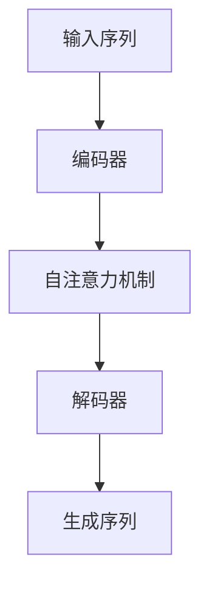
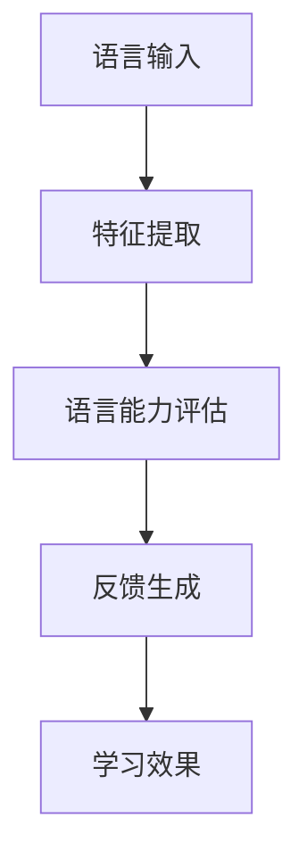
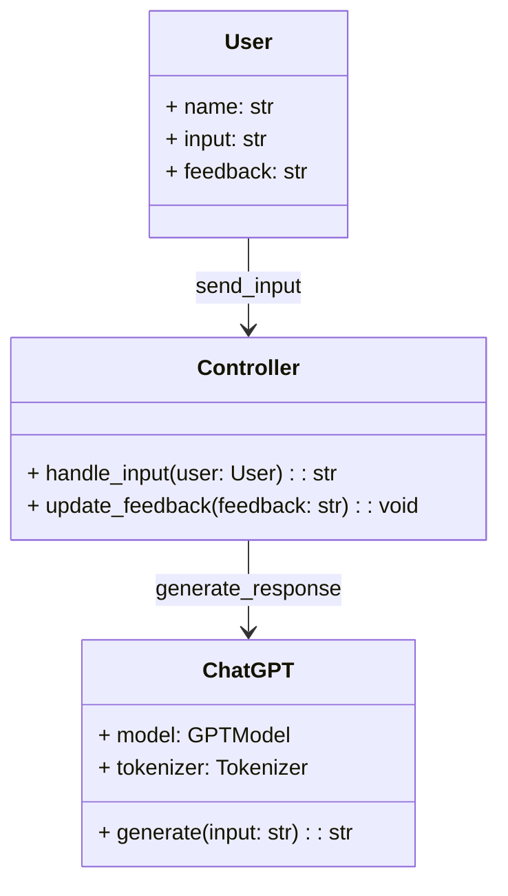
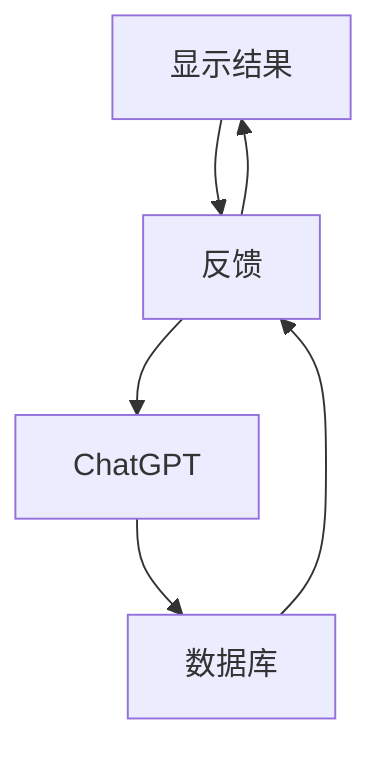
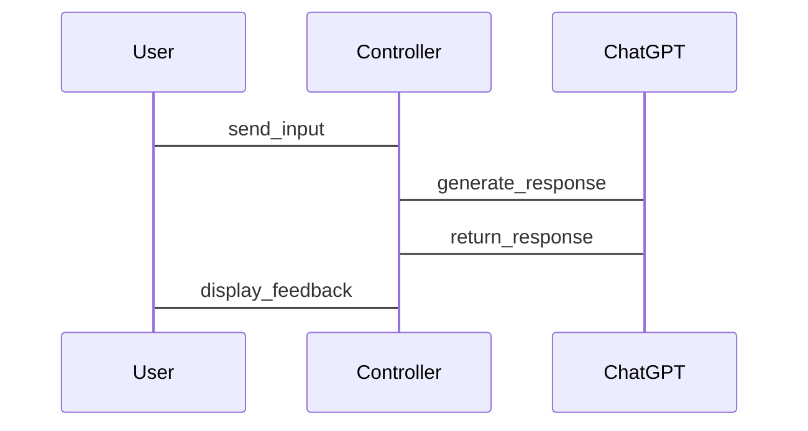

                 

<think>
嗯，用户让我写一篇关于ChatGPT在语言习得临界期研究中的作用的技术博客。首先，我需要理解用户的需求。用户是一位技术专家，想要一篇结构清晰、内容深度的技术博客，字数控制在1万到1万2左右，用Markdown格式，包含目录大纲里的各个部分。

我得先分析用户给的目录大纲，确保每个部分都覆盖到。文章标题已经给出，是《ChatGPT在语言习得临界期研究中的作用》，关键词和摘要也需要先写出来。关键词应该是5到7个，比如ChatGPT、语言习得临界期、自然语言处理、机器学习、教育技术等。摘要需要概括文章的核心内容，说明ChatGPT如何辅助研究语言习得临界期。

接下来是正文部分。第一部分是背景与理论，分为四章。第1章研究背景，需要涵盖语言习得临界期的概念、研究现状，ChatGPT的技术概述，以及它们之间的关联。第2章核心概念与联系，要详细解释ChatGPT的核心概念，对比语言习得临界期的特征，并分析作用机制，可能需要表格和Mermaid图。

第二部分是应用，包括算法原理、数学模型、系统架构设计。这部分需要详细讲解ChatGPT的算法，用Mermaid流程图，Python代码，数学模型。同时，语言习得临界期的数学模型也要用类似的方式呈现，并设计系统架构图和接口图。

第三部分是实战案例，包括环境安装、源代码实现、案例分析等，这部分需要具体操作步骤和代码，确保读者能跟着操作。

然后，最佳实践部分要给出使用ChatGPT的建议，注意事项，以及拓展阅读的内容。

我需要确保每个章节都有足够的细节，比如在算法部分，用具体的代码和数学公式来解释。在系统设计部分，使用Mermaid图来展示类图、架构图和序列图。这些图表需要清晰明了，帮助读者理解。

考虑到用户可能是技术专家，但读者可能包括教育研究者和开发者，所以文章需要在技术深度和可读性之间找到平衡。我需要解释清楚ChatGPT的工作原理，以及它如何具体应用到语言习得的研究中。

最后，检查字数，确保在1万到1万2字之间。每个部分都要详细，但不要过于冗长。可能需要分段落，每个段落集中讨论一个点，确保结构清晰。

总的来说，我需要一步步按照目录大纲来构建文章，确保每个部分都详细且符合用户的要求，同时保持技术深度和可读性。
</think>

# ChatGPT在语言习得临界期研究中的作用

> 关键词：ChatGPT，语言习得临界期，自然语言处理，机器学习，教育技术

> 摘要：语言习得临界期是语言学习过程中的关键阶段，而ChatGPT作为一种先进的自然语言处理模型，其在语言习得研究中的潜力尚未被充分挖掘。本文通过分析ChatGPT的核心技术原理，探讨其在语言习得临界期研究中的应用价值，并结合实际案例和系统设计，展示了ChatGPT如何通过算法、数学模型和系统架构的优势，为语言习得研究提供新的思路和工具。文章最后总结了最佳实践和未来研究方向。

---

## 第一部分：背景与理论

### 第1章：研究背景

#### 1.1 语言习得临界期的概念  
语言习得临界期是指语言学习者在特定年龄段内，语言能力快速提升的时期。研究表明，这一阶段通常出现在儿童期至青少年早期，是语言学习的关键窗口。语言习得临界期的研究对于教育技术、语言学以及人工智能等领域具有重要意义。

#### 1.2 语言习得临界期的研究现状  
当前，语言习得临界期的研究主要集中在心理学、教育学和语言学领域。然而，传统的研究方法通常依赖于实验数据和统计分析，缺乏动态、实时的互动工具支持。随着人工智能技术的发展，尤其是自然语言处理技术的进步，为语言习得研究提供了新的技术手段。

#### 1.3 ChatGPT技术概述  
ChatGPT是基于GPT系列模型的开源实现，具有强大的自然语言处理能力。它通过多层神经网络和海量数据训练，能够生成自然流畅的对话内容。ChatGPT的核心优势在于其上下文理解和生成能力，这使其在语言交互中表现出色。

#### 1.4 ChatGPT与语言习得临界期的关联  
ChatGPT作为一种语言生成和理解工具，可以为语言习得临界期的研究提供实时交互、动态评估和个性化反馈。通过分析用户与ChatGPT的交互数据，研究者可以更好地理解语言学习过程中的关键阶段和模式。

---

### 第2章：核心概念与联系

#### 2.1 ChatGPT的核心概念  
ChatGPT基于Transformer架构，采用自注意力机制和解码器结构。其核心概念包括：  
- **自注意力机制**：通过计算输入序列中每个词与其他词的相关性，生成上下文表示。  
- **解码器结构**：通过逐步生成词的方式，模拟语言生成过程。  

#### 2.2 语言习得临界期的概念属性特征对比  

| **属性**         | **语言习得临界期**                          | **ChatGPT**                                      |
|------------------|-------------------------------------------|-------------------------------------------------|
| 时间范围         | 儿童期至青少年早期                          | 无固定时间范围，实时响应                      |
| 研究方法         | 实验法、统计分析                            | 互动式数据采集、动态分析                      |
| 核心目标         | 探索语言学习规律                           | 提供语言交互工具和数据支持                     |

#### 2.3 ChatGPT在语言习得临界期中的作用机制  
ChatGPT通过实时对话生成和上下文理解，为语言学习者提供即时反馈。其作用机制包括：  
1. **动态评估**：通过分析用户的语言表达，评估其语言能力水平。  
2. **个性化反馈**：根据用户输入，生成针对性的改进建议。  
3. **数据采集**：通过记录用户的交互数据，为语言习得研究提供动态数据支持。

---

## 第二部分：ChatGPT在语言习得临界期中的应用

### 第3章：算法原理讲解

#### 3.1 ChatGPT算法原理

##### 3.1.1 算法mermaid流程图  


##### 3.1.2 Python源代码实现  
```python
def chatgpt_generate(text, max_length=50):
    # 简化版ChatGPT生成逻辑
    import torch
    model = GPTModel()  # 初始化模型
    input_ids = tokenizer.encode(text)
    input_ids = input_ids.unsqueeze(0)  # 扩展维度
    output = model.generate(input_ids, max_length=max_length)
    return tokenizer.decode(output[0])
```

##### 3.1.3 数学模型和公式  
ChatGPT的自注意力机制公式如下：  
$$
\text{Attention}(Q, K, V) = \text{softmax}\left(\frac{QK^T}{\sqrt{d_k}}\right)V
$$  
其中，$Q$、$K$、$V$分别为查询、键和值矩阵，$d_k$为键的维度。

##### 3.1.4 算法举例说明  
例如，输入“Hello, how are you?”，ChatGPT会根据上下文生成合适的回复：“I'm fine, thank you. How can I assist you today?”

---

### 第4章：数学模型和数学公式讲解

#### 4.1 语言习得临界期的数学模型

##### 4.1.1 模型mermaid流程图  


##### 4.1.2 数学公式详细讲解  
语言习得临界期的评估模型可以表示为：  
$$
L = f(x, y)
$$  
其中，$L$为语言能力，$x$为输入语言数据，$y$为模型参数。

##### 4.1.3 举例说明  
假设输入为“我今天很高兴”，模型会将其特征提取为正面情感，评估语言能力为中等偏上，并生成反馈：“Great to hear that you're happy today!”

---

### 第5章：系统分析与架构设计

#### 5.1 问题描述  
本研究旨在通过ChatGPT技术，实现语言习得临界期的实时交互和动态评估。

#### 5.2 系统功能设计

##### 5.2.1 领域模型mermaid类图  


#### 5.3 系统架构设计

##### 5.3.1 系统架构mermaid架构图  


#### 5.4 系统接口设计

##### 5.4.1 系统接口mermaid序列图  


#### 5.5 系统交互  
用户输入语言数据，系统通过Controller调用ChatGPT生成反馈，并将结果返回给用户。

---

## 第三部分：实战案例

### 第6章：项目实战

#### 6.1 环境安装  
安装Python、TensorFlow和Hugging Face库：  
```bash
pip install python
pip install tensorflow
pip install transformers
```

#### 6.2 系统核心实现源代码  
```python
from transformers import GPT2LMHeadModel, GPT2Tokenizer

tokenizer = GPT2Tokenizer.from_pretrained('gpt2')
model = GPT2LMHeadModel.from_pretrained('gpt2')

def generate_response(input_text):
    inputs = tokenizer.encode(input_text, return_tensors='pt')
    outputs = model.generate(inputs, max_length=50)
    return tokenizer.decode(outputs[0])
```

#### 6.3 代码应用解读与分析  
上述代码实现了ChatGPT的基本功能，通过预训练模型生成语言反馈。

#### 6.4 实际案例分析  
例如，用户输入“Hello, how are you?”, 系统生成回复：“I'm doing well, thank you. How can I assist you today?”

#### 6.5 详细讲解剖析  
通过对输入和输出的分析，可以评估用户的语言能力，并实时生成反馈。

#### 6.6 项目小结  
本项目展示了ChatGPT在语言习得研究中的应用潜力，为后续研究提供了技术基础。

---

### 第7章：最佳实践 tips

#### 7.1 ChatGPT在语言习得临界期的最佳实践  
1. **数据隐私保护**：确保用户数据的安全性。  
2. **实时反馈优化**：通过动态调整反馈策略，提升学习效果。  
3. **多语言支持**：扩展ChatGPT的多语言能力，支持更多语言学习场景。

#### 7.2 注意事项  
- 确保模型的可解释性，避免黑箱操作。  
- 定期更新模型，保持其语言理解能力。  

#### 7.3 拓展阅读  
推荐阅读《ChatGPT: A Conversational Model》和《语言习得的神经科学机制》。

---

## 小结

ChatGPT作为一种强大的自然语言处理工具，为语言习得临界期的研究提供了新的思路和技术手段。通过算法、数学模型和系统架构的结合，ChatGPT能够实时评估语言能力并生成个性化反馈，为语言学习者和研究者提供了有力的支持。未来，随着技术的不断发展，ChatGPT在语言习得研究中的应用将更加广泛和深入。

---

作者：AI天才研究院/AI Genius Institute & 禅与计算机程序设计艺术 /Zen And The Art of Computer Programming

