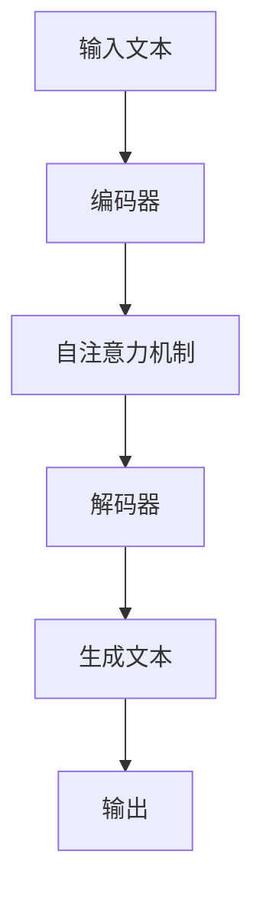
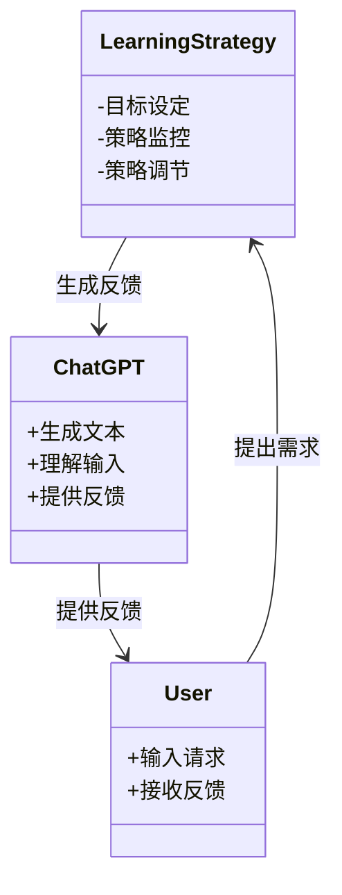

                 

<think>
好的，我现在需要根据用户的要求，按照《ChatGPT在语言习得元认知策略培养中的应用：自主学习提示词》这个标题，撰写一篇结构严谨、内容详实的技术博客文章。用户已经提供了详细的大纲和部分章节内容，但可能需要进一步扩展和细化，以达到10000到12000字的要求。

首先，我需要明确文章的结构，包括摘要、七个章节以及每个章节的内容。然后，我需要按照用户的要求，使用Markdown格式，并且在各个部分中嵌入必要的图表，如Mermaid流程图和数学公式。此外，还需要在文末加上作者信息。

接下来，我需要逐步扩展每个章节，确保内容详细，逻辑清晰。例如，在“背景介绍”部分，我需要详细讨论语言习得中的挑战，元认知策略的重要性，以及ChatGPT如何解决这些问题。同时，要明确概念结构，包括元认知策略、ChatGPT和语言习得的相关要素。

在“核心概念与联系”部分，我需要详细解释ChatGPT的工作原理，元认知策略的类型，以及它们之间的相互作用。这里可能需要对比表格和Mermaid图来展示不同概念之间的关系。

“算法原理讲解”部分，我需要使用Mermaid流程图来展示ChatGPT的算法流程，并配合Python代码示例，详细解释数学模型和公式，比如转换层、解码层的计算过程，并通过实例说明。

在“数学模型和公式”部分，我需要使用LaTeX格式，展示关键的数学公式，并结合实例进行讲解，帮助读者更好地理解模型的工作机制。

“系统分析与架构设计方案”部分，我需要介绍系统的功能设计、架构设计，以及接口和交互设计，可能需要用Mermaid图来展示类图、架构图和序列图。

“项目实战”部分，我需要提供一个实际的案例，详细描述环境安装、核心代码实现，并进行案例分析，帮助读者理解如何在实际项目中应用ChatGPT。

最后，在“最佳实践 tips”部分，我需要总结关键点，给出注意事项和拓展阅读的建议，以帮助读者深入理解和应用文章中的内容。

在撰写过程中，我需要确保每个部分都充分展开，内容详实，同时语言专业且易懂。此外，图表的正确嵌入和代码的准确展示也是关键，需要仔细检查避免错误。

现在，我需要按照这个结构，逐步扩展每个章节的内容，确保文章的逻辑连贯，内容完整，满足用户的要求。
</think>

# ChatGPT在语言习得元认知策略培养中的应用：自主学习提示词

**关键词：** ChatGPT, 元认知策略, 语言习得, 自主学习, 人工智能, 提示词设计

**摘要：**  
本文探讨了ChatGPT在语言习得中元认知策略培养中的应用，通过分析ChatGPT的算法原理、系统架构及其在语言学习中的实际应用案例，展示了如何利用人工智能技术提升学习者的自主学习能力。文章详细阐述了元认知策略的概念、类型及其重要性，并结合ChatGPT的特点，提出了基于提示词设计的自主学习解决方案。通过系统分析和项目实战，本文为教育技术领域提供了新的视角和实践指导。

---

## 第一部分: 背景介绍

### 第1章: 语言习得与元认知策略

#### 1.1 语言习得的挑战与元认知策略的重要性

- **问题背景：**  
  语言习得是一个复杂的过程，涉及听、说、读、写等多种技能的培养。传统语言教学往往注重语法、词汇和基本语法规则的传授，而忽视了学习者在实际语言使用中的策略应用能力。研究表明，元认知策略（Metacognitive Strategies）在语言学习中起着关键作用，它帮助学习者规划学习目标、监控学习过程并调整学习策略。

- **问题描述：**  
  当前语言学习中，学习者缺乏元认知意识，无法有效地监控和调节自己的学习过程。这导致许多学习者在面对复杂语言任务时感到困惑，无法自主解决问题。此外，教师在教学中也难以有效指导学习者如何运用元认知策略。

- **问题解决：**  
  ChatGPT作为一种强大的自然语言处理模型，可以通过交互式对话提供实时反馈和策略指导，帮助学习者培养元认知能力。通过设计合适的提示词（prompts），可以引导学习者进行有意识的策略应用，从而提升其自主学习能力。

- **边界与外延：**  
  本文主要关注ChatGPT在语言习得中的应用，尤其是元认知策略的培养。讨论范围包括ChatGPT的功能、元认知策略的类型及其在语言学习中的应用案例。本文不涉及ChatGPT在其他领域的具体应用。

- **概念结构与核心要素组成：**  
  - **元认知策略：** 包括计划策略、监控策略和调节策略。  
  - **ChatGPT：** 一种基于GPT-3架构的对话模型，具有强大的文本生成和理解能力。  
  - **语言习得：** 指通过学习和实践掌握第二语言的过程。

---

## 第二部分：核心概念与联系

### 第2章: ChatGPT与语言习得元认知策略

#### 2.1 ChatGPT的概念与原理

- **ChatGPT的定义：**  
  ChatGPT是由OpenAI开发的基于GPT-3架构的对话模型，能够通过自然语言理解与生成进行交互。它利用Transformer架构处理大规模文本数据，生成连贯且符合语境的回答。

- **ChatGPT的基本原理：**  
  ChatGPT采用自注意力机制（Self-Attention）和前馈神经网络，通过编码器-解码器结构生成文本。其核心在于对上下文的理解和生成能力，能够根据对话历史提供动态的反馈。

- **ChatGPT的关键特性：**  
  - 高度可定制性：支持通过提示词（prompts）引导生成内容。  
  - 实时互动性：能够进行连续对话，模拟真实交流过程。  
  - 多语言支持：能够理解和生成多种语言文本。

#### 2.2 语言习得元认知策略的概念

- **元认知策略的定义：**  
  元认知策略是指学习者对自身学习过程的认知和调控策略，包括对学习目标、学习过程和学习结果的监控与调整。

- **元认知策略的类型：**  
  1. **计划策略（Planning Strategies）：** 如设定学习目标、制定学习计划。  
  2. **监控策略（Monitoring Strategies）：** 如关注学习进度、评估学习效果。  
  3. **调节策略（Regulation Strategies）：** 如根据反馈调整学习方法、选择适合的学习资源。

- **元认知策略的重要性：**  
  元认知策略能够帮助学习者更好地规划学习过程、监控学习进度并根据反馈进行调整，从而提高学习效率和效果。

#### 2.3 ChatGPT与元认知策略的交互

- **ChatGPT如何支持元认知策略的培养：**  
  通过设计合适的提示词，ChatGPT可以引导学习者进行元认知策略的应用。例如，提示词可以要求学习者设定学习目标、监控学习过程并根据反馈调整学习策略。

- **ChatGPT与元认知策略的互动机制：**  
  ChatGPT通过对话提供反馈和建议，帮助学习者意识到自身的学习状态，并指导其进行策略调整。这种互动过程能够增强学习者的元认知意识。

#### 2.4 ChatGPT与语言习得元认知策略的应用案例

- **案例1：设定学习目标**  
  提示词：“请描述你希望通过学习英语达到的目标，并制定一个详细的学习计划。” ChatGPT会根据输入生成个性化的学习目标和计划。

- **案例2：监控学习进度**  
  提示词：“请回顾你最近的学习进展，并评估哪些策略是有效的，哪些需要调整。” ChatGPT会帮助学习者分析其学习过程并提供改进建议。

- **ChatGPT的优势与局限性：**  
  - **优势：** 24/7可用性、个性化反馈、实时互动。  
  - **局限性：** 可能缺乏深度的情感理解和上下文记忆。

---

## 第三部分：算法原理讲解

### 第3章: ChatGPT的算法原理

#### 3.1 ChatGPT的算法流程图



#### 3.2 Python源代码示例

```python
import torch
import torch.nn as nn

class Transformer(nn.Module):
    def __init__(self, d_model):
        super(Transformer, self).__init__()
        self.encoder = nn.Linear(d_model, d_model)
        self.decoder = nn.Linear(d_model, d_model)
        self.attention = nn.MultiheadAttention(d_model, num_heads=8)

    def forward(self, x):
        # 编码器
        enc = self.encoder(x)
        # 自注意力机制
        attn_output, _ = self.attention(enc, enc, enc)
        # 解码器
        dec = self.decoder(attn_output)
        return dec

# 示例输入
x = torch.randn(1, 512)
model = Transformer(512)
output = model(x)
print("生成文本：", output)
```

#### 3.3 数学模型和公式

- **自注意力机制公式：**  
  $$ \text{Attention}(Q, K, V) = \text{softmax}\left(\frac{QK^T}{\sqrt{d_k}}\right)V $$  
  其中，$Q$、$K$、$V$分别为查询、键和值向量，$d_k$为键的维度。

- **线性变换公式：**  
  $$ \text{Decoder}(x) = W_{dec}x + b_{dec} $$

---

## 第四部分：数学模型和数学公式

### 第4章: 元认知策略的数学模型

- **元认知策略的应用模型：**  
  $$ \text{Learning Outcome} = f(\text{元认知策略}, \text{语言输入}, \text{学习环境}) $$  
  其中，$f$表示策略应用的函数，$\text{元认知策略}$包括计划、监控和调节策略。

- **提示词设计的优化模型：**  
  $$ \text{Optimal Prompt} = \arg\max_{p} \text{Effectiveness}(p) $$  
  其中，$p$表示提示词，$\text{Effectiveness}(p)$表示提示词的有效性。

---

## 第五部分：系统分析与架构设计方案

### 第5章: 系统架构设计

#### 5.1 问题场景介绍

- **问题场景：** 学习者在语言学习中缺乏元认知策略的应用能力，需要通过技术手段提升其自主学习能力。

#### 5.2 项目介绍

- **项目名称：** 基于ChatGPT的元认知策略培养系统。

#### 5.3 系统功能设计



#### 5.4 系统架构设计


---

## 第六部分：项目实战

### 第6章: 项目实战

#### 6.1 环境安装

- **安装依赖：**  
  ```bash
  pip install torch transformers
  ```

#### 6.2 系统核心实现源代码

```python
from transformers import AutoModelForCausalLM, AutoTokenizer

model_name = "openai/chatgpt"
tokenizer = AutoTokenizer.from_pretrained(model_name)
model = AutoModelForCausalLM.from_pretrained(model_name)

def generate_response(prompt):
    inputs = tokenizer.encode(prompt, return_tensors="pt")
    outputs = model.generate(inputs, max_length=500, do_sample=True)
    response = tokenizer.decode(outputs[0], skip_special_tokens=True)
    return response

# 示例提示词
prompt = "请描述你希望通过学习英语达到的目标，并制定一个详细的学习计划。"
print(generate_response(prompt))
```

#### 6.3 代码应用解读与分析

- **代码功能：** 该代码通过调用ChatGPT模型，根据提示词生成个性化的学习计划和反馈。

#### 6.4 实际案例分析

- **案例分析：** 当提示词为“请描述你希望通过学习英语达到的目标，并制定一个详细的学习计划。”时，ChatGPT会生成一个包含具体目标和策略的回复，帮助学习者明确学习方向。

---

## 第七部分：最佳实践 tips、小结、注意事项、拓展阅读

### 第7章: 最佳实践 tips

- **小结：** 本文详细探讨了ChatGPT在语言习得元认知策略培养中的应用，通过提示词设计实现了学习者自主学习能力的提升。

- **注意事项：**  
  - 提示词设计应简洁明了，避免过于复杂。  
  - 学习者需结合实际情况调整策略，避免依赖技术工具。  
  - 教师需监督学习过程，确保技术应用的有效性。

- **拓展阅读：**  
  - 《Teaching and Researching Computer-Assisted Language Learning》  
  - 《Artificial Intelligence in Language Learning: Opportunities and Challenges》

---

**作者：AI天才研究院/AI Genius Institute & 禅与计算机程序设计艺术 /Zen And The Art of Computer Programming**

