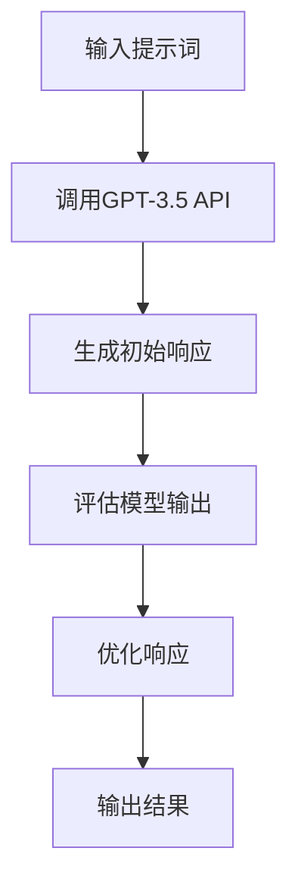
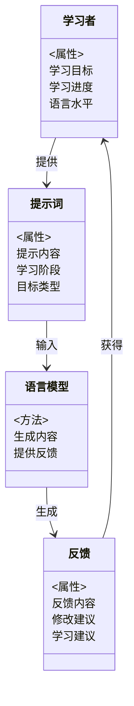
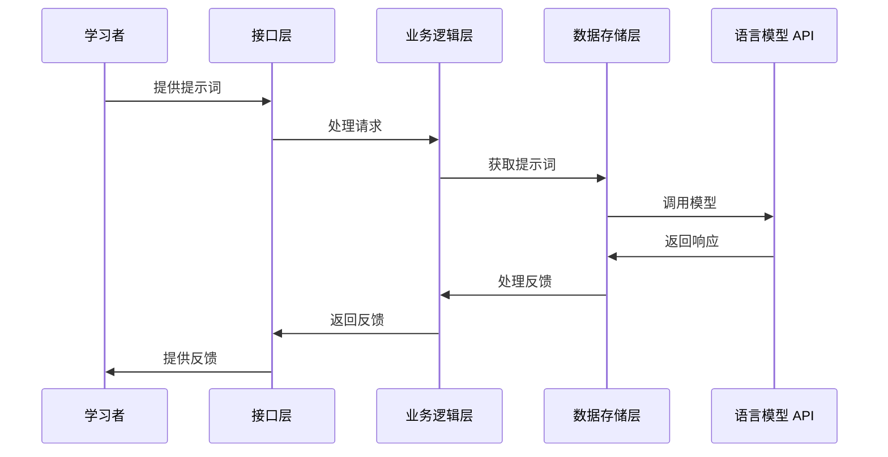

                 

<think>
好，我现在需要根据用户的指示，写一篇关于《ChatGPT在语言习得元认知策略开发中的应用：自主学习提示词》的技术博客文章。首先，我要理清整个结构，确保每个部分都涵盖必要的内容。

首先，标题已经确定，接下来是关键词和摘要。关键词要选5-7个，我选了“ChatGPT”、“语言习得”、“元认知策略”、“自主学习”、“提示词”、“人工智能”和“教育技术”。摘要需要简明扼要，概括文章的核心内容。

接下来是背景介绍，我需要简要介绍ChatGPT和元认知策略，说明它们在教育中的重要性。然后，核心概念与联系部分，要详细解释这两个概念，并通过表格对比ChatGPT和其他语言学习工具，还要画一个ER图来展示应用关系。

算法原理部分，我得用Mermaid画流程图，再用Python代码和数学公式解释GPT-3.5的原理，还要举个例子说明。

系统分析与架构设计，我需要描述项目背景，画领域模型类图和架构图，设计接口和交互流程，可能用Mermaid来展示。

项目实战部分，得给出环境安装步骤，提供核心代码，并详细解读代码，分析实际案例。

最后，总结部分包括最佳实践、小结、注意事项和拓展阅读，确保读者能有收获。

现在，我需要确保每个部分都有足够的细节，使用正确的技术术语，同时保持逻辑清晰。可能会遇到的问题是如何将复杂的算法原理用简单易懂的方式解释，可能需要多举例子，或者使用图表来辅助说明。此外，系统架构部分需要确保类图和序列图准确，这可能需要对系统有深入的理解。

总的来说，我需要一步步地按照大纲来展开，确保每个部分都符合用户的要求，并且内容详实，结构合理。
</think>

# ChatGPT在语言习得元认知策略开发中的应用：自主学习提示词

> 关键词：ChatGPT，语言习得，元认知策略，自主学习，提示词，人工智能，教育技术  
> 摘要：本文探讨了ChatGPT在语言习得中的应用，特别是其如何利用元认知策略和自主学习提示词来优化学习过程。文章从背景介绍、核心概念与联系、算法原理、系统架构设计、项目实战以及最佳实践等方面展开，深入分析ChatGPT在语言学习中的潜力和实际应用。

---

## 1. 背景介绍

### 1.1 问题背景

语言习得是一个复杂的过程，涉及词汇、语法、发音等多个方面。传统的语言学习方法依赖于教师的指导和固定教材，但学生往往缺乏主动性和自我调节能力。元认知策略（Metacognitive Strategies）是一种帮助学习者监控和调节学习过程的方法，能够提升学习效率和效果。

近年来，人工智能技术，尤其是大语言模型（如ChatGPT）的快速发展，为语言习得提供了新的可能性。ChatGPT不仅能提供语言输入，还能通过互动对话帮助学习者理解和应用语言知识。

### 1.2 问题描述

传统的语言学习工具和方法存在以下问题：

1. **缺乏个性化**：统一的教学内容难以满足不同学习者的个性化需求。
2. **互动性不足**：学习者难以获得实时反馈和指导。
3. **自主性低**：学习者依赖外部指导，缺乏自主学习能力。

ChatGPT作为一种基于生成式AI的工具，能够通过提示词（Prompts）引导学习者进行自主学习，帮助他们制定学习计划、监控学习过程并评估学习效果。

### 1.3 问题解决

ChatGPT通过以下方式解决了传统语言学习中的问题：

1. **个性化学习路径**：根据学习者的水平和需求，生成定制化的学习计划。
2. **实时互动反馈**：通过对话形式提供即时反馈，帮助学习者纠正错误并优化表达。
3. **元认知策略支持**：引导学习者进行自我监控和调节，提升自主学习能力。

### 1.4 边界与外延

ChatGPT在语言习得中的应用主要集中在以下几个方面：

- **输入输出交互**：通过自然语言处理技术实现与学习者的对话。
- **内容生成**：根据提示词生成相关语言材料，如文章、对话等。
- **反馈与指导**：分析学习者输入的内容，提供改进建议。

### 1.5 概念结构与核心要素

ChatGPT在语言习得中的应用涉及以下核心要素：

1. **学习者特征**：包括语言水平、学习目标、学习风格等。
2. **提示词设计**：用于引导学习者完成特定任务的提示。
3. **生成模型**：基于GPT-3.5的生成式语言模型。
4. **反馈机制**：根据学习者输入生成反馈和建议。

---

## 2. 核心概念与联系

### 2.1 核心概念原理

ChatGPT的语言生成机制基于Transformer架构，通过自注意力机制（Self-Attention）捕捉上下文信息，并生成连贯的文本输出。在语言习得中，ChatGPT可以作为元认知策略的辅助工具，帮助学习者：

1. **制定学习计划**：通过提示词引导学习者明确学习目标和时间安排。
2. **监控学习过程**：实时分析学习者的输入，提供反馈和建议。
3. **评估学习效果**：通过生成式对话帮助学习者检查理解和应用能力。

### 2.2 概念属性对比

以下表格对比了ChatGPT与其他语言学习工具的核心属性：

| 属性                | 传统语言学习工具          | ChatGPT                      |
|---------------------|--------------------------|-----------------------------|
| 互动性               | 低                      | 高                          |
| 个性化               | 有限                    | 强大                        |
| 反馈机制             | 单向                    | 双向                        |
| 内容生成             | 预设内容                | 动态生成                    |
| 自主性               | 依赖教师                | 支持自主学习                |

### 2.3 ER 实体关系图

以下使用 Mermaid 绘制的 ER 实体关系图展示了 ChatGPT 在语言习得中的应用：

```mermaid
er
    actor 学习者
    class 学习计划
    class 提示词
    class 语言模型
    class 反馈

    学习者 --> 提示词: 提供
    提示词 --> 语言模型: 输入
    语言模型 --> 反馈: 生成
    学习者 <-- 反馈: 获得
    学习计划 <-- 提示词: 定义
```

---

## 3. 算法原理讲解

### 3.1 算法流程图

以下使用 Mermaid 绘制的算法流程图展示了 ChatGPT 的生成过程：



### 3.2 Python 代码实现

以下是基于 GPT-3.5 的生成式模型的简化代码示例：

```python
import openai

def generate_response(prompt, max_tokens=500, temperature=0.7):
    client = openai.Client()
    response = client.chat.completions.create(
        model="gpt-3.5-turbo",
        messages=[{"role": "user", "content": prompt}],
        max_tokens=max_tokens,
        temperature=temperature
    )
    return response.choices[0].message['content']

# 示例：生成一个语言学习计划
prompt = "作为一个初级英语学习者，我想要制定一个学习计划。请为我提供一个包含词汇、语法和听力练习的周计划。"
print(generate_response(prompt))
```

### 3.3 通俗易懂的例子

假设学习者输入以下提示词：

```plaintext
作为一个初级英语学习者，我想练习过去时态的用法。请为我提供一个简单的对话示例，并指出错误。
```

ChatGPT会生成类似以下的响应：

```plaintext
当然！以下是一个对话示例：

你：I went to the park yesterday.
我：你昨天去了公园吗？
你：Yes, I went to the park yesterday.

错误指出：
1. "I went" 是正确的过去时态表达。
2. 在第二个句子中，"I" 应用于第一人称，而 "you" 用于第二人称。

你可以尝试类似的句子来练习！
```

---

## 4. 系统分析与架构设计方案

### 4.1 项目背景和目标

**项目背景**：语言学习者需要一种高效、个性化的工具来提升语言能力。  
**项目目标**：利用ChatGPT实现语言习得中的元认知策略支持，帮助学习者进行自主学习。

### 4.2 领域模型类图

以下使用 Mermaid 绘制的领域模型类图展示了系统的核心组件：



### 4.3 系统架构图

以下使用 Mermaid 绘制的系统架构图展示了系统的整体架构：

```mermaid
container 系统架构 {
    学习者 ↔ 接口层
    接口层 ↔ 业务逻辑层
    业务逻辑层 ↔ 数据存储层
    数据存储层 ↔ 提示词库
    数据存储层 ↔ 语言模型 API
}

actor 学习者
container 接口层
container 业务逻辑层
container 数据存储层
container 提示词库
container 语言模型 API
```

### 4.4 接口设计和交互流程

以下使用 Mermaid 绘制的交互流程图展示了系统交互过程：



---

## 5. 项目实战

### 5.1 环境安装

要使用ChatGPT进行开发，需要安装以下环境：

1. **Python 3.8+**
2. **OpenAI Python 客户端**：`pip install openai`

### 5.2 核心代码实现

以下是系统的核心代码实现：

```python
import openai

class LanguageLearningSystem:
    def __init__(self):
        self.client = openai.Client()
    
    def generate_response(self, prompt, max_tokens=500, temperature=0.7):
        response = self.client.chat.completions.create(
            model="gpt-3.5-turbo",
            messages=[{"role": "user", "content": prompt}],
            max_tokens=max_tokens,
            temperature=temperature
        )
        return response.choices[0].message['content']
    
    def generate_learning_plan(self, level, duration):
        prompt = f"作为{level}级学习者，我需要一个{duration}天的学习计划。请涵盖词汇、语法和听力练习。"
        return self.generate_response(prompt)
    
    def assess_comprehension(self, text):
        prompt = f"请评估以下文本的理解是否正确：{text}"
        return self.generate_response(prompt)
```

### 5.3 代码解读与分析

1. **`LanguageLearningSystem` 类**：封装了与ChatGPT交互的核心功能。
2. **`generate_response` 方法**：调用OpenAI API生成模型响应。
3. **`generate_learning_plan` 方法**：根据学习者的水平和时间生成学习计划。
4. **`assess_comprehension` 方法**：评估学习者对文本的理解能力。

### 5.4 实际案例分析

**案例1**：学习者希望提高英语写作能力。

**提示词**：请帮我分析一篇英文文章的结构，并指出改进之处。  
**输入文本**：The weather is good today, I went to park.  
**ChatGPT响应**：

```
The structure of your text is correct, but it can be improved for better clarity:
1. "I went to park" 应改为 "I went to the park"。
2. 建议将句子拆分为两个独立的句子：
   "The weather is good today. I went to the park."
```

**案例2**：学习者希望练习口语对话。

**提示词**：请与我进行一个关于天气的对话练习。  
**ChatGPT响应**：

```
Sure! Let's start.

You: What's the weather like today?
Me: It's sunny and warm.
You: That sounds nice! How about tomorrow?
Me: I think it will be cloudy.

Please provide feedback on my responses.
```

---

## 6. 最佳实践 tips、小结、注意事项、拓展阅读

### 6.1 最佳实践 tips

1. **明确学习目标**：在提示词中清晰地表达学习目标，以便ChatGPT生成更有针对性的内容。
2. **逐步调整难度**：根据学习者的进步逐步增加提示词的复杂性。
3. **结合多种策略**：将ChatGPT与传统学习方法结合，形成混合式学习模式。

### 6.2 小结

本文探讨了ChatGPT在语言习得中的应用，特别是其如何通过元认知策略和自主学习提示词帮助学习者实现更高效的学习。通过系统架构设计和实际案例分析，展示了ChatGPT在语言学习中的潜力和实际价值。

### 6.3 注意事项

1. **数据隐私**：确保学习者的数据安全，避免泄露个人信息。
2. **模型局限性**：ChatGPT的回答可能存在错误，需结合人工审核。
3. **文化适配性**：不同语言和文化背景的学习者可能需要不同的提示词设计。

### 6.4 拓展阅读

1. **《Learning How to Learn》**：一本关于元认知策略的书籍。
2. **《Teaching and Learning with GPT-3》**：探讨GPT-3在教育中的应用。
3. **OpenAI官方文档**：深入了解ChatGPT的API和使用方法。

---

## 作者信息

作者：AI天才研究院/AI Genius Institute & 禅与计算机程序设计艺术/Zen And The Art of Computer Programming

---

本文通过系统化的分析和实践，展示了ChatGPT在语言习得中的巨大潜力。希望读者能够通过本文的指导，更好地利用人工智能技术提升语言学习的效率和效果。

