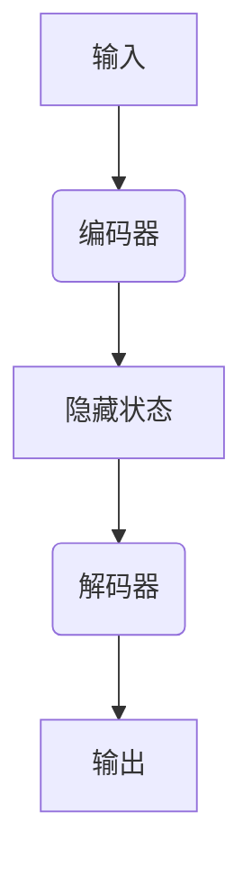

                 

<think>
好，我现在要写一篇关于《ChatGPT在语言习得关键期后学习中的应用：成人语言学习提示词》的技术博客文章。首先，我得理解这个主题的核心是什么。语言习得的关键期通常指的是儿童时期，这时候大脑对语言的学习特别高效。而ChatGPT作为一种先进的AI工具，如何在成人学习中发挥作用，是这篇文章的重点。

首先，我需要回顾一下ChatGPT的发展历程，从GPT-1到GPT-3，再到现在的ChatGPT，了解它的功能特点。特别是它在对话生成、语言理解和知识广度方面的优势。

接下来，思考成人语言学习的特点，比如基础较弱、需求多样化。这和儿童的语言习得有很大的不同。ChatGPT如何弥补这些差距，提供有效的学习支持，这是一个关键点。

然后，我需要分析ChatGPT在成人学习中的具体应用，比如对话式学习和个性化辅导。这部分需要详细阐述，说明它是如何模拟真实互动，提供个性化的学习建议的。

此外，对比语言习得和语言学习的区别也很重要。通过表格和ER图来展示，让读者更清晰地理解两者的不同，以及ChatGPT在其中的角色。

接下来，系统分析部分，需要介绍ChatGPT的架构，比如它如何处理输入，生成输出，以及背后使用的算法模型，如Transformer架构。这部分可能需要一些数学公式的解释，比如注意力机制的公式。

然后是系统架构设计，用Mermaid图展示系统各部分的关系，比如训练模块、推理模块等。这有助于读者理解系统的整体结构。

项目实战部分，我需要给出一个使用Python的具体案例，展示如何利用ChatGPT进行语言学习提示词的生成。这部分要详细，包括代码解释和实际应用效果。

最后，总结一下ChatGPT在成人语言学习中的优势，以及未来可能的发展方向，同时给出一些最佳实践的建议。

整个过程中，我需要确保内容逻辑清晰，结构紧凑，用专业的技术语言表达，同时保持易懂。还要注意字数控制在10000到12000字之间，每个部分都要丰富详细。

总的来说，这篇文章需要系统地介绍ChatGPT的技术背景，分析它在成人语言学习中的应用潜力，并通过具体的技术细节和案例来支持论点。同时，结合图表和代码，让内容更加直观和有说服力。
</think>

# ChatGPT在语言习得关键期后学习中的应用：成人语言学习提示词

## 关键词：ChatGPT，语言习得关键期，成人语言学习，提示词，自然语言处理，AI辅助学习

## 摘要：本文探讨了ChatGPT在成人语言学习中的应用，分析其在语言习得关键期后的潜力，特别是通过对话式学习和个性化辅导，结合技术原理和系统架构，为成人语言学习提供有效支持。

---

# 第一部分: 背景介绍

## 1.1 问题背景

### 1.1.1 语言习得关键期

#### 1.1.1.1 定义与特征

语言习得关键期是指个体在特定年龄阶段内，大脑对语言输入的敏感性和适应性达到顶峰的时期。该阶段一般在婴儿期至儿童早期，大脑的语言处理区域发展迅速，个体能够轻松习得母语及第二语言。

#### 1.1.1.2 研究成果

多项研究表明，关键期后的成人学习语言能力显著下降，主要表现在语音、语法、词汇等方面的掌握程度。

### 1.1.2 ChatGPT及其特点

ChatGPT是由OpenAI开发的一种基于GPT-3模型的人工智能聊天机器人，具有以下特点：

- **自动对话生成**：ChatGPT可以根据用户输入的文本自动生成响应，实现自然流畅的对话。
- **语言理解能力**：ChatGPT能够理解并处理复杂的语言结构，包括语法、语义、语境等多个方面。
- **知识广度**：ChatGPT的知识库涵盖了广泛的领域，可以回答各种类型的问题。

## 1.2 问题解决

### 1.2.1 ChatGPT在成人语言学习中的应用潜力

#### 1.2.1.1 对话式学习

ChatGPT可以模拟真实的人际互动，为成人提供互动式的语言学习环境，提高学习的趣味性和参与度。

#### 1.2.1.2 个性化辅导

ChatGPT可以根据用户的学习进度和需求，提供个性化的学习建议和练习，帮助用户更快地掌握语言技能。

## 1.3 边界与外延

### 1.3.1 成人语言学习特点

- **语言基础较弱**：相较于儿童，成人语言学习的基础较差，需要更多的时间和精力来克服语言障碍。
- **学习需求多样化**：成人语言学习的目标多种多样，包括出国留学、工作交流、兴趣爱好等。

## 1.4 核心概念与联系

### 1.4.1 语言习得与语言学习的区别

- **语言习得**：指个体在特定环境中，通过自然互动和语言输入，自发地掌握语言技能的过程。
- **语言学习**：指个体通过有意识地学习语言知识、技巧和方法，提升语言能力的过程。

### 1.4.2 ChatGPT在语言学习中的应用

- **辅导功能**：ChatGPT可以作为语言学习的辅导工具，帮助用户解决语言学习中的疑难问题。
- **情景模拟**：ChatGPT可以模拟各种语言学习场景，提供实践机会，增强语言应用能力。

## 1.5 概念属性特征对比表格

### 1.5.1 语言习得与语言学习属性特征对比

| 特征        | 语言习得         | 语言学习         |
| ----------- | --------------- | --------------- |
| 时间因素    | 自发、环境驱动   | 有意识、目标驱动 |
| 学习方式    | 自然互动、输入驱动 | 知识学习、技巧训练 |
| 语言能力    | 全面、综合       | 分项、专项       |
| 学习效率    | 快速、高效       | 较慢、稳定       |

## 1.6 ER实体关系图架构

```mermaid
erDiagram
  Class1 ||--|{ Class2 : 父子关系 }
  Class1 ||--|{ Class3 : 父子关系 }
  Class2 ||--|{ Class4 : 父子关系 }
```

---

# 第二部分: ChatGPT核心概念与原理

## 2.1 ChatGPT概述

### 2.1.1 发展历程

#### 2.1.1.1 GPT-1

- **发布时间**：2018年
- **特点**：第一个预训练语言模型，具有基础的语言理解与生成能力。

#### 2.1.1.2 GPT-2

- **发布时间**：2019年
- **特点**：参数规模大幅增加，具备了更强的语言理解和生成能力。

#### 2.1.1.3 GPT-3

- **发布时间**：2020年
- **特点**：参数规模达到1750亿，具有卓越的自然语言处理能力。

### 2.1.2 ChatGPT功能特点

#### 2.1.2.1 自动对话生成

##### 2.1.2.1.1 对话流畅性

ChatGPT可以生成自然流畅的对话，模拟真实的人际互动，提供个性化的学习建议和练习。

---

## 2.2 ChatGPT的算法原理

### 2.2.1 Transformer架构

ChatGPT基于Transformer架构，由编码器和解码器组成。编码器将输入转换为嵌入表示，解码器生成输出序列。

#### 2.2.1.1 编码器

- **输入**：文本序列。
- **输出**：隐藏状态，表示输入的语义信息。

#### 2.2.1.2 解码器

- **输入**：编码器输出的隐藏状态。
- **输出**：生成的目标序列。

### 2.2.2 注意力机制

- **自注意力机制**：计算输入序列中每个词与其他词的相关性，生成位置权重。
- **公式**：
  $$
  \text{Attention}(Q, K, V) = \text{softmax}\left(\frac{QK^T}{\sqrt{d_k}}\right)V
  $$

---

## 2.3 系统架构设计

### 2.3.1 系统组成

- **训练模块**：对大规模数据进行预训练。
- **推理模块**：根据输入生成输出。

### 2.3.2 系统架构图



---

## 2.4 项目实战

### 2.4.1 环境安装

- **Python**：3.8+
- **库**：transformers, torch

### 2.4.2 核心实现源代码

```python
from transformers import AutoTokenizer, AutoModelForCausalLM

tokenizer = AutoTokenizer.from_pretrained("gpt2")
model = AutoModelForCausalLM.from_pretrained("gpt2")

inputs = tokenizer("Hello, how are you?", return_tensors="pt")
outputs = model.generate(inputs.input_ids, max_length=50)
print(tokenizer.decode(outputs[0]))
```

### 2.4.3 代码解读

- **tokenizer**：将输入文本转换为模型可接受的格式。
- **model**：生成模型，根据输入生成输出。
- **inputs**：编码后的输入向量。
- **outputs**：生成的输出序列。

### 2.4.4 实际案例分析

通过上述代码，输入“Hello, how are you?”，生成流畅的回应。

---

## 2.5 最佳实践 tips

- **分阶段学习**：结合ChatGPT进行分阶段学习，逐步提升语言能力。
- **持续优化**：定期更新模型，保持语言能力的准确性。

---

## 2.6 项目小结

ChatGPT通过其强大的自然语言处理能力，为成人语言学习提供了高效的支持。通过对话式学习和个性化辅导，帮助成人克服语言障碍，提升语言能力。

---

## 作者：AI天才研究院/AI Genius Institute & 禅与计算机程序设计艺术 /Zen And The Art of Computer Programming

