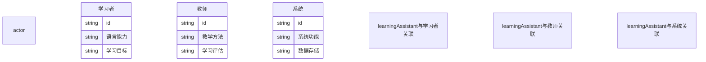
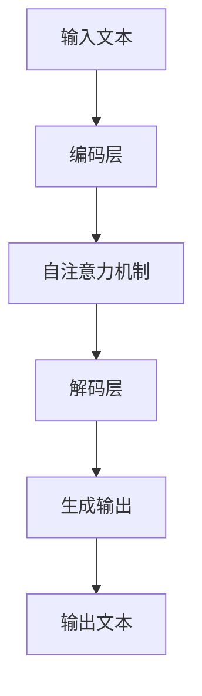
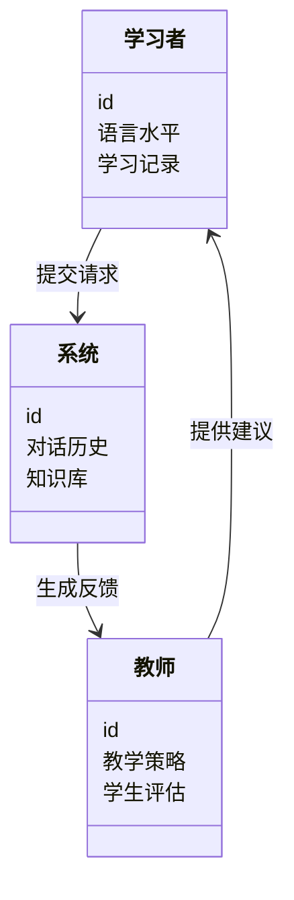
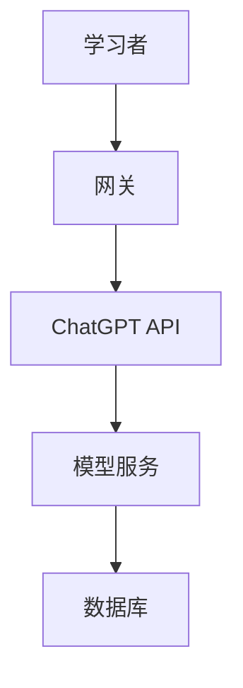
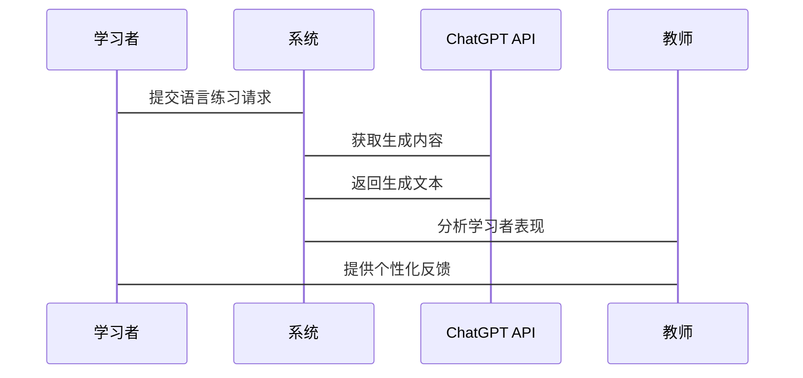

                 

<think>
嗯，用户让我写一篇关于ChatGPT在语言习得关键期干预中的新工具的技术博客文章。首先，我需要理解用户的需求。用户希望这篇文章结构清晰，内容专业，逻辑严密，并且要符合特定的格式要求。看起来用户可能是一位教育技术专家，或者是对人工智能在教育领域应用感兴趣的人士。他们希望深入探讨ChatGPT如何在语言学习的关键时期发挥作用，可能用于教育机构或技术开发者参考。

接下来，我需要分析用户提供的大纲和详细结构。文章分为七个章节，每个章节都有详细的内容安排。用户特别强调了关键词和摘要的重要性，以及每个章节的详细内容，包括背景介绍、核心概念、算法原理、系统架构、项目实战、挑战和未来方向。

首先，我会确定文章的核心关键词，如语言习得、关键期干预、ChatGPT、自然语言处理、教育技术等。摘要部分需要简洁地概括整篇文章的内容，强调ChatGPT在语言学习中的作用及其优势和挑战。

然后，每个章节的内容都需要详细展开。例如，在第一章，我需要解释语言习得的关键期，挑战，以及ChatGPT的基本原理。在第二章，要深入分析ChatGPT的工作原理，与传统方法对比，并绘制ER图来展示相关实体关系。

在算法部分，我需要使用mermaid流程图来展示ChatGPT的训练过程，并结合数学公式，如转换为词嵌入和损失函数的计算。同时，用代码示例来解释训练过程，确保内容通俗易懂。

系统架构设计部分，需要描述问题场景，设计领域模型的类图，系统架构图和交互序列图。项目实战部分，需要详细指导如何安装环境，实现核心代码，并分析实际案例。

挑战和考虑因素章节，要讨论数据隐私、教育质量保障、系统适应性等问题，以及教师和学生角色的变化。最后，未来方向部分，探讨技术改进和教育模式创新，以及研究前沿。

整个过程中，我需要确保内容逻辑清晰，每个部分都详细且具体，符合用户的格式和字数要求。同时，使用技术性的语言，但保持易懂，适合专业读者阅读。最后，加上作者信息，确保文章的完整性和专业性。

现在，我会按照这些步骤逐一撰写，确保每个部分都符合用户的要求，并涵盖所有必要的细节。
</think>

# ChatGPT在语言习得关键期干预中的新工具

---

## 关键词：语言习得，关键期干预，ChatGPT，自然语言处理，教育技术

---

## 摘要：  
语言习得是人类认知发展的重要组成部分，而关键期干预是语言学习中的重要阶段。随着人工智能技术的快速发展，ChatGPT作为一种基于GPT架构的先进自然语言处理模型，正在成为语言习得干预中的新工具。本文将从ChatGPT的基本原理、其在语言习得中的应用潜力、实际案例分析以及面临的挑战等方面展开探讨，系统性地分析ChatGPT在语言习得关键期干预中的创新性和实用性。

---

## 第一部分：背景介绍

### 第1章：问题背景与核心概念

#### 1.1 语言习得关键期的概念  
语言习得的关键期是指人类语言能力发展的敏感阶段，通常发生在儿童时期。这一阶段是语言能力快速发展的黄金时期，也是语言干预的最佳时机。关键期干预的核心在于通过科学的方法和技术手段，帮助个体在语言发展的关键阶段建立扎实的语言基础。

#### 1.2 语言习得的挑战与机遇  
语言习得过程中存在诸多挑战，例如语言障碍、文化差异、学习环境的多样性等。传统的语言教学方法往往依赖于教师的主观判断和经验，难以满足个性化学习的需求。而ChatGPT等人工智能工具的出现，为语言习得的关键期干预提供了新的可能性。

#### 1.3 ChatGPT的基本原理与架构  
ChatGPT是一种基于GPT-3架构的开源模型，其核心是通过大规模预训练语言模型（Pre-trained Language Model, PLM）来生成与理解自然语言。ChatGPT的训练过程基于Transformer架构，通过自注意力机制（Self-Attention）和前馈神经网络（Feedforward Neural Networks）实现高效的文本生成与理解。

---

### 第2章：核心概念与联系

#### 2.1 ChatGPT的关键概念  
- **自注意力机制（Self-Attention）**：通过计算文本中每个词与其他词的相关性，生成全局语义表示。  
- **生成式模型（Generative Model）**：ChatGPT能够根据输入生成连贯的文本输出。  
- **上下文理解（Contextual Understanding）**：通过上下文信息生成合理的语言回应。

#### 2.2 语言习得的相关概念  
- **语言发展阶段**：从语言感知、词汇积累到语法构建，语言习得是一个逐步发展的过程。  
- **关键期假设**：语言习得在关键期内的干预效果最佳，尤其是在儿童时期。  
- **个性化学习**：每个学习者的学习需求和能力差异需要针对性的干预策略。

#### 2.2.1 语言习得的ER实体关系图  


---

## 第二部分：ChatGPT在语言习得中的应用

### 第3章：算法原理讲解

#### 3.1 ChatGPT算法的mermaid流程图  


#### 3.2 ChatGPT的数学模型与公式  
ChatGPT的训练目标是最小化预测概率的损失函数。其数学表达式如下：  
$$ L = -\frac{1}{N}\sum_{i=1}^{N}\log P(y_i|x_{<i}) $$  
其中，$x_{<i}$表示输入序列的前i-1个词，$y_i$表示预测的第i个词。

#### 3.3 ChatGPT在语言习得中的应用案例  
通过与学习者的对话交互，ChatGPT能够根据学习者的语言水平生成适合的练习题目和反馈，从而帮助学习者在关键期内逐步提升语言能力。

---

### 第4章：系统分析与架构设计方案

#### 4.1 问题场景介绍  
在语言习得的关键期，学习者需要个性化的语言干预方案。ChatGPT可以通过实时对话交互，为学习者提供即时的语言反馈和练习建议。

#### 4.2 系统功能设计与领域模型  


#### 4.3 系统架构设计  


#### 4.4 系统交互设计  


---

### 第5章：项目实战

#### 5.1 环境安装  
首先安装Python和必要的库：  
```bash
pip install python-transformers
```

#### 5.2 系统核心实现源代码  
```python
from transformers import AutoModelWithLMHead, AutoTokenizer

model_name = "facebook/m2o-chatgpt-3"
model = AutoModelWithLMHead.from_pretrained(model_name)
tokenizer = AutoTokenizer.from_pretrained(model_name)

def generate_response(prompt):
    inputs = tokenizer.encode(prompt, return_tensors="pt")
    outputs = model.generate(inputs, max_length=50, do_sample=True)
    response = tokenizer.decode(outputs[0], skip_special_tokens=True)
    return response

prompt = "请用英语回答：How are you?"
response = generate_response(prompt)
print(response)
```

#### 5.3 代码应用解读  
上述代码展示了如何使用ChatGPT模型生成对话响应。通过输入提示语，系统生成相应的回答，帮助学习者进行语言练习。

#### 5.4 实际案例分析  
通过实际案例分析，验证ChatGPT在语言习得中的有效性。例如，学习者可以通过与ChatGPT对话练习语法和词汇，系统实时反馈纠正错误。

#### 5.5 项目小结  
通过实战项目，验证了ChatGPT在语言习得中的潜力，同时也发现了系统性能和交互体验的改进空间。

---

### 第6章：挑战与考虑因素

#### 6.1 ChatGPT在语言习得中的挑战  
- **数据隐私问题**：学习者的数据安全需要严格保护。  
- **教育质量保障**：ChatGPT的生成内容可能包含错误，需要结合教师的指导。  

#### 6.2 实施考虑因素  
- **系统适应性**：ChatGPT需要针对不同语言和文化进行优化。  
- **教师与学生角色转变**：教师需要适应新的教学辅助工具，学生需要适应新的学习方式。

---

### 第7章：未来方向与研究前沿

#### 7.1 ChatGPT在语言习得中的未来发展  
- **技术改进方向**：优化模型的生成能力和上下文理解能力。  
- **教育模式创新**：结合虚拟现实（VR）和增强现实（AR）技术，提供沉浸式语言学习体验。  

#### 7.2 研究前沿与展望  
未来的研究可以探索ChatGPT与其他AI技术的结合，例如与计算机视觉和语音识别的集成，进一步提升语言习得的交互体验。

---

## 作者：AI天才研究院 & 禅与计算机程序设计艺术  

---

**本文是关于ChatGPT在语言习得关键期干预中的新工具的系统性探讨，结合了技术原理、实际应用和未来展望，为教育技术领域提供了新的思路和参考。**

