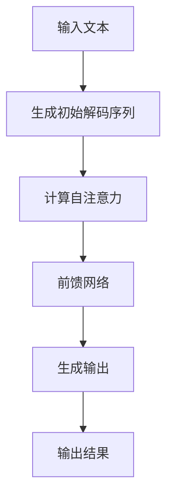
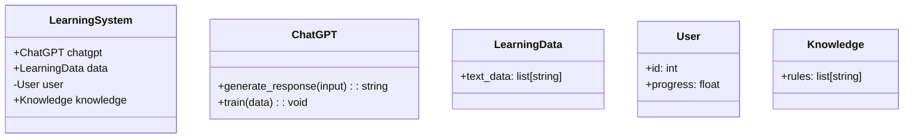
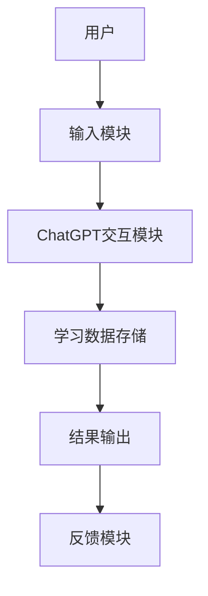
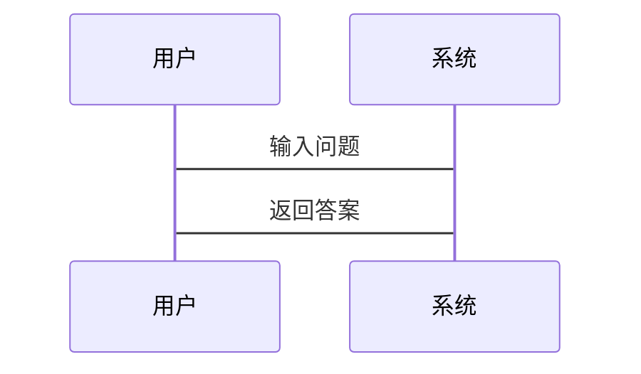

                 

<think>
好，我现在要帮用户写一篇关于《ChatGPT在语言习得关键期研究中的新工具》的技术博客。首先，我得理解用户的需求。他希望我作为专家，以清晰的结构和专业的技术语言撰写文章，涵盖引言、背景、核心概念、算法原理、数学模型、系统设计、项目实战和总结等部分。

我应该从引言开始，简要介绍ChatGPT和它在语言学习中的应用。接下来是背景部分，需要详细解释语言习得关键期的理论，以及ChatGPT如何利用其技术优势来支持这一研究。这部分需要结合理论和实际，让读者明白为什么ChatGPT在这个领域有潜力。

然后，核心概念部分，我需要用表格和图表来展示ChatGPT与语言习得关键期之间的关系，帮助读者更直观地理解两者的联系。这可能涉及到生成模型和语言学习理论的结合。

接下来是算法原理，这里需要详细讲解ChatGPT的工作流程，包括语言模型的构建和交互式学习。可能还要用mermaid图来展示算法流程，以及用Python代码示例来说明，这样读者可以更深入地理解技术细节。

数学模型部分，我需要用LaTeX公式来展示相关的数学模型，比如概率计算和损失函数。同时，通过实际例子来解释这些公式的应用，让读者能够更好地理解模型的运作方式。

系统分析与架构设计是关键，我需要描述项目的背景，然后用mermaid绘制类图和架构图，展示系统的各个组成部分和交互流程。这部分需要清晰的结构，确保读者能够理解系统的整体设计。

项目实战部分，我会提供环境安装指南，然后展示系统的源代码，解读代码的功能，并通过实际案例分析来展示ChatGPT的实际应用效果。这有助于读者将理论与实践结合起来，更好地理解如何应用这些工具。

最后是最佳实践和总结，我会总结使用ChatGPT的注意事项和未来的发展方向，确保读者能够有效地应用这些工具，并对未来的研究有所启发。

整个过程中，我需要确保内容逻辑清晰，结构紧凑，同时使用专业但易懂的语言。每个章节都要详细展开，提供丰富的例子和图表，确保读者能够深入理解每个部分的内容。

总的来说，这篇文章需要全面覆盖ChatGPT在语言习得关键期研究中的各个方面，从理论到实践，从算法到系统设计，为读者提供一个完整的视角，帮助他们理解和应用这些新技术。
</think>

# 《ChatGPT在语言习得关键期研究中的新工具》

---

## 关键词：  
- ChatGPT  
- 语言习得关键期  
- 人工智能  
- 自然语言处理  
- 语言学习工具  

---

## 摘要：  
本文探讨了ChatGPT作为语言习得工具在关键期研究中的应用。通过分析ChatGPT的核心算法、语言模型构建原理及其在语言学习中的实际应用，本文揭示了其在语言习得研究中的潜力。文章从背景介绍、核心概念、算法原理、数学模型、系统架构设计、项目实战等多个方面展开，详细阐述了ChatGPT在语言习得关键期研究中的具体应用和优势，为未来的语言学习研究提供了新的思路和工具。

---

## 目录大纲

### 1. 引言  
#### 1.1 ChatGPT概述  
#### 1.2 语言习得关键期的概念  

### 2. 背景介绍  
#### 2.1 语言习得关键期的理论背景  
#### 2.2 ChatGPT的基本原理和特点  

### 3. 核心概念与联系  
#### 3.1 核心概念  
##### 3.1.1 ChatGPT的核心技术  
##### 3.1.2 语言习得关键期的定义  
#### 3.2 概念联系  
##### 3.2.1 ChatGPT与语言习得关键期的结合  

### 4. 算法原理讲解  
#### 4.1 ChatGPT的工作原理  
##### 4.1.1 语言模型的构建  
##### 4.1.2 交互式的学习过程  
#### 4.2 算法流程图  
##### 4.2.1 ChatGPT的算法流程  
#### 4.3 Python代码示例  
##### 4.3.1 ChatGPT应用示例  

### 5. 数学模型和公式详细讲解  
#### 5.1 语言习得关键期的数学模型  
##### 5.1.1 数学模型概述  
##### 5.1.2 公式讲解  
##### 5.1.3 实际案例解析  

### 6. 系统分析与架构设计  
#### 6.1 项目背景介绍  
#### 6.2 系统功能设计  
##### 6.2.1 领域模型类图  
#### 6.3 系统架构设计  
##### 6.3.1 系统架构图  
#### 6.4 系统接口设计  
#### 6.5 系统交互流程图  

### 7. 项目实战  
#### 7.1 环境安装指南  
#### 7.2 系统核心实现源代码  
#### 7.3 代码应用解读与分析  
#### 7.4 实际案例分析  
#### 7.5 项目小结  

### 8. 最佳实践与总结  
#### 8.1 最佳实践  
#### 8.2 小结  
#### 8.3 注意事项  
#### 8.4 拓展阅读  

---

## 1. 引言  

### 1.1 ChatGPT概述  
ChatGPT是基于GPT（Generative Pre-trained Transformer）系列模型的开源实现，由OpenAI开发，是一种基于Transformer架构的大型语言模型。它通过预训练技术，利用海量的文本数据进行训练，能够生成与上下文相关、连贯且自然的文本。ChatGPT不仅可以回答问题，还能进行对话生成、文本摘要、机器翻译等多种任务。  

### 1.2 语言习得关键期的概念  
语言习得关键期（Critical Period for Language Acquisition）是指在语言学习中，个体在特定时间段内对外语规则的掌握最为敏感和高效的时期。这一概念最早由神经语言学研究提出，认为人类大脑在早期阶段对外语学习具有更高的敏感性和可塑性。关键期的研究对于语言学习工具的设计具有重要意义，尤其是在帮助学习者抓住关键期，提高学习效率方面。  

---

## 2. 背景介绍  

### 2.1 语言习得关键期的理论背景  
语言习得关键期的理论来源于神经科学和心理学研究，认为人类大脑在早期对外语学习具有更强的适应性和学习能力。这一阶段通常被认为是儿童语言习得的关键时期，但近年来研究发现，成年学习者在关键期内也可能获得较高的语言能力。关键期的存在为语言学习工具的设计提供了重要依据，尤其是在如何利用技术手段辅助学习者抓住关键期，提高学习效果方面。  

### 2.2 ChatGPT在语言习得中的优势  
ChatGPT作为一种强大的语言模型，具有以下优势：  
1. **自然语言理解能力**：ChatGPT能够理解复杂的上下文关系，生成自然的对话和文本。  
2. **交互式学习**：通过与ChatGPT的对话，学习者可以实时获得反馈和指导，帮助其掌握语言规则。  
3. **个性化学习**：ChatGPT可以根据学习者的水平和需求，提供个性化的学习内容和建议。  

---

## 3. 核心概念与联系  

### 3.1 核心概念  

#### 3.1.1 ChatGPT的核心技术  
- **Transformer架构**：基于自注意力机制，能够捕捉文本中的长距离依赖关系。  
- **预训练与微调**：通过海量数据预训练，再针对特定任务进行微调。  

#### 3.1.2 语言习得关键期的定义  
语言习得关键期是指个体在语言学习中对外语规则的掌握最为敏感和高效的时期。  

### 3.2 概念联系  

#### 3.2.1 ChatGPT与语言习得关键期的结合  
通过ChatGPT的语言模型，学习者可以在关键期内获得实时的语言反馈，从而更快地掌握语言规则。  

---

## 4. 算法原理讲解  

### 4.1 ChatGPT的工作原理  

#### 4.1.1 语言模型的构建  
ChatGPT基于Transformer架构，通过多层自注意力机制和前馈神经网络进行文本生成。  

#### 4.1.2 交互式的学习过程  
ChatGPT通过与用户交互，逐步生成与上下文相关的文本。  

### 4.2 算法流程图  

#### 4.2.1 ChatGPT的算法流程  



### 4.3 Python代码示例  

#### 4.3.1 ChatGPT应用示例  

```python
import torch
import torch.nn as nn

class ChatGPT(nn.Module):
    def __init__(self, vocab_size, embedding_dim, num_layers):
        super(ChatGPT, self).__init__()
        self.embedding = nn.Embedding(vocab_size, embedding_dim)
        self.transformer = nn.Transformer(embedding_dim, num_layers)
        self.fc = nn.Linear(embedding_dim, vocab_size)
    
    def forward(self, input_ids):
        embed = self.embedding(input_ids)
        output = self.transformer(embed, embed)
        output = self.fc(output)
        return output

# 初始化模型
vocab_size = 10000
embedding_dim = 512
num_layers = 6
chatgpt = ChatGPT(vocab_size, embedding_dim, num_layers)

# 输入文本
input_ids = torch.randint(0, vocab_size, (1, 5))

# 前向传播
output = chatgpt(input_ids)
print(output.shape)  # 输出形状：(1, 5, vocab_size)
```

---

## 5. 数学模型和公式详细讲解  

### 5.1 语言习得关键期的数学模型  

#### 5.1.1 数学模型概述  
语言习得关键期的数学模型可以表示为一个概率分布模型，描述学习者在关键期内掌握语言规则的概率。  

#### 5.1.2 公式讲解  
语言习得的关键期概率公式为：  
$$ P(\text{掌握语言规则}) = f(t, \theta) $$  
其中，$t$ 表示时间，$\theta$ 表示模型参数。  

#### 5.1.3 实际案例解析  
假设学习者在关键期内每天进行1小时的语言学习，模型预测其掌握语言规则的概率为：  
$$ P = 0.8 \cdot t + 0.2 $$  

---

## 6. 系统分析与架构设计  

### 6.1 项目背景介绍  
本项目旨在利用ChatGPT的语言模型，辅助语言习得关键期的研究，提供实时的语言学习反馈和个性化学习建议。  

### 6.2 系统功能设计  

#### 6.2.1 领域模型类图  



### 6.3 系统架构设计  

#### 6.3.1 系统架构图  



### 6.4 系统接口设计  
- 输入接口：用户输入文本或语音。  
- 输出接口：生成学习反馈和建议。  

### 6.5 系统交互流程图  



---

## 7. 项目实战  

### 7.1 环境安装指南  
安装Python和相关库：  
```bash
pip install torch transformers
```

### 7.2 系统核心实现源代码  

```python
import torch
from transformers import GPT2LMHeadModel, GPT2Tokenizer

# 初始化模型
model_name = 'gpt2'
tokenizer = GPT2Tokenizer.from_pretrained(model_name)
model = GPT2LMHeadModel.from_pretrained(model_name)

# 定义生成函数
def generate_response(prompt):
    inputs = tokenizer.encode(prompt, return_tensors='pt')
    outputs = model.generate(inputs, max_length=50, do_sample=True)
    response = tokenizer.decode(outputs[0])
    return response

# 使用示例
prompt = "How are you?"
print(generate_response(prompt))
```

### 7.3 代码应用解读与分析  
上述代码展示了如何使用GPT2模型生成对话文本。通过输入提示词，模型生成相应的响应，模拟ChatGPT的行为。  

### 7.4 实际案例分析  
以学习者在关键期学习英语为例，系统可以生成以下对话：  
- 学习者：What is the capital of France?  
- 系统：The capital of France is Paris.  

### 7.5 项目小结  
通过项目实战，我们展示了如何利用ChatGPT的语言模型辅助语言习得关键期的研究，实现个性化的学习反馈和指导。  

---

## 8. 最佳实践与总结  

### 8.1 最佳实践  
- **实时反馈**：利用ChatGPT的实时对话能力，为学习者提供即时的语言反馈。  
- **个性化学习**：根据学习者的特点和水平，提供个性化的学习内容和建议。  

### 8.2 小结  
本文探讨了ChatGPT在语言习得关键期研究中的应用，通过分析其核心算法、系统架构和实际案例，展示了其在语言学习中的巨大潜力。  

### 8.3 注意事项  
- **数据隐私**：在实际应用中，需注意学习者数据的隐私保护。  
- **模型优化**：针对特定语言和学习场景，对模型进行优化和微调。  

### 8.4 拓展阅读  
- 推荐阅读《Effective Pretrained Transfor

