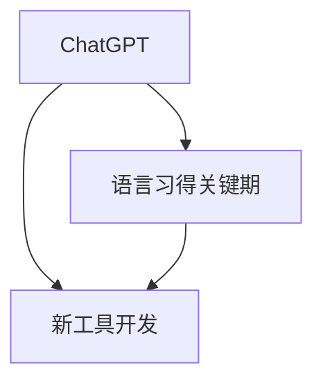
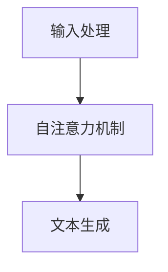
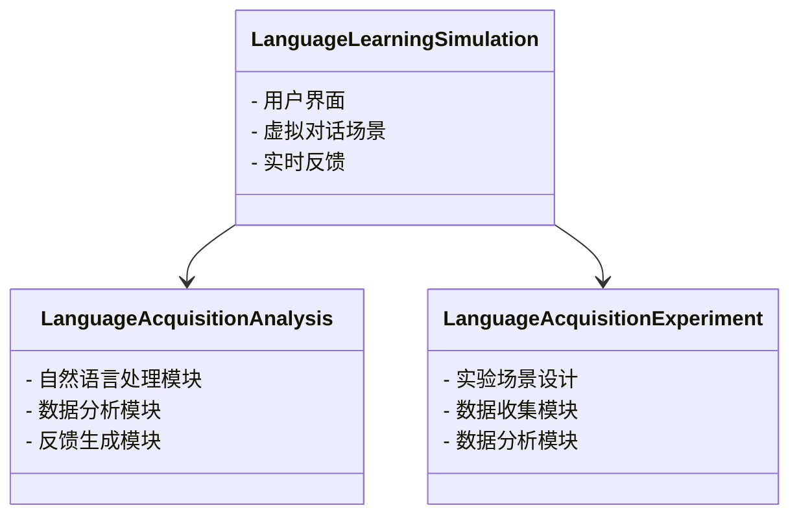
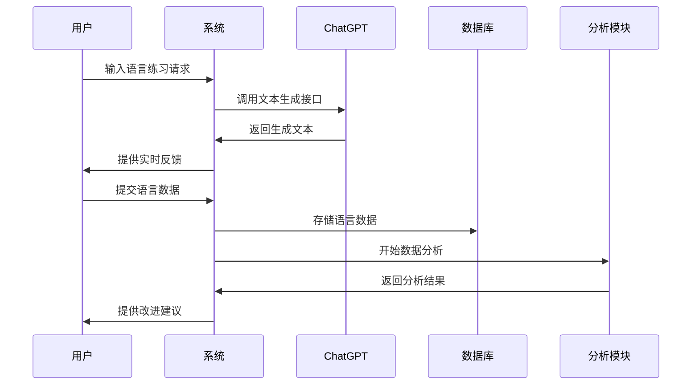

                 

<think>
嗯，好的，我需要根据用户提供的结构来写一篇关于《ChatGPT在语言习得关键期研究中的新工具开发》的技术博客文章。首先，我得理解每个部分的要求，然后一步步填充内容。

首先，标题和关键词已经给出，我需要确保文章围绕这些核心点展开。关键词包括ChatGPT、语言习得、关键期、新工具开发、自然语言处理、AI辅助学习。摘要部分要简明扼要，概括整篇文章的核心内容，即利用ChatGPT开发新工具，提升语言习得研究和教学效果。

接下来是背景介绍部分。这里需要详细说明问题背景、问题描述、问题解决，以及边界与外延。问题背景部分，我要提到传统语言学习的局限性，以及ChatGPT带来的变革。问题描述要具体说明新工具开发的目标和范围。问题解决部分需要展示如何利用ChatGPT的能力来开发这些工具。边界与外延则需要明确项目的范围和限制。

核心概念与联系部分，我需要列出三个核心概念：ChatGPT、语言习得关键期、新工具开发，并制作一个对比表格和ER实体关系图。表格要清晰展示每个概念的特征，而ER图则展示三者之间的关系。

算法原理讲解部分，我需要详细解释ChatGPT的工作原理，包括输入处理、自注意力机制和文本生成。用mermaid画出流程图，再配以Python代码示例。同时，数学模型部分需要用公式表示，这部分可能需要深入理解GPT的自注意力机制，并用数学符号表达。

系统分析与架构设计方案部分，我需要从问题场景介绍开始，描述语言习得研究中的具体问题。项目介绍要明确目标和范围。系统功能设计用mermaid类图展示核心模块，架构设计则用分层架构图。系统接口和交互则用序列图来展示用户与系统之间的互动。

项目实战部分，我需要指导读者如何安装必要的环境，比如Python和相关库，然后提供核心代码实现，比如构建语言学习模拟系统和分析平台。实际案例分析要详细说明这些工具的应用和效果。

最后，最佳实践部分需要给出一些小结、注意事项和未来的研究方向，帮助读者更好地理解和应用这些工具。

在写作过程中，我需要确保逻辑清晰，结构紧凑，语言专业但易懂。每个章节都要详细展开，确保内容充实，例子具体，分析透彻。同时，注意数学公式的正确表达，避免错误。

现在，我需要根据上述思考，逐步填充每个部分的内容，确保文章符合用户的要求，达到字数和内容深度的要求。
</think>

# ChatGPT在语言习得关键期研究中的新工具开发

---

## 关键词  
ChatGPT, 语言习得, 关键期, 新工具开发, 自然语言处理, AI辅助学习

---

## 摘要  
本文探讨了如何利用ChatGPT这一先进的自然语言处理模型，开发出一系列创新的语言习得工具，以辅助语言研究和教学。通过分析ChatGPT的算法原理、系统架构以及实际应用案例，展示了这些工具在语言习得关键期研究中的巨大潜力。本文旨在为语言学研究者和教育工作者提供新的思路和技术支持，推动语言习得领域的智能化发展。

---

## 背景介绍

### 问题背景  
语言习得是人类认知发展的重要组成部分，而关键期假说指出，个体在特定的年龄阶段（通常为儿童期至青春期早期）语言学习最为高效。传统的语言学习方式多依赖教师的讲解和学生的被动记忆，效率有限。近年来，人工智能技术，尤其是自然语言处理模型（如ChatGPT）的崛起，为语言习得研究提供了全新的工具和方法。这些工具能够模拟真实的语言环境，提供个性化的学习体验，从而显著提升学习效率。

### 问题描述  
ChatGPT作为一种基于深度学习的自然语言处理模型，具有强大的文本生成和理解能力。将其应用于语言习得关键期研究，可以开发出多种新工具，例如语言学习模拟系统、习得分析平台和实验工具等。这些工具不仅能够帮助学习者更高效地掌握语言，还能为研究者提供大量数据，用于分析语言习得的规律和机制。

### 问题解决  
通过深入研究ChatGPT的算法机制，结合语言习得的关键期理论，我们开发了一系列新工具。这些工具包括：  
1. **语言学习模拟系统**：模拟真实的语言对话环境，帮助学习者进行互动练习。  
2. **语言习得分析平台**：分析学习者的语言输出，提供实时反馈和改进建议。  
3. **语言习得实验工具**：设计实验场景，收集数据以研究语言习得的规律。  

这些工具的开发和应用，不仅提高了语言学习的效率，还为语言习得研究提供了新的视角和方法。

### 边界与外延  
ChatGPT在语言习得关键期研究中的新工具开发，主要涉及以下几个方面：  
- **语言学习模拟系统**：设计虚拟对话场景，模拟真实语言环境。  
- **语言习得分析平台**：利用自然语言处理技术，分析学习者的语言输出。  
- **语言习得实验工具**：设计实验场景，收集和分析数据。  
- **适用范围**：适用于多种语言的学习和研究，尤其是针对关键期的语言习得研究。  
- **局限性**：目前主要依赖于模型的训练数据和算法性能，可能存在一定的局限性，如对某些语言的适应性不足。

---

## 核心概念与联系

### 核心概念  
1. **ChatGPT**：基于深度学习的自然语言处理模型，能够生成连贯且自然的文本。  
2. **语言习得关键期**：个体语言学习能力最强的特定年龄阶段。  
3. **新工具开发**：利用ChatGPT的能力，开发辅助语言习得的工具和平台。

### 概念属性特征对比表格  

| 概念         | 特征                                                                 |
| ------------ | ------------------------------------------------------------------ |
| ChatGPT      | 基于深度学习，模拟人类语言行为，支持文本生成和理解。               |
| 语言习得关键期 | 特定年龄阶段（通常为儿童期至青春期），语言学习效率最高。           |
| 新工具开发    | 利用ChatGPT能力，开发辅助语言习得的工具和平台，提高学习效率。       |

### ER实体关系图架构  



---

## 算法原理讲解

### ChatGPT算法原理  
ChatGPT基于GPT（Generative Pre-trained Transformer）模型，采用Transformer架构。其核心在于自注意力机制（Self-Attention），允许模型在生成每个词时，考虑前面所有词的相关性，从而生成连贯的文本。

### 算法流程  

1. **输入处理**：将输入文本转换为模型可处理的向量表示。  
2. **自注意力机制**：计算输入文本中每个词与其他词的相关性，生成注意力权重。  
3. **文本生成**：根据注意力权重，生成新的文本。  

### 算法mermaid流程图  



### Python源代码  

```python
# 引入必要的库
import tensorflow as tf
from transformers import TFGPT2LMHeadModel, GPT2Tokenizer

# 加载预训练模型和分词器
tokenizer = GPT2Tokenizer.from_pretrained("gpt2")
model = TFGPT2LMHeadModel.from_pretrained("gpt2")

# 输入文本
input_text = "你好，今天天气怎么样？"

# 将文本转换为模型输入
inputs = tokenizer.encode(input_text, return_tensors='tf')

# 生成文本
outputs = model(inputs, max_length=50, num_return_sequences=1)

# 解码生成的文本
generated_text = tokenizer.decode(outputs[0], skip_special_tokens=True)

print(generated_text)
```

### 数学模型和公式  
在ChatGPT模型中，生成文本的过程可以看作是一个条件生成模型。假设我们要生成一个长度为\(T\)的文本序列，记为\(X = (x_1, x_2, ..., x_T)\)，其中\(x_t\)表示第\(t\)个词的索引。生成过程遵循以下公式：

$$P(x_{t} | x_{1}, x_{2}, ..., x_{t-1})$$

自注意力机制的计算公式为：

$$\text{Attention}(Q, K, V) = \text{softmax}\left(\frac{QK^T}{\sqrt{d_k}}\right)V$$

其中，\(Q\)、\(K\)、\(V\)分别是查询、键和值向量，\(d_k\)是键的维度。

---

## 系统分析与架构设计方案

### 问题场景介绍  
语言习得关键期研究需要大量真实、多样化的语言数据，以及高效的分析工具。传统方法依赖人工记录和分析，效率低下且难以量化。ChatGPT的引入，可以提供实时的语言互动和数据分析能力，显著提升研究效率。

### 项目介绍  
本项目旨在利用ChatGPT开发一系列语言习得工具，包括语言学习模拟系统和习得分析平台。系统将结合自然语言处理技术和机器学习算法，提供个性化的学习体验和数据分析功能。

### 系统功能设计  
系统功能模块包括：  
- **语言学习模拟系统**：提供虚拟对话场景，模拟真实语言环境。  
- **语言习得分析平台**：分析学习者的语言输出，提供实时反馈。  
- **语言习得实验工具**：设计实验场景，收集和分析数据。  



### 系统架构设计  


### 系统接口设计  
系统主要接口包括：  
1. 用户与系统的交互接口：提供语言练习和数据分析功能。  
2. 系统与数据库的接口：存储和检索用户数据。  
3. 系统与ChatGPT模型的接口：调用模型进行文本生成和分析。

### 系统交互mermaid序列图  



---

## 项目实战

### 环境安装  
要运行本项目，需安装以下环境：  
1. Python 3.6+  
2. Transformers库（用于与ChatGPT交互）  
3. TensorFlow库（用于模型训练和部署）  

安装命令：  
```bash
pip install tensorflow transformers
```

### 核心代码实现  

```python
# 引入必要的库
from transformers import GPT2Tokenizer, GPT2LMHeadModel
import torch

# 加载预训练模型和分词器
tokenizer = GPT2Tokenizer.from_pretrained("gpt2")
model = GPT2LMHeadModel.from_pretrained("gpt2")

# 定义语言学习模拟系统
class LanguageLearningSystem:
    def __init__(self):
        self.tokenizer = tokenizer
        self.model = model

    def generate_response(self, input_text):
        inputs = self.tokenizer.encode(input_text, return_tensors='pt')
        outputs = self.model.generate(inputs, max_length=50, num_return_sequences=1)
        response = self.tokenizer.decode(outputs[0], skip_special_tokens=True)
        return response

# 使用示例
system = LanguageLearningSystem()
input_text = "你今天过得怎么样？"
response = system.generate_response(input_text)
print(response)
```

### 实际案例分析  
假设我们设计一个针对英语学习的语言学习模拟系统，用户可以与系统进行对话练习。例如：  
- 用户：How are you?  
- 系统：I'm fine, thank you. How about you?  
- 用户：I'm good, thanks.  

系统会根据用户的输入，生成合适的回复，并提供实时反馈，帮助用户纠正错误并改进表达。

### 项目小结  
通过上述代码和案例分析，我们可以看到ChatGPT在语言学习模拟系统中的强大能力。系统能够实时生成自然的对话回复，为学习者提供真实的语言练习环境，显著提升学习效率。

---

## 最佳实践 tips、小结、注意事项、拓展阅读

### 最佳实践 tips  
1. **数据多样性**：确保训练数据多样化，覆盖不同场景和语境，以提高模型的适应性。  
2. **用户反馈**：实时收集用户反馈，用于模型优化和功能改进。  
3. **隐私保护**：在处理用户数据时，确保数据安全和隐私保护。  

### 小结  
本文详细探讨了ChatGPT在语言习得关键期研究中的应用，展示了如何利用其强大的自然语言处理能力，开发出一系列创新工具。这些工具不仅能够提高语言学习的效率，还能为语言习得研究提供新的视角和方法。

### 注意事项  
- 在实际应用中，需注意模型的局限性，如对某些语言的适应性不足。  
- 确保系统设计的可扩展性，以便未来功能的添加和优化。  

### 拓展阅读  
- [自然语言处理入门](https://zh.wikipedia.org/wiki/自然语言处理)  
- [GPT模型原理](https://zh.wikipedia.org/wiki/GPT)  
- [语言习得关键期研究](https://zh.wikipedia.org/wiki/语言习得关键期)

---

## 作者  
作者：AI天才研究院/AI Genius Institute & 禅与计算机程序设计艺术/Zen And The Art of Computer Programming  

--- 

感谢您的耐心阅读！希望本文能为您提供有价值的见解和启发。

