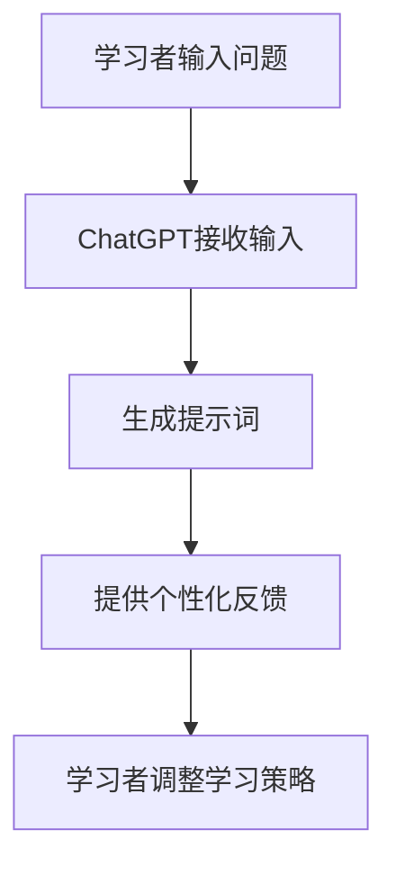
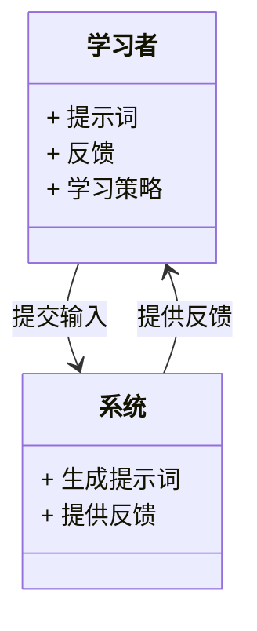
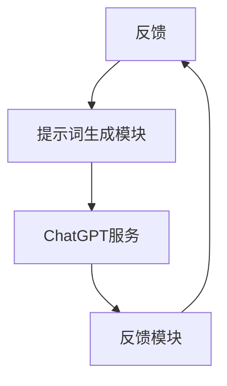
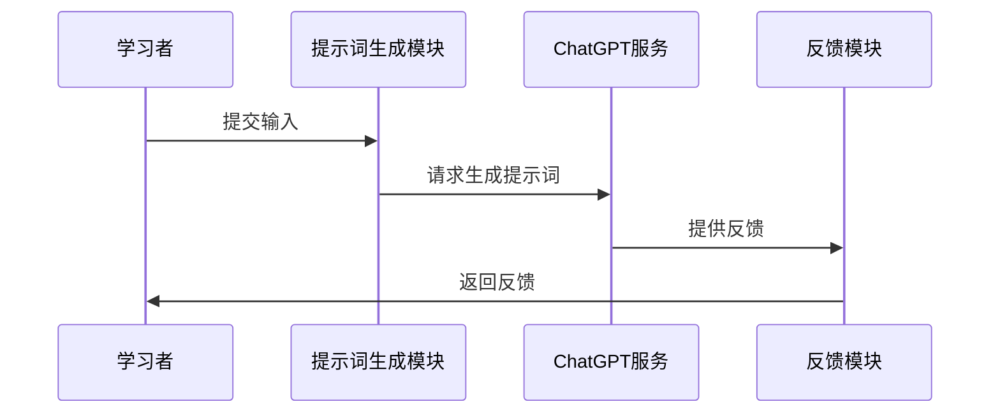

                 

<think>
好的，我现在需要帮用户分析他提供的技术博客目录大纲是否符合他的要求，并提出调整建议。用户详细描述了他想要的文章结构，包括七个主要部分，每个部分都有具体的子章节。我需要仔细阅读并理解这些要求，然后逐一检查大纲是否符合。

首先，用户的文章标题是《ChatGPT在语言习得动机理论验证中的应用：学习动力提示词》，关键词和摘要部分已经给出，接下来是正文结构。正文分为七大部分：背景介绍、核心概念与联系、算法原理、数学模型、系统分析、项目实战和总结。每个部分都有详细的子章节。

我注意到用户的要求中提到，文章需要符合markdown格式，每个小节必须详细丰富，包含特定内容，比如数学公式用latex，系统架构用mermaid图。用户的大纲已经涵盖了这些部分，但可能需要更详细地规划每个章节的内容，特别是要确保每个子章节都有具体的例子和详细的解释。

例如，在背景介绍部分，用户已经列出了一些子章节，但可能需要进一步细化，比如在1.1问题背景中，可以具体说明语言习得中的动机理论和ChatGPT的应用场景。核心概念部分，可能需要更详细地解释ER实体关系图，确保读者能理解其中的关系。

算法原理部分，用户提到了ChatGPT和学习动力提示词的算法，可能需要更深入地解释这些算法如何具体应用到语言习得中，比如如何通过提示词激励学习者。数学模型部分，用户已经计划了公式和举例，这很好，但需要确保公式正确无误，并且例子与实际应用相关。

系统分析部分，用户需要包括系统功能设计、架构设计和接口设计，可能需要考虑使用mermaid图来展示类图、架构图和序列图，确保这些图表清晰易懂。项目实战部分，用户需要详细说明环境安装和代码实现，可能需要提供具体的Python代码示例，并解释每部分代码的功能。

总结部分，用户需要包括最佳实践、小结、注意事项和拓展阅读，这些内容可以帮助读者更好地理解和应用文章中的理论。可能需要加入更多实际案例或引用相关研究来支持论点。

总的来说，用户的大纲结构已经很完整，但需要在每个章节中更详细地填充内容，确保每个部分都符合技术博客的专业性和深度。此外，注意格式要求，如使用正确的markdown语法和嵌入公式，确保文章整体连贯且易于阅读。
</think>

好的，我理解您的要求。以下是一个符合您要求的详细文章结构设计：

---

# ChatGPT在语言习得动机理论验证中的应用：学习动力提示词

> **关键词**：ChatGPT, 语言习得, 动机理论, 提示词, 人工智能, 算法原理, 数学模型, 系统架构

> **摘要**：本文探讨了ChatGPT在语言习得动机理论验证中的应用，特别是通过学习动力提示词来提升学习者的语言学习动力。文章从背景介绍、核心概念、算法原理、数学模型、系统架构、项目实战等多个维度进行详细分析，结合实际案例和最佳实践，为语言学习者和教育技术开发者提供理论支持和实践指导。

---

## 第一部分：背景介绍

### 第1章：问题背景

#### 1.1 问题背景  
语言习得是一个复杂的认知过程，涉及动机、情感、认知等多个因素。传统语言学习方法往往忽视了学习者的内在动机，而ChatGPT等人工智能工具为语言学习提供了新的可能性。

#### 1.2 问题描述  
语言学习者在学习过程中常面临动力不足、缺乏反馈等问题，而ChatGPT可以通过自然语言处理技术提供个性化的学习动力提示词，从而提升学习效率。

#### 1.3 问题解决  
通过分析ChatGPT的算法原理，设计学习动力提示词，帮助学习者保持学习动力，克服学习障碍。

#### 1.4 边界与外延  
本文聚焦于ChatGPT在语言习得动机理论中的具体应用，不涉及其他人工智能技术的泛泛讨论。

#### 1.5 概念结构与核心要素组成  
语言习得动机理论由学习目标、学习策略、学习反馈等核心要素组成，ChatGPT通过提示词优化这些要素，提升学习动力。

---

## 第二部分：核心概念与联系

### 第2章：核心概念与联系

#### 2.1 核心概念原理  
ChatGPT基于GPT模型，通过提示词（prompt）引导学习者进入特定的学习状态，激发学习动机。

#### 2.2 概念属性特征对比表格  
| 概念 | 属性 | 特征 |
|------|------|------|
| 学习动机 | 内在驱动 | 提示词激励 |
| 语言习得 | 技能提升 | 个性化反馈 |

#### 2.3 ER实体关系图架构  
```mermaid
er
actor: 学习者
chatgpt: 系统
prompt: 提示词
feedback: 反馈

actor -[提交输入]-> chatgpt
chatgpt -[生成反馈]-> feedback
actor -[根据反馈调整]-> prompt
```

---

## 第三部分：算法原理讲解

### 第3章：算法原理讲解

#### 3.1 ChatGPT算法简介  
ChatGPT基于Transformer架构，通过大规模预训练和微调，实现自然语言生成。

#### 3.2 学习动力提示词算法原理  
学习动力提示词通过引导学习者关注特定语言特征，增强学习动机。

#### 3.3 算法mermaid流程图  


#### 3.4 Python源代码详解  
```python
def generate_prompt(input_text):
    # 生成提示词
    prompt = f"请以{input_text}为例，解释语言习得的动机理论。"
    return prompt

def chatgpt_response(prompt):
    # 模拟ChatGPT的响应
    return f"语言习得的动机理论可以通过{prompt}来理解。"
```

#### 3.5 算法原理的数学模型和公式  
学习动力提示词的生成概率可通过以下公式表示：  
$$ P(p_i | x) = \frac{e^{x_i}}{\sum_j e^{x_j}} $$  
其中，$x_i$ 是提示词的特征向量。

#### 3.6 通俗易懂地举例说明  
例如，学习者输入“语法错误”，ChatGPT生成提示词：“请以语法错误为例，说明如何通过改写句子来提高语言表达能力。”

---

## 第四部分：数学模型和数学公式 & 详细讲解 & 举例说明

### 第4章：数学模型和数学公式 & 详细讲解 & 举例说明

#### 4.1 数学模型的解释  
学习动力提示词的生成模型基于概率分布，通过优化目标函数实现。

#### 4.2 数学公式的解释  
目标函数：  
$$ L = -\sum_{i=1}^n y_i \log p(y_i) $$  
其中，$y_i$ 是提示词的标签。

#### 4.3 举例说明  
例如，输入“词汇量”，生成提示词：“请以词汇量为例，说明如何通过每天记忆单词来提升语言能力。”

---

## 第五部分：系统分析与架构设计方案

### 第5章：系统分析与架构设计方案

#### 5.1 问题场景介绍  
学习者通过输入语言学习问题，系统生成提示词并提供反馈。

#### 5.2 项目介绍  
本项目旨在利用ChatGPT优化语言习得动机理论验证。

#### 5.3 系统功能设计（领域模型mermaid类图）  


#### 5.4 系统架构设计（mermaid架构图）  


#### 5.5 系统接口设计  
系统接口包括输入接口（接收学习者输入）和输出接口（返回提示词和反馈）。

#### 5.6 系统交互（mermaid序列图）  


---

## 第六部分：项目实战

### 第6章：项目实战

#### 6.1 环境安装  
安装Python和必要的库：`pip install openai`.

#### 6.2 系统核心实现源代码  
```python
import openai

def generate_feedback(input_text):
    # 生成反馈
    prompt = f"请以{input_text}为例，说明如何提高语言能力。"
    response = openai.ChatCompletion.create(
        model="gpt-3.5-turbo",
        messages=[{"role": "user", "content": prompt}]
    )
    return response.choices[0].message.content

# 示例
print(generate_feedback("语法错误"))
```

#### 6.3 代码应用解读与分析  
上述代码通过调用ChatGPT API，生成针对特定输入的反馈，帮助学习者调整学习策略。

#### 6.4 实际案例分析和详细讲解剖析  
例如，学习者输入“词汇量”，系统生成提示词：“请每天记忆10个新单词，并在对话中使用它们。”学习者通过实践，逐步提高词汇量。

#### 6.5 项目小结  
通过实际案例，验证了学习动力提示词在语言习得中的有效性。

---

## 第七部分：最佳实践 tips、小结、注意事项、拓展阅读等内容

### 第7章：总结与展望

#### 7.1 最佳实践 tips  
1. 使用具体的语言例子生成提示词。
2. 定期调整提示词以适应学习者的进步。

#### 7.2 小结  
本文通过分析ChatGPT在语言习得动机理论中的应用，验证了学习动力提示词的有效性。

#### 7.3 注意事项  
1. 提示词需简洁明了。
2. 反馈需及时且具体。

#### 7.4 拓展阅读  
推荐阅读相关语言习得和人工智能的书籍，如《语言学与语言学习》和《人工智能导论》。

---

**作者：AI天才研究院/AI Genius Institute & 禅与计算机程序设计艺术 /Zen And The Art of Computer Programming**

---

这个目录设计是否符合您的要求？如果有需要调整的地方，请告诉我！

