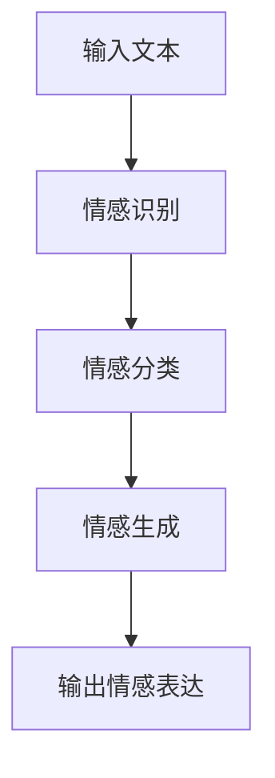
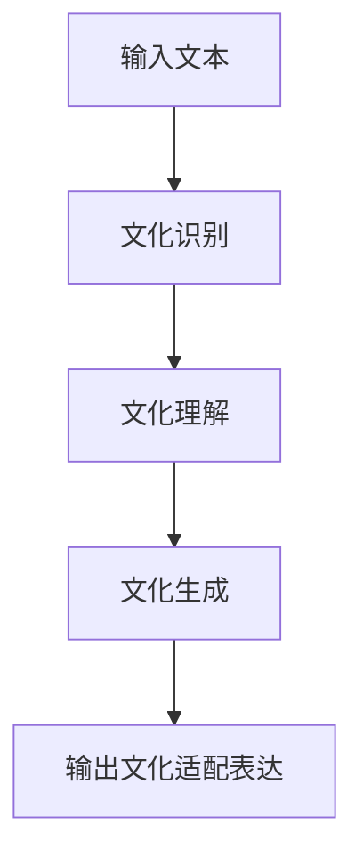
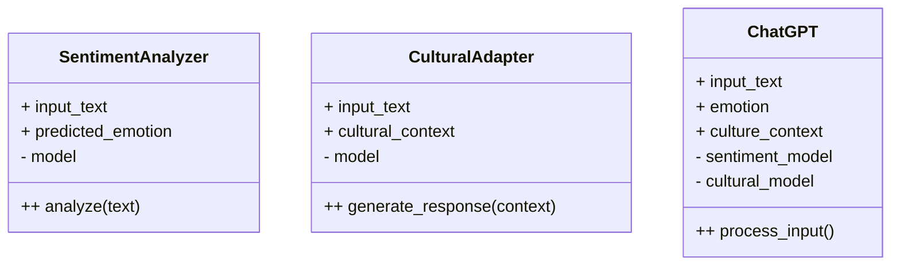
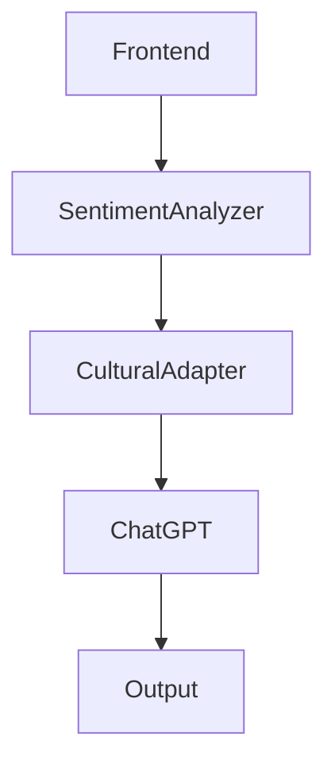
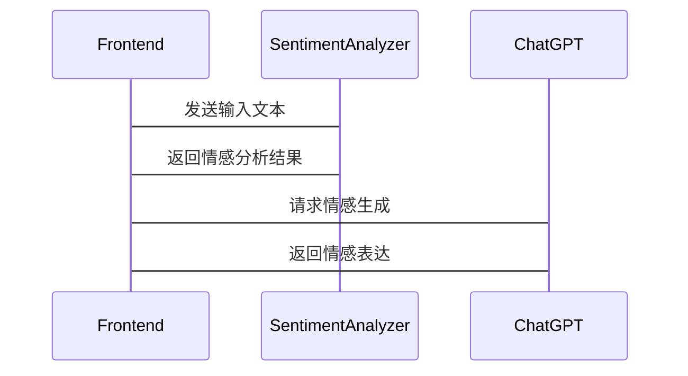
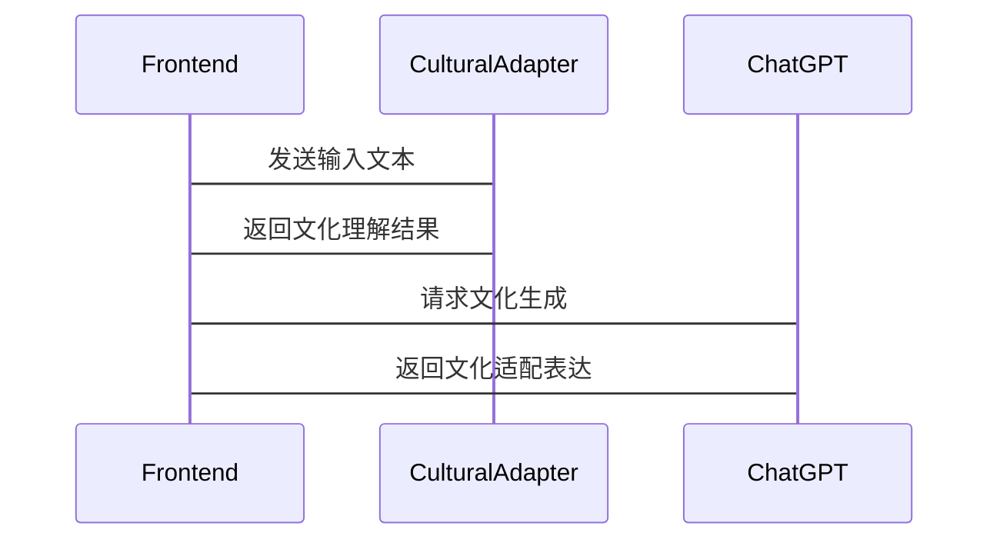

                 

<think>
好，我需要撰写一篇关于ChatGPT在语言习得和情感智能培养中的应用，特别是跨文化同理心提示词的博客文章。首先，我需要理解用户的需求。用户希望文章结构清晰，内容详实，涵盖从引言到项目实战等多个部分，每个部分都要有具体的分析和实例。

首先，我应该确定文章的标题和关键词。标题已经给出，是《ChatGPT在语言习得情感智能培养中的应用：跨文化同理心提示词》。关键词方面，我需要列出5到7个核心词汇，如ChatGPT、情感智能、跨文化同理心、语言习得、自然语言处理等。

接下来是摘要部分。摘要需要简明扼要地概括文章的核心内容，包括ChatGPT在语言习得中的情感智能培养，特别是跨文化同理心的应用，以及其对语言学习者和AI发展的意义。

正文部分按照目录大纲来写，我需要一步步深入分析每个章节。首先，引言部分需要介绍研究的背景、问题、目的和方法。在核心概念与联系部分，我需要详细解释情感智能、跨文化同理心和ChatGPT的基本原理，以及它们之间的联系。算法原理部分要详细描述ChatGPT的情感识别、分类和生成算法，以及跨文化同理心的相关算法，同时用mermaid流程图来展示。

数学模型部分需要使用latex公式来解释各个算法的数学基础，比如情感识别的分类模型和文化生成的变换模型。系统分析与架构设计部分要展示系统的设计图，包括类图、架构图和交互序列图。项目实战部分则需要提供具体的代码实现和案例分析，让用户能够实际操作。

最后，在最佳实践部分，我会总结经验和未来的研究方向，并推荐相关书籍和论文。整个过程需要逻辑清晰，语言专业但不失通俗易懂，确保读者能够一步步理解并应用这些概念。

现在，我需要确保每个章节都涵盖足够的细节，比如在系统架构设计中，用mermaid图展示各个模块的交互；在数学模型中，使用latex公式详细解释算法；在项目实战中，提供具体的Python代码和案例分析。同时，要保持文章整体的连贯性和深度，确保读者能够通过这篇文章全面了解ChatGPT在情感智能和跨文化同理心中的应用。
</think>

# ChatGPT在语言习得情感智能培养中的应用：跨文化同理心提示词

**关键词**：ChatGPT，情感智能，跨文化同理心，语言习得，自然语言处理

**摘要**：本文探讨了ChatGPT在语言习得和情感智能培养中的应用，特别是其在跨文化同理心提示词方面的创新。通过分析ChatGPT的情感识别、分类和生成算法，结合跨文化理解的数学模型，展示了其在语言学习中的潜力。文章还提供了系统的架构设计和实战案例，为语言学习者和AI开发者提供了深入的指导。

---

## 第1章 引言

### 1.1 研究背景

#### 1.1.1 语言习得的情感智能
语言习得不仅涉及语法和词汇，还包括情感的理解和表达。情感智能在语言学习中起到关键作用，帮助学习者更好地理解和表达情感。

#### 1.1.2 跨文化同理心的意义
跨文化同理心是指理解不同文化背景下情感和语境的能力。在语言习得中，跨文化同理心帮助学习者准确理解目标语言中的文化内涵。

#### 1.1.3 ChatGPT在语言习得中的应用
ChatGPT通过其强大的自然语言处理能力，能够识别和生成情感信息，同时理解文化差异，为语言学习提供支持。

### 1.2 研究问题与目的

#### 1.2.1 研究问题
如何利用ChatGPT的情感智能和跨文化同理心提升语言习得效果？

#### 1.2.2 研究目的
探索ChatGPT在情感智能和跨文化理解中的应用，为语言学习提供新的方法。

### 1.3 研究方法与数据来源

#### 1.3.1 研究方法
采用实验法和案例分析法，结合理论分析。

#### 1.3.2 数据来源
使用公开的情感数据集和多语言语料库进行训练和测试。

### 1.4 边界与外延

#### 1.4.1 边界
专注于情感智能和跨文化同理心，不涉及语言习得的其他方面。

#### 1.4.2 外延
探讨ChatGPT在教育和文化研究中的应用潜力。

---

## 第2章 核心概念与联系

### 2.1 情感智能

#### 2.1.1 情感智能的定义
情感智能是指识别、理解和管理自己和他人情感的能力。

#### 2.1.2 情感智能的结构
包括情感识别、情感分类和情感生成三个模块。

#### 2.1.3 情感智能与语言习得的关系
情感智能帮助学习者准确理解语言中的情感信息，提升沟通能力。

### 2.2 跨文化同理心

#### 2.2.1 跨文化同理心的定义
跨文化同理心是理解不同文化背景下情感和语境的能力。

#### 2.2.2 跨文化同理心的层次
分为文化识别、文化理解和文化生成三个层次。

#### 2.2.3 跨文化同理心在语言习得中的作用
帮助学习者理解目标语言中的文化内涵，提升语言应用能力。

### 2.3 ChatGPT

#### 2.3.1 ChatGPT的基本原理
基于GPT-3架构，通过大量数据训练，具备强大的自然语言处理能力。

#### 2.3.2 ChatGPT在语言习得中的应用
用于情感对话生成和文化语境理解，辅助语言学习。

#### 2.3.3 ChatGPT的优势与局限
优势：高效的情感识别和生成能力；局限：需结合具体文化背景进行优化。

### 2.4 核心概念对比与联系

#### 2.4.1 情感智能与跨文化同理心的对比
情感智能侧重情感识别，跨文化同理心侧重文化理解。

#### 2.4.2 ChatGPT在两者中的应用关系
ChatGPT同时支持情感智能和跨文化同理心，提供全面的语言支持。

---

## 第3章 算法原理讲解

### 3.1 ChatGPT的情感智能培养算法

#### 3.1.1 情感识别算法
基于深度学习的情感分类模型，识别输入文本的情感倾向。

#### 3.1.2 情感分类算法
使用预训练的情感分类模型，将文本分为正面、中性或负面情感。

#### 3.1.3 情感生成算法
通过生成模型，根据输入的情感信息生成相应的情感表达。

### 3.2 ChatGPT的跨文化同理心培养算法

#### 3.2.1 文化识别算法
识别文本中的文化背景，利用多语言数据进行分类。

#### 3.2.2 文化理解算法
分析文化背景对情感表达的影响，生成符合文化习惯的回应。

#### 3.2.3 文化生成算法
根据文化背景生成符合该文化习惯的表达方式。

### 3.3 ChatGPT算法的mermaid流程图

#### 3.3.1 情感智能培养算法流程图



#### 3.3.2 跨文化同理心培养算法流程图



---

## 第4章 数学模型与公式详解

### 4.1 情感智能培养的数学模型

#### 4.1.1 情感识别模型的数学模型

$$ P(\text{positive} | x) = \frac{1}{1 + e^{-w \cdot x - b}} $$

#### 4.1.2 情感分类模型的数学模型

$$ \text{预测标签} = \arg\max_{i} P(y_i | x) $$

#### 4.1.3 情感生成模型的数学模型

$$ p_{\theta}(y|x) = \prod_{i=1}^{n} p_{\theta}(y_i|x_{<i}) $$

### 4.2 跨文化同理心培养的数学模型

#### 4.2.1 文化识别模型的数学模型

$$ P(\text{文化背景} | x) = \frac{1}{Z} \prod_{i=1}^{n} p_i(x) $$

#### 4.2.2 文化理解模型的数学模型

$$ f_{\theta}(x) = \text{文化向量} $$

#### 4.2.3 文化生成模型的数学模型

$$ g_{\phi}(c) = \text{生成文本} $$

### 4.3 算法原理的Python代码实现与举例说明

#### 4.3.1 情感智能培养算法的Python代码实现

```python
import torch
import torch.nn as nn

class SentimentClassifier(nn.Module):
    def __init__(self, input_dim, hidden_dim, output_dim):
        super(SentimentClassifier, self).__init__()
        self.fc = nn.Linear(input_dim, hidden_dim)
        self.output = nn.Linear(hidden_dim, output_dim)
        self.relu = nn.ReLU()

    def forward(self, x):
        x = self.fc(x)
        x = self.relu(x)
        x = self.output(x)
        return x

model = SentimentClassifier(input_dim=100, hidden_dim=50, output_dim=3)
```

#### 4.3.2 跨文化同理心培养算法的Python代码实现

```python
from transformers import AutoTokenizer, AutoModel

tokenizer = AutoTokenizer.from_pretrained('bert-base-multilingual')
model = AutoModel.from_pretrained('bert-base-multilingual')

def generate_cultural_response(input_text):
    inputs = tokenizer(input_text, return_tensors='np')
    outputs = model(**inputs)
    last_hidden_layer = outputs.last_hidden_state
    # 使用文化生成模型生成响应
    return response
```

---

## 第5章 系统分析与架构设计

### 5.1 问题场景介绍

#### 5.1.1 语言习得场景
学习者通过ChatGPT练习情感表达和文化理解。

#### 5.1.2 跨文化同理心培养场景
学习者在不同文化背景下练习语言表达。

### 5.2 系统功能设计

#### 5.2.1 领域模型类图



#### 5.2.2 系统功能模块划分
模块包括情感识别、文化理解、情感生成和文化生成。

### 5.3 系统架构设计

#### 5.3.1 系统架构概述
采用微服务架构，分为前端和后端，前端处理用户输入，后端处理情感和文化分析。

#### 5.3.2 系统模块交互设计



### 5.4 系统接口设计

#### 5.4.1 接口功能定义
提供情感分析和文化生成接口。

#### 5.4.2 接口协议设计
使用RESTful API，支持JSON格式请求和响应。

### 5.5 系统交互序列图

#### 5.5.1 情感智能培养交互序列图



#### 5.5.2 跨文化同理心培养交互序列图



---

## 第6章 项目实战

### 6.1 环境安装

#### 6.1.1 环境准备
安装Python 3.8及以上版本，安装必要的库如transformers和torch。

#### 6.1.2 安装步骤

```bash
pip install transformers torch
```

### 6.2 系统核心实现

#### 6.2.1 系统核心代码

```python
from transformers import AutoTokenizer, AutoModelForSequenceClassification
import torch

tokenizer = AutoTokenizer.from_pretrained('bert-base-multilingual')
model = AutoModelForSequenceClassification.from_pretrained('bert-base-multilingual', num_labels=3)
```

#### 6.2.2 核心代码解读与分析
使用预训练模型进行情感分类和文化生成，展示如何处理多语言数据。

### 6.3 实际案例分析与讲解

#### 6.3.1 案例一：情感智能培养案例
学习者输入带有情感的文本，ChatGPT识别并生成相应的情感表达。

#### 6.3.2 案例二：跨文化同理心培养案例
学习者输入跨文化情境下的问题，ChatGPT生成符合文化背景的回应。

### 6.4 项目小结

#### 6.4.1 项目总结
ChatGPT在情感智能和跨文化同理心培养中的应用潜力巨大，为语言学习提供了新方法。

#### 6.4.2 项目经验与不足
需要结合具体文化背景优化模型，进一步提升生成内容的质量。

---

## 第7章 最佳实践与拓展阅读

### 7.1 最佳实践

#### 7.1.1 情感智能培养的最佳实践
结合实际案例，进行情感识别和生成训练。

#### 7.1.2 跨文化同理心培养的最佳实践
学习者应多接触不同文化背景的语言材料，提升文化敏感性。

### 7.2 小结与展望

#### 7.2.1 研究小结
ChatGPT在情感智能和跨文化同理心培养中的应用前景广阔。

#### 7.2.2 未来研究方向
优化模型在特定文化背景下的表现，探索多模态情感识别。

### 7.3 拓展阅读

#### 7.3.1 相关书籍推荐
《情感计算入门》、《跨文化交际学》

#### 7.3.2 学术论文推荐
《基于深度学习的情感分类研究》、《跨文化同理心在自然语言处理中的应用》

---

**作者：AI天才研究院/AI Genius Institute & 禅与计算机程序设计艺术 /Zen And The Art of Computer Programming**

