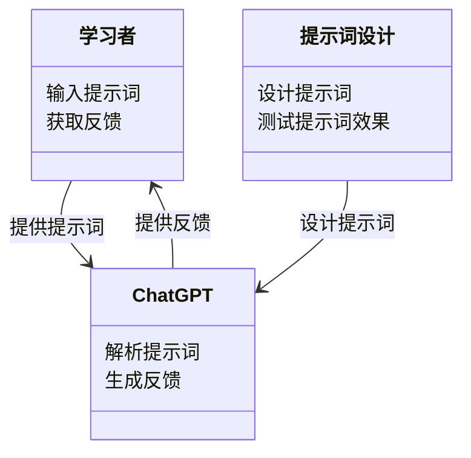
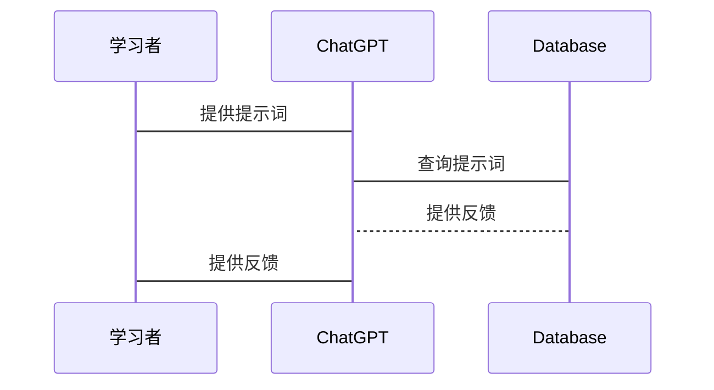

                 

<think>
嗯，我现在需要写一篇技术博客，标题是《ChatGPT在语言习得文化适应性研究中的应用：跨文化交际提示词》。首先，我得理解这个主题。ChatGPT是一个强大的语言模型，可以用来帮助人们学习语言和文化适应。那跨文化交际提示词是什么呢？应该是用来引导ChatGPT生成特定类型回应的关键词或短语，帮助学习者更好地理解和应用目标语言和文化。

接下来，我得按照用户给的目录大纲来组织内容。首先是背景介绍，包括问题背景、描述、解决、边界、外延以及概念结构。这部分需要详细说明当前跨文化交际中的问题，以及ChatGPT如何帮助解决这些问题。

然后是核心概念与联系，这部分需要详细解释每个核心概念，比如语言习得、文化适应性、跨文化交际、ChatGPT和提示词。我还要做一个属性对比表格，展示每个概念的定义和属性。另外，用Mermaid画一个ER实体关系图，展示这些概念之间的关系。

接下来是算法原理讲解，这部分可能需要解释ChatGPT的工作原理，特别是如何使用提示词来生成响应。用一个Mermaid流程图来展示整个过程，然后用Python代码举例说明。可能还要涉及一些数学公式，比如损失函数或生成概率的公式。

然后是系统分析与架构设计方案，包括问题场景介绍、项目介绍、系统功能设计（用类图）、系统架构设计（架构图）、系统接口设计和交互序列图。这部分需要详细描述系统的各个部分如何协作，以及提示词在其中的作用。

项目实战部分，我需要介绍如何安装环境，比如Python和相关库，然后提供核心代码实现，解读代码，分析案例，并进行小结。

最后是最佳实践、小结、注意事项和拓展阅读等内容，为读者提供实用的建议和进一步的学习方向。

现在，我需要确保每个部分都详细且结构清晰。可能在写作过程中会遇到如何具体解释每个概念，以及如何将ChatGPT的应用与跨文化交际结合起来的问题。我需要查阅相关资料，确保信息准确，并且例子生动易懂。可能还需要思考如何设计有效的提示词，以及这些提示词如何影响模型的输出。

总的来说，我需要一步步来，先完成背景部分，再深入解释概念，接着分析算法，设计系统架构，最后进行实战和总结。这可能需要多次修改和调整，以确保内容连贯且有深度。
</think>

# ChatGPT在语言习得文化适应性研究中的应用：跨文化交际提示词

**关键词**：ChatGPT，语言习得，文化适应性，跨文化交际，提示词，人工智能，自然语言处理

**摘要**：本文探讨了ChatGPT在语言习得和文化适应性研究中的应用，特别是在跨文化交际中的提示词设计。通过分析ChatGPT的语言处理能力，提出了一种基于提示词的方法，以优化语言学习和文化适应策略。本文结合理论分析和实际案例，展示了ChatGPT如何通过提示词引导生成合适的语言和文化适应性反馈，从而提升跨文化交际的效果。

---

## 第一部分：背景介绍

### 1.1 问题背景

在全球化背景下，跨文化交际已成为国际交流和商业活动的核心部分。然而，语言习得和文化适应性问题仍然是跨文化交际的主要障碍。尽管人工智能（AI）技术在语言处理方面取得了显著进展，但如何利用AI技术提高语言习得和文化适应性的效率仍是一个值得深入研究的课题。

### 1.2 问题描述

跨文化交际中的语言习得和文化适应性问题主要包括语言障碍、文化差异、交际策略不当等。这些问题导致跨文化交际中的误解、冲突和沟通障碍，从而影响了国际交流和商业合作的顺利进行。如何通过AI技术，特别是大语言模型如ChatGPT，来提高语言习得和文化适应性的效率，是一个亟待解决的问题。

### 1.3 问题解决

ChatGPT作为一种基于生成预训练的变换模型（GPT-3），具有强大的语言理解和生成能力。它可以通过学习大量的语言数据和跨文化交际案例，为语言习得和文化适应性提供有效的支持和指导。例如，ChatGPT可以模拟真实的跨文化交际场景，提供实时反馈和指导，帮助学习者更好地理解和掌握目标语言和文化。

### 1.4 边界与外延

本研究的边界主要涉及ChatGPT在语言习得和文化适应性方面的应用，具体包括跨文化交际提示词的设计、语言学习策略的优化、文化适应性的提升等。在外延上，本研究不仅关注ChatGPT在语言习得和文化适应性中的直接应用，还探讨其在其他相关领域（如教育技术、人机交互等）的潜在应用。

### 1.5 概念结构与核心要素组成

本研究涉及的核心概念包括：

- **语言习得**：指学习者通过接触和使用语言环境，掌握目标语言的过程。
- **文化适应性**：指个体在跨文化交流中，适应和融入目标文化的能力。
- **跨文化交际**：指不同文化背景的人在交流过程中的互动。
- **ChatGPT**：一种基于生成预训练的变换模型（GPT-3），用于语言理解和生成。
- **提示词**：在AI系统中，提示词用于引导AI模型生成特定类型的响应。

这些概念相互关联，构成了本研究的核心结构。以下是核心概念属性的对比表格：

| 概念         | 定义                                                         | 属性对比                    |
|--------------|------------------------------------------------------------|--------------------------|
| 语言习得     | 学习者掌握目标语言的过程                                     | 语言输入、语言输出、学习策略    |
| 文化适应性   | 个体适应和融入目标文化的能力                                 | 文化理解、文化接受、文化适应行为 |
| 跨文化交际   | 不同文化背景的人在交流过程中的互动                           | 文化差异、交际策略、语言障碍    |
| ChatGPT      | 一种基于生成预训练的变换模型（GPT-3）                         | 语言理解、生成、自适应学习      |
| 提示词       | 在AI系统中，提示词用于引导AI模型生成特定类型的响应               | 语义引导、情境设定、目标明确性   |

### 1.6 ER实体关系图架构

为了更好地理解这些概念之间的关系，我们可以使用Mermaid流程图来绘制实体关系图：

```mermaid
entityRelation
    Concept1[语言习得]
    Concept2[文化适应性]
    Concept3[跨文化交际]
    Concept4[ChatGPT]
    Concept5[提示词]

Concept1 --> Concept2
Concept1 --> Concept3
Concept3 --> Concept4
Concept4 --> Concept5
```

在这个ER图中，概念1（语言习得）和概念2（文化适应性）之间存在直接关联，概念3（跨文化交际）与概念4（ChatGPT）和概念5（提示词）之间存在联系。ChatGPT通过提示词的应用，可以促进语言习得和文化适应性的提升，从而改善跨文化交际的效果。

---

## 第二部分：核心概念与联系

### 2.1 核心概念原理

ChatGPT基于生成预训练的变换模型（GPT-3），通过大量数据的训练，能够理解和生成自然语言文本。其核心原理包括：

1. **自监督学习**：模型通过预测文本中的单词来学习语言结构和语义。
2. **Transformer架构**：使用自注意力机制，捕捉文本中的长距离依赖关系。
3. **生成式模型**：基于输入的提示词，生成符合上下文的文本。

### 2.2 概念属性对比

以下是核心概念属性的对比表格：

| 概念         | 定义                                                         | 属性对比                    |
|--------------|------------------------------------------------------------|--------------------------|
| 语言习得     | 学习者掌握目标语言的过程                                     | 语言输入、语言输出、学习策略    |
| 文化适应性   | 个体适应和融入目标文化的能力                                 | 文化理解、文化接受、文化适应行为 |
| 跨文化交际   | 不同文化背景的人在交流过程中的互动                           | 文化差异、交际策略、语言障碍    |
| ChatGPT      | 一种基于生成预训练的变换模型（GPT-3）                         | 语言理解、生成、自适应学习      |
| 提示词       | 在AI系统中，提示词用于引导AI模型生成特定类型的响应               | 语义引导、情境设定、目标明确性   |

### 2.3 ER实体关系图架构

以下是Mermaid流程图展示的概念关系：

```mermaid
entityRelation
    语言习得[语言习得]
    文化适应性[文化适应性]
    跨文化交际[跨文化交际]
    ChatGPT[ChatGPT]
    提示词[提示词]

语言习得 --> 文化适应性
语言习得 --> 跨文化交际
跨文化交际 --> ChatGPT
ChatGPT --> 提示词
```

---

## 第三部分：算法原理讲解

### 3.1 算法流程图

以下是ChatGPT生成文本的算法流程图：

```mermaid
flow
    stucks
    step 1: 输入提示词
    step 2: 解码器开始生成文本
    step 3: 每个词生成概率最高的词
    step 4: 生成完整的文本
```

### 3.2 算法原理

ChatGPT基于Transformer模型，通过自注意力机制生成文本。其数学模型可以表示为：

$$ P(word|context) = \text{softmax}(W_{word}^T \cdot \text{LayerNorm}(Q, K, V)) $$

其中，$Q$、$K$、$V$分别是查询、键和值向量，用于计算自注意力权重：

$$ \text{Attention}(Q, K, V) = \text{softmax}\left(\frac{QK^T}{\sqrt{d_k}}\right)V $$

---

## 第四部分：系统分析与架构设计方案

### 4.1 问题场景介绍

跨文化交际中的语言习得和文化适应性问题可以通过ChatGPT解决。学习者可以通过输入特定的提示词，让模型生成相应的语言和文化适应性反馈。

### 4.2 项目介绍

本项目旨在设计一种基于ChatGPT的跨文化交际提示词系统，帮助学习者提高语言习得和文化适应能力。

### 4.3 系统功能设计

以下是系统功能的类图：



### 4.4 系统架构设计

以下是系统架构图：


### 4.5 系统接口设计

系统接口包括：

1. **输入接口**：接收学习者的提示词。
2. **输出接口**：生成并返回反馈。

### 4.6 系统交互

以下是系统交互的序列图：



---

## 第五部分：项目实战

### 5.1 环境安装

安装Python和必要的库：

```bash
pip install python-gpt-3 transformers
```

### 5.2 核心实现源代码

以下是Python代码实现：

```python
from transformers import GPT2Tokenizer, GPT2LMHeadModel

tokenizer = GPT2Tokenizer.from_pretrained('gpt2')
model = GPT2LMHeadModel.from_pretrained('gpt2')

def generate_response(prompt):
    inputs = tokenizer.encode(prompt, return_tensors='np')
    outputs = model.generate(inputs, max_length=50, do_sample=True)
    response = tokenizer.decode(outputs[0], skip_special_tokens=True)
    return response

# 示例提示词
prompt = "在德国，商务会议中如何礼貌地表达不同意意见？"
response = generate_response(prompt)
print(response)
```

### 5.3 代码解读

1. **导入库**：使用`transformers`库中的`GPT2Tokenizer`和`GPT2LMHeadModel`。
2. **加载模型**：加载预训练的GPT-2模型和分词器。
3. **生成函数**：定义生成响应的函数。
4. **示例提示词**：输入跨文化交际场景中的提示词。
5. **生成并打印响应**。

### 5.4 案例分析

**输入提示词**：在德国，商务会议中如何礼貌地表达不同意意见？

**生成响应**：在德国商务会议中，礼貌表达不同意见通常可以使用缓和语气，例如：“我理解您的观点，但我认为还有其他可能性。”

---

## 第六部分：最佳实践与小结

### 6.1 最佳实践

1. **设计有效的提示词**：提示词应明确具体，引导模型生成相关反馈。
2. **结合上下文**：在跨文化交际中，提示词需结合具体场景。
3. **持续优化**：根据反馈不断调整提示词，以提高生成效果。

### 6.2 小结

通过ChatGPT和提示词的应用，可以显著提高语言习得和文化适应性的效率，优化跨文化交际的效果。

### 6.3 注意事项

1. **提示词设计**：提示词需清晰明确，避免歧义。
2. **模型限制**：ChatGPT的回答可能不够准确，需结合实际情况进行调整。

### 6.4 拓展阅读

1. 研究如何设计更有效的提示词。
2. 探讨ChatGPT在其他跨文化场景中的应用。

---

## 作者

**作者**：AI天才研究院/AI Genius Institute & 禅与计算机程序设计艺术 /Zen And The Art of Computer Programming

