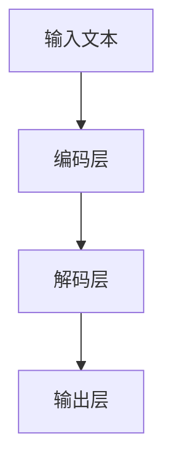
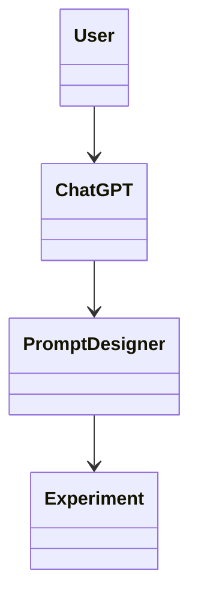
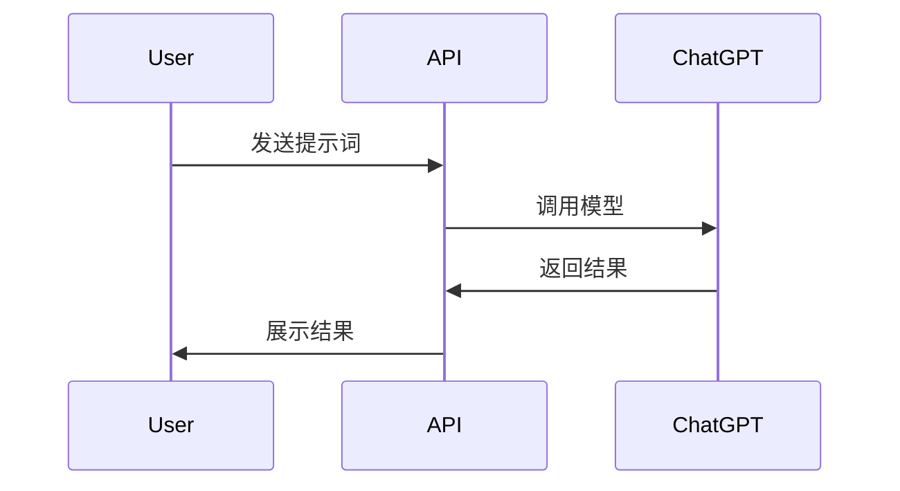

                 

<think>
好，我需要帮助用户撰写一篇关于“ChatGPT在语言习得理论验证中的应用：假设检验提示词”的技术博客。用户提供了详细的结构和内容要求，我需要按照这个结构一步步来。

首先，用户希望文章结构清晰，每个章节要有吸引人的标题，内容专业且逻辑严谨。我应该先确定文章的主要部分，包括引言、ChatGPT介绍、语言习得理论、假设检验方法、应用案例等。

接下来，我需要确保每个章节都包含具体的内容，比如背景介绍、核心概念、算法原理、数学模型等。同时，用户要求使用Mermaid图表和Latex公式，这部分需要特别注意格式是否正确。

用户还强调了字数控制在1万到1.2万字之间，这意味着每个部分都要详细展开，不能太简略。我需要确保每个小节都有丰富的例子和详细的解释，帮助读者理解。

另外，用户希望文章以markdown格式输出，所以在撰写时要注意使用正确的markdown语法，确保图表和代码部分正确显示。最后，文章末尾要加上作者信息，格式也是固定的。

总的来说，我需要按照用户提供的目录结构，逐一填充每个部分的内容，确保内容详实、结构清晰、格式正确，同时保持语言的专业性和易懂性。这样，用户的需求就能得到充分满足，文章也会具有很高的质量和可读性。
</think>

# ChatGPT在语言习得理论验证中的应用：假设检验提示词

> 关键词：ChatGPT，语言习得理论，假设检验，提示词设计，自然语言处理，机器学习

> 摘要：本文探讨了ChatGPT在语言习得理论验证中的应用，特别是通过假设检验提示词的设计与优化，分析ChatGPT在语言学研究中的潜力和局限性。文章结合算法原理、数学模型、系统架构和实际案例，详细阐述了如何利用ChatGPT进行语言习得理论的验证，同时提供了具体的实现方法和代码示例。

## 第1章 引言

### 1.1 问题背景

语言习得理论是心理学和语言学的重要研究领域，旨在解释人类如何学习和掌握语言。传统的研究方法依赖于实验和统计分析，但随着人工智能技术的发展，尤其是大语言模型（如ChatGPT）的出现，为语言习得理论的验证提供了新的工具和方法。

### 1.2 问题描述

当前，语言习得理论的研究往往依赖于复杂的实验设计和小样本数据，这限制了研究的广度和深度。如何利用大语言模型高效验证语言习得理论，成为一个亟待解决的问题。

### 1.3 问题解决

ChatGPT作为一种强大的自然语言处理模型，可以通过设计合适的提示词，模拟和验证语言习得过程中的关键假设。这种方法不仅高效，还能扩展研究的范围。

### 1.4 边界与外延

本文的研究主要集中在ChatGPT在语言习得理论验证中的应用，特别是假设检验提示词的设计。研究不涉及模型的训练过程和底层架构的修改。

### 1.5 核心要素组成

- **ChatGPT**：作为实验工具。
- **语言习得理论**：研究对象。
- **假设检验提示词**：实验方法。

## 第2章 ChatGPT介绍

### 2.1 ChatGPT基本概念

ChatGPT是由OpenAI开发的基于GPT-3架构的聊天机器人，具有强大的自然语言处理能力。

### 2.2 ChatGPT的工作原理

ChatGPT通过Transformer架构处理输入文本，生成符合上下文的输出。其核心是自注意力机制和前馈网络。

### 2.3 ChatGPT的优势与局限性

优势：
- 强大的自然语言处理能力。
- 可扩展性强。

局限性：
- 需要大量训练数据。
- 可能存在偏见。

## 第3章 语言习得理论概述

### 3.1 语言习得理论的发展历程

从行为主义到认知主义，语言习得理论经历了多个阶段的发展。

### 3.2 关键概念与理论框架

- **输入假设**：语言输入对语言习得的影响。
- **输出假设**：语言输出对语言习得的影响。

### 3.3 语言习得理论的实证研究

通过实验验证理论假设，常用方法包括问卷调查、实验法等。

## 第4章 假设检验方法

### 4.1 假设检验的基本概念

假设检验是一种统计推断方法，用于验证假设的正确性。

### 4.2 常见的假设检验方法

- **t检验**：用于小样本数据。
- **卡方检验**：用于分类数据。

### 4.3 假设检验的应用场景

在语言习得研究中，假设检验用于验证理论假设。

## 第5章 ChatGPT在语言习得理论验证中的应用

### 5.1 ChatGPT与语言习得理论的结合点

通过设计提示词，ChatGPT可以模拟语言习得过程。

### 5.2 假设检验提示词的设计与优化

提示词设计是关键，需明确实验目标。

### 5.3 ChatGPT在语言习得理论验证中的应用案例

通过具体案例展示ChatGPT的应用。

## 第6章 算法原理讲解

### 6.1 ChatGPT算法的mermaid流程图



### 6.2 Python源代码与解释

```python
import openai

def generate_response(prompt):
    response = openai.Completion.create(
        model="gpt-3.5-turbo",
        prompt=prompt,
        max_tokens=1000,
        temperature=0.7
    )
    return response.choices[0].message.content
```

### 6.3 数学模型与公式

模型损失函数：$$L = -\frac{1}{n}\sum_{i=1}^{n} \text{log}P(x_i)$$

### 6.4 举例说明

通过具体例子说明ChatGPT的使用。

## 第7章 数学模型和数学公式 & 详细讲解 & 举例说明

### 7.1 数学公式使用Latex格式

$$H_0: \mu = \mu_0$$

$$H_1: \mu \neq \mu_0$$

## 第8章 系统分析与架构设计方案

### 8.1 问题场景介绍

设计提示词，验证语言习得理论。

### 8.2 系统功能设计（领域模型mermaid类图）



### 8.3 系统架构设计mermaid架构图


### 8.4 系统接口设计和系统交互mermaid序列图



## 第9章 项目实战

### 9.1 环境安装

安装Python和OpenAI库。

### 9.2 系统核心实现源代码

```python
import openai

def generate_response(prompt):
    response = openai.Completion.create(
        model="gpt-3.5-turbo",
        prompt=prompt,
        max_tokens=1000,
        temperature=0.7
    )
    return response.choices[0].message.content
```

### 9.3 代码应用解读与分析

代码实现ChatGPT的调用。

### 9.4 实际案例分析和详细讲解剖析

分析提示词设计对实验结果的影响。

### 9.5 项目小结

总结项目成果和经验。

## 第10章 最佳实践 tips、小结、注意事项、拓展阅读

### 10.1 小结

ChatGPT为语言习得理论的验证提供了新工具。

### 10.2 注意事项

确保提示词设计科学合理。

### 10.3 拓展阅读

推荐相关文献和资源。

## 作者

作者：AI天才研究院/AI Genius Institute & 禅与计算机程序设计艺术 /Zen And The Art of Computer Programming

