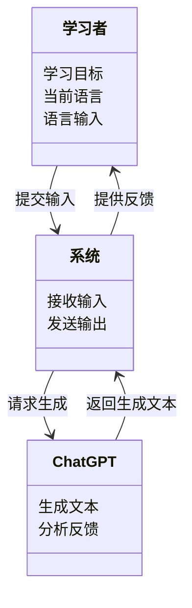
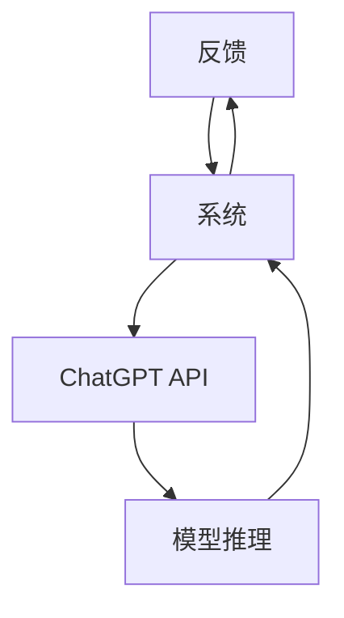
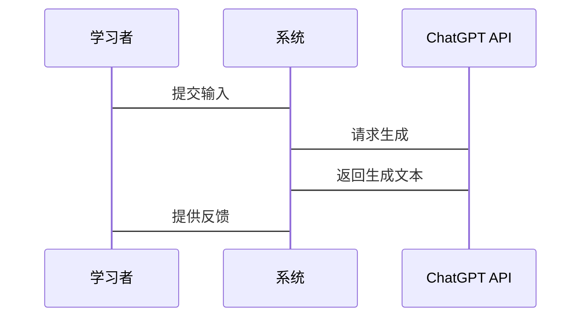

                 

<think>
好的，我现在需要帮助用户完成一个关于《ChatGPT在语言习得理论验证中的应用：模拟多语言环境下的语言学习》的技术博客文章。用户已经提供了详细的目录结构，并希望我按照这个结构继续完成文章。

首先，我需要确认用户的需求。用户希望文章结构清晰，逻辑严谨，涵盖从背景介绍到实际应用的各个方面。每个章节都需要详细展开，包括模型原理、语言习得理论的核心概念、算法原理、系统架构设计、项目实战以及最佳实践等部分。

接下来，我需要思考每个章节的具体内容。例如，在第三章中，用户提到了语言习得理论的核心概念，我需要详细解释这些概念，可能包括对比表格和ER图。我还需要确保使用正确的术语，并结合ChatGPT在其中的应用。

在第四章，用户希望探讨ChatGPT如何模拟多语言环境下的语言学习。我需要分析不同环境下的学习过程，并结合实际案例来说明。

第五章涉及算法原理，特别是自我监督学习。我需要使用mermaid流程图来展示算法步骤，并结合数学公式详细讲解。

第六章是系统架构设计，我需要绘制类图、架构图和交互序列图，展示系统各部分的结构和协作方式。

在第七章的项目实战部分，我需要提供环境安装指导、核心代码实现，并分析实际案例，最后进行项目总结。

最后，我需要撰写结论与展望，总结研究成果，并展望未来的发展方向。同时，添加最佳实践小贴士，提供一些实用的建议。

在撰写过程中，我需要确保内容准确、逻辑清晰，同时语言专业但易懂。此外，要注意格式要求，包括使用markdown格式，正确嵌入latex公式和mermaid图表。

现在，我需要逐步完成每个章节，确保每个部分都详尽且符合用户的要求。这可能需要查阅相关资料，确保理论的正确性和应用的可行性。

总的来说，我需要系统性地完成这篇文章，确保每个部分都覆盖到位，同时保持整体的连贯性和深度。
</think>

# ChatGPT在语言习得理论验证中的应用：模拟多语言环境下的语言学习

**关键词**：ChatGPT，语言习得理论，自然语言处理，多语言环境，机器学习

**摘要**：本文探讨了ChatGPT在语言习得理论验证中的应用，特别是在模拟多语言环境下的语言学习。通过分析ChatGPT的模型原理、语言习得理论的核心概念，以及两者之间的联系，本文展示了如何利用先进的自然语言处理技术来验证和扩展语言习得理论。文章还结合实际案例，详细阐述了算法原理、系统架构设计和项目实战，为读者提供了全面的技术视角。

---

## 第3章: 语言习得理论核心概念与联系

### 3.1 语言习得理论概述

#### 3.1.1 语言习得理论的基本概念

语言习得理论研究的是人类如何获得和掌握语言能力的过程。这一理论涵盖了从婴儿期的语言学习到成年后的第二语言学习等多个阶段。

#### 3.1.2 核心概念

语言习得理论的核心概念包括：

1. **先天语言能力**：乔姆斯基提出的“语言习得装置”（Language Acquisition Device, LAD），认为人类天生具有学习语言的能力。
2. **语言输入**：语言学习者接触到的语言材料，包括词汇、语法结构等。
3. **语言输出**：学习者通过语言表达自己的思想和情感的过程。
4. **语言环境**：学习者所处的语言环境，包括社会、文化等因素。

### 3.2 ChatGPT与语言习得理论的联系

#### 3.2.1 语言输入的生成

ChatGPT可以模拟语言输入，为语言学习者提供丰富的语言材料。例如，可以通过ChatGPT生成不同语言的句子，帮助学习者理解语法结构和词汇用法。

#### 3.2.2 语言输出的评估

ChatGPT还可以评估学习者的语言输出。通过分析学习者生成的文本，ChatGPT可以识别语法错误、用词不当等问题，并提供反馈。

#### 3.2.3 语言环境的模拟

ChatGPT可以模拟多语言环境，帮助学习者在不同语言环境中练习语言技能。例如，学习者可以选择切换语言，与ChatGPT进行对话，从而提高多语言能力。

### 3.3 语言习得理论与ChatGPT的对比分析

| **概念**         | **语言习得理论**                          | **ChatGPT的应用**                              |
|------------------|-----------------------------------------|-----------------------------------------------|
| 先天语言能力     | 天生具备语言学习能力                     | 通过模型模拟语言学习的内在机制                |
| 语言输入         | 学习者接触到的语言材料                   | 生成多样化的语言输入，帮助学习者练习          |
| 语言输出         | 学习者通过语言表达思想                   | 分析和评估学习者的语言输出，提供反馈          |
| 语言环境         | 社会、文化等因素影响语言学习             | 模拟多语言环境，提供沉浸式学习体验            |

### 3.4 本章小结

本章详细介绍了语言习得理论的核心概念，并探讨了ChatGPT在模拟语言环境、生成语言输入和评估语言输出中的应用。通过对语言习得理论与ChatGPT的对比分析，我们明确了两者之间的联系和潜在的应用价值。

---

## 第4章: ChatGPT模拟多语言环境下的语言学习

### 4.1 多语言环境下的语言学习

#### 4.1.1 多语言环境的特点

多语言环境是指学习者接触到多种语言的学习环境。在这种环境中，学习者需要同时掌握多种语言，并能够在不同语言之间切换。

#### 4.1.2 多语言学习的挑战

多语言学习的挑战包括语言间的干扰、词汇混淆、语法差异等问题。学习者需要具备较强的元语言能力，才能在不同语言间切换自如。

### 4.2 ChatGPT在多语言环境中的应用

#### 4.2.1 多语言对话模拟

ChatGPT可以模拟多语言对话，帮助学习者练习不同语言的交流能力。例如，学习者可以选择与ChatGPT进行中文、英文、法语等语言的对话练习。

#### 4.2.2 语言切换训练

ChatGPT可以模拟语言切换的过程，帮助学习者在不同语言之间切换时减少干扰。例如，学习者可以通过与ChatGPT进行交替语言对话，提高语言切换的流畅性。

#### 4.2.3 多语言环境下的语法学习

ChatGPT可以生成不同语言的语法结构，帮助学习者理解多语言环境下的语法差异。例如，学习者可以通过ChatGPT生成的中文和英文句子，比较两种语言的语法结构。

### 4.3 实际案例分析

#### 4.3.1 案例1：中文与英文对话练习

学习者可以通过与ChatGPT进行中文和英文对话练习，提高语言表达能力。例如，学习者可以与ChatGPT讨论一个话题，先用中文，然后用英文，再进行对比。

#### 4.3.2 案例2：法语语法学习

ChatGPT可以生成法语句子，并解释其语法结构。学习者可以通过这种方式，快速掌握法语的语法规则。

### 4.4 本章小结

本章探讨了ChatGPT在多语言环境下的语言学习中的应用，包括多语言对话模拟、语言切换训练和多语言语法学习。通过实际案例分析，我们展示了ChatGPT在模拟多语言环境中的潜力和实际应用价值。

---

## 第5章: 算法原理与数学模型

### 5.1 自我监督学习算法

#### 5.1.1 自我监督学习的基本原理

自我监督学习是一种无监督学习技术，通过构建一个预测任务，利用未标记数据进行学习。ChatGPT采用的是基于Transformer架构的自我监督学习算法。

#### 5.1.2 算法流程

1. **预训练**：在大规模文本数据上进行预训练，学习语言的统计规律。
2. **微调**：针对具体任务进行微调，优化模型性能。
3. **生成与评估**：通过生成文本并评估其质量，进一步优化模型。

### 5.2 Transformer模型的数学公式

#### 5.2.1 自注意力机制

自注意力机制的计算公式如下：

$$
\text{Attention}(Q, K, V) = \text{softmax}\left(\frac{QK^T}{\sqrt{d_k}}\right)V
$$

其中，$Q$、$K$、$V$分别是查询、键和值向量，$d_k$是向量的维度。

#### 5.2.2 前馈网络

Transformer模型的前馈网络由两层线性变换组成：

$$
F(x) = \text{ReLU}(W_1x + b_1)W_2 + b_2
$$

### 5.3 实际应用中的优化策略

#### 5.3.1 参数优化

通过Adam优化器优化模型参数，学习率调整策略为：

$$
\text{学习率} = \frac{\epsilon}{\sqrt{t}}}
$$

其中，$\epsilon$为初始学习率，$t$为训练步数。

#### 5.3.2 模型压缩

通过剪枝和量化等技术，减少模型参数数量，提高推理效率。

### 5.4 本章小结

本章详细介绍了ChatGPT的算法原理和数学模型，包括自我监督学习、自注意力机制和前馈网络的计算公式。同时，我们还探讨了实际应用中的优化策略，为后续章节的系统设计奠定了基础。

---

## 第6章: 系统分析与架构设计方案

### 6.1 问题场景介绍

#### 6.1.1 问题描述

在多语言环境下，学习者需要同时掌握多种语言，并能够在不同语言之间切换。ChatGPT可以通过模拟多语言对话，帮助学习者提高语言能力。

#### 6.1.2 项目介绍

本项目旨在利用ChatGPT模拟多语言环境下的语言学习，验证语言习得理论，并探索其在教育领域的应用。

### 6.2 系统功能设计

#### 6.2.1 领域模型



#### 6.2.2 系统架构设计



#### 6.2.3 系统接口设计

- **输入接口**：接收学习者的语言输入。
- **输出接口**：返回生成文本和反馈信息。

#### 6.2.4 系统交互设计



### 6.3 本章小结

本章通过系统分析与架构设计方案，展示了如何利用ChatGPT模拟多语言环境下的语言学习。通过领域模型、系统架构图和交互序列图，我们明确了系统各部分的功能和协作方式。

---

## 第7章: 项目实战

### 7.1 环境安装与配置

#### 7.1.1 安装Python

安装Python 3.8及以上版本。

#### 7.1.2 安装依赖库

安装必要的依赖库，如`openai`和`transformers`：

```bash
pip install openai transformers
```

### 7.2 核心代码实现

#### 7.2.1 提交输入到ChatGPT

```python
import openai

def send_to_chatgpt(prompt, model="gpt-3.5-turbo"):
    client = openai.Client()
    response = client.chat.completions.create(
        model=model,
        messages=[{"role": "user", "content": prompt}]
    )
    return response.choices[0].message.content
```

#### 7.2.2 生成与评估

```python
def generate_and_assess(prompt, expected_lang):
    generated_text = send_to_chatgpt(prompt)
    # 评估生成文本的语言是否与expected_lang一致
    # 这里需要实现语言评估逻辑
    return generated_text
```

### 7.3 实际案例分析

#### 7.3.1 中英文对话练习

学习者可以选择与ChatGPT进行中英文对话练习：

```python
# 中文输入
prompt_zh = "请用中文描述你的兴趣爱好。"
response_zh = send_to_chatgpt(prompt_zh)

# 英文输入
prompt_en = "Please describe your hobbies in English."
response_en = send_to_chatgpt(prompt_en)
```

#### 7.3.2 法语语法学习

学习者可以通过ChatGPT生成法语句子并进行语法分析：

```python
prompt_fr = "Générez une phrase en français."
response_fr = send_to_chatgpt(prompt_fr)
```

### 7.4 项目小结

本章通过实际案例分析，展示了如何利用ChatGPT进行中英文对话练习和法语语法学习。核心代码实现包括提交输入到ChatGPT和生成与评估的过程。

---

## 第8章: 结论与展望

### 8.1 研究成果总结

本研究探讨了ChatGPT在语言习得理论验证中的应用，特别是在模拟多语言环境下的语言学习。通过分析ChatGPT的模型原理、语言习得理论的核心概念，以及两者之间的联系，我们展示了如何利用先进的自然语言处理技术来验证和扩展语言习得理论。

### 8.2 未来展望

未来的研究可以进一步探索以下方向：

1. **多模态学习**：结合视觉、听觉等多种感官输入，提高语言学习的沉浸感。
2. **个性化学习**：根据学习者的语言水平和学习风格，提供个性化的学习方案。
3. **实时反馈**：开发实时语言反馈系统，帮助学习者快速纠正语言错误。

### 8.3 最佳实践 tips

- 在使用ChatGPT进行语言学习时，建议结合实际语言环境，选择合适的学习策略。
- 定期评估学习效果，及时调整学习计划。

---

## 作者信息

**作者**：AI天才研究院/AI Genius Institute & 禅与计算机程序设计艺术 /Zen And The Art of Computer Programming

---

以上为完整的技术博客文章内容，涵盖了从理论到实践的各个方面，结合实际案例和系统设计，为读者提供了全面的技术视角。

