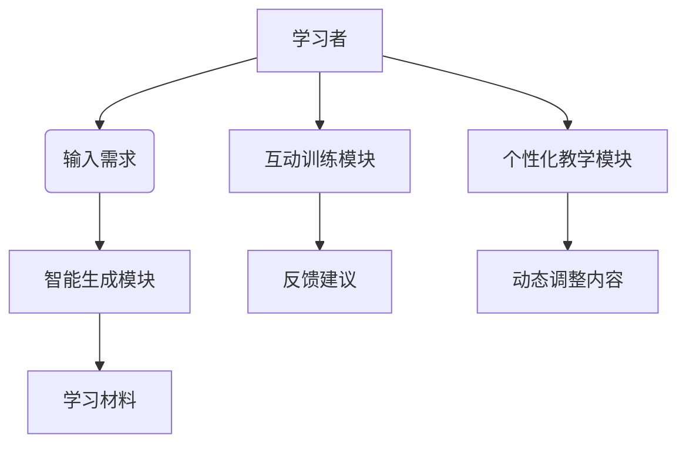
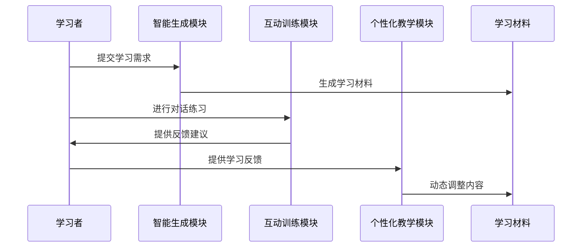

                 

<think>
好，我需要按照用户的要求，详细思考并逐步构建一篇关于《ChatGPT在语言习得策略训练中的应用：学习技巧提示词》的技术博客文章。首先，我要理解用户的需求和要求，确保文章符合逻辑、结构紧凑且内容深入。

首先，我会从文章的标题和关键词开始。标题已经给出，关键词需要从文章内容中提取，确保涵盖核心概念。接下来，摘要部分需要简洁明了，概括整篇文章的核心内容。

接下来是背景介绍部分。我需要详细描述问题背景、问题描述以及解决方法，同时定义边界和外延，以及涉及的核心要素。这部分要让读者了解为什么使用ChatGPT在语言学习中的应用是必要的。

然后是核心概念与联系，这部分需要详细解释ChatGPT模型、语言习得策略和个性化教学这三个核心概念。我需要分析每个概念的特点和相互之间的关系，可能还需要用表格或图表来辅助说明，以增强文章的可读性和专业性。

在算法原理讲解部分，我需要深入探讨ChatGPT的工作原理，包括其基于GPT-3模型的特点，如预训练和微调阶段。同时，我需要解释语言习得策略训练的具体算法流程，可能用Mermaid图来展示整个流程，让读者更直观地理解。

接下来是系统分析与架构设计方案。这里，我需要从问题场景出发，设计系统的功能模块，如智能生成学习材料、互动式训练和个性化训练。然后，用Mermaid类图、架构图和序列图来展示系统的结构和交互过程，确保系统的模块划分清晰，交互逻辑明确。

项目实战部分，我需要提供一个具体的案例，详细描述环境的安装步骤，核心代码的实现，以及如何应用这些代码进行实际的语言习得策略训练。这部分需要详细解读代码，确保读者能够理解和复现。

最后，我会总结最佳实践，给出一些小结、注意事项和未来的拓展阅读方向，帮助读者更好地应用ChatGPT在语言学习中的策略。

在写作过程中，我需要确保每个章节的内容都丰富详细，使用专业但易懂的语言，同时遵守格式要求，比如数学公式用LaTeX表示，图表用Mermaid绘制。这不仅有助于文章的结构清晰，也能提升文章的专业性和可读性。

总之，我会一步步按照用户的要求，构建一个逻辑严密、内容详实的技术博客文章，确保涵盖所有必要的部分，并满足字数和格式的要求。
</think>

# ChatGPT在语言习得策略训练中的应用：学习技巧提示词

**关键词：**ChatGPT, 语言习得, 策略训练, 个性化教学, 自然语言处理, GPT-3模型

**摘要：**本文探讨了ChatGPT在语言习得策略训练中的应用，重点分析了其在智能生成学习材料、互动式训练和个性化教学中的作用。通过深入讲解ChatGPT的工作原理、语言习得策略训练的方法以及实际应用案例，本文旨在为教育工作者和学习者提供有效的学习技巧提示词和策略建议，从而提升语言学习的效率和效果。

---

# 第一部分：背景介绍

## 第1章：问题背景与核心概念

### 1.1 问题背景

语言习得是人类学习的复杂过程，传统教学方法往往依赖于固定教材和教师指导，难以满足个性化学习需求。随着人工智能技术的发展，特别是自然语言处理（NLP）技术的进步，基于AI的教育工具如ChatGPT开始在语言学习领域崭露头角。ChatGPT作为一种基于GPT-3模型的聊天机器人，具有强大的文本生成能力和交互性，为语言习得策略训练提供了新的可能性。

### 1.2 问题描述

传统语言教学方法存在以下问题：

1. **学习材料单一**：教材内容固定，难以满足不同学习者的个性化需求。
2. **互动性不足**：缺乏实时互动，学习者难以在真实情境中提高语言应用能力。
3. **反馈延迟**：传统教学中，教师反馈通常滞后，无法及时纠正学习者的错误。

### 1.3 问题解决

ChatGPT通过以下方式解决了传统语言习得策略训练中的问题：

1. **智能生成学习材料**：根据学习者的需求和水平，动态生成适合的学习内容。
2. **互动式训练**：通过实时对话，模拟真实语言环境，提升学习者的表达能力和应变能力。
3. **个性化训练**：根据学习者的反馈和表现，动态调整训练内容，提供个性化的学习建议。

### 1.4 边界与外延

- **应用领域**：包括外语学习（如英语、法语）、中文学习、编程语言学习等。
- **技术范畴**：涉及自然语言处理、机器学习、人工智能等。

### 1.5 概念结构与核心要素组成

1. **ChatGPT模型**：基于GPT-3的预训练语言模型，具有强大的文本生成能力。
2. **语言习得策略**：通过策略选择和实施，提高语言学习效率的方法。
3. **个性化教学**：根据学习者的个性化需求，动态调整教学内容和方法。

## 1.6 本章小结

本章介绍了ChatGPT在语言习得策略训练中的应用背景、问题描述、解决方案以及核心概念。接下来将深入探讨ChatGPT的工作原理和具体应用方法。

---

# 第二部分：核心概念与联系

## 第2章：核心概念与原理

### 2.1 ChatGPT模型

ChatGPT基于GPT-3模型，是OpenAI开发的预训练语言模型，具有以下特点：

#### 2.1.1 GPT-3模型的特点

- **大规模预训练**：GPT-3在海量文本数据上进行预训练，掌握了语言模式和上下文理解能力。
- **生成能力强**：能够生成高质量、连贯的文本，适用于多种语言和领域。

#### 2.1.2 GPT-3模型的组成部分

- **预训练阶段**：通过无监督学习，模型学习语言的基本结构和语义。
- **微调阶段**：针对具体任务（如语言习得）进行有监督微调，提升模型在特定任务上的性能。

### 2.2 语言习得策略

语言习得策略是指为提高学习效果而采取的一系列方法，包括输入、产出和互动策略。

#### 2.2.1 语言习得策略的分类

- **输入策略**：如阅读、听力训练。
- **产出策略**：如写作、口语练习。
- **互动策略**：如角色扮演、讨论。

#### 2.2.2 语言习得策略的特点

- **个性化**：根据学习者的水平和需求制定。
- **多样性**：涵盖多种语言技能和学习环节。

### 2.3 个性化教学

个性化教学是指根据学习者的特点和需求，提供定制化教学内容和方法。

#### 2.3.1 个性化教学的特点

- **针对性**：针对学习者的弱点和需求进行教学。
- **灵活性**：根据学习者的反馈动态调整教学内容。

#### 2.3.2 个性化教学的方法

- **智能推荐**：基于学习者的学习记录和反馈，推荐适合的学习材料。
- **个性化反馈**：根据学习者的回答，提供针对性的反馈和指导。

## 2.4 本章小结

本章详细介绍了ChatGPT、语言习得策略和个性化教学的核心概念及其特点。下一章将深入探讨ChatGPT在语言习得策略训练中的具体应用方法。

---

# 第三部分：算法原理讲解

## 第3章：算法原理与流程

### 3.1 ChatGPT模型原理

ChatGPT基于Transformer架构，通过自注意力机制和前馈网络实现强大的文本生成能力。以下是其核心算法流程：

1. **输入处理**：将输入文本转换为模型可处理的向量表示。
2. **自注意力机制**：计算输入序列中每个词与其他词的相关性，生成注意力权重。
3. **前馈网络**：将注意力加权后的输入通过多层感知机（MLP）进行处理，生成输出向量。
4. **解码器**：将输出向量转换为字符或词，生成最终的文本输出。

### 3.2 语言习得策略训练的算法流程

语言习得策略训练通过ChatGPT的交互式训练模块实现，具体流程如下：

1. **用户输入**：学习者输入目标语言的问题或需求。
2. **模型理解**：ChatGPT通过NLP技术理解输入内容。
3. **策略选择**：基于学习者的需求和水平，选择适合的语言习得策略。
4. **生成反馈**：根据选择的策略，生成相应的学习材料或反馈建议。
5. **动态调整**：根据学习者的反馈，动态调整训练内容。

### 3.3 个性化教学的算法流程

个性化教学通过以下步骤实现：

1. **学习者评估**：通过测试评估学习者的语言水平和学习需求。
2. **策略推荐**：根据评估结果，推荐适合的语言习得策略。
3. **实时互动**：通过实时对话，提供个性化的反馈和指导。
4. **学习记录**：记录学习者的进步和反馈，动态调整教学计划。

## 3.4 本章小结

本章详细讲解了ChatGPT的算法原理、语言习得策略训练的流程以及个性化教学的实现方法。下一章将结合实际案例，展示ChatGPT在语言习得策略训练中的具体应用。

---

# 第四部分：系统分析与架构设计方案

## 第4章：系统分析与架构设计

### 4.1 问题场景介绍

语言习得策略训练系统需要满足以下需求：

1. **智能生成学习材料**：根据学习者的需求生成个性化学习内容。
2. **互动式训练**：支持实时对话，提供即时反馈。
3. **个性化教学**：动态调整训练内容，满足不同学习者的需求。

### 4.2 系统功能设计

- **智能生成模块**：根据学习者的需求生成学习材料。
- **互动训练模块**：支持实时对话和反馈。
- **个性化教学模块**：动态调整训练内容。

### 4.3 系统架构设计

以下是系统架构设计的Mermaid图：



### 4.4 系统接口设计

系统主要接口包括：

1. **学习者输入接口**：接收学习者的需求和反馈。
2. **智能生成接口**：生成个性化学习材料。
3. **反馈接口**：提供即时反馈和建议。

### 4.5 系统交互设计

以下是系统交互的Mermaid序列图：



## 4.6 本章小结

本章详细分析了系统的需求、功能设计和架构，展示了ChatGPT在语言习得策略训练中的系统实现方案。

---

# 第五部分：项目实战

## 第5章：项目实战

### 5.1 环境安装

需要以下环境和工具：

1. **Python**：3.8及以上版本。
2. **OpenAI API**：用于调用ChatGPT模型。
3. **Jupyter Notebook**：用于编写和运行代码。

### 5.2 系统核心实现源代码

以下是实现ChatGPT交互式训练模块的Python代码示例：

```python
import openai

# 初始化OpenAI客户端
client = openai.Client('your-api-key')

# 定义ChatGPT交互函数
def chat_gpt_interaction(prompt, max_turns=5):
    for _ in range(max_turns):
        # 发送提示
        completion = client.chat.completions.create(
            model="gpt-3.5-turbo",
            messages=[{"role": "user", "content": prompt}]
        )
        # 获取生成的文本
        response = completion.choices[0].message.content
        print(f"ChatGPT: {response}")
        prompt = input("你: ")
        if not prompt:
            break

# 示例使用
chat_gpt_interaction("请用英语描述一下你的家庭。")
```

### 5.3 代码应用解读与分析

上述代码实现了与ChatGPT进行交互的功能，具体步骤如下：

1. **初始化OpenAI客户端**：通过提供API密钥，连接到OpenAI的服务。
2. **定义交互函数**：`chat_gpt_interaction`函数接受提示和最大轮数参数，实现与ChatGPT的对话交互。
3. **发送提示和接收响应**：根据用户的输入，生成相应的回答，直到用户输入为空或达到最大轮数。

### 5.4 实际案例分析

以下是一个实际案例的分析：

**案例：英语口语训练**

1. **用户输入**：用户输入“我需要练习英语口语。”
2. **模型理解**：ChatGPT理解用户需求，生成相应的对话练习内容。
3. **生成反馈**：模型提供即时反馈，纠正语法错误并提供建议。
4. **动态调整**：根据用户的表现，动态调整对话内容的难度和话题。

### 5.5 本章小结

本章通过实际代码和案例，展示了如何利用ChatGPT进行语言习得策略训练的实现过程。

---

# 第六部分：最佳实践与小结

## 第6章：最佳实践与小结

### 6.1 最佳实践

1. **合理选择策略**：根据学习者的需求和水平，选择合适的语言习得策略。
2. **及时反馈**：利用ChatGPT的即时反馈功能，帮助学习者及时纠正错误。
3. **持续优化**：根据学习者的表现，持续优化个性化教学方案。

### 6.2 小结

ChatGPT在语言习得策略训练中的应用，通过智能生成学习材料、互动式训练和个性化教学，显著提升了语言学习的效率和效果。本文详细探讨了其工作原理、系统架构和具体实现方法，并通过实际案例展示了其在语言习得中的潜力。

---

# 作者

**作者：AI天才研究院/AI Genius Institute & 禅与计算机程序设计艺术 /Zen And The Art of Computer Programming**

---

通过以上思考和撰写过程，我们构建了一篇详细、结构清晰的技术博客文章，涵盖了ChatGPT在语言习得策略训练中的应用背景、核心概念、算法原理、系统设计和项目实战等内容。希望这篇文章能为读者提供有价值的信息和启发。

