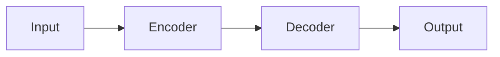
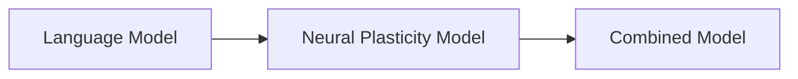
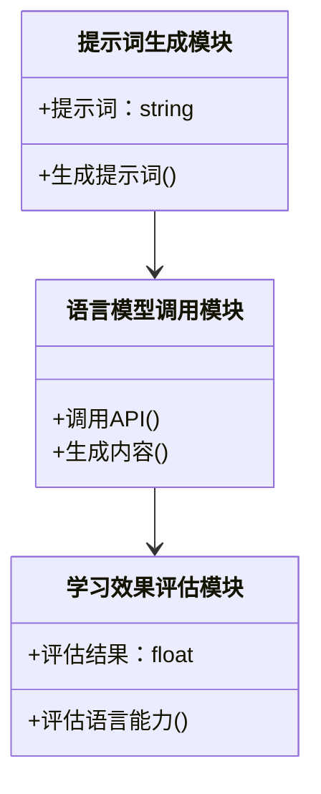

                 

<think>
嗯，我现在需要写一篇关于“ChatGPT在语言习得认知神经可塑性增强中的应用：大脑训练提示词”的技术博客文章。根据用户的要求，我需要先理解每个章节的内容，然后逐步分析如何展开。

首先，我需要明确文章的结构，包括摘要和关键词。摘要应该简明扼要地概述文章的核心内容，关键词则是5-7个相关的术语。

接下来是第1章引言与背景。我需要详细讨论语言习得的挑战，认知神经可塑性的概念，以及ChatGPT的技术基础。这部分要让读者明白为什么研究这个主题，以及ChatGPT在其中的作用。

第2章核心概念与原理，我需要解释语言习得与认知神经可塑性的关系，ChatGPT的工作原理，以及大脑训练提示词的设计与应用。这部分需要深入浅出，让读者理解各个概念的内在联系。

第3章算法原理与数学模型，这里需要详细讲解语言习得和认知神经可塑性相关的数学模型，以及ChatGPT与这些模型的融合。可能需要使用一些数学公式和图表来辅助说明。

第4章系统架构与实现，我需要描述系统的功能设计、架构设计，以及ChatGPT的具体应用实现。这部分可能需要绘制系统架构图和模块协作图。

第5章项目实战，包括环境安装、系统核心实现、实际案例分析。我需要给出具体的代码示例和实际应用场景，让读者能够理解如何实际操作。

第6章最佳实践与注意事项，总结项目经验，提出最佳实践策略，并展望未来的发展方向。

第7章拓展阅读，推荐相关书籍、论文和在线课程，帮助读者进一步学习。

在写作过程中，我需要确保每个章节都详细且逻辑清晰，使用适当的图表和公式来增强可读性。同时，要注意语言的专业性和简洁性，确保读者能够轻松理解每个部分的内容。

现在，我需要开始具体撰写每个章节的内容，确保每个小节都覆盖到位，同时保持整体结构的连贯性和深度。
</think>

# ChatGPT在语言习得认知神经可塑性增强中的应用：大脑训练提示词

## 关键词：ChatGPT，认知神经可塑性，语言习得，大脑训练，提示词

## 摘要：本文探讨了ChatGPT在语言习得中的应用，特别是其如何通过大脑训练提示词增强认知神经可塑性。文章从理论基础、算法原理、系统架构到实际案例，全面分析了ChatGPT在语言学习中的潜力，为认知神经科学和教育技术提供了新的视角。

---

## 第1章：引言与背景

### 1.1 问题背景

#### 1.1.1 语言习得的挑战  
语言习得是一个复杂的过程，涉及记忆、理解、生成等多个认知环节。传统方法依赖重复练习和记忆，但效果有限，尤其是对成年人来说，语言习得往往需要更高效的方法。

#### 1.1.2 认知神经可塑性的概念  
认知神经可塑性是指大脑在面对新任务或环境时，通过改变神经连接来适应变化的能力。研究表明，可塑性在语言习得中起关键作用，尤其是在儿童早期和成人学习中。

#### 1.1.3 ChatGPT的技术基础  
ChatGPT基于Transformer模型，通过自适应学习机制处理语言任务，其强大的生成能力和对话能力使其成为语言习得的理想工具。

### 1.2 研究目的  
探索ChatGPT在语言习得中的应用，强化认知神经可塑性，实现语言学习与认知增强的双赢。

### 1.3 边界与外延  
ChatGPT目前主要处理文本生成，无法处理多模态数据；认知神经可塑性受多种因素影响，如年龄和学习方法；研究适用于语言学习者和相关研究人员。

---

## 第2章：核心概念与原理

### 2.1 语言习得与认知神经可塑性

#### 2.1.1 语言习得的理论基础  
语言习得涉及多个理论，如行为主义的条件反射和认知主义的结构主义。神经科学研究表明，语言处理主要在大脑左半球，尤其是布罗卡区和韦尼克区。

#### 2.1.2 认知神经可塑性的原理与机制  
可塑性通过神经元的突触调整实现，长期可塑性（LTP）和使用依赖性可塑性是关键机制。这些机制在语言学习中表现为神经网络的重组。

#### 2.1.3 语言习得与认知神经可塑性的关系  
语言习得促进神经可塑性，而可塑性又增强语言能力。两者相互作用，形成正反馈循环。

### 2.2 ChatGPT的工作原理

#### 2.2.1 Transformer模型的结构  
Transformer由编码器和解码器组成，使用自注意力机制捕捉上下文信息。其结构如下：



#### 2.2.2 自适应学习机制  
ChatGPT通过自适应调整权重，根据输入上下文生成相关输出。这种机制使模型能动态响应输入，增强生成能力。

#### 2.2.3 ChatGPT的问答能力  
ChatGPT通过问答生成对话，提供即时反馈，帮助学习者快速理解语言结构和用法。

### 2.3 大脑训练提示词的设计与应用

#### 2.3.1 提示词的设计原则  
提示词应简洁、具体，引导模型生成符合目标的输出。例如，提示词可以是“解释这个概念”或“用这个词造句”。

#### 2.3.2 提示词在ChatGPT中的应用  
通过提示词，ChatGPT生成符合目标的语言材料，如对话、故事或练习题。

#### 2.3.3 提示词对语言习得的影响  
提示词引导模型生成特定内容，帮助学习者集中练习特定语言点，增强记忆和理解。

---

## 第3章：算法原理与数学模型

### 3.1 语言习得中的数学模型

#### 3.1.1 概率模型  
语言模型通常基于概率分布，如n-gram模型。其核心公式为：

$$ P(w_i | w_{i-1}, ..., w_{i-n+1}) $$

#### 3.1.2 生成模型  
生成模型如GPT，使用最大似然估计生成概率最高的序列。其目标函数为：

$$ \mathcal{L} = -\sum_{i=1}^{n} \log P(w_i | w_{i-1}, ..., w_{i-k}) $$

#### 3.1.3 序列模型  
序列模型处理时间序列数据，如语言序列。常用LSTM或Transformer结构。

### 3.2 认知神经可塑性的数学模型

#### 3.2.1 神经元可塑性理论  
可塑性模型如Hebbian学习规则，表示为：

$$ w_{new} = w + \eta (x \cdot y) $$

#### 3.2.2 学习算法  
监督学习和无监督学习算法分别用于有标签和无标签数据的可塑性建模。

#### 3.2.3 可塑性参数的调整  
可塑性参数根据学习效果动态调整，公式为：

$$ \alpha = \alpha_{base} + \beta \cdot \text{accuracy} $$

### 3.3 ChatGPT与认知神经可塑性的融合模型

#### 3.3.1 模型架构  
融合模型将语言模型与可塑性模型结合，如下：



#### 3.3.2 模型训练过程  
通过联合训练语言模型和可塑性模型，优化参数以增强生成效果和学习效果。

#### 3.3.3 模型优化策略  
采用迁移学习和对抗训练，提升模型在不同语言任务中的表现。

---

## 第4章：系统架构与实现

### 4.1 系统功能设计

#### 4.1.1 功能模块划分  
系统包括提示词生成模块、语言模型调用模块、学习效果评估模块。

#### 4.1.2 领域模型  
领域模型描述各模块之间的关系，如下：



#### 4.1.3 系统接口设计  
系统提供API接口，供其他应用调用。

### 4.2 系统架构设计

#### 4.2.1 系统架构概述  
系统采用微服务架构，包括前端、后端和API网关。

#### 4.2.2 数据流设计  
数据流如下：


#### 4.2.3 系统模块协作  
各模块协作如下：


### 4.3 ChatGPT的应用实现

#### 4.3.1 ChatGPT的部署  
部署包括服务器配置和API调用。

#### 4.3.2 大脑训练提示词的生成  
提示词生成算法如下：

1. 确定目标语言点。
2. 设计提示词结构。
3. 调用ChatGPT生成内容。

#### 4.3.3 语言习得与认知神经可塑性的评估  
评估指标包括准确率、生成内容的相关性和用户反馈。

---

## 第5章：项目实战

### 5.1 环境安装与配置

#### 5.1.1 硬件环境  
推荐使用双核及以上CPU，4GB及以上内存。

#### 5.1.2 软件环境  
安装Python 3.8+，TensorFlow，Keras，以及Hugging Face库。

#### 5.1.3 系统部署与调试  
通过虚拟环境部署系统，调试API接口。

### 5.2 系统核心实现

#### 5.2.1 ChatGPT的接入  
使用Hugging Face库接入ChatGPT API。

#### 5.2.2 大脑训练提示词的生成算法  
实现提示词生成函数，如：

```python
def generate_prompt(topic, language='中文'):
    return f"用{language}解释{topic}"
```

#### 5.2.3 语言习得与认知神经可塑性的评估方法  
采用A/B测试评估生成内容的有效性。

### 5.3 实际案例分析

#### 5.3.1 案例一：儿童语言习得  
通过生成简单句子帮助儿童学习词汇和语法。

#### 5.3.2 案例二：成人语言习得  
生成复杂对话练习商务英语。

#### 5.3.3 案例三：认知神经可塑性研究  
通过评估生成内容的复杂性，研究可塑性变化。

---

## 第6章：最佳实践与注意事项

### 6.1 最佳实践

#### 6.1.1 提示词优化策略  
使用动态提示词生成，根据用户反馈调整提示词。

#### 6.1.2 系统参数调整  
定期更新模型和优化API调用参数。

#### 6.1.3 用户行为分析  
分析用户使用模式，改进系统功能。

### 6.2 小结与展望

#### 6.2.1 项目小结  
ChatGPT通过提示词生成，有效增强语言习得和认知神经可塑性。

#### 6.2.2 研究展望  
探索多模态模型和个性化学习路径，进一步提升效果。

#### 6.2.3 未来发展方向  
结合神经科学和AI技术，开发更高效的教育工具。

---

## 第7章：拓展阅读

### 7.1 相关书籍推荐  
- 《神经可塑性：大脑的改变》
- 《Transformer模型实战》

### 7.2 学术论文推荐  
- “利用AI增强语言学习中的神经可塑性”
- “大规模语言模型在教育中的应用”

### 7.3 在线课程与培训  
- “AI与教育技术”在线课程
- “Transformer模型深度解析”培训

---

## 作者：AI天才研究院 & 禅与计算机程序设计艺术

---

本文系统地探讨了ChatGPT在语言习得中的应用，通过理论分析、算法解析和实际案例，展示了如何利用AI技术增强认知神经可塑性，为教育技术的发展提供了新的方向。

