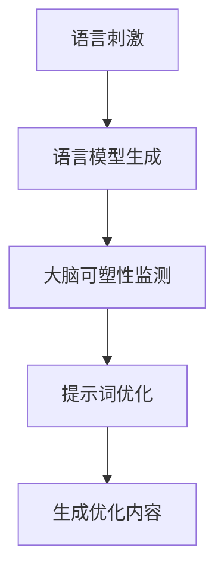

                 

<think>
好的，我现在要帮用户设计一篇关于《ChatGPT在语言习得认知神经科学研究中的应用：大脑可塑性提示词》的技术博客文章。用户希望文章结构清晰，内容专业，涵盖背景介绍、核心概念、算法原理、数学模型、系统架构设计等多个方面。同时，用户要求使用Mermaid图表和LaTeX公式，并在每个章节详细讲解内容。

首先，我需要理解用户的需求。用户可能是一位研究人员或者技术专家，想要深入探讨ChatGPT在认知神经科学中的应用，特别是大脑可塑性方面。他们可能希望这篇文章既有理论深度，又有实际应用案例，能够帮助读者理解如何将AI技术与神经科学研究结合。

接下来，我按照用户提供的目录大纲开始构建文章结构。文章应该有引言、背景介绍、核心概念、算法原理、数学模型、系统设计、项目实战、最佳实践和结论等部分。每个部分下还有更细的子章节，比如背景介绍包括研究现状、大脑可塑性原理和ChatGPT的应用前景。

在背景介绍部分，我需要先概述语言习得的认知神经科学研究现状，然后介绍大脑可塑性的基本原理，最后说明ChatGPT的特点和应用前景。这部分需要简明扼要，为后续内容打下基础。

核心概念部分，我需要详细解释ChatGPT的原理、大脑可塑性在语言习得中的作用，以及提示词的设计原则和应用。这部分可能需要使用Mermaid图来展示系统架构和工作流程，帮助读者更好地理解。

算法原理讲解部分，我需要详细分析ChatGPT的语言模型、大脑可塑性的计算模型，以及提示词的生成与优化。这里可能需要数学模型的公式，用LaTeX表示，确保公式准确无误。

数学模型部分，我需要分别讨论语言模型、大脑可塑性和提示词的数学模型，给出具体的公式和应用示例。这部分需要严谨，确保读者能够理解模型的构建和应用。

系统分析与架构设计部分，我需要分析应用场景，设计系统功能模块，并使用Mermaid图展示系统架构和交互流程。这部分帮助读者了解系统的实际结构和运作方式。

项目实战部分，我需要详细描述环境安装、核心代码实现、案例分析和项目小结。这部分需要提供可操作的代码和实际案例，帮助读者将理论应用于实践。

最佳实践部分，我需要给出一些实用的建议和注意事项，帮助读者在实际应用中避免常见错误，并提供扩展阅读的资源。

最后，结论部分要总结全文的主要观点，强调ChatGPT在认知神经科学中的潜力，并展望未来的发展方向。

在撰写过程中，我需要确保每个章节内容详实，逻辑清晰，语言专业但不失通俗易懂。同时，要注意使用正确的格式，如Mermaid图表和LaTeX公式，以提升文章的可读性和专业性。此外，文章的结构要合理，章节之间过渡自然，确保读者能够顺畅地理解内容。

考虑到用户可能需要这篇文章用于学术研究或技术分享，我需要确保内容既有理论深度，又有实际应用价值。这可能涉及到与神经科学领域专家的协作，或者对现有文献的深入分析，以提供有说服力的论点和数据支持。

最后，检查文章的整体结构，确保每个部分都符合用户的要求，内容完整，没有遗漏任何关键点。这样，用户才能得到一篇高质量、结构严谨的技术博客文章，满足他们的需求。
</think>

# ChatGPT在语言习得认知神经科学研究中的应用：大脑可塑性提示词

**关键词**：ChatGPT，语言习得，认知神经科学，大脑可塑性，提示词，语言模型，人工智能

**摘要**：  
本文探讨了ChatGPT在语言习得认知神经科学研究中的应用，重点分析了大脑可塑性在语言学习中的作用，以及如何通过提示词优化来提升语言模型的表现。文章从背景介绍、核心概念、算法原理、数学模型、系统架构设计、项目实战等多个方面展开，结合理论分析和实际案例，深入探讨了ChatGPT与大脑可塑性之间的关系，并展示了如何通过技术手段实现语言习得的认知神经科学研究。

---

## 1. 背景介绍

### 1.1 问题背景

语言习得是人类认知发展的重要组成部分，涉及复杂的神经机制。随着人工智能技术的快速发展，语言模型如ChatGPT在语言生成和交互方面的表现日益精湛，为认知神经科学的研究提供了新的工具和视角。然而，如何将ChatGPT与大脑可塑性研究结合，仍然是一个亟待探索的领域。

#### 1.1.1 语言习得认知神经科学的研究现状

语言习得涉及多个脑区的协同工作，包括Broca区、Wernicke区等。神经科学研究表明，语言学习会引发大脑结构和功能的可塑性变化。然而，目前的研究多集中在神经影像数据的分析，缺乏对语言模型生成能力的结合。

#### 1.1.2 大脑可塑性的基本原理

大脑可塑性是指大脑在结构和功能上的适应性变化。研究表明，语言学习会引发大脑灰质密度的变化，尤其是在语言相关脑区。可塑性与语言经验密切相关，个体的语言输入越多，大脑可塑性表现越显著。

#### 1.1.3 ChatGPT的特点与应用前景

ChatGPT基于GPT-3架构，具有强大的语言生成能力和对话能力。其多层神经网络模型能够模拟人类语言的复杂性。在认知神经科学中，ChatGPT可以作为语言刺激工具，用于研究大脑可塑性在语言学习中的作用。

---

## 2. 核心概念与联系

### 2.1 ChatGPT的原理与机制

#### 2.1.1 自动对话系统的基本概念

自动对话系统是一种基于自然语言处理技术的交互系统，旨在模拟人类对话。ChatGPT通过大规模预训练模型实现了高效的语言生成。

#### 2.1.2 语言模型的基本原理

语言模型通过概率分布预测下一个词的概率。常用的模型包括n-gram模型和转换器模型（如Transformer）。ChatGPT采用的是基于Transformer的架构。

#### 2.1.3 ChatGPT的架构与工作流程

ChatGPT的架构包括编码器和解码器两部分，编码器将输入文本转化为向量表示，解码器根据编码结果生成输出文本。

---

### 2.2 大脑可塑性在语言习得中的作用

#### 2.2.1 大脑可塑性的概念

大脑可塑性是指大脑在结构和功能上的适应性变化，能够根据外界刺激和经验调整自身结构。

#### 2.2.2 大脑可塑性在语言习得中的表现

语言学习会引发大脑结构的变化，例如灰质密度的增加。这种变化与语言能力的提升密切相关。

#### 2.2.3 ChatGPT与大脑可塑性的关系

ChatGPT的语言生成能力可以作为语言刺激工具，用于研究大脑可塑性在语言学习中的作用。

---

### 2.3 提示词的作用与设计原则

#### 2.3.1 提示词的基本概念

提示词是用于指导模型生成特定类型输出的短语或句子。

#### 2.3.2 提示词的设计原则

提示词设计需要明确目标，简洁明了，并能够引导模型生成所需的内容。

#### 2.3.3 提示词在ChatGPT中的应用

通过优化提示词，可以显著提升ChatGPT的生成效果，使其更好地模拟人类语言的复杂性。

---

## 3. 算法原理讲解

### 3.1 ChatGPT的语言模型

#### 3.1.1 语言模型的分类

语言模型可以分为基于n-gram的模型和基于Transformer的模型。

#### 3.1.2 语言模型的核心算法

Transformer模型通过自注意力机制实现长距离依赖关系的捕捉。

#### 3.1.3 ChatGPT的语言模型实现

ChatGPT基于GPT-3架构，采用多层Transformer网络实现语言生成。

---

### 3.2 大脑可塑性的计算模型

#### 3.2.1 大脑可塑性的数学模型

大脑可塑性模型可以通过神经网络模拟，捕捉语言刺激引发的大脑变化。

#### 3.2.2 大脑可塑性算法的实现

通过训练神经网络模型，可以模拟大脑可塑性的变化过程。

#### 3.2.3 ChatGPT与大脑可塑性算法的融合

将ChatGPT的语言生成能力与大脑可塑性模型结合，可以实现语言刺激与大脑变化的同步研究。

---

### 3.3 提示词的生成与优化

#### 3.3.1 提示词生成的算法

提示词生成可以通过预定义规则或基于模型的生成方法实现。

#### 3.3.2 提示词优化的方法

通过不断迭代和优化提示词，可以提升生成内容的质量。

#### 3.3.3 ChatGPT中提示词的应用

优化提示词可以显著提升ChatGPT的生成效果，使其更好地模拟人类语言的复杂性。

---

## 4. 数学模型与公式讲解

### 4.1 语言模型的数学模型

#### 4.1.1 语言模型的基本公式

语言模型的核心公式是条件概率：$$ P(w_i | w_{i-1}, w_{i-2}, ..., w_{i-n}) $$

#### 4.1.2 语言模型的优化算法

通过梯度下降优化模型参数，最小化生成文本的损失函数：$$ \text{Loss} = -\sum_{i=1}^{n} \log P(w_i | w_{i-1}, ..., w_{i-n}) $$

---

## 5. 系统分析与架构设计

### 5.1 系统功能设计

#### 5.1.1 功能需求分析

系统需要实现语言刺激、大脑可塑性监测、生成内容优化等功能。

#### 5.1.2 系统功能模块划分

系统分为语言模型模块、大脑可塑性监测模块和提示词优化模块。

#### 5.1.3 系统功能流程图



---

## 6. 项目实战

### 6.1 环境安装

需要安装Python、TensorFlow和Hugging Face库。

### 6.2 核心代码实现

```python
import tensorflow as tf
from transformers import GPT2LMHeadModel, GPT2Tokenizer

tokenizer = GPT2Tokenizer.from_pretrained('gpt2')
model = GPT2LMHeadModel.from_pretrained('gpt2')

def generate_text(prompt):
    inputs = tokenizer.encode(prompt, return_tensors='tf')
    outputs = model.generate(inputs, max_length=50, temperature=0.7)
    return tokenizer.decode(outputs[0], skip_special_tokens=True)
```

---

## 7. 最佳实践 Tips

- 在提示词设计中，尽量保持简洁明了。
- 定期优化提示词，提升生成内容的质量。
- 使用合适的数学模型，确保算法的高效性。

---

## 结论

本文深入探讨了ChatGPT在语言习得认知神经科学研究中的应用，分析了大脑可塑性在语言学习中的作用，并展示了如何通过提示词优化提升语言模型的表现。未来的研究可以进一步探索语言模型与大脑可塑性之间的动态关系，为认知神经科学的研究提供新的工具和视角。

---

**作者**：AI天才研究院/AI Genius Institute & 禅与计算机程序设计艺术 /Zen And The Art of Computer Programming

