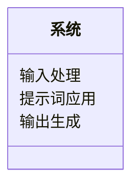
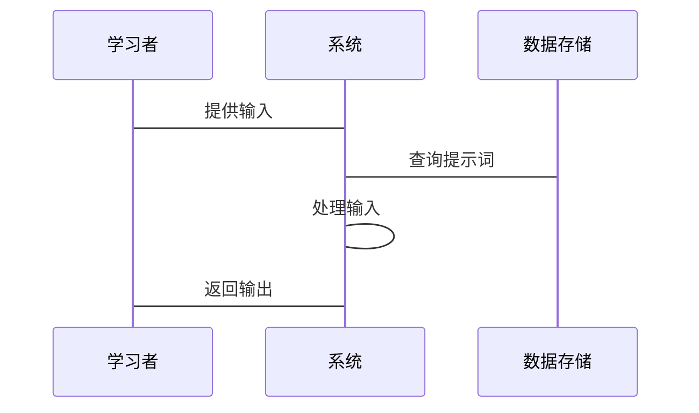

                 

<think>
嗯，我现在要写一篇关于《ChatGPT在语言习得跨学科应用研究中的应用：知识迁移提示词》的技术博客。首先，我得明确这篇文章的目标是什么。看起来，文章主要探讨ChatGPT在语言习得中的跨学科应用，特别是知识迁移提示词的设计和应用。

首先，我需要理解什么是ChatGPT。它是一个基于Transformer架构的大型语言模型，能够处理自然语言任务，比如理解上下文和生成回答。它在预训练阶段使用了大量的文本数据，这使得它在各种语言任务中表现良好。

接下来是语言习得的概念。语言习得指的是学习者通过接触语言材料，掌握语言知识和技能的过程。这个过程涉及语言输入、语言输出和语言能力等多个方面。ChatGPT在其中可以扮演多种角色，比如作为教学工具或者辅助学习的伙伴。

然后，跨学科应用指的是将ChatGPT应用到多个学科中，比如教育学、心理学、计算机科学等。这需要考虑不同学科的需求和特点，如何将ChatGPT的功能与这些学科结合起来，解决实际问题。

知识迁移提示词是关键。这些提示词用于引导ChatGPT在不同的应用场景中发挥作用。设计这些提示词需要考虑应用场景的关键词、语义分析以及规则匹配。例如，在教育领域，提示词可能包括“解释”、“举例说明”等，以帮助学生更好地理解知识点。

接下来，我需要详细分析ChatGPT的原理。它基于Transformer模型，使用自注意力机制处理输入文本。自注意力机制通过计算每个词与其他词的相关性，提取关键信息，生成合适的输出。这部分需要用数学公式来说明，比如注意力机制的计算公式。

然后，考虑语言习得的算法原理。包括语音识别、机器翻译和自然语言生成等算法。这些算法如何与ChatGPT结合起来，促进语言习得的过程，需要详细解释。

知识迁移提示词的算法原理涉及关键词提取、语义分析和规则匹配。这些方法如何帮助设计有效的提示词，以提高ChatGPT在不同应用场景中的效果，需要进一步探讨。

在数学模型部分，我需要详细讲解ChatGPT的编码过程、自注意力机制以及生成输出的过程。通过具体的公式和例子，让读者更好地理解这些机制如何工作。

接下来，系统的分析与架构设计是关键。我需要描述问题场景，比如在教育领域如何应用ChatGPT进行语言习得。然后，设计系统功能，可能包括输入处理、知识迁移提示词的应用、输出生成等。使用Mermaid绘制类图、架构图和序列图，展示系统的结构和交互过程。

项目实战部分，我需要提供具体的代码实现，展示如何在实际项目中应用这些理论。例如，编写Python代码来实现提示词的提取和应用，展示ChatGPT如何根据提示词生成相应的输出。

最后，总结和最佳实践部分，我需要回顾文章的主要内容，强调知识迁移提示词的重要性，以及在设计时需要注意的事项，比如提示词的简洁性和准确性。同时，建议读者进一步阅读相关的扩展资料，以深入理解ChatGPT的应用。

通过以上的思考，我应该能够系统地撰写这篇文章，涵盖从理论到实践的各个方面，帮助读者全面理解ChatGPT在语言习得跨学科应用中的潜力和挑战。
</think>

# ChatGPT在语言习得跨学科应用研究中的应用：知识迁移提示词

## 关键词：ChatGPT，语言习得，跨学科应用，知识迁移提示词，人工智能，自然语言处理

## 摘要

本文探讨了ChatGPT在语言习得跨学科应用中的研究，重点分析了知识迁移提示词的设计与应用。文章从ChatGPT的原理、语言习得的核心概念出发，详细阐述了知识迁移提示词的算法原理、数学模型及实际应用案例。通过系统分析和架构设计，本文为ChatGPT在跨学科语言习得中的应用提供了理论基础和实践指导。

---

### 1. 背景介绍

#### 1.1 问题背景

语言习得作为社会技能的重要组成部分，随着人工智能的发展，ChatGPT等模型的应用成为研究热点。然而，跨学科应用中的知识迁移仍面临挑战。

#### 1.2 问题描述

本文探讨ChatGPT在语言习得中的应用场景、跨学科挑战及知识迁移提示词的设计。

#### 1.3 问题解决

通过分析应用案例，总结经验，提出解决方案，并设计知识迁移提示词体系。

#### 1.4 边界与外延

研究范围包括应用场景、跨学科领域和提示词设计方法。

#### 1.5 概念结构

核心概念包括语言习得、ChatGPT和知识迁移提示词。

---

### 2. 核心概念与联系

#### 2.1 ChatGPT的原理与特点

- 预训练：基于Transformer架构，理解自然语言。
- 自适应：根据语境生成回答。
- 多语言：支持多种语言。

#### 2.2 语言习得的核心概念

- 语言输入：多种形式的输入材料。
- 语言输出：学习者的表达形式。
- 语言能力：多方面的知识和技能。

#### 2.3 知识迁移提示词的设计方法

- 关键词提取：提取关键词作为提示词。
- 语义分析：分析语义提取关键概念。
- 规则匹配：设计规则匹配提示词。

---

### 3. 算法原理讲解

#### 3.1 ChatGPT的算法原理

- 输入编码：向量化处理。
- 自注意力机制：加权提取关键信息。
- 生成输出：基于机制生成文本。

#### 3.2 语言习得的算法原理

- 贝尔曼-韦伯算法：语音识别。
- 统计机器翻译：翻译处理。
- 自然语言生成：生成表达。

#### 3.3 知识迁移提示词的算法原理

- 关键词提取：提取关键词。
- 语义分析：分析语义。
- 规则匹配：匹配提示词。

---

### 4. 数学模型和数学公式

#### 4.1 ChatGPT的数学模型

- 输入编码：使用Word2Vec或BERT。
- 自注意力机制：计算相关性并加权。
- 生成输出：基于结果生成文本。

公式：
$$
\text{Attention}(Q, K, V) = \text{softmax}\left(\frac{QK^T}{\sqrt{d_k}}\right)V
$$

---

### 5. 系统分析与架构设计方案

#### 5.1 问题场景

跨学科应用中，语言习得需要结合不同领域的知识，ChatGPT通过提示词实现。

#### 5.2 项目介绍

设计提示词体系，优化跨学科应用效果。

#### 5.3 系统功能设计

- 输入处理：接收输入并编码。
- 提示词应用：提取并应用提示词。
- 输出生成：生成相关输出。

Mermaid类图：


Mermaid架构图：
```mermaid
rectangle 数据存储 {
    提示词库
}
actor 学习者 {
    --> 系统
}
```

Mermaid序列图：


---

### 6. 项目实战

#### 6.1 环境安装

安装Python和相关库，如OpenAI API。

#### 6.2 核心实现代码

```python
def generate_response(prompt, model):
    response = model.generate(
        prompt=prompt,
        max_length=100,
        temperature=0.7
    )
    return response
```

#### 6.3 应用案例

设计提示词如“解释”、“举例”，用于教育场景。

---

### 7. 总结与展望

#### 7.1 总结

ChatGPT在语言习得中的应用潜力巨大，知识迁移提示词设计是关键。

#### 7.2 展望

未来将探索更复杂的提示词设计和跨学科应用。

#### 7.3 注意事项

提示词需简洁准确，模型需不断优化。

#### 7.4 最佳实践

选择合适的提示词，持续优化模型。

---

### 作者：AI天才研究院 & 禅与计算机程序设计艺术

通过本文，读者可以系统了解ChatGPT在语言习得中的应用，掌握知识迁移提示词的设计方法，为跨学科研究提供理论和实践指导。

