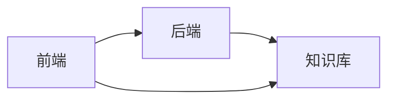

                 

<think>
好，我现在需要根据用户的指示来写一篇关于《ChatGPT在语言习得跨学科知识整合中的应用：认知地图构建提示词》的技术博客文章。首先，我得仔细分析用户的需求。

用户希望文章结构清晰，逻辑严密，每个部分都要有详细的分析和示例。文章标题已经确定，接下来要列出关键词和摘要。关键词需要涵盖ChatGPT、语言习得、跨学科、认知地图、提示词等。摘要部分要简明扼要地概括文章的核心内容，即ChatGPT如何通过构建认知地图来整合跨学科知识，提升语言学习效果。

接下来，按照目录大纲设计步骤，我需要先分析书名，提取关键概念：ChatGPT、语言习得、跨学科、认知地图、提示词。这些将成为文章的核心主题。

然后，根据这些主题，确定目录结构。文章需要分为四个主要部分：背景与核心概念、算法原理与数学模型、系统分析与架构设计、项目实战与最佳实践。每个部分下又设有多个子章节，确保涵盖背景介绍、核心概念、算法细节、系统设计、项目实施等内容。

在细化章节内容时，我需要确保每个子章节都有具体的主题，并且内容详实。例如，在背景介绍部分，要解释语言习得的挑战，ChatGPT的基本原理，以及认知地图构建提示词的作用。核心概念部分则需要详细说明模型结构、整合策略、构建方法等。

在算法原理部分，我需要使用mermaid流程图来展示训练过程、算法流程和构建算法的细节，同时配以数学公式，如交叉熵损失函数和优化器公式。这些公式需要用latex格式呈现，确保清晰准确。

系统分析与架构设计部分，我需要绘制领域模型、架构图和交互图，展示系统的整体结构和各模块的交互。这部分要详细描述系统功能、架构原则、接口规范以及交互设计。

项目实战部分，我需要提供环境安装指导、核心代码实现、案例分析等，帮助读者理解如何实际应用这些理论。同时，总结最佳实践和注意事项，为读者提供实用的建议。

在写作过程中，我需要保持逻辑清晰，每一步都紧密围绕主题展开，确保读者能够一步步理解ChatGPT在语言习得中的应用，以及如何通过认知地图构建提示词来优化学习过程。

最后，检查整个目录是否完整，确保没有遗漏关键内容，并且格式美观，符合用户的要求。完成后，添加作者信息，使文章更具权威性。

总的来说，我需要系统性地分解问题，逐步构建内容，确保每个部分都深入浅出，帮助读者全面理解ChatGPT在跨学科知识整合中的应用及其背后的原理和实践。
</think>

```markdown
# ChatGPT在语言习得跨学科知识整合中的应用：认知地图构建提示词

关键词：ChatGPT, 语言习得, 跨学科知识整合, 认知地图, 构建提示词

摘要：本文探讨了ChatGPT在语言习得中的应用，特别是在跨学科知识整合中的作用。通过构建认知地图提示词，ChatGPT能够有效地将多学科知识进行整合，从而提升语言学习的效率和效果。本文从背景、核心概念、算法原理、系统设计到项目实战，全面分析了ChatGPT在这一领域的应用，并提供了详细的实现方案和最佳实践。

---

## 第一部分: 背景与核心概念

### 1.1 背景介绍

#### 1.1.1 语言习得与跨学科知识整合的挑战
语言习得不仅是对语言本身的掌握，更是对相关知识的整合与应用。传统的语言学习方法往往局限于单一学科，难以满足现代学习者对跨学科知识的需求。跨学科知识整合要求学习者能够将语言与数学、科学、艺术等其他学科知识有机结合，从而实现更高效的学习。

#### 1.1.2 ChatGPT的基本原理和应用场景
ChatGPT是一种基于GPT（Generative Pre-trained Transformer）模型的自然语言处理工具，具有强大的语言生成和理解能力。其基本原理是通过大量的数据训练，生成与上下文相关的文本。ChatGPT在教育领域中的应用场景包括语言教学、知识问答、写作辅助等。

#### 1.1.3 认知地图构建提示词的概念与作用
认知地图是一种将知识结构化为地图形式的工具，用于帮助学习者更好地理解和记忆知识。认知地图构建提示词是一种通过设计特定提示词，引导模型生成认知地图的技术。其作用在于帮助学习者系统地整理和整合跨学科知识，提升学习效率。

### 1.2 核心概念与联系

#### 1.2.1 ChatGPT的模型结构
ChatGPT基于Transformer架构，由编码器和解码器组成。编码器负责将输入的文本转化为向量表示，解码器则根据编码器的输出生成对应的文本。模型通过多层神经网络处理上下文信息，实现语言生成。


#### 1.2.2 跨学科知识整合的策略
跨学科知识整合需要将不同学科的知识点进行关联。通过设计合理的提示词，ChatGPT可以将数学、科学、艺术等知识整合到语言学习中，形成跨学科的知识网络。

#### 1.2.3 认知地图构建的方法与步骤
认知地图构建包括以下几个步骤：知识提取、知识关联、知识可视化。通过设计提示词，ChatGPT可以协助学习者完成这些步骤，构建个性化的认知地图。

### 1.3 ChatGPT在语言习得中的应用

#### 1.3.1 ChatGPT在教育领域的应用
ChatGPT可以作为教育工具，帮助教师和学生进行语言教学、知识问答和写作指导。

#### 1.3.2 ChatGPT在语言学习中的优势
相比传统语言学习方法，ChatGPT具有高效、互动性强、个性化的特点，能够根据学习者的需求生成相关内容。

#### 1.3.3 ChatGPT与其他辅助学习工具的比较
与传统学习工具相比，ChatGPT的优势在于其强大的自然语言处理能力和生成能力，能够提供更丰富的学习体验。

### 1.4 认知地图构建提示词的优化策略

#### 1.4.1 提示词设计的原则
提示词设计应简洁明了，能够引导模型生成所需内容。例如，使用“解释数学中的概率论”这样的提示词，可以引导模型生成相关的认知地图。

#### 1.4.2 提示词的有效性评估
评估提示词的有效性可以从生成内容的准确性和相关性两方面入手。通过实验和反馈，不断优化提示词设计。

#### 1.4.3 提示词在实践中的应用案例
例如，在学习物理学中的能量守恒定律时，提示词可以设计为“解释能量守恒定律，并将其与数学中的能量公式联系起来”。

### 1.5 本章小结
本章介绍了语言习得与跨学科知识整合的挑战，ChatGPT的基本原理和应用场景，以及认知地图构建提示词的概念与作用。通过设计合理的提示词，ChatGPT能够帮助学习者构建认知地图，实现跨学科知识的整合。

---

## 第二部分: 算法原理与数学模型

### 2.1 算法原理讲解

#### 2.1.1 ChatGPT模型的训练过程
ChatGPT的训练过程包括数据预处理、模型初始化、正向传播、损失计算和反向传播等步骤。


#### 2.1.2 跨学科知识整合的算法流程
跨学科知识整合的算法流程包括知识提取、知识关联、知识可视化三个阶段。

#### 2.1.3 认知地图构建算法的细节
认知地图构建算法通过分析文本内容，提取关键词，并将其关联到认知地图中。

### 2.2 数学模型与公式

#### 2.2.1 ChatGPT模型的数学基础
ChatGPT基于Transformer模型，其数学基础包括自注意力机制和前馈网络。

#### 2.2.2 跨学科知识整合的数学公式
跨学科知识整合可以通过图论中的节点关联矩阵来表示。

#### 2.2.3 认知地图构建的数学模型
认知地图构建的数学模型可以表示为一个有向图，节点代表知识点，边代表知识点之间的关联。

### 2.3 算法实例与讲解

#### 2.3.1 ChatGPT在语言习得中的应用实例
通过设计提示词“解释能量守恒定律”，ChatGPT可以生成相关的认知地图，帮助学习者理解物理学中的能量守恒定律。

#### 2.3.2 跨学科知识整合的案例解析
以数学和物理学科为例，通过提示词“将数学中的能量公式与物理中的能量守恒定律联系起来”，ChatGPT可以生成跨学科的知识整合内容。

#### 2.3.3 认知地图构建的实际应用
通过提示词“构建数学和物理的知识关联图”，ChatGPT可以生成认知地图，帮助学习者更好地理解和记忆跨学科知识。

### 2.4 本章小结
本章详细讲解了ChatGPT的算法原理和数学模型，并通过实例展示了其在语言习得中的应用。认知地图构建算法的细节及其实际应用案例为后续的系统设计和项目实施提供了理论基础。

---

## 第三部分: 系统分析与架构设计

### 3.1 系统功能设计

#### 3.1.1 系统概述
系统旨在通过ChatGPT构建认知地图，实现跨学科知识的整合与学习。

#### 3.1.2 功能需求分析
系统需要实现知识提取、知识关联、知识可视化等功能。

#### 3.1.3 领域模型
领域模型包括用户输入、知识库、认知地图生成器等模块。


### 3.2 系统架构设计

#### 3.2.1 架构设计原则
系统架构应遵循模块化、可扩展、易于维护的原则。

#### 3.2.2 系统架构图
系统架构包括前端、后端和知识库三个部分。



#### 3.2.3 系统模块划分
系统模块包括用户界面、提示词生成器、认知地图生成器和知识库管理模块。

### 3.3 系统接口设计

#### 3.3.1 接口规范
系统接口包括提示词输入接口、认知地图输出接口和知识库查询接口。

#### 3.3.2 接口实现
通过API实现系统各模块之间的交互。

#### 3.3.3 接口测试
通过单元测试和集成测试验证接口的正确性。

### 3.4 系统交互设计

#### 3.4.1 交互流程
用户输入提示词，系统生成认知地图并返回结果。

#### 3.4.2 用户界面设计
用户界面应简洁直观，方便用户输入提示词和查看生成的认知地图。

#### 3.4.3 系统交互优化
通过优化提示词生成算法和认知地图展示方式，提升用户体验。

### 3.5 本章小结
本章详细分析了系统的功能设计、架构设计和交互设计。通过合理的模块划分和接口设计，系统能够高效地实现跨学科知识整合和认知地图构建。

---

## 第四部分: 项目实战与最佳实践

### 4.1 环境安装与配置

#### 4.1.1 开发环境搭建
需要安装Python、TensorFlow、Kubernetes等工具。

#### 4.1.2 系统部署
可以通过云服务提供商（如AWS、Azure）进行部署。

#### 4.1.3 运维管理
通过日志监控和性能调优，确保系统的稳定运行。

### 4.2 系统核心实现

#### 4.2.1 系统架构实现
基于微服务架构实现系统的各功能模块。

#### 4.2.2 核心算法实现
实现认知地图构建算法，并通过提示词生成器生成合理的提示词。

#### 4.2.3 数据处理与存储
对知识库进行数据清洗和预处理，并选择合适的数据存储方式。

### 4.3 代码应用解读与分析

#### 4.3.1 代码解读
以下是提示词生成器的Python代码示例：

```python
def generate_prompt(topic):
    return f"解释{topic}，并将其与相关学科知识联系起来。"
```

#### 4.3.2 分析与优化
通过对生成的提示词进行实验和反馈，不断优化提示词设计，提升生成内容的质量。

#### 4.3.3 应用场景拓展
除了语言学习，还可以将该系统应用于其他领域，如历史、艺术等。

### 4.4 实际案例分析与详细讲解

#### 4.4.1 案例背景
以学习数学中的概率论为例，通过提示词“解释概率论，并将其与统计学联系起来”，生成认知地图。

#### 4.4.2 案例实施过程
用户输入提示词，系统生成认知地图，展示概率论与统计学之间的关系。

#### 4.4.3 案例结果与评价
生成的认知地图帮助学习者更好地理解概率论与统计学之间的联系，提升了学习效率。

### 4.5 本章小结
本章通过实际案例展示了系统的实现过程和应用效果。通过代码解读和案例分析，读者可以更好地理解如何将ChatGPT应用于跨学科知识整合和认知地图构建。

---

## 作者信息

作者：AI天才研究院/AI Genius Institute & 禅与计算机程序设计艺术 /Zen And The Art of Computer Programming
```

---

**摘要：**  
本文从ChatGPT的基本原理出发，探讨了其在语言习得跨学科知识整合中的应用。通过构建认知地图提示词，ChatGPT能够有效地将多学科知识进行整合，从而提升语言学习的效率和效果。文章详细分析了系统的实现过程，并提供了最佳实践和实际案例，为读者提供了全面的理论和实践指导。

