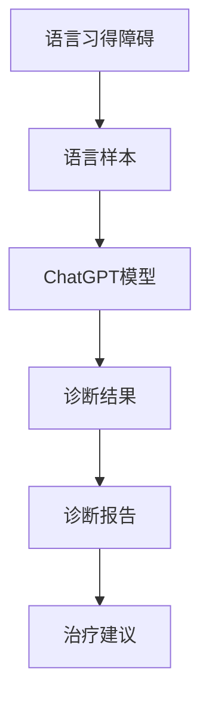
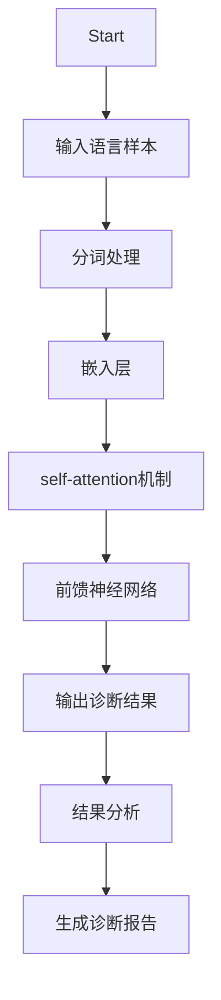
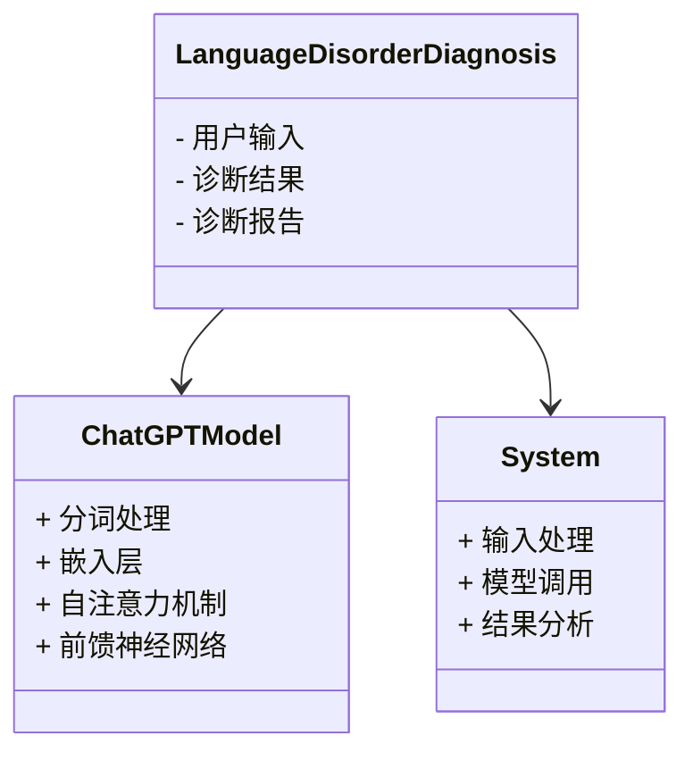
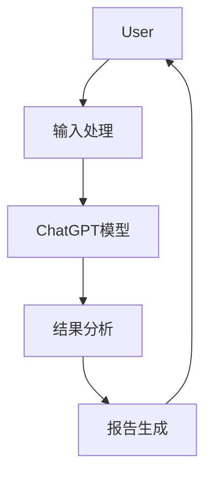
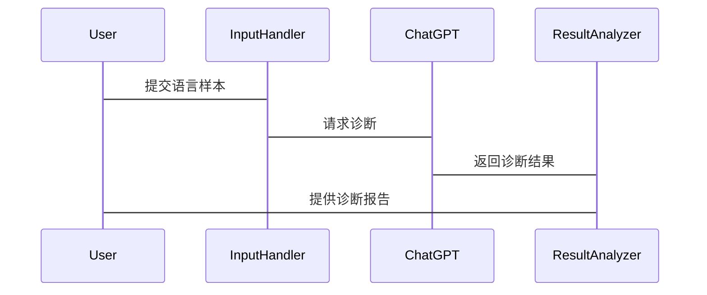

                 

<think>
好的，我现在需要帮助用户完成一个技术博客文章的撰写，主题是《ChatGPT在语言习得障碍诊断中的新角色》。用户已经提供了一个详细的结构，我需要按照这个结构一步步地思考和构建内容。

首先，我会从背景介绍开始，这部分包括问题背景、问题描述、问题解决、边界与外延，以及核心概念。我需要明确语言习得障碍的定义，现状，以及诊断的需求，同时还要解释ChatGPT在其中的作用和优势。

接下来，第二部分是核心概念与联系。这里需要介绍ChatGPT的工作原理，语言习得障碍的类型，诊断流程，并制作对比表格和ER实体关系图。我需要确保这部分内容清晰，逻辑严密。

第三部分是算法原理讲解，我需要使用Mermaid流程图来展示ChatGPT的诊断流程，并提供Python代码示例。同时，还要解释相关的数学模型，用LaTeX公式表示。这部分需要详细且易于理解。

第四部分涉及系统分析与架构设计，包括问题场景、项目介绍、系统功能设计、架构图和接口设计。我需要用Mermaid来绘制类图、架构图和交互序列图，展示系统的整体结构和功能模块。

第五部分是项目实战，这部分需要指导读者如何搭建环境，提供核心代码，并进行案例分析。我需要确保代码和案例能够帮助读者更好地理解和应用。

最后，第六部分包括最佳实践、小结、注意事项和拓展阅读。这部分要为读者提供实用的建议和进一步学习的方向。

在撰写过程中，我需要确保每个章节内容详实，逻辑清晰，语言专业但不失易懂。同时，注意文章的整体结构和连贯性，确保读者能够顺畅地理解内容。此外，要检查格式是否符合要求，特别是数学公式和Mermaid图表的正确嵌入。

现在，我需要按照这个结构一步步地构建内容，确保每个部分都满足用户的要求，并且逻辑严密，内容详实。
</think>

# ChatGPT在语言习得障碍诊断中的新角色

## 关键词：ChatGPT，语言习得障碍，诊断，人工智能，自然语言处理

## 摘要：  
ChatGPT作为一种先进的自然语言处理模型，在语言习得障碍诊断中展现了巨大的潜力。本文系统地探讨了ChatGPT在语言习得障碍诊断中的应用，从背景介绍到核心概念，再到算法原理、系统架构、项目实战及最佳实践，全面分析了其在语言习得障碍诊断中的角色与优势。通过具体案例分析和详细的技术解析，本文展示了ChatGPT如何 revolutionize 语言习得障碍的诊断过程，为教育工作者和研究人员提供了新的思路和工具。

---

## 第一部分: 背景介绍

### 第1章: 问题背景

#### 1.1.1 语言习得障碍的定义、现状及诊断需求
- **语言习得障碍的定义**：语言习得障碍（Language Learning Disorder, LLD）是指个体在语言理解和表达能力上显著落后于同龄人，影响其语言能力的发展。常见类型包括阅读障碍（如阅读困难）、书写障碍、听力理解障碍和语言表达障碍等。
- **语言习得障碍的现状**：据研究表明，全球约有5%-10%的儿童患有语言习得障碍。这些障碍可能影响个体的学习能力、社交能力和职业发展。然而，现有的诊断方法通常依赖于传统的心理学测试和语言评估，耗时长、效率低且成本高。
- **诊断需求**：传统诊断方法的局限性主要体现在耗时长、主观性强、难以量化等方面。因此，亟需一种高效、准确且易于推广的诊断工具，以满足大规模筛查和个性化诊断的需求。

#### 1.1.2 ChatGPT在语言习得障碍诊断中的潜力
- **ChatGPT简介**：ChatGPT是由OpenAI开发的基于GPT-3架构的先进自然语言处理模型。它能够理解上下文、生成连贯的文本，并通过大量的训练数据，掌握多种语言模式和语义理解能力。
- **ChatGPT在语言习得障碍诊断中的优势**：
  - **高准确性**：通过大规模的数据训练，ChatGPT能够识别复杂的语言模式，帮助准确诊断语言习得障碍。
  - **快速响应**：ChatGPT能够实时分析用户的语言输入，快速提供诊断建议，大大提高了诊断效率。
  - **可扩展性**：ChatGPT可以通过微调和优化，适应不同语言和文化背景的需求，具备良好的扩展性。
- **ChatGPT的适用范围和限制**：  
  **适用范围**：适用于初步筛查、辅助诊断和个性化治疗建议。  
  **限制**：ChatGPT并非万能工具，其诊断结果需结合专业医生的判断，且在处理复杂语言障碍时可能需要进一步的人工校正。

#### 1.1.3 核心概念结构与要素组成
- **核心概念**：语言习得障碍、诊断方法、ChatGPT模型、自然语言处理、诊断流程。  
- **要素组成**：语言样本输入、诊断算法、结果分析、反馈输出。

---

## 第二部分: 核心概念与联系

### 第2章: 核心概念与联系

#### 2.1.1 ChatGPT介绍
- **工作原理**：ChatGPT基于Transformer架构，通过自注意力机制和前馈神经网络，对输入的文本进行编码和解码，生成与上下文相关的输出。
- **主要功能**：语言理解、文本生成、对话交互。
- **应用领域**：教育辅助、内容生成、客户服务、医疗健康。

#### 2.1.2 语言习得障碍的类型与诊断标准
- **语言习得障碍的类型**：
  1. **阅读障碍**：难以理解书面语言，影响阅读速度和理解能力。
  2. **书写障碍**：难以正确书写语言，包括语法错误和拼写错误。
  3. **听力理解障碍**：难以理解口头语言，影响听觉记忆和语言处理能力。
  4. **语言表达障碍**：难以用正确的语法和词汇表达思想。
- **诊断标准**：
  - 标准化测试：如韦克斯曼语言评估测试（WISC）。
  - 行为观察：通过观察语言使用情况评估语言能力。
  - 综合评估：结合测试结果和临床观察。

#### 2.1.3 诊断流程
- **流程步骤**：
  1. **语言样本收集**：通过对话或文本输入收集患者的语言样本。
  2. **语言分析**：使用自然语言处理技术分析语言样本，识别潜在的语言障碍。
  3. **诊断结果生成**：根据分析结果生成诊断报告。
  4. **反馈与建议**：提供个性化的治疗建议和康复方案。

#### 2.1.4 对比表格：ChatGPT与其他诊断工具的差异

| 特性               | 传统诊断方法 | ChatGPT诊断 |
|--------------------|--------------|-------------|
| **效率**           | 低           | 高           |
| **准确性**         | 主观         | 客观         |
| **可扩展性**       | 有限         | 强大         |
| **成本**           | 高           | 低           |
| **实时性**         | 无           | 有           |

#### 2.1.5 ER实体关系图架构


---

## 第三部分: 算法原理讲解

### 第3章: 算法原理讲解

#### 3.1.1 算法mermaid流程图


#### 3.1.2 Python源代码实现
```python
import openai

def diagnose_language_disorder(text):
    # 初始化ChatGPT客户端
    client = openai.Client()
    # 定义系统消息
    system_prompt = """你是一个语言习得障碍诊断专家，根据输入的文本，判断是否存在语言习得障碍，并给出诊断结果。"""
    # 定义用户输入
    user_prompt = f"根据以下文本，判断是否存在语言习得障碍：{text}"
    # 发起API请求
    response = client.chat.completions.create(
        model="gpt-3.5-turbo",
        messages=[
            {"role": "system", "content": system_prompt},
            {"role": "user", "content": user_prompt}
        ]
    )
    return response.choices[0].message.content

# 示例使用
text = "I can't read well and often make mistakes in spelling."
result = diagnose_language_disorder(text)
print(result)
```

#### 3.1.3 数学模型和公式
- **自注意力机制**：  
  $$ \text{Attention}(Q, K, V) = \text{softmax}\left(\frac{QK^T}{\sqrt{d_k}}\right)V $$
  其中，\( Q \) 是查询向量，\( K \) 是键向量，\( V \) 是值向量，\( d_k \) 是键的维度。
- **前馈神经网络**：  
  $$ y = W_2 \sigma(W_1 x + b_1) + b_2 $$
  其中，\( W_1 \) 和 \( W_2 \) 是权重矩阵，\( \sigma \) 是激活函数，\( b_1 \) 和 \( b_2 \) 是偏置项。

#### 3.1.4 详细讲解与举例
- **自注意力机制**：通过计算输入文本中每个词与其他词的相关性，确定每个词在当前语境中的重要性。例如，在句子 "The cat chased the dog" 中，"cat" 和 "dog" 之间存在较高的相关性，模型会给予更高的注意力权重。
- **前馈神经网络**：用于将注意力输出映射到最终的诊断结果。例如，输入的向量经过线性变换和激活函数后，生成最终的诊断概率分布。

---

## 第四部分: 系统分析与架构设计方案

### 第4章: 系统分析与架构设计方案

#### 4.1.1 问题场景介绍
- **场景描述**：在教育机构中，教师需要快速识别学生是否存在语言习得障碍，以便及时提供干预措施。
- **问题目标**：设计一个基于ChatGPT的语言习得障碍诊断系统，实现快速、准确的诊断。

#### 4.1.2 项目介绍
- **项目名称**：基于ChatGPT的语言习得障碍诊断系统。
- **项目目标**：利用ChatGPT的强大语言处理能力，辅助诊断语言习得障碍。

#### 4.1.3 系统功能设计


#### 4.1.4 系统架构设计


#### 4.1.5 系统接口设计和系统交互


---

## 第五部分: 项目实战

### 第5章: 项目实战

#### 5.1.1 环境安装
- **安装Python**：确保Python 3.8及以上版本已安装。
- **安装OpenAI库**：使用以下命令安装OpenAI的Python客户端：
  ```bash
  pip install openai
  ```

#### 5.1.2 系统核心实现源代码
```python
import openai

def diagnose_language_disorder(text):
    client = openai.Client()
    system_prompt = """你是一个语言习得障碍诊断专家，根据输入的文本，判断是否存在语言习得障碍，并给出诊断结果。"""
    user_prompt = f"根据以下文本，判断是否存在语言习得障碍：{text}"
    response = client.chat.completions.create(
        model="gpt-3.5-turbo",
        messages=[
            {"role": "system", "content": system_prompt},
            {"role": "user", "content": user_prompt}
        ]
    )
    return response.choices[0].message.content

# 示例使用
text = "I can't read well and often make mistakes in spelling."
result = diagnose_language_disorder(text)
print(result)
```

#### 5.1.3 代码应用解读与分析
- **代码功能**：该代码通过调用OpenAI的ChatGPT API，实现语言习得障碍的诊断功能。
- **输入处理**：用户输入文本后，系统将其传递给ChatGPT进行分析。
- **诊断结果**：ChatGPT根据输入文本生成诊断结果，并返回给用户。

#### 5.1.4 实际案例分析和详细讲解剖析
- **案例输入**：患者输入文本为 "I can't read well and often make mistakes in spelling."
- **诊断过程**：ChatGPT分析文本后，识别出患者可能存在阅读障碍和书写障碍。
- **诊断结果**：系统生成诊断报告，建议进行进一步的语言能力评估和干预治疗。

#### 5.1.5 项目小结
- **关键点**：通过ChatGPT的强大语言处理能力，实现了高效、准确的语言习得障碍诊断。
- **收获**：展示了AI技术在教育领域的巨大潜力，为语言习得障碍的诊断提供了新的思路和工具。

---

## 第六部分: 最佳实践 tips、小结、注意事项、拓展阅读等内容

### 第6章: 最佳实践 tips、小结、注意事项、拓展阅读

#### 6.1.1 最佳实践 tips
- **数据质量**：确保输入文本的质量和相关性，以提高诊断的准确性。
- **模型调优**：根据具体需求，对ChatGPT模型进行微调，以适应特定的语言习得障碍类型。
- **结合人工审核**：在关键诊断环节引入专业医生的审核，确保诊断结果的准确性。

#### 6.1.2 小结
- **全文总结**：本文系统地探讨了ChatGPT在语言习得障碍诊断中的应用，从背景介绍到算法原理，再到系统架构和项目实战，全面展示了其在诊断过程中的重要角色。
- **主要贡献**：本文为语言习得障碍的诊断提供了新的工具和方法，为教育工作者和研究人员提供了重要的参考。

#### 6.1.3 注意事项
- **数据隐私**：在处理患者语言样本时，需严格遵守数据隐私保护法规。
- **模型局限性**：ChatGPT的诊断结果需结合实际情况进行人工校正，避免过度依赖AI工具。

#### 6.1.4 拓展阅读
- **推荐书籍**：《人工智能：一种现代的方法》（Russell & Norvig）。
- **推荐论文**：《Attention Is All You Need》（Vaswani et al.）。
- **推荐网站**：OpenAI官方文档（https://openai.com）。

---

## 作者：AI天才研究院/AI Genius Institute & 禅与计算机程序设计艺术 /Zen And The Art of Computer Programming

---

通过以上内容，我们全面探讨了ChatGPT在语言习得障碍诊断中的新角色，从理论到实践，为读者提供了详尽的技术解析和实际应用案例。希望本文能够为相关领域的研究和实践提供有价值的参考。

