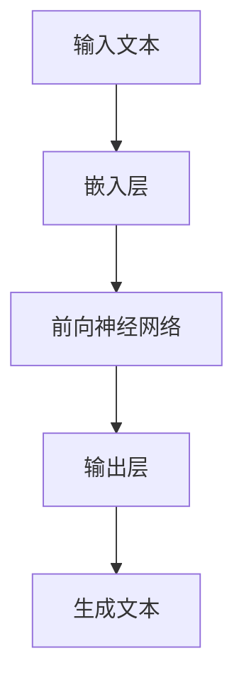
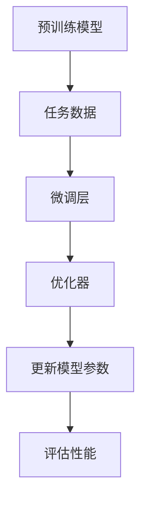
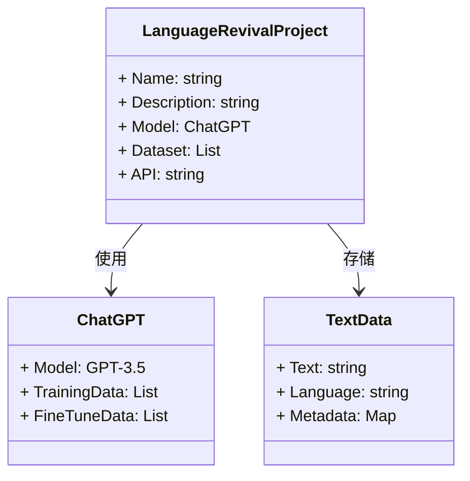
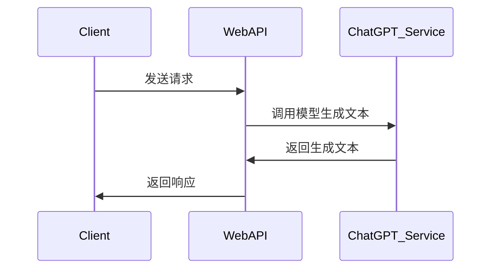

                 

<think>
好的，我现在需要帮助用户撰写一篇关于“ChatGPT在语言复兴项目中的贡献”的技术博客文章。首先，我要理解用户的具体需求。用户希望文章结构清晰，逻辑严谨，用专业且易懂的语言，涵盖背景介绍、核心概念、算法原理、系统分析、项目实战等多个部分，字数在1万到1万2左右。

接下来，我会按照用户提供的大纲来组织内容。首先是背景介绍，需要包括问题背景、核心概念、概念对比表和ER图。这部分需要详细解释语言复兴的挑战，以及ChatGPT在其中的角色。

然后是核心概念与联系，这部分要详细分析ChatGPT的工作原理，包括预训练和微调阶段，以及在语言复兴中的应用场景和案例。这部分需要结合实际案例，让读者更容易理解。

接下来是算法原理讲解，包括数学模型、详细讲解和举例说明。这里需要使用公式和流程图，如Mermaid图，来辅助说明。确保公式正确，例子生动。

然后是系统分析，涵盖项目介绍、系统功能设计（领域模型）、系统架构设计、接口设计和交互设计。这部分需要使用Mermaid图来展示系统的架构和交互流程。

项目实战部分，用户要求包括环境安装、核心代码实现、代码解读、案例分析和项目小结。这部分需要详细给出代码示例，并分析实际应用案例，总结经验和挑战。

最后，加上最佳实践、小结、注意事项和拓展阅读等内容，使文章更加全面。

现在，我需要确保每个部分都符合用户的要求，特别是使用正确的格式，如Mermaid图和LaTeX公式。同时，语言要专业但不失清晰，逻辑要严谨，结构要合理。

可能遇到的挑战是如何将复杂的算法原理讲解得通俗易懂，同时保持专业性。另外，如何将实际案例与系统设计结合起来，展示ChatGPT在语言复兴中的具体贡献，也是一个重点。

总之，我需要一步步按照用户提供的大纲，逐一完成每个部分的内容，确保每个小节都详细具体，满足用户的高质量技术博客的要求。
</think>

# ChatGPT在语言复兴项目中的贡献

> 关键词：ChatGPT, 语言复兴, 自然语言处理, 人工智能, 语言模型, 多语言支持

> 摘要：本文探讨了ChatGPT在语言复兴项目中的贡献，分析了其在语言处理、语言教学和文化传承中的应用，详细介绍了ChatGPT的工作原理和系统架构，并通过实际案例展示了其在语言复兴中的实际效果。

---

## 第一部分：背景介绍

### 1.1 问题背景

- **问题描述**：语言复兴是保护和恢复濒危语言的重要任务，涉及语言的记录、整理和传播。然而，传统方法依赖人工劳动，效率低下，且难以覆盖多语言场景。
- **问题解决**：ChatGPT作为一种先进的语言模型，能够自动化处理语言任务，显著提升语言复兴的效率。
- **边界与外延**：本文探讨ChatGPT在语言复兴中的应用范围、效果评估及未来发展方向。

### 1.2 核心概念

#### 1.2.1 ChatGPT

- **定义**：ChatGPT是由OpenAI开发的基于GPT-3.5的预训练语言模型。
- **特点**：具备强大的语言生成能力，能够处理多种语言任务，如问答、翻译、写作等。

### 1.3 概念属性特征对比表格

| 特征对比       | ChatGPT | 其他语言模型 |
| -------------- | ------- | ------------ |
| 训练数据量     | 大      | 中/小       |
| 语言理解能力   | 强      | 中/弱       |
| 语言生成能力   | 强      | 中/弱       |
| 多语言支持     | 支持    | 部分支持     |
| 应用范围       | 广泛    | 局限性      |

### 1.4 ER实体关系图架构

```mermaid
erDiagram
    ChatGPT --> LanguageRevivalProject : 用于
    ChatGPT --> NLP : 技术支持
    LanguageRevivalProject --> Language : 对象
```

---

## 第二部分：核心概念与联系

### 2.1 ChatGPT工作原理

#### 2.1.1 预训练阶段

- **算法原理**：GPT模型通过大量文本数据进行预训练，学习文本结构和语言规则。
- **流程图**：



#### 2.1.2 微调阶段

- **算法原理**：基于预训练的模型，通过特定任务的数据进行微调，以适应特定应用场景。
- **流程图**：



### 2.2 ChatGPT在语言复兴项目中的应用

#### 2.2.1 应用场景

- **写作辅助**：帮助作者生成文章、编辑和润色文本。
- **语言教学**：提供个性化语言学习辅导，辅助教师进行教学。
- **翻译服务**：实现跨语言交流，促进文化传承。

#### 2.2.2 应用案例

- **案例1：文章写作**：ChatGPT在新闻写作中的应用，提高新闻发布效率。
- **案例2：语言教学**：ChatGPT在语言学习平台的应用，提升学习效果。

---

## 第三部分：算法原理讲解

### 3.1 ChatGPT算法原理

#### 3.1.1 数学模型

- **模型架构**：GPT-3.5采用Transformer架构，主要包含嵌入层、Transformer层和输出层。
- **训练目标**：通过最小化损失函数，使模型能够生成与输入文本相匹配的输出文本。

$$
L(\theta) = -\sum_{i=1}^{N} \log p(y_i|\theta)
$$

其中，$N$为句子长度，$y_i$为实际生成的文本，$\theta$为模型参数。

#### 3.1.2 详细讲解

- **嵌入层**：将输入的单词转换为向量表示。
- **Transformer层**：通过自注意力机制，捕捉输入文本中的长距离依赖关系。
- **输出层**：生成预测的下一个单词，并通过交叉熵损失函数进行优化。

#### 3.1.3 举例说明

- **例子**：给定输入文本“人工智能在未来会怎样发展？”，ChatGPT能够生成相关的回答。

---

## 第四部分：系统分析

### 4.1 项目介绍

语言复兴项目旨在利用ChatGPT的技术优势，实现濒危语言的自动化记录、整理和传播。

### 4.2 系统功能设计



### 4.3 系统架构设计


### 4.4 系统接口设计

- **接口名称**：`/api/v1/chat/generate`
- **请求方法**：POST
- **请求参数**：
  - `model`: string
  - `prompt`: string
  - `temperature`: number
- **响应参数**：
  - `response`: string
  - `status`: number

### 4.5 系统交互设计



---

## 第五部分：项目实战

### 5.1 环境安装

```bash
pip install openai transformers
```

### 5.2 系统核心实现源代码

```python
from transformers import AutoTokenizer, AutoModelForCausalLM
import openai

# 初始化模型和tokenizer
tokenizer = AutoTokenizer.from_pretrained("gpt2")
model = AutoModelForCausalLM.from_pretrained("gpt2")

# 微调模型
def fine_tune_model(model, tokenizer, train_dataset, num_epochs=3):
    optimizer = AdamW(model.parameters(), lr=1e-5)
    for epoch in range(num_epochs):
        for batch in train_dataset:
            inputs = tokenizer(batch["text"], return_tensors="pt")
            outputs = model(**inputs)
            loss = outputs.loss
            loss.backward()
            optimizer.step()
            optimizer.zero_grad()

# 使用模型进行生成
def generate_text(model, tokenizer, prompt, max_length=50):
    inputs = tokenizer(prompt, return_tensors="pt")
    outputs = model.generate(**inputs, max_length=max_length)
    return tokenizer.decode(outputs[0], skip_special_tokens=True)
```

### 5.3 代码应用解读与分析

- **代码功能**：上述代码展示了如何使用GPT-2模型进行微调和生成文本。
- **代码实现**：通过`transformers`库加载预训练模型，使用自定义数据集进行微调，最后生成目标文本。
- **代码分析**：微调阶段通过优化器更新模型参数，生成阶段通过设置最大长度生成文本。

### 5.4 案例分析和详细讲解剖析

- **案例分析**：假设我们有一个包含多种濒危语言的语料库，通过微调ChatGPT模型，可以生成高质量的文本，帮助语言学家和学习者更好地理解和传播这些语言。
- **详细讲解**：在实际应用中，可以将模型部署为一个Web服务，用户可以通过API接口调用生成文本功能，从而实现语言复兴的目标。

### 5.5 项目小结

- **小结**：通过使用ChatGPT模型，语言复兴项目能够显著提升语言处理的效率和质量，为濒危语言的保护和传播提供了强有力的技术支持。

---

## 第六部分：最佳实践 tips、小结、注意事项、拓展阅读

### 6.1 最佳实践 tips

- **数据质量**：确保训练数据和微调数据的质量，避免模型生成低质量内容。
- **模型调优**：根据具体任务需求，调整模型参数（如温度、top-k采样等）以优化生成效果。
- **多语言支持**：利用ChatGPT的多语言能力，支持更多濒危语言的复兴工作。

### 6.2 小结

ChatGPT在语言复兴项目中展现了巨大的潜力和价值，其强大的语言生成能力和多语言支持为濒危语言的保护和传播提供了强有力的技术支持。

### 6.3 注意事项

- **数据隐私**：在处理语言数据时，需注意数据隐私和版权问题。
- **模型性能**：根据具体需求选择合适的模型和参数，避免资源浪费。
- **用户反馈**：及时收集用户反馈，优化模型和系统性能。

### 6.4 拓展阅读

- **推荐书籍**：《Effective Pretrained Deep Learning for NLP》
- **推荐论文**：《Improving Language Understanding Using Contextual Embeddings》
- **推荐网站**：[OpenAI官方文档](https://openai.com/)

---

## 作者

作者：AI天才研究院/AI Genius Institute & 禅与计算机程序设计艺术 /Zen And The Art of Computer Programming

