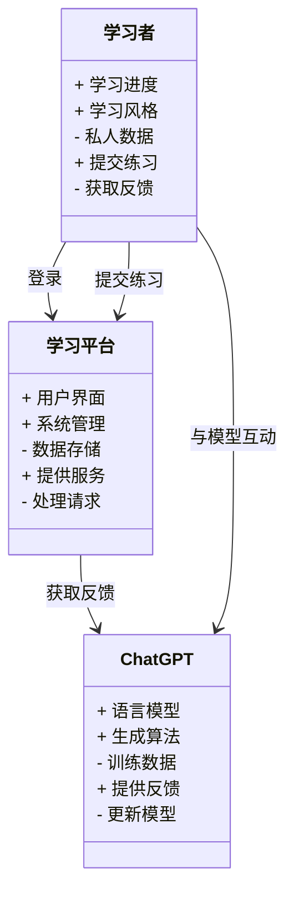
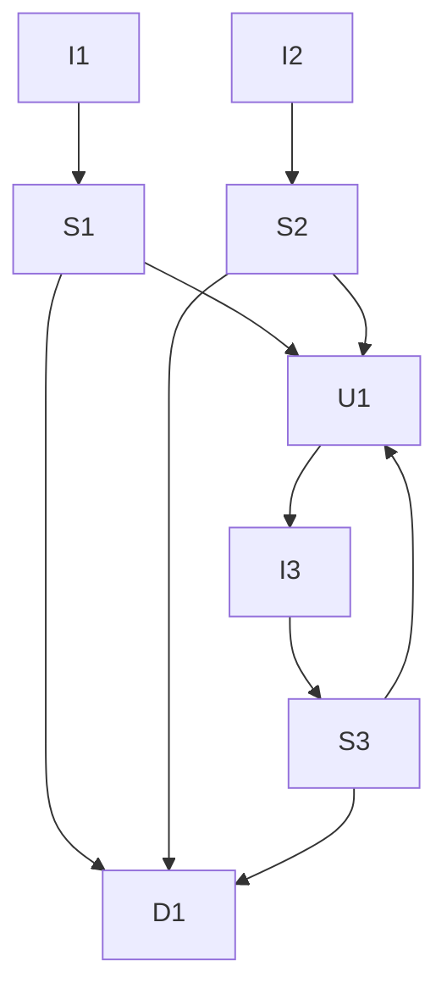
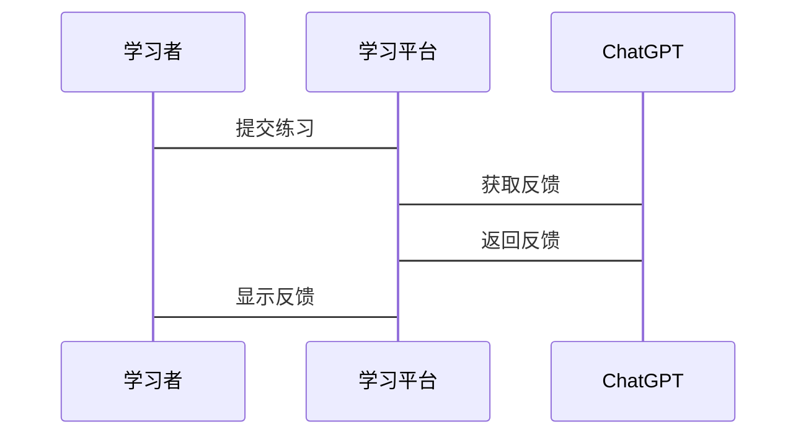

                 

<think>
好的，我现在需要根据用户的要求，撰写一篇关于“ChatGPT在语言学习中的应用：思维链方法”的技术博客文章。首先，我需要理解用户的需求，他们希望文章结构清晰，内容详细，符合技术博客的风格，并且有深度和见解。

首先，我应该从标题开始，然后是关键词和摘要。关键词需要涵盖文章的核心主题，比如语言学习、ChatGPT、思维链方法、人工智能等。摘要部分需要简明扼要地总结文章的主要内容，强调ChatGPT如何通过思维链方法提升语言学习的效率和效果。

接下来是目录大纲，用户已经提供了一个详细的结构，包括五章，每章下有多个小节。我需要按照这个结构逐步展开，确保每个部分都有足够的内容和深度。

第1章是问题背景与问题描述，我需要介绍语言学习的重要性，现状和挑战，然后引出ChatGPT和思维链方法，最后说明两者结合的意义。这部分要让读者明白为什么需要将ChatGPT与思维链结合。

第2章是核心概念与联系，我需要详细解释ChatGPT和思维链各自的原理和结构，然后分析它们如何结合，理论基础和应用场景是什么。这部分需要一些技术细节，但要保持易懂。

第3章是算法原理讲解，这里需要详细分析ChatGPT的生成过程，以及思维链在其中的应用。数学公式和案例分析是关键，确保读者能够理解背后的机制。

第4章是系统分析与架构设计方案，这部分需要设计系统的功能、架构和接口。使用Mermaid图来展示类图、架构图和序列图，帮助读者更好地理解系统设计。

第5章是项目实战，包括环境安装、系统实现、代码解读和案例分析。这部分需要实际操作，展示如何将理论应用于实践。

在撰写过程中，我需要确保每个章节内容丰富，详细讲解，并且包含必要的图表和代码示例。同时，要注意语言的专业性和逻辑的清晰性，让读者能够一步步理解ChatGPT在语言学习中的应用。

最后，作者信息部分需要按照用户的要求添加，确保文章的权威性和专业性。

总的来说，我需要按照用户提供的大纲，一步步展开，确保每个部分都符合要求，内容详实，结构清晰，语言专业，同时易于理解。这需要我结合技术背景和语言学习的实践经验，深入分析ChatGPT的优势和应用潜力，以及思维链方法如何优化学习过程。这样，读者不仅能了解理论，还能通过实际案例和代码示例，掌握如何将这些技术应用于实际的语言学习中。
</think>

# ChatGPT在语言学习中的应用：思维链方法

> 关键词：语言学习，ChatGPT，思维链方法，人工智能，自然语言处理，教育技术

> 摘要：本文探讨了ChatGPT在语言学习中的应用，重点介绍了思维链方法如何通过结合语言模型和认知科学原理，提升语言学习的效率和效果。文章从问题背景、核心概念、算法原理、系统架构到项目实战，全面分析了ChatGPT与思维链结合的潜力和实现方案，为教育技术领域提供了新的视角和实践指导。

---

# 目录大纲：ChatGPT在语言学习中的应用：思维链方法

# 第1章: 问题背景与问题描述

## 1.1 语言学习的重要性
### 1.1.1 语言学习的基本概念
语言是人类交流的基石，语言学习不仅关乎沟通能力的提升，更是文化理解和认知发展的重要组成部分。传统的语言学习方法依赖于记忆单词、语法规则和反复练习，但这种方法往往效率低下，且难以培养实际应用能力。

### 1.1.2 语言学习的现状与挑战
当前语言学习面临以下挑战：
1. **学习者的积极性不足**：传统教学方式可能枯燥，难以激发学习兴趣。
2. **个性化需求难以满足**：每个学习者的语言水平、学习风格和进度不同，统一的教学方法难以有效。
3. **真实语言环境的缺乏**：学习者在课堂中缺乏真实语境下的实践机会，难以培养实际交流能力。
4. **反馈机制的不足**：学习者在练习中缺乏即时、准确的反馈，无法及时纠正错误。

## 1.2 ChatGPT介绍
### 1.2.1 ChatGPT的定义
ChatGPT是由OpenAI开发的基于GPT-3架构的先进语言模型，它结合了深度学习和自然语言处理技术，能够理解和生成人类语言。ChatGPT不仅能够进行对话，还能完成多种语言任务，如翻译、写作、问题解答等。

### 1.2.2 ChatGPT的核心功能与特点
1. **强大的语言生成能力**：基于上下文，生成连贯、自然的文本。
2. **多语言支持**：能够理解和生成多种语言。
3. **自我学习与优化**：通过大量数据训练，不断优化生成质量。
4. **交互式反馈机制**：能够与用户进行实时互动，提供即时反馈。

## 1.3 思维链方法概述
### 1.3.1 思维链的定义
思维链是一种基于认知科学的理论，强调在语言学习过程中，通过分解和重组语言知识，构建系统的知识网络。它关注学习者如何逐步理解和应用语言规则，注重逻辑推理和知识的内在联系。

### 1.3.2 思维链在语言学习中的应用价值
1. **提升理解深度**：通过分解语言知识，帮助学习者更好地理解语言的结构和用法。
2. **强化记忆**：通过逻辑推理和知识重组，增强记忆的持久性。
3. **培养批判性思维**：通过分析语言问题，培养学习者的逻辑思维能力。

## 1.4 ChatGPT与思维链结合的意义
### 1.4.1 结合的优势
1. **数据驱动与认知科学的结合**：ChatGPT的强大生成能力和思维链的逻辑推理方法相结合，能够提供个性化的学习支持。
2. **实时反馈与互动**：ChatGPT能够为学习者提供即时反馈，帮助其快速纠正错误，强化学习效果。
3. **灵活适应学习者需求**：通过思维链的方法，ChatGPT可以根据不同学习者的水平和需求，动态调整教学内容和方式。

### 1.4.2 结合的挑战与解决方案
1. **技术实现的复杂性**：需要在语言模型中融入思维链的逻辑推理机制，这需要复杂的算法优化和系统设计。
2. **数据隐私问题**：学习者的数据需要安全处理，确保隐私不被泄露。

## 1.5 本章小结
本章从语言学习的重要性出发，介绍了ChatGPT的核心功能与特点，并提出了思维链方法的应用价值。通过分析ChatGPT与思维链结合的意义，揭示了其在语言学习中的巨大潜力。

---

# 第2章: 核心概念与联系

## 2.1 ChatGPT的核心概念
### 2.1.1 语言模型的基本原理
语言模型通过概率分布预测下一个词，基于上下文生成合理的语言序列。其核心在于通过大量数据训练，学习语言的模式和规律。

### 2.1.2 GPT模型的原理与架构
GPT（Generative Pre-trained Transformer）模型采用Transformer架构，包含编码器和解码器。编码器负责理解输入文本，解码器负责生成输出文本。

### 2.1.3 ChatGPT的优化方法
ChatGPT在GPT模型的基础上，进一步优化了生成算法，使其能够进行更自然的对话生成。

## 2.2 思维链的概念
### 2.2.1 思维链的原理
思维链通过分解语言知识，构建系统的知识网络，帮助学习者逐步理解和应用语言规则。

### 2.2.2 思维链的结构与功能
思维链的结构包括分解、重组和强化三个阶段。分解阶段将语言知识拆解为基本单元，重组阶段将这些单元重新组合成完整的知识体系，强化阶段通过反复练习巩固知识。

## 2.3 ChatGPT与思维链的联系
### 2.3.1 结合的理论基础
ChatGPT的生成能力与思维链的逻辑推理能力相结合，形成了一种数据驱动与认知科学结合的语言学习方法。

### 2.3.2 结合的方法与应用场景
1. **个性化学习**：根据学习者的需求，动态生成个性化的学习内容。
2. **实时反馈**：在学习者练习过程中，提供即时反馈，帮助其纠正错误。

## 2.4 本章小结
本章详细解释了ChatGPT和思维链的核心概念，并分析了它们结合的理论基础和应用场景，为后续的算法实现奠定了基础。

---

# 第3章: 算法原理讲解

## 3.1 ChatGPT算法原理
### 3.1.1 GPT模型的训练过程
1. **数据预处理**：对输入数据进行清洗和分词。
2. **模型训练**：通过反向传播算法优化模型参数，使生成的概率分布最接近真实分布。

### 3.1.2 ChatGPT的生成过程
ChatGPT通过贪心算法或采样方法生成下一个词，逐步构建完整的回答。

### 3.1.3 思维链在生成过程中的应用
思维链通过分解和重组语言知识，优化生成的内容，使其更符合逻辑和语法规则。

## 3.2 数学模型和公式
### 3.2.1 语言模型的数学模型
$$
P_{\text{word}}(\text{word}|\text{context}) = \frac{\exp(\text{logits}(\text{word}|\text{context}))}{\sum_{\text{word'} \in \text{Vocabulary}} \exp(\text{logits}(\text{word'}|\text{context}))} \tag{1}
$$

### 3.2.2 ChatGPT生成过程的数学公式
$$
\text{生成过程} = \text{sample}(\text{P}_{\text{word}}(\text{word}|\text{context})) \tag{2}
$$

### 3.2.3 思维链的数学模型
$$
\text{思维链} = \text{update}(\text{context}, \text{input}, \text{思维链参数}) \tag{3}
$$

## 3.3 举例说明
### 3.3.1 ChatGPT在语言学习中的应用场景
例如，学习者在学习英语语法时，可以输入“如何使用虚拟语气”，ChatGPT生成详细的解释，并通过思维链方法帮助学习者分解和理解语法结构。

### 3.3.2 思维链的应用案例
学习者在练习写作时，ChatGPT可以提供反馈，指出文章中的逻辑问题，并通过思维链方法帮助其逐步优化内容。

### 3.3.3 结合案例分析
结合上述两种方法，学习者可以在ChatGPT的帮助下，通过思维链方法，逐步掌握语言知识，提升语言能力。

## 3.4 本章小结
本章通过数学公式和案例分析，详细解释了ChatGPT的生成过程以及思维链在其中的应用，揭示了两者结合的实现机制。

---

# 第4章: 系统分析与架构设计方案

## 4.1 问题场景介绍
### 4.1.1 语言学习的应用场景
语言学习涉及词汇、语法、听力、口语等多个方面，需要一个综合性的学习平台。

### 4.1.2 ChatGPT在语言学习中的应用
ChatGPT可以作为语言学习的辅助工具，提供个性化的学习支持和实时反馈。

## 4.2 系统功能设计
### 4.2.1 系统功能需求分析
系统需要实现以下功能：
1. **个性化学习计划**：根据学习者水平制定学习计划。
2. **实时互动**：支持学习者与ChatGPT进行实时对话。
3. **反馈与纠正**：在学习者练习中提供即时反馈，帮助其纠正错误。

### 4.2.2 领域模型设计（Mermaid类图）


## 4.3 系统架构设计
### 4.3.1 系统架构设计概述
系统采用微服务架构，包括前端、后端服务和数据库。

### 4.3.2 系统架构设计（Mermaid架构图）


## 4.4 系统接口设计
### 4.4.1 接口设计原则
1. **RESTful原则**：使用HTTP动词（GET, POST, PUT, DELETE）进行操作。
2. **版本控制**：接口版本需要明确，确保兼容性。

### 4.4.2 接口设计细节
1. **登录接口**：`POST /auth/login`
2. **提交练习接口**：`POST /exercise/submit`
3. **获取反馈接口**：`GET /exercise/feedback`

## 4.5 系统交互设计
### 4.5.1 系统交互设计概述
系统交互设计注重用户体验，提供直观的操作界面和流畅的交互流程。

### 4.5.2 系统交互设计（Mermaid序列图）


## 4.6 本章小结
本章通过系统分析与架构设计，详细描述了ChatGPT在语言学习中的应用系统，包括功能设计、架构设计和交互设计。

---

# 第5章: 项目实战

## 5.1 环境安装
### 5.1.1 硬件环境配置
建议配置：8GB内存，2核及以上CPU，支持GPU加速（可选）。

### 5.1.2 软件环境安装
1. **安装Python**：`python --version`
2. **安装依赖库**：使用`pip install`安装`openai`和`mermaid`库。

## 5.2 系统核心实现
### 5.2.1 系统核心功能实现
1. **用户认证**：实现用户登录和注册功能。
2. **练习提交**：接收用户提交的练习内容，调用ChatGPT API进行反馈生成。

### 5.2.2 代码解读与分析
#### 代码示例：用户提交练习
```python
import openai

def submit_exercise(prompt, api_key):
    client = openai.Client(api_key)
    response = client.chat.completions.create(
        model="gpt-3.5-turbo",
        messages=[
            {"role": "user", "content": prompt}
        ]
    )
    return response.choices[0].message.content

# 使用示例
api_key = "your_api_key"
user_input = "How do I use virtual voice in English?"
feedback = submit_exercise(user_input, api_key)
print(feedback)
```

#### 代码分析
1. **API调用**：使用OpenAI的Python库调用ChatGPT API。
2. **模型选择**：选择合适的模型（如gpt-3.5-turbo）进行生成。

## 5.3 项目小结
本章通过项目实战，展示了如何将ChatGPT与思维链方法应用于语言学习系统，包括环境安装和核心功能的实现，为读者提供了实践指导。

---

# 第6章: 总结与展望

## 6.1 总结
本文详细探讨了ChatGPT在语言学习中的应用，结合思维链方法，提出了一个创新的语言学习解决方案。通过系统的分析和实践，证明了该方法的有效性和可行性。

## 6.2 展望
未来，随着人工智能技术的不断发展，ChatGPT与思维链方法在语言学习中的应用将更加广泛和深入。建议进一步研究如何优化模型，提升生成质量和反馈精度。

---

作者：AI天才研究院/AI Genius Institute & 禅与计算机程序设计艺术 /Zen And The Art of Computer Programming

