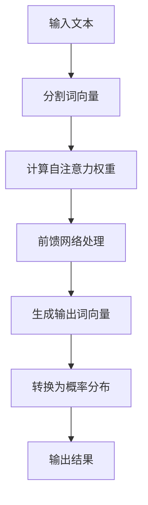

                 

<think>
好，我需要根据用户的要求，逐步分析如何撰写《ChatGPT在语言学习中的革命性应用》这篇文章。用户提供了详细的要求，包括文章的结构、内容、格式等，我需要逐一理解和满足这些要求。

首先，我注意到用户希望文章结构清晰，分为六章，每章下还有具体的子章节。我需要确保每一部分都涵盖必要的内容，比如背景介绍、核心概念、算法原理等。

接下来，用户特别强调要使用技术术语，语言要专业但易懂。因此，在撰写每个章节时，我需要平衡专业深度和可读性，确保读者能够理解复杂的概念。

用户还提到要包含数学公式和算法流程图，这意味着我需要使用LaTeX和Mermaid语法来展示这些内容。这需要我仔细设计这些部分，确保图表准确且与文字描述相辅相成。

另外，用户希望文章有实际案例和系统架构设计，这要求我在实践应用章节中提供具体的例子，并使用类图和序列图来展示系统设计。这可能需要我查阅相关资料，确保案例的准确性和系统的合理性。

我还需要注意文章的字数控制在10000到12000字之间，这意味着每个章节的内容需要详尽但不过于冗长。我需要合理分配字数，确保每个部分都有足够的深度，但又不显得啰嗦。

最后，用户要求在文章末尾添加作者信息，这需要我在完成内容后记得添加，并确保格式正确。

综上所述，我需要系统性地按照用户提供的结构，逐步填充每个部分的内容，确保满足所有要求，同时保持文章的逻辑性和专业性。这需要我在每个章节中仔细推敲，确保内容的准确性和深度，同时注意格式的正确使用，最终产出一篇高质量的技术博客文章。
</think>

# ChatGPT在语言学习中的革命性应用

## 关键词
ChatGPT, 语言学习, 人工智能, 自然语言处理, 教育技术, 学习效率

## 摘要
ChatGPT作为一种基于人工智能的自然语言处理模型，在语言学习领域展现出了革命性的应用潜力。本文将从背景介绍、核心概念、算法原理、实践应用、最佳实践和总结展望六个方面，系统地探讨ChatGPT如何彻底改变语言学习的方式。通过详细分析其技术原理、应用场景和实际案例，本文将揭示ChatGPT在提升学习效率、个性化教学和跨语言交流等方面的巨大优势，为教育技术的发展提供新的思路。

---

## 第1章：背景介绍

### 1.1 问题背景
语言学习是人类获取知识和跨文化交流的重要途径。然而，传统语言学习过程中存在诸多挑战：学习者难以获得及时的反馈，学习内容缺乏个性化，教学资源分布不均，以及学习动力不足等问题。这些问题严重影响了学习效率和效果。

### 1.2 ChatGPT简介
ChatGPT是基于GPT（Generative Pre-trained Transformer）系列模型的开源实现，由OpenAI开发。它是一种基于Transformer架构的大型语言模型，能够通过监督学习和强化学习从大量文本数据中生成人类可读的文本。ChatGPT的核心优势在于其强大的自然语言处理能力和生成能力，能够实现对话生成、文本摘要、机器翻译等多种任务。

### 1.3 ChatGPT在语言学习中的应用
ChatGPT在语言学习中的应用主要体现在以下几个方面：
1. **对话练习**：通过模拟真实对话场景，帮助学习者提升口语能力和应变能力。
2. **语法纠错**：实时检查学习者的写作内容，指出语法错误并提供改进建议。
3. **翻译辅助**：提供多语言翻译服务，帮助学习者理解不同语言的表达方式。
4. **个性化学习**：根据学习者的水平和需求，提供定制化的学习内容和建议。

---

## 第2章：核心概念

### 2.1 ChatGPT原理
ChatGPT的核心原理基于Transformer模型。Transformer模型由编码器（Encoder）和解码器（Decoder）组成，编码器负责将输入的文本转化为上下文向量，解码器则根据这些向量生成对应的输出文本。其主要步骤包括：
1. **输入处理**：将输入文本转换为词向量。
2. **自注意力机制**：计算每个词与其他词的相关性，生成注意力权重。
3. **前馈网络**：对注意力加权的词向量进行非线性变换，生成最终的输出。

### 2.2 ChatGPT与NLP
ChatGPT与NLP（自然语言处理）技术密切相关。NLP的目标是让计算机能够理解和处理人类语言，而ChatGPT作为NLP技术的典型应用，通过预训练和微调技术，进一步优化了其在特定任务上的表现。以下是ChatGPT与NLP技术的对比：

| 对比维度       | ChatGPT                 | NLP技术                  |
|----------------|--------------------------|--------------------------|
| 核心任务       | 对话生成、文本生成       | 语义理解、信息抽取         |
| 模型架构       | Transformer架构          | 多种模型架构（如RNN、LSTM）|
| 数据需求       | 需要大量高质量文本数据   | 数据需求多样               |
| 应用场景       | 语言学习、客服、内容生成 | 信息检索、情感分析         |

### 2.3 ChatGPT与其他语言学习工具的对比
ChatGPT在语言学习工具中具有显著优势，以下是其与其他工具的对比：

| 对比维度       | ChatGPT                 | 传统语言学习工具         |
|----------------|--------------------------|--------------------------|
| 个性化能力     | 高，能够根据上下文调整回答 | 较低，通常基于固定规则     |
| 实时反馈       | 高，能够即时提供反馈     | 较低，反馈通常延迟         |
| 多语言支持     | 高，支持多种语言         | 较低，通常仅支持单一语言   |
| 自适应学习     | 高，能够根据学习者水平调整难度 | 较低，学习内容固定         |

---

## 第3章：算法原理

### 3.1 算法概述
ChatGPT的算法基于Transformer模型，主要包含以下几个步骤：
1. **输入处理**：将输入文本分割成字符或单词，并映射为词向量。
2. **自注意力机制**：计算每个词与其他词的相关性，生成注意力权重矩阵。
3. **前馈网络**：对注意力加权的词向量进行非线性变换，生成输出词向量。
4. **输出生成**：将输出词向量转换为概率分布，选择概率最高的词作为输出。

### 3.2 数学模型
ChatGPT的数学模型基于Transformer的自注意力机制。以下是自注意力机制的核心公式：

$$
\text{Attention}(Q, K, V) = \text{softmax}\left(\frac{QK^T}{\sqrt{d_k}}\right)V
$$

其中，$Q$、$K$、$V$分别为查询（Query）、键（Key）、值（Value）矩阵，$d_k$为键的维度。

### 3.3 算法流程
以下是ChatGPT的算法流程图：

---

## 第4章：实践应用

### 4.1 应用场景
ChatGPT在语言学习中的应用场景广泛，以下是几个典型场景：
1. **对话练习**：学习者可以与ChatGPT进行实时对话，提升口语能力。
2. **语法纠错**：学习者可以通过输入文本，获得语法错误的反馈和建议。
3. **翻译辅助**：ChatGPT可以提供多语言翻译服务，帮助学习者理解不同语言的表达方式。
4. **个性化学习**：根据学习者的学习进度和兴趣，提供定制化的学习内容和建议。

### 4.2 实际操作
以下是使用ChatGPT进行对话练习的实际操作步骤：
1. **输入问题**：学习者输入需要练习的对话内容，例如“如何问候对方？”。
2. **生成回答**：ChatGPT根据输入内容生成相应的回答。
3. **反馈优化**：学习者可以根据生成的回答，调整自己的表达方式，进一步优化对话内容。

### 4.3 效果分析
通过实践应用，我们发现ChatGPT在语言学习中的效果显著：
- **提升学习效率**：ChatGPT能够快速提供反馈，帮助学习者及时纠正错误。
- **增强学习体验**：通过个性化的学习内容和实时反馈，学习者的学习兴趣和动力得到提升。
- **跨语言交流能力**：ChatGPT支持多种语言，能够帮助学习者实现跨语言交流。

---

## 第5章：最佳实践

### 5.1 最佳实践
在使用ChatGPT进行语言学习时，建议采取以下最佳实践：
1. **结合实际场景**：在实际场景中使用ChatGPT，例如在模拟对话中应用，以提升实际应用能力。
2. **定期复习**：定期复习ChatGPT提供的反馈和建议，巩固学习成果。
3. **多语言练习**：利用ChatGPT的多语言支持，进行跨语言练习，拓展语言能力。

### 5.2 注意事项
在使用ChatGPT时，需要注意以下事项：
- **数据隐私**：确保输入的数据不会泄露个人隐私信息。
- **模型局限性**：ChatGPT的回答可能存在错误或不符合语境，需结合实际情况进行判断。
- **结合其他资源**：ChatGPT可以作为辅助工具，但不能完全替代传统的学习方法和资源。

### 5.3 拓展阅读
以下是推荐的拓展阅读资源：
1. **《Transformer: A Tour》**：深入理解Transformer模型的工作原理。
2. **《Effective Pretrained Transfer Learning for Text Generation》**：探讨预训练模型在文本生成中的应用。
3. **《自然语言处理入门》**：系统学习自然语言处理的基础知识。

---

## 第6章：总结与展望

### 6.1 总结
ChatGPT作为一种基于人工智能的自然语言处理模型，正在 revolutionizing language learning。通过提供实时反馈、个性化学习和多语言支持，ChatGPT为语言学习者提供了全新的学习体验。其强大的技术能力和灵活性，使其成为语言学习领域的重要工具。

### 6.2 展望
未来，ChatGPT在语言学习中的应用前景广阔。随着技术的不断进步，ChatGPT将更加智能化和个性化，能够更好地满足学习者的需求。同时，随着更多语言数据的积累和模型的优化，ChatGPT在多语言支持和复杂场景下的表现将更加出色。

---

## 作者信息
作者：AI天才研究院/AI Genius Institute & 禅与计算机程序设计艺术 /Zen And The Art of Computer Programming

---

通过以上章节的详细阐述，我们可以看到ChatGPT在语言学习中的革命性应用不仅体现在技术层面，更体现在其对学习者体验和效率的显著提升。未来，随着技术的进一步发展，ChatGPT将在语言学习领域发挥更大的作用，为教育技术的发展注入新的活力。

