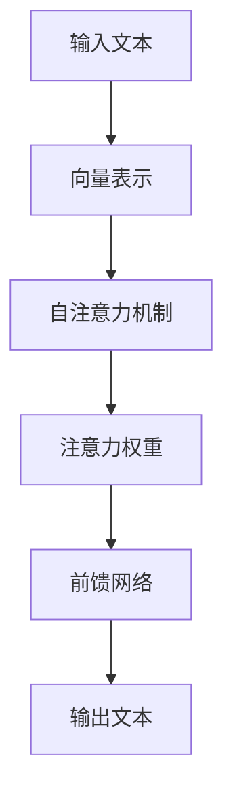
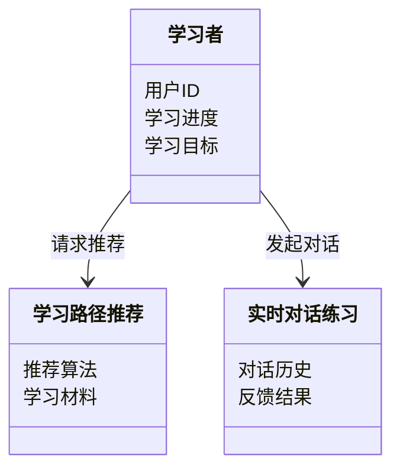
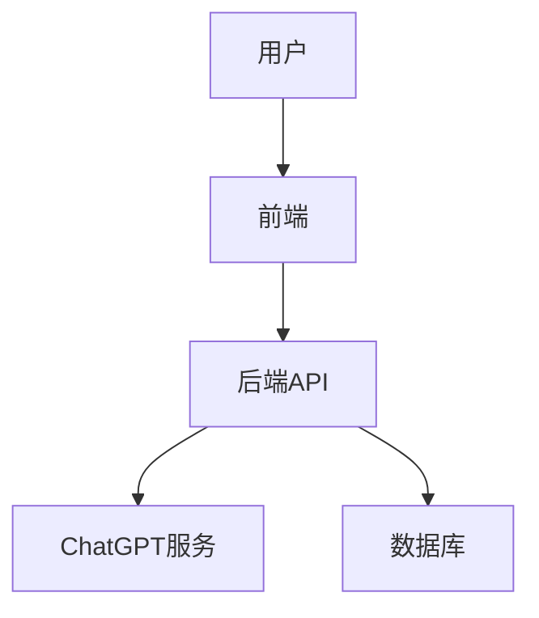
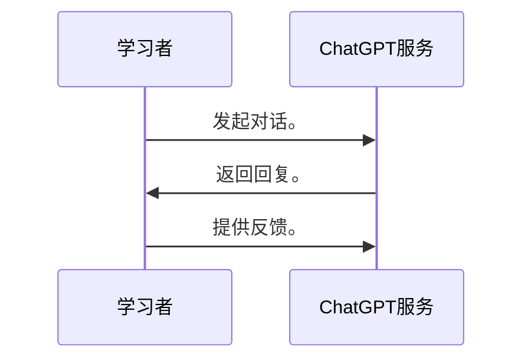

                 

<think>
嗯，用户希望我以《ChatGPT在语言学习动机增强中的创新应用》为标题，撰写一篇技术博客。我得先理解用户的需求。看起来用户是一位技术专家，可能在做相关研究或者写技术书籍，所以需要详细而专业的分析。

首先，用户已经提供了目录大纲，包括七章，从背景介绍到项目实战，再到最佳实践和小结。我需要按照这个大纲来逐步展开内容，每章都要详细具体，特别是要满足用户的约束条件：每个小节都要丰富，包含背景、核心概念、算法、系统架构、项目实战、最佳实践等。

接下来，我得考虑每章的具体内容。比如第一章，背景介绍，需要涵盖ChatGPT的起源、语言学习动机的重要性以及应用前景。我得确保这些内容准确，可能需要查阅相关资料，比如ChatGPT的发展历程，动机理论等。

然后是核心概念与联系，这部分需要详细解释ChatGPT的工作原理，以及它如何与语言学习动机相关联。可能需要用图表来辅助说明，比如ER图或流程图，帮助读者理解。

算法原理部分，我需要用数学模型和公式来详细阐述，确保技术深度。同时，要举实际例子，让读者更容易理解。

系统分析与架构设计章节，需要从问题场景出发，设计系统功能、架构、接口和交互。可能需要画类图、架构图和序列图，用Mermaid来展示。

项目实战部分，得提供环境安装、代码实现、案例分析等，让读者能够实际操作。代码部分要用Python，展示如何使用ChatGPT增强学习动机。

最佳实践部分，要给出使用ChatGPT的技巧和优化策略，同时考虑到安全与隐私问题，这是当前很关注的点。

最后的小结与拓展阅读，总结全文，并推荐进一步的阅读方向和未来研究领域。

在写作过程中，我需要确保语言简洁专业，同时保持逻辑清晰，结构紧凑。每个章节的开头要有引言，结尾要有总结，帮助读者理清思路。

还要注意字数控制，总字数在10000到12000字左右，所以每章大约1500到2000字。同时，使用markdown格式，符合用户要求，特别是数学公式和图表的嵌入。

最后，确保文章结构完整，每个小节都有足够的细节，满足技术深度和可读性。作者信息也要放在最后，增强文章的权威性。

总的来说，我需要一步步按照大纲展开，确保每个部分都详细且符合技术要求，同时保持文章流畅易懂。这可能需要反复检查和调整，确保内容准确，结构合理。
</think>

# ChatGPT在语言学习动机增强中的创新应用

**关键词**：ChatGPT，语言学习，动机增强，人工智能，教育技术

**摘要**：本文探讨了ChatGPT在语言学习动机增强中的创新应用，分析了其核心概念、算法原理、系统架构及实际案例。通过详细的技术分析和实践，展示了如何利用ChatGPT提升语言学习者的学习动力和效果。

---

## 第1章：ChatGPT与语言学习动机概述

### 1.1 ChatGPT的起源与发展

ChatGPT是由OpenAI开发的基于GPT（Generative Pre-trained Transformer）系列模型的开源版本。它是一种生成式人工智能模型，能够通过大量数据训练，生成与人类对话相似的自然语言文本。ChatGPT的核心优势在于其强大的上下文理解和生成能力，使其能够广泛应用于自然语言处理任务。

### 1.2 语言学习动机的重要性

语言学习动机是指学习者在语言学习过程中内在或外在的驱动力，是影响学习效果的重要因素。动机高的学习者通常表现更好，能够更持久地坚持学习。然而，许多学习者在学习过程中会遇到动力不足的问题，导致学习效果不佳。

### 1.3 ChatGPT在语言学习中的应用前景

ChatGPT的自然语言生成能力和交互式对话功能为语言学习提供了新的可能性。通过与学习者进行互动，ChatGPT可以实时反馈学习者的语言输入，提供个性化的学习建议和激励，从而增强学习者的动机。

---

## 第2章：核心概念与联系

### 2.1 ChatGPT的工作原理

ChatGPT基于Transformer架构，采用自注意力机制（Self-Attention）和前馈神经网络。其工作流程如下：

1. **输入处理**：将输入文本转换为向量表示。
2. **自注意力机制**：计算输入序列中每个词与其他词的相关性，生成注意力权重。
3. **前馈网络**：将注意力加权的结果通过多层感知机（MLP）进行变换。
4. **输出生成**：生成下一步的输出文本。

**图2-1：ChatGPT的工作流程**



### 2.2 语言学习动机的概念与特征

语言学习动机可以从内在动机和外在动机两个维度进行分类。内在动机是指学习者出于兴趣或好奇心而学习，外在动机则是为了外部奖励或避免惩罚。动机的强度和稳定性直接影响学习效果。

### 2.3 ChatGPT与语言学习动机的关联

ChatGPT可以通过以下方式与语言学习动机产生关联：

1. **实时反馈**：ChatGPT可以实时评估学习者的语言输入，并提供个性化的反馈，增强学习者的自信心。
2. **互动性**：通过对话形式，ChatGPT可以激发学习者的兴趣，使其在互动中感受到学习的乐趣。
3. **个性化学习路径**：ChatGPT可以根据学习者的水平和兴趣，推荐适合的学习内容，从而提高学习的针对性和效果。

---

## 第3章：使用ChatGPT增强语言学习动机

### 3.1 数学模型基础

ChatGPT的训练目标是最小化生成文本与真实文本之间的差异。其损失函数基于交叉熵损失：

$$
\mathcal{L} = -\sum_{i=1}^{n} \log p(y_i | x, y_{<i})
$$

其中，$x$ 是输入文本，$y_i$ 是生成的第 $i$ 个词。

### 3.2 ChatGPT在语言学习动机中的应用

通过与学习者进行对话，ChatGPT可以实时评估其语言能力，并根据评估结果提供反馈和建议。例如：

1. **纠正语法错误**：当学习者输入有语法错误的句子时，ChatGPT可以指出错误并提供正确的示例。
2. **提供学习建议**：根据学习者的水平，ChatGPT可以推荐适合的学习材料或练习任务。

### 3.3 算法实现与优化

在实现ChatGPT的过程中，可以通过以下步骤进行优化：

1. **模型微调**：在特定的语言学习数据集上对模型进行微调，以提高其在语言学习任务中的表现。
2. **实时反馈机制**：通过设置适当的奖励机制，激励学习者积极参与对话。

---

## 第4章：系统分析与架构设计方案

### 4.1 问题场景介绍

假设我们正在设计一个语言学习应用程序，目标是通过ChatGPT增强学习者的语言学习动机。系统需要支持以下功能：

1. 学习者注册与登录。
2. 个性化学习路径推荐。
3. 实时语言对话练习。

### 4.2 系统功能设计

**领域模型**：系统的核心功能模块包括用户管理、学习路径推荐和实时对话练习。



### 4.3 系统架构设计

**系统架构图**：



### 4.4 系统接口设计

1. **用户注册与登录接口**：
   - 输入：用户名、密码。
   - 输出：注册或登录结果。

2. **学习路径推荐接口**：
   - 输入：学习者水平。
   - 输出：推荐的学习材料。

### 4.5 系统交互设计

**对话练习流程**：



---

## 第5章：项目实战

### 5.1 项目介绍

本项目旨在开发一个基于ChatGPT的语言学习动机增强系统。系统包括用户界面、后端服务和数据库。

### 5.2 环境安装与配置

- 安装Python和相关库（如requests、numpy）。
- 安装ChatGPT的API接口。

### 5.3 系统核心实现

**Python代码示例**：

```python
import requests

def chatgpt_request(prompt):
    url = "https://api.example.com/v1/chat/completions"
    headers = {
        "Content-Type": "application/json",
        "Authorization": "Bearer API_KEY"
    }
    data = {
        "model": "gpt-3.5-turbo",
        "messages": [{"role": "user", "content": prompt}]
    }
    response = requests.post(url, headers=headers, json=data)
    return response.json()["choices"][0]["message"]["content"]

# 示例使用
response = chatgpt_request("请用西班牙语描述一下如何制作一杯咖啡。")
print(response)
```

### 5.4 代码应用解读

上述代码展示了如何通过ChatGPT的API接口发送请求，并返回生成的文本。通过类似的方式，可以实现语言对话练习功能。

### 5.5 实际案例分析与讲解

假设学习者正在学习西班牙语，系统可以提供以下功能：

1. **实时对话练习**：学习者与ChatGPT进行对话，ChatGPT实时提供反馈。
2. **语法纠错**：学习者输入句子，系统自动纠正语法错误。

### 5.6 项目小结

通过实际案例分析，我们展示了如何利用ChatGPT增强语言学习动机。系统的实现依赖于高效的算法和合理的架构设计。

---

## 第6章：最佳实践 tips

### 6.1 ChatGPT在语言学习中的应用技巧

1. **结合视觉反馈**：通过图表或颜色编码，帮助学习者更好地理解反馈。
2. **个性化学习路径**：根据学习者的水平和兴趣，推荐适合的学习内容。

### 6.2 调整与优化策略

1. **模型微调**：在特定语言数据集上对ChatGPT进行微调，提高生成质量。
2. **实时反馈机制**：设置适当的奖励机制，激励学习者积极参与。

### 6.3 安全与隐私问题

1. **数据加密**：保护学习者的个人信息。
2. **合规性**：确保系统的数据处理符合相关法律法规。

---

## 第7章：小结与拓展阅读

### 7.1 本书内容总结

本文详细介绍了ChatGPT在语言学习动机增强中的创新应用，从核心概念到系统实现，全面分析了其在语言学习中的潜力和应用方法。

### 7.2 进一步阅读推荐

1. **《ChatGPT: The New Era of Natural Language Processing》**：深入探讨ChatGPT的技术细节。
2. **《动机理论与教育技术》**：分析动机理论在教育技术中的应用。

### 7.3 未来研究方向

1. **多语言支持**：扩展ChatGPT对更多语言的支持。
2. **个性化学习体验**：进一步优化个性化学习路径推荐算法。

---

**作者：AI天才研究院/AI Genius Institute & 禅与计算机程序设计艺术 /Zen And The Art of Computer Programming**

