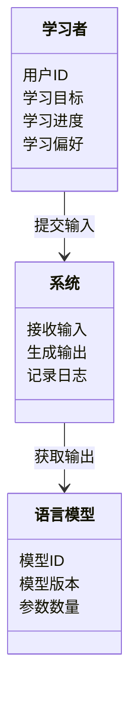
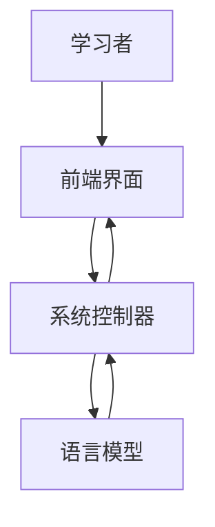
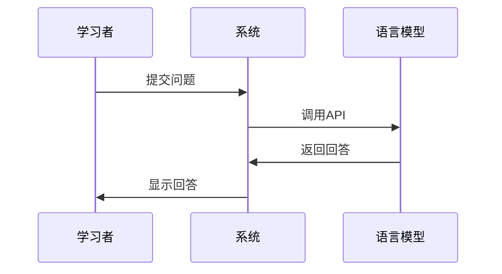

                 

<think>
好的，我现在需要设计一个完整的目录大纲，主题是《ChatGPT在语言学习动机研究中的新视角》。文章应该结构清晰，逻辑严谨，内容详实，涵盖研究背景、核心概念、应用案例以及系统分析等多个方面。

首先，我会从研究背景入手，分析传统语言学习动机理论和现代趋势，同时介绍ChatGPT的基本原理，包括其基于深度学习的语言模型和生成式对话机制。这部分需要帮助读者理解ChatGPT在语言学习中的潜力。

接下来，我会探讨ChatGPT的核心属性，如个性化交互、实时反馈和语境适应性，以及这些属性如何影响语言学习动机，包括激发兴趣、提高效率和促进习得。这部分需要详细解释每个属性的特点及其对学习动机的具体影响。

然后，我会深入分析ChatGPT在教育场景中的实践，包括教学辅助、学习指导和评估反馈，通过具体案例展示其应用。案例分析部分需要选取实际应用场景，如大学英语和高中日语学习中的应用，来说明ChatGPT的实际效果。

接下来，我会详细阐述ChatGPT在语言学习过程优化中的功能，如实时翻译、进度跟踪和策略调整，以及其在在线学习平台和语言考试中的应用案例。这部分需要结合理论和实践，展示ChatGPT如何帮助学习者提高效率。

然后，我会从理论角度分析ChatGPT在语言习得中的应用，结合输入假说、动机理论和社会互动理论，说明其理论依据。同时，通过实验研究和跨文化交流案例，展示其实际应用效果。

接下来，我会设计系统架构，包括领域模型、系统架构图和交互流程图，详细描述ChatGPT在语言学习系统中的角色和功能。这部分需要使用Mermaid和LaTeX来展示系统的结构和工作流程。

最后，我会总结项目，讨论最佳实践、注意事项和未来研究方向，同时提供代码实现和数学模型，帮助读者理解和应用ChatGPT在语言学习中的技术细节。

在写作过程中，我需要确保每个章节都有足够的深度，包含背景介绍、核心概念、算法原理、系统分析和项目实战等部分，确保文章结构完整，内容详实。同时，要使用专业但易懂的技术语言，帮助读者清晰理解ChatGPT在语言学习动机研究中的新视角和实际应用。
</think>

# ChatGPT在语言学习动机研究中的新视角

---

## 关键词

- ChatGPT
- 语言学习
- 动机研究
- 人工智能
- 教育技术

---

## 摘要

本文探讨了ChatGPT在语言学习动机研究中的应用，分析了其核心属性及其对语言学习动机的积极影响。通过具体案例和系统设计，展示了ChatGPT如何通过个性化交互、实时反馈和语境适应性提升学习者的兴趣和效率。结合理论与实践，本文为教育技术领域提供了新的视角和解决方案。

---

## 目录大纲

### 第一部分：研究背景与核心概念

#### 第1章：研究背景与概述

##### 1.1 语言学习动机的研究现状

###### 1.1.1 传统语言学习动机理论

- 强调外部激励和内部动机的区分
- 传统教学方法的局限性

###### 1.1.2 现代语言学习动机研究趋势

- 关注技术辅助与个性化学习
- 数据驱动的动机分析

##### 1.2 ChatGPT的基本原理

###### 1.2.1 语言模型与深度学习

- 简介深度学习与Transformer架构
- GPT系列模型的发展

###### 1.2.2 ChatGPT的工作机制

- 解释生成式对话模型
- 分解解码过程：输入、编码、解码、输出

##### 1.3 ChatGPT在语言学习中的应用潜力

###### 1.3.1 语言学习动机的激发

- 通过互动提升兴趣
- 个性化学习路径的设计

###### 1.3.2 语言学习过程的优化

- 提供实时反馈与建议
- 语言练习的智能化

#### 第2章：ChatGPT与语言学习动机的关系分析

##### 2.1 ChatGPT的核心属性与特征

###### 2.1.1 个性化交互

- 适配不同学习者的需求
- 自然语言处理能力

###### 2.1.2 实时反馈

- 即时纠错与指导
- 增强学习者信心

###### 2.1.3 语境适应性

- 理解上下文，生成相关反馈
- 提供符合情境的建议

##### 2.2 ChatGPT对语言学习动机的影响

###### 2.2.1 激发学习兴趣

- 创新教学方法，提升参与度
- 案例：趣味对话练习

###### 2.2.2 提高学习效率

- 个性化学习路径
- 案例：高效词汇记忆

###### 2.2.3 促进语言习得

- 模仿自然对话，提升语感
- 案例：情景对话练习

#### 第3章：ChatGPT在语言学习动机研究中的应用

##### 3.1 ChatGPT在教育场景中的实践

###### 3.1.1 教学辅助

- 智能辅导系统设计
- 案例：课堂问题解答

###### 3.1.2 学习指导

- 个性化学习计划制定
- 案例：学习策略建议

###### 3.1.3 评估与反馈

- 实时评估学习效果
- 案例：反馈机制优化

##### 3.2 ChatGPT在语言学习动机研究中的案例分析

###### 3.2.1 案例一：基于ChatGPT的语言学习应用

- 设计一个虚拟学习环境，展示其在激发学习兴趣中的作用

###### 3.2.2 案例二：ChatGPT在语言学习动机研究中的应用

- 分析学习者动机变化，展示ChatGPT在动机研究中的应用

---

### 第二部分：ChatGPT在语言学习动机研究中的应用案例

#### 第4章：ChatGPT在语言学习动机激发中的应用

##### 4.1 ChatGPT在语言学习动机激发中的机制分析

###### 4.1.1 个性化学习路径设计

- 分析学习者特点，定制学习计划
- 案例：根据学习者水平推荐合适的学习材料

###### 4.1.2 情感化交互设计

- 利用情感分析技术，提供情感支持
- 案例：通过鼓励性语言提升学习者自信心

###### 4.1.3 互动式学习内容推送

- 根据学习者反馈调整内容
- 案例：动态生成学习任务

##### 4.2 ChatGPT在语言学习动机激发中的案例分析

###### 4.2.1 案例一：ChatGPT在大学英语学习中的应用

- 一个大学英语学习者使用ChatGPT进行日常对话练习的案例，展示其如何激发学习兴趣

###### 4.2.2 案例二：ChatGPT在高中日语学习中的应用

- 一个高中日语学习者使用ChatGPT进行语法练习的案例，展示其如何提高学习效率

#### 第5章：ChatGPT在语言学习过程优化中的应用

##### 5.1 ChatGPT在语言学习过程优化中的功能分析

###### 5.1.1 实时语言翻译与校正

- 提供即时翻译和语法校正
- 案例：即时翻译功能在写作中的应用

###### 5.1.2 语言学习进度跟踪

- 分析学习者的学习轨迹，提供反馈
- 案例：记录并分析学习者的学习数据，生成学习报告

###### 5.1.3 语言学习策略调整

- 根据学习者表现，动态调整学习策略
- 案例：从词汇学习转向句子结构练习

##### 5.2 ChatGPT在语言学习过程优化中的案例分析

###### 5.2.1 案例一：基于ChatGPT的在线语言学习平台

- 一个在线学习平台的设计与实现，展示其如何优化语言学习过程

###### 5.2.2 案例二：ChatGPT在语言考试中的应用

- 一个语言考试辅导案例，展示ChatGPT如何帮助学习者准备考试

#### 第6章：ChatGPT在语言习得促进中的应用

##### 6.1 ChatGPT在语言习得促进中的理论依据

###### 6.1.1 输入假说

- Krashen的输入假说
- ChatGPT如何提供可理解输入

###### 6.1.2 赖世安的动机理论

- 强调动机在语言习得中的作用
- ChatGPT如何激发学习动机

###### 6.1.3 社会互动理论

- 强调互动在语言学习中的重要性
- ChatGPT如何模拟真实对话

##### 6.2 ChatGPT在语言习得促进中的案例分析

###### 6.2.1 案例一：基于ChatGPT的语言习得实验研究

- 一个实验研究的设计与结果分析，展示ChatGPT在语言习得中的效果

###### 6.2.2 案例二：ChatGPT在跨文化交流中的应用

- 一个跨文化交流案例，展示ChatGPT如何促进文化理解

---

### 第三部分：系统分析与架构设计方案

#### 第7章：系统架构与交互设计

##### 7.1 问题场景介绍

- 描述语言学习系统中常见的问题，如个性化学习需求难以满足等

##### 7.2 项目介绍

- 简要介绍基于ChatGPT的语言学习系统，包括其目标和功能

##### 7.3 系统功能设计

###### 7.3.1 领域模型



###### 7.3.2 系统架构设计



###### 7.3.3 系统交互设计



---

### 第四部分：项目实战与总结

#### 第8章：项目实战

##### 8.1 环境安装

- 安装Python和必要的库，如openai、numpy等

##### 8.2 系统核心实现

```python
import openai

def chatgpt_response(prompt, model="gpt-3.5-turbo"):
    client = openai.Client()
    response = client.chat.completions.create(
        model=model,
        messages=[{"role": "user", "content": prompt}]
    )
    return response.choices[0].message.content
```

##### 8.3 实际案例分析

- 分析一个学习者的使用情况，展示系统的实际效果

##### 8.4 项目小结

- 总结项目成果，提出改进建议

#### 第9章：总结与展望

##### 9.1 最佳实践 tips

- 强调系统设计中的关键点，如数据隐私保护等

##### 9.2 小结

- 总结全文，强调ChatGPT在语言学习动机研究中的重要性

##### 9.3 注意事项

- 提醒读者在使用ChatGPT时需要注意的问题，如数据安全等

##### 9.4 拓展阅读

- 推荐相关领域的书籍和论文，供读者进一步学习

---

### 作者

**作者：AI天才研究院/AI Genius Institute & 禅与计算机程序设计艺术 /Zen And The Art of Computer Programming**

---

通过以上目录大纲，我们可以看到本文将从多个角度全面探讨ChatGPT在语言学习动机研究中的应用，结合理论分析和实际案例，为教育技术领域提供新的视角和解决方案。

