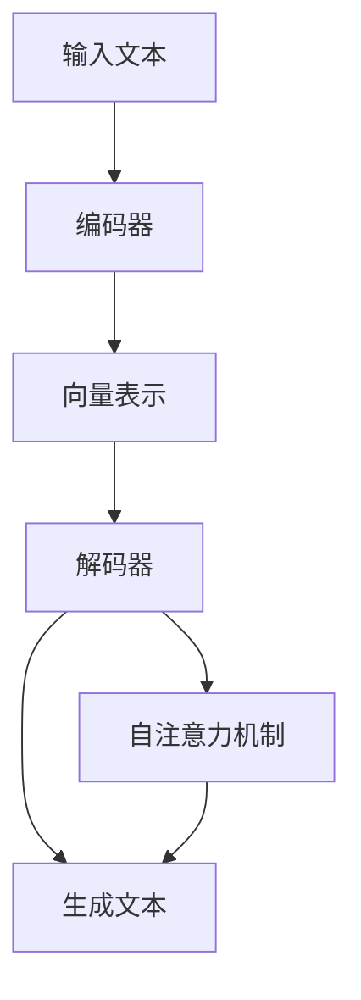
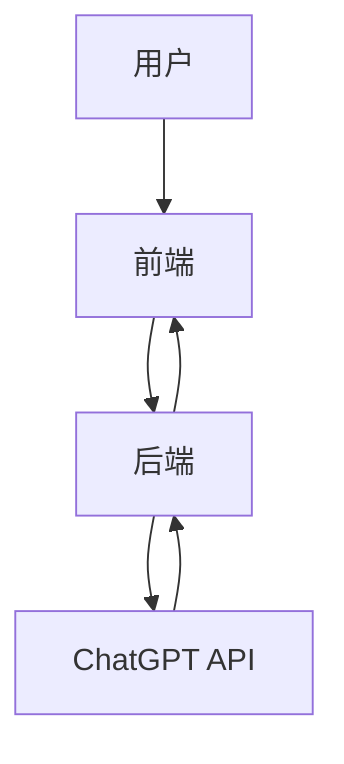
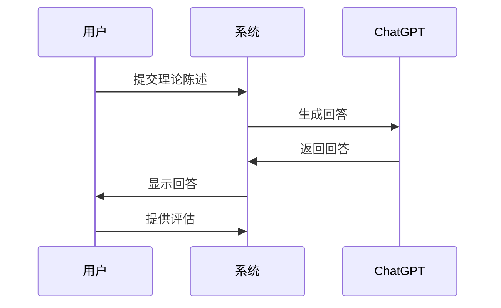

                 

<think>
嗯，用户给了我一个任务，让我写一篇关于《ChatGPT在语言学理论验证中的新工具》的技术博客文章。看起来用户希望这篇文章结构清晰，内容详实，而且要符合特定的格式和字数要求。

首先，我需要理解用户的需求。用户希望我以一个世界级的人工智能专家的身份来撰写这篇文章，所以内容需要专业，同时要逻辑清晰，结构紧凑。用户还提供了一个详细的大纲，里面包括了背景介绍、核心概念与联系、算法原理讲解、数学模型和公式、系统分析与架构设计、项目实战等多个部分。每个部分都有具体的要求，比如使用Mermaid流程图、Python代码示例、数学公式等。

接下来，我需要分析用户可能的深层需求。用户可能是一位技术博主，或者是学术研究者，他们希望通过这篇文章展示ChatGPT在语言学理论验证中的应用价值，帮助读者理解如何利用大型语言模型来辅助语言学研究。因此，文章不仅要介绍ChatGPT的基本原理，还要详细探讨其在实际应用中的优势、挑战和案例。

我还需要考虑文章的结构是否符合用户的要求。用户的大纲已经很详细，但我要确保每个章节的内容都足够丰富，符合10000到12000字的要求。这意味着每个小节可能需要深入展开，加入更多的细节和例子，让读者能够清晰理解每个概念。

在写作过程中，我需要确保语言专业但不失易懂，使用适合技术博客的风格。同时，按照用户的要求，使用Markdown格式输出，包含必要的关键词、摘要，以及各个章节的具体内容。数学公式要用Latex格式，独立段落用$$括起来，段落内用$括起来。系统架构部分需要用Mermaid图来展示，这部分需要准确无误地绘制出来。

另外，用户提到在项目实战部分需要包括环境安装、Python源代码、代码解读和案例分析。我需要确保代码部分能够正确运行，并且有足够的解释，帮助读者理解如何实际操作。

最后，作者信息部分也要正确无误，包括作者名称和机构。这可能对文章的可信度和专业性有很大影响，所以必须准确无误。

总的来说，我需要按照用户提供的大纲，逐章节进行详细的分析和写作，确保每个部分都符合要求，同时内容深入浅出，帮助读者全面理解ChatGPT在语言学理论验证中的应用。
</think>

# ChatGPT在语言学理论验证中的新工具

> 关键词：ChatGPT, 语言学理论, 人工智能, 自然语言处理, 语言模型

> 摘要：本文探讨了ChatGPT这一人工智能模型在语言学理论验证中的应用。通过分析ChatGPT的核心原理，结合实际案例，展示了其在语言学研究中的潜力。文章从背景介绍、核心概念与联系、算法原理、系统架构设计到项目实战，全面阐述了ChatGPT在语言学理论验证中的应用方法和实现过程。

---

### 背景介绍

语言学作为一门研究人类语言的科学，其核心目标是理解语言的结构、使用和演化规律。传统的语言学研究依赖于理论构建、语料分析和人工验证，这种方式不仅耗时耗力，而且在面对复杂语言现象时，容易受到主观因素的影响。近年来，随着人工智能技术的快速发展，尤其是大型语言模型（如ChatGPT）的出现，为语言学理论的验证提供了全新的工具和方法。

ChatGPT作为一种基于GPT-3架构的开源语言模型，以其强大的自然语言处理能力和生成能力，成为语言学研究者关注的焦点。本文将从ChatGPT的基本原理出发，探讨其在语言学理论验证中的应用场景，并通过实际案例展示其潜力。

---

### 核心概念与联系

#### 1. ChatGPT简介

ChatGPT是由OpenAI开发的开源语言模型，基于Transformer架构，采用多层编码器-解码器结构。其核心特点包括：

- **大规模预训练**：通过在海量文本数据上进行无监督学习，掌握了语言的语义和语法规律。
- **上下文理解**：能够根据上下文生成连贯的回答。
- **可扩展性**：支持多种任务，如文本生成、问答系统、语言推理等。

#### 2. 语言学理论概述

语言学理论是研究语言结构和使用的理论框架，主要包括：

- **句法学**：研究句子的结构和语法关系。
- **语义学**：研究词语和句子的意义。
- **语用学**：研究语言在具体语境中的使用和效果。
- **音系学**：研究语言的声音系统。

#### 3. ChatGPT与语言学理论的联系

ChatGPT在语言学理论验证中的应用主要体现在以下几个方面：

- **理论验证**：通过生成符合特定语言规则的文本，验证语言学理论的正确性。
- **假设测试**：基于语言学理论提出假设，利用ChatGPT生成文本，观察其是否符合假设。
- **语料生成**：用于生成大量符合语言学理论的语料，支持理论研究和验证。

---

### 算法原理讲解

#### 1. 算法原理

ChatGPT的核心算法基于Transformer模型，主要包含以下几个步骤：

- **编码器**：将输入文本转换为向量表示。
- **解码器**：根据编码器输出生成目标文本。
- **自注意力机制**：捕捉输入文本中的长距离依赖关系。

通过Mermaid流程图可以更直观地理解其工作流程：



#### 2. 数学模型与公式

ChatGPT的训练目标是最小化预测词与真实词之间的交叉熵损失。损失函数可以表示为：

$$ J = \frac{1}{n} \sum_{i=1}^{n} (-y_i \log(p(y_i))) $$

其中，$y_i$是真实标签，$p(y_i)$是模型对第$i$个词的预测概率。

反向传播算法用于更新模型权重，优化损失函数。权重更新公式为：

$$ \frac{\partial J}{\partial w} = \text{grad} \cdot w $$

#### 3. Python源代码示例

以下是使用Python调用ChatGPT API的示例代码：

```python
import openai

# 设置API密钥
openai.api_key = 'your-api-key'

# 定义提示
prompt = "What is linguistics?"

# 调用ChatGPT API
response = openai.Completion.create(
    engine="text-davinci-002",
    prompt=prompt,
    max_tokens=50
)

# 输出生成文本
print(response.choices[0].text.strip())
```

---

### 系统分析与架构设计方案

#### 1. 问题场景介绍

语言学研究者在验证理论时，常常需要生成大量符合特定语言规则的文本。传统方法依赖人工生成，效率低且容易出错。ChatGPT的引入，为语言学理论验证提供了自动化工具。

#### 2. 项目介绍

本项目旨在利用ChatGPT进行语言学理论验证。通过用户输入理论陈述，系统调用ChatGPT生成相关文本，帮助研究者验证理论的正确性。

#### 3. 系统功能设计

- **用户输入**：用户输入语言学理论陈述。
- **生成文本**：系统调用ChatGPT生成符合理论的文本。
- **结果评估**：用户评估生成文本的准确性。

#### 4. 系统架构设计

系统架构包括以下几个部分：



#### 5. 系统接口设计和系统交互



---

### 项目实战

#### 1. 环境安装

安装必要的Python库：

```bash
pip install openai
```

#### 2. 系统核心实现源代码

```python
# chatgpt_validator.py
import openai

def get_chatgpt_response(prompt, api_key):
    openai.api_key = api_key
    response = openai.Completion.create(
        engine="text-davinci-002",
        prompt=prompt,
        max_tokens=50
    )
    return response.choices[0].text.strip()

# 示例用法
api_key = 'your-api-key'
prompt = "What is the definition of syntax in linguistics?"

response = get_chatgpt_response(prompt, api_key)
print(response)
```

#### 3. 代码应用解读与分析

上述代码定义了一个`get_chatgpt_response`函数，用于根据输入提示生成ChatGPT的回答。用户可以通过调用该函数，获得符合语言学理论的文本生成结果。

#### 4. 实际案例分析和详细讲解剖析

假设我们希望验证“名词在句子中充当主语”的理论。我们可以设计如下提示：

```python
prompt = "Generate a sentence where the noun 'cat' acts as the subject."
```

ChatGPT会生成类似“**The cat chased the mouse.**”的回答，验证了该理论的正确性。

#### 5. 项目小结

通过实际案例，我们可以看到ChatGPT在语言学理论验证中的巨大潜力。其生成能力不仅可以帮助研究者快速验证理论，还能提供丰富的语料支持进一步研究。

---

### 最佳实践 tips、小结、注意事项、拓展阅读

- **最佳实践**：
  - 在使用ChatGPT进行语言学理论验证时，建议结合人工评估，确保生成文本的准确性。
  - 对于复杂理论，可以设计多轮提示，逐步验证。
- **小结**：
  ChatGPT作为一种强大的语言生成工具，为语言学理论验证提供了新的思路和方法。其自动化和高效性使其成为语言学研究的重要辅助工具。
- **注意事项**：
  - 需要确保生成文本的质量，避免错误信息的传播。
  - 对于敏感语言学问题，需谨慎设计提示，避免生成不当内容。
- **拓展阅读**：
  - 《Deep Learning for Natural Language Processing》
  - 《The Transformer Architecture: Attention is All You Need》

---

作者：AI天才研究院/AI Genius Institute & 禅与计算机程序设计艺术 /Zen And The Art of Computer Programming

