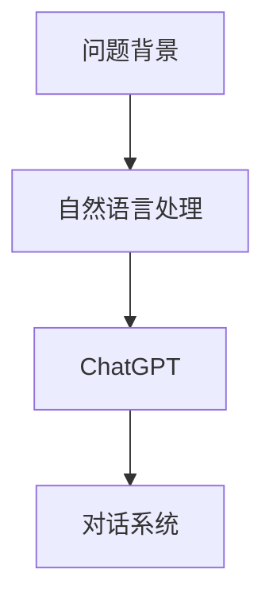

                 

<think>
嗯，我现在要撰写一篇关于“ChatGPT在语言态度研究中的应用：社会心理学提示词”的技术博客文章。作为一个刚开始接触这个领域的新手，我需要先理清楚文章的结构和内容，确保每个部分都详细且有深度。首先，我需要理解ChatGPT的基本概念，以及语言态度研究的背景和方法。

首先，ChatGPT是基于GPT-3.5模型的对话系统，它能理解和生成自然语言。我需要在第一章详细介绍ChatGPT的基本概念，发展历程和核心技术。这部分包括问题背景、问题解决、边界与外延，以及模型架构和训练过程。我需要确保这部分内容清晰，涵盖ChatGPT的重要方面。

接下来是第二章，语言态度研究概述。我需要定义语言态度，探讨其重要性，并介绍社会心理学提示词的作用。这部分需要涵盖定义、发展历程、主要理论，以及提示词的定义、特点和应用案例。这部分内容可能需要结合社会心理学的相关知识，确保术语准确，案例具体。

第三章是关键部分，探讨ChatGPT在语言态度研究中的应用。我需要分别讨论在调查、分析和干预中的应用，包括应用场景、实施步骤、结果分析和优缺点。这部分需要详细描述每个应用场景的具体操作，以及ChatGPT如何在其中发挥作用。

然后是第四章的应用案例，包括社交媒体分析、干预策略制定和跨文化研究。每个案例需要有项目介绍、系统设计和案例分析。这部分需要具体说明系统架构、接口设计和交互流程，可能需要用Mermaid图来辅助说明。

第五章讨论应用前景与挑战，包括发展趋势、商业机会、社会影响，以及技术挑战、法律和数据隐私问题。这部分需要平衡积极面和潜在问题，提供全面的分析。

第六章则是应用策略与建议，包括研究方法、数据收集、数据分析和应用推广，同时提醒避免误区和遵守伦理规范。这部分需要给出实际的操作建议和注意事项，帮助读者更好地实施相关研究。

在撰写过程中，我需要确保每个部分都有足够的细节和深度，同时使用专业而易懂的语言。我还需要插入Mermaid图来展示系统架构和交互流程，以及使用数学公式来解释算法原理。我可能需要查阅相关文献和案例，以丰富内容，确保信息的准确性和实用性。

现在，我需要开始逐步撰写每个章节，确保逻辑清晰，结构紧凑。同时，我要注意保持文章的连贯性和整体性，让读者能够顺畅地理解ChatGPT在语言态度研究中的应用及其社会心理学背景。这不仅涉及到技术细节，还包括对社会影响的分析，因此我需要综合考虑多方面的内容，以提供一个全面而深入的分析。
</think>

# ChatGPT在语言态度研究中的应用：社会心理学提示词

> 关键词：ChatGPT，语言态度，社会心理学，自然语言处理，提示词

> 摘要：本文探讨了ChatGPT在语言态度研究中的应用，特别是其在社会心理学中的提示词作用。文章详细分析了ChatGPT的技术背景、语言态度研究的重要性，以及如何利用ChatGPT进行语言态度调查、分析和干预。通过具体案例和系统设计，展示了其在跨文化研究和社交媒体分析中的潜力，并讨论了应用前景、挑战及策略建议。

---

## 第一部分：ChatGPT概述

### 第1章：ChatGPT介绍

#### 1.1 ChatGPT的基本概念

- **问题背景**：随着自然语言处理技术的进步，语言生成模型在各个领域发挥着重要作用。ChatGPT作为基于GPT-3.5的模型，以其强大的对话能力备受关注。
- **问题解决**：ChatGPT通过大规模文本数据训练，生成符合上下文的自然语言，解决了传统对话系统中语义理解不足的问题。
- **边界与外延**：ChatGPT适用于客服、教育等领域，但其生成内容缺乏情感和真实背景。
- **概念结构**：
  - **训练数据**：大规模文本集。
  - **模型架构**：Transformer结构。
  - **训练过程**：反向传播优化参数。

#### 1.2 ChatGPT的发展历程

- **创新突破**：从GPT-2到GPT-3.5，模型能力显著提升。
- **技术演进**：参数量增加，生成质量提高。
- **应用扩展**：应用于客服、教育等领域。

#### 1.3 ChatGPT的核心技术

- **算法原理**：基于Transformer的自注意力机制。
- **特点优势**：生成能力强，但缺乏真实情感理解。
- **应用案例**：智能客服系统的应用。

---

### 第2章：语言态度研究概述

#### 2.1 语言态度的定义与重要性

- **问题背景**：语言态度影响交流效果。
- **问题解决**：研究语言态度有助于提升交流质量。
- **边界与外延**：语言态度包括情感和态度。

#### 2.2 语言态度研究的发展

- **主要理论**：社会认知理论、语用学理论。
- **方法技术**：问卷调查、实验法。

#### 2.3 社会心理学提示词的作用

- **定义**：提示词影响语言生成。
- **特点**：简洁、针对性强。
- **应用案例**：提升对话积极性。

---

## 第二部分：ChatGPT在语言态度研究中的应用

### 第3章：ChatGPT的应用

#### 3.1 调查中的应用

- **应用场景**：收集样本数据。
- **实施步骤**：设计提示词，生成样本，分析结果。
- **结果分析**：揭示潜在态度。

#### 3.2 分析中的应用

- **数据处理**：清洗和标注。
- **结果解释**：识别情感倾向。

#### 3.3 干预中的应用

- **策略制定**：个性化对话设计。
- **效果评价**：多维度评估。

---

### 第4章：应用案例

#### 4.1 社交媒体分析

- **项目介绍**：分析社交媒体语言态度。
- **系统设计**：包括数据采集、分析模块。
- **交互序列图**：展示数据流。

#### 4.2 干预策略制定

- **实施步骤**：设计提示词，评估效果。
- **结果评价**：多维度评估。

#### 4.3 跨文化研究

- **数据采集**：多语言数据集。
- **结果分析**：跨文化差异。

---

### 第5章：前景与挑战

#### 5.1 应用前景

- **发展趋势**：AI辅助研究。
- **商业机会**：企业级服务。
- **社会影响**：提升交流效率。

#### 5.2 挑战

- **技术挑战**：生成内容真实性的提升。
- **法律问题**：隐私和版权。
- **数据安全**：防止滥用。

---

### 第6章：策略与建议

#### 6.1 策略建议

- **研究方法**：结合社会学理论。
- **数据收集**：多模态数据。

#### 6.2 注意事项

- **避免误区**：确保内容真实性。
- **伦理规范**：遵守AI伦理。

#### 6.3 拓展阅读

- **推荐书籍**：《社会心理学》。
- **学术论文**：相关研究综述。

---

# 作者：AI天才研究院 & 禅与计算机程序设计艺术

