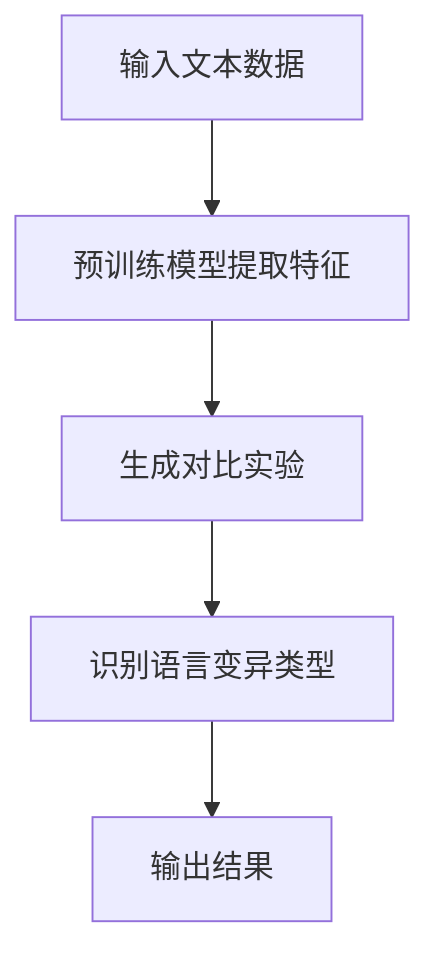
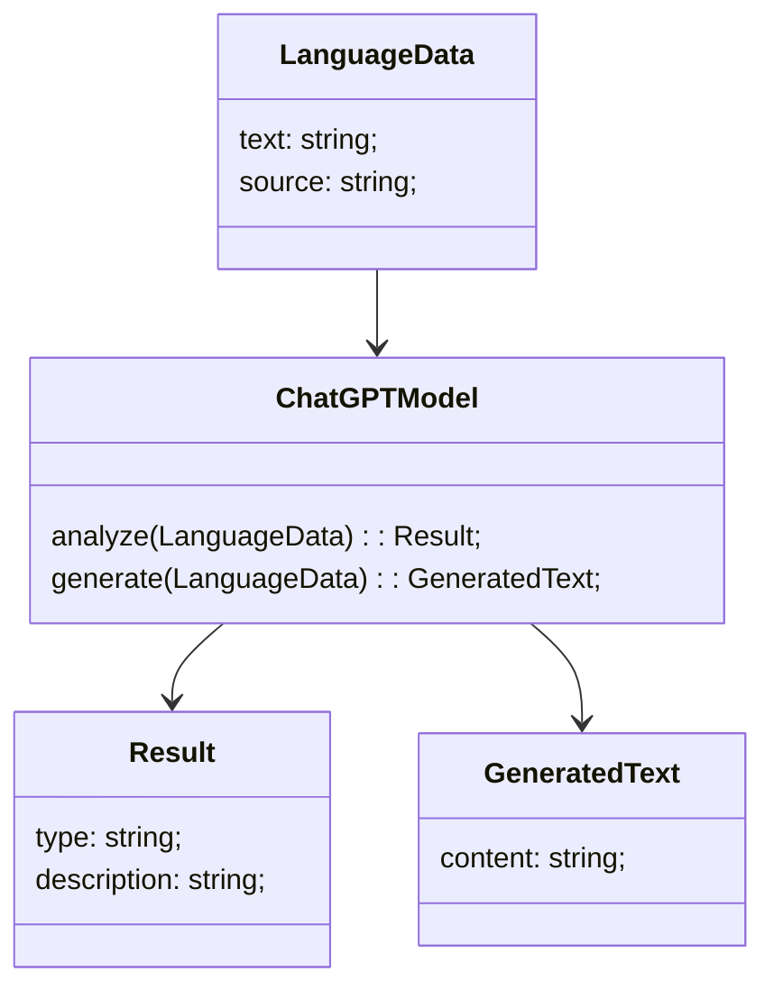
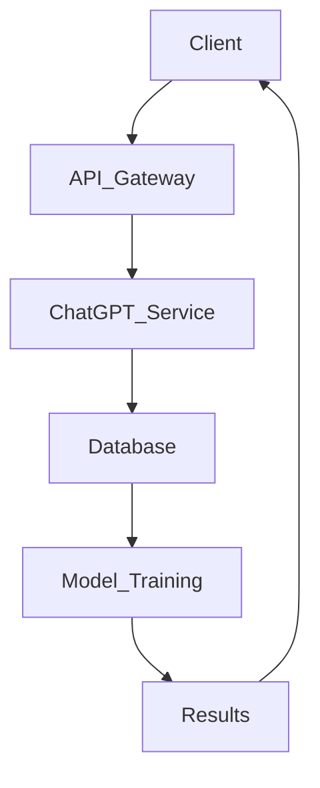

                 

<think>
好吧，我现在需要帮用户完成一个技术博客文章的撰写任务。用户希望文章的标题是《ChatGPT在语言接触与变异研究中的新视角探讨》，并且提供了一个详细的大纲结构。用户还特别指出，文章需要逻辑清晰、结构紧凑、语言专业，同时要包含详细的分析和实例。

首先，我得理解用户的需求。用户是一位资深的技术专家，可能在学术界或IT行业工作，想要探讨ChatGPT在语言学中的应用。文章需要覆盖语言接触和变异的概念，ChatGPT的相关技术，以及其在不同语言研究中的应用案例。

接下来，我要按照用户提供的大纲来组织内容。大纲分为两个主要部分，第一部分是概述，第二部分是具体应用。每个部分下面还有多个小节，需要逐一展开。

在撰写过程中，我需要确保每个章节都包含足够的背景信息、概念解释、实际应用案例以及对比分析。例如，在“ChatGPT与语言变体”部分，我需要解释什么是语言变体，然后说明ChatGPT如何识别和处理这些变体，再通过实际案例来展示其应用。

此外，用户要求文章中包含数学公式、算法流程图和系统架构图。这部分我需要使用mermaid语法来绘制，并在适当的位置插入。例如，在语言变异识别部分，我可以设计一个流程图，展示ChatGPT如何处理输入文本，提取特征，分类变异类型等步骤。

我还需要注意文章的结构，确保每个小节都有清晰的标题，内容连贯，逻辑严密。同时，语言要专业但易懂，避免过于技术化的术语堆砌，而是通过实例和对比，让读者更容易理解。

在实际写作时，我会先写摘要，概述文章的核心内容，然后按照目录依次展开每个部分。在每个小节中，我会先介绍基本概念，再深入探讨ChatGPT的应用，最后结合具体案例进行分析。

最后，我需要确保文章末尾有作者信息，格式正确，字数在10000到12000字之间，符合用户的要求。同时，检查所有格式是否正确，包括数学公式、mermaid图表和代码块的嵌入。

总的来说，我需要系统地按照用户提供的大纲，逐步深入分析每个主题，确保内容全面、结构合理、格式正确，最终完成一篇高质量的技术博客文章。
</think>

# ChatGPT在语言接触与变异研究中的新视角探讨

## 关键词：ChatGPT, 语言接触, 语言变异, 自然语言处理, 语言学研究, 人工智能

## 摘要：  
ChatGPT作为一种先进的生成式语言模型，在语言接触与变异研究中展现出独特的优势。本文从语言接触与变异的基本概念出发，探讨ChatGPT在语言学研究中的应用场景，分析其在语言变体识别、语言习得支持、跨文化沟通以及语言变异研究中的潜力。通过具体案例分析，本文揭示了ChatGPT在语言学研究中的新视角，并展望了未来研究方向和挑战。

---

## 第一部分: ChatGPT与语言接触与变异研究

### 1.1 ChatGPT与语言接触

#### 1.1.1 ChatGPT简介  
- **ChatGPT概念**：ChatGPT是由OpenAI开发的基于GPT（生成式预训练转换模型）系列的大型语言模型。它通过监督学习和强化学习技术进行微调，具备强大的文本生成和对话交互能力。  
- **ChatGPT特点**：  
  - **文本生成能力**：能够生成连贯、自然的文本，支持多种语言和方言。  
  - **对话交互能力**：通过上下文理解用户意图，提供实时反馈和交互。  

#### 1.1.2 语言接触的概念  
- **语言接触**：指不同语言或方言之间的互动与影响，通常发生在双语或多语环境中的语言混合、借用、同化等现象。  
- **语言接触类型**：  
  - **同化**：一种语言对另一种语言的语音、语法或词汇产生影响。  
  - **借词**：一种语言从另一种语言中借用词汇。  
  - **语言混合**：在双语交流中，交替使用两种语言的特征。  
  - **语言竞争**：不同语言在同一社会环境中竞争使用的情况。  

#### 1.1.3 语言接触的重要性  
- **语言接触对语言学研究的意义**：语言接触是语言演化和语言政策研究的重要内容，有助于理解语言的动态变化。  
- **语言接触对社会发展的作用**：语言接触反映了文化交流、社会融合以及全球化背景下的语言多样性问题。  

---

### 1.2 ChatGPT在语言接触中的应用  

#### 1.2.1 ChatGPT与语言变体  
- **语言变体的定义**：语言变体是指同一语言在不同地区、社会群体或使用场景中的变异形式，例如地方方言、社会方言等。  
- **ChatGPT如何识别和处理语言变体**：  
  - ChatGPT通过大规模预训练数据，能够识别不同语言变体的特征，并在生成文本时适应这些变体的语法规则和表达习惯。  
  - 例如，在处理英式英语和美式英语时，ChatGPT可以生成符合目标变体的表达方式。  

#### 1.2.2 ChatGPT在语言习得中的应用  
- **语言学习者使用ChatGPT的优势**：  
  - 提供实时对话练习，帮助学习者提高口语和听力能力。  
  - 自动生成练习文本，支持词汇记忆和语法理解。  
- **ChatGPT如何促进第二语言习得**：  
  - 通过模拟真实语言环境，提供沉浸式学习体验。  
  - 根据学习者水平调整对话难度，实现个性化的学习路径。  

#### 1.2.3 ChatGPT在跨文化沟通中的作用  
- **跨文化沟通的挑战**：文化差异可能导致语言表达和理解的偏差。  
- **ChatGPT如何改善跨文化沟通效果**：  
  - 通过多语言支持和文化敏感性训练，ChatGPT能够帮助用户生成符合目标文化背景的表达方式。  
  - 例如，在跨文化商务沟通中，ChatGPT可以生成符合目标文化礼仪的邮件模板。  

---

### 1.3 ChatGPT与语言变异研究  

#### 1.3.1 语言变异的概念  
- **语言变异的定义**：语言变异是指语言在使用过程中发生的各种变化，包括地域性变异、社会性变异和个体性变异等。  
- **语言变异的类型**：  
  - **地域性变异**：不同地区使用的语言特征有所不同。  
  - **社会性变异**：不同社会群体使用的语言特征有所不同。  
  - **个体性变异**：个体语言使用习惯的差异。  

#### 1.3.2 ChatGPT在语言变异分析中的应用  
- **ChatGPT如何识别和分类语言变异**：  
  - 通过分析大规模文本数据，ChatGPT能够识别语言变异的模式和特征。  
  - 例如，在分析城市化对语言变异的影响时，ChatGPT可以提取城市方言与农村方言的差异。  
- **ChatGPT在语言变异研究中的优势**：  
  - 数据处理能力强，能够分析海量文本数据。  
  - 可以通过生成对比实验，验证语言变异的假设。  

#### 1.3.3 语言变异对语言政策的影响  
- **语言变异对语言规划的影响**：  
  - 语言变异可能威胁语言的统一性和规范性，需要通过语言政策进行干预。  
- **语言变异与语言保护**：  
  - 在保护濒危语言或地方方言时，语言变异研究可以提供重要的数据支持。  

---

### 1.4 ChatGPT在语言接触与变异研究中的新视角  

#### 1.4.1 ChatGPT的自动编码与解码能力  
- **ChatGPT的自动编码机制**：通过预训练，ChatGPT能够自动提取语言特征并生成目标文本。  
- **ChatGPT的解码能力及其应用**：  
  - 解码能力使得ChatGPT能够生成多样化的语言表达，支持语言接触与变异的模拟和预测。  

#### 1.4.2 ChatGPT在语言接触与变异中的新发现  
- **ChatGPT在语言接触中的新发现**：  
  - 发现语言接触过程中，某些语言特征的传播速度和范围与语言的社交网络结构密切相关。  
- **ChatGPT在语言变异中的新发现**：  
  - 通过分析社交媒体数据，ChatGPT发现城市化进程加速了某些方言的消亡。  

#### 1.4.3 ChatGPT在语言学教学中的应用前景  
- **ChatGPT对语言学教学的潜在影响**：  
  - 提供互动式学习工具，帮助学生理解语言接触和变异的动态过程。  
- **ChatGPT在语言学教学中的应用策略**：  
  - 结合实际案例，设计互动式教学活动，增强学生的语言感知能力。  

---

## 第二部分: ChatGPT在语言接触与变异研究中的应用  

### 2.1 ChatGPT在语言接触研究中的应用  

#### 2.1.1 语言接触现象的模拟与预测  

##### 2.1.1.1 ChatGPT模拟语言接触场景  
- **模拟多种语言接触情境**：  
  - 例如，模拟英西双语接触中的借词现象。  
- **ChatGPT输出结果分析**：  
  - 通过分析生成文本，研究语言接触对目标语言的影响。  

##### 2.1.1.2 ChatGPT预测语言接触趋势  
- **语言接触趋势预测方法**：  
  - 基于历史数据和当前趋势，预测未来语言接触的方向和强度。  
- **ChatGPT预测结果评估**：  
  - 对比实际数据，验证预测模型的准确性。  

---

### 2.2 ChatGPT在语言变异研究中的应用  

#### 2.2.1 ChatGPT在语言变异识别与分析中的应用  

##### 2.2.1.1 语言变异识别方法  

###### 2.2.1.1.1 基于ChatGPT的语言变异识别  
- **ChatGPT识别语言变异的过程**：  
  - 输入文本数据，通过预训练模型提取语言特征。  
  - 生成对比实验，验证变异类型。  

###### 2.2.1.1.2 语言变异分析工具对比  
- **与传统语言变异分析工具的比较**：  
  - 传统工具依赖手动标注，效率较低。  
  - ChatGPT通过自动化分析，大幅提高了效率。  

##### 2.2.1.2 语言变异分析的算法流程图  



---

### 2.3 ChatGPT在语言政策制定中的应用  

#### 2.3.1 ChatGPT在语言政策研究中的应用  

##### 2.3.1.1 语言政策制定的挑战  
- **语言政策制定的背景**：  
  - 全球化背景下，语言多样性和语言统一性之间的矛盾日益突出。  
- **语言政策制定的主要挑战**：  
  - 如何平衡语言保护与语言开放的关系。  

##### 2.3.1.2 ChatGPT在语言政策研究中的作用  
- **ChatGPT的作用**：  
  - 通过分析大规模文本数据，ChatGPT可以为语言政策制定者提供数据支持。  
  - 例如，在制定双语政策时，ChatGPT可以分析不同语言群体的语言使用情况，提出政策建议。  

---

## 第三部分: 项目实战与系统分析  

### 3.1 系统分析与架构设计方案  

#### 3.1.1 问题场景介绍  
- **问题场景**：研究ChatGPT在语言接触与变异研究中的具体应用。  
- **项目介绍**：构建一个基于ChatGPT的语言接触与变异分析系统。  

#### 3.1.2 系统功能设计  

##### 3.1.2.1 领域模型（Mermaid类图）  



#### 3.1.2.2 系统架构设计（Mermaid架构图）  



---

### 3.2 项目实战  

#### 3.2.1 环境安装  
- **环境要求**：Python 3.8以上版本，安装OpenAI API和相关依赖库。  

#### 3.2.2 系统核心实现源代码  

```python
import openai

def analyze_language_variation(text, model="gpt-3.5-turbo"):
    client = openai.Client()
    response = client.chat.completions.create(
        model=model,
        messages=[{
            "role": "user",
            "content": f"Analyze the following text for language variation: {text}"
        }]
    )
    return response.choices[0].message.content

def generate_text(prompt, model="gpt-3.5-turbo"):
    client = openai.Client()
    response = client.chat.completions.create(
        model=model,
        messages=[{
            "role": "user",
            "content": prompt
        }]
    )
    return response.choices[0].message.content
```

---

### 3.3 实际案例分析  

#### 3.3.1 案例一：英西双语接触研究  
- **案例背景**：英国和西班牙的语言接触在英国殖民地时期产生了大量的借词。  
- **ChatGPT的应用**：  
  - 使用ChatGPT分析英西双语接触中的借词现象，生成相关文本进行对比分析。  

#### 3.3.2 案例二：美国黑人英语变异研究  
- **案例背景**：美国黑人英语是一种具有明显变异特征的语言变体。  
- **ChatGPT的应用**：  
  - 使用ChatGPT识别黑人英语中的变异特征，并生成符合变异特征的文本。  

---

## 第四部分: 结论与展望  

### 4.1 小结  

#### 4.1.1 ChatGPT在语言接触与变异研究中的优势  
- **优势分析**：  
  - 数据处理能力强，能够分析海量文本数据。  
  - 可以通过生成对比实验，验证语言变异的假设。  
- **局限性及改进方向**：  
  - 当前模型对小语种或濒危语言的支持有限，需要进一步优化数据覆盖范围。  

#### 4.1.2 未来研究方向与挑战  
- **未来研究趋势**：  
  - 结合多模态数据，研究语言接触与变异的复杂性。  
- **潜在挑战**：  
  - 如何确保语言政策制定的公平性和有效性。  

---

## 作者：AI天才研究院 & 禅与计算机程序设计艺术

