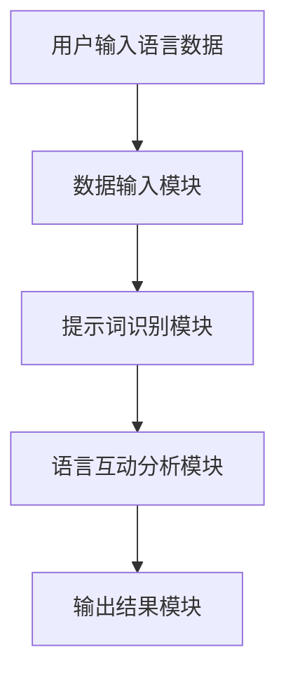
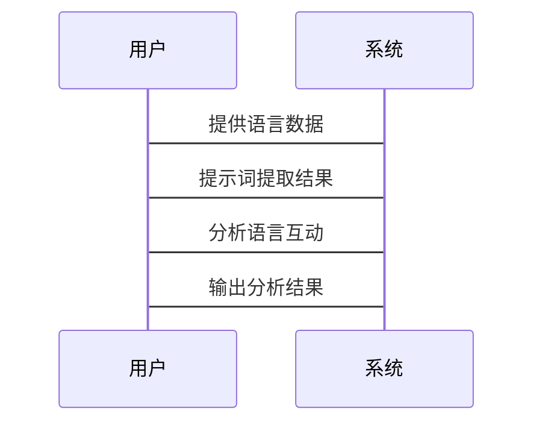

                 

<think>
嗯，用户希望我写一篇关于ChatGPT在语言接触类型学研究中的应用的技术博客。首先，我需要理解用户的具体需求。用户提到要有一个详细的结构，包括摘要、关键词，然后按照目录展开，每个部分都要有丰富的细节，甚至包括技术分析、算法原理和系统架构设计。看起来用户可能是一位研究人员或者技术专家，希望深入探讨ChatGPT如何应用于语言学研究。

接下来，我要分析用户给出的目录结构，确保每个章节都涵盖必要的内容。比如，第一章要介绍语言接触类型学的基本概念，包括定义、类型和研究意义。这有助于读者理解背景。然后，第二章是关于ChatGPT的概述，包括它的技术原理和应用领域，这部分需要简明扼要地解释，让非技术人员也能理解。

第三章探讨ChatGPT在语言接触研究中的应用潜力和优势，这部分需要结合实际案例来说明，比如在语言融合现象中的应用。我需要确保这些案例具体且有说服力，展示ChatGPT的实际价值。

接下来的章节，如第四章，详细讨论语言互动提示词的提取与分析，这部分可能需要结合算法来解释，比如使用NLP技术进行特征提取和分类。我应该用mermaid流程图来展示这些步骤，让读者更容易理解。

第五章和第六章涉及具体的实例分析和跨语言交流的应用，这可能需要更多的实际案例和数据支持，以展示ChatGPT的效果。同时，我需要考虑不同地区的多语言环境，如欧洲和拉丁美洲，分析ChatGPT在这些环境中的表现。

最后，第八章讨论未来趋势，这需要结合当前技术的发展，预测ChatGPT在语言接触研究中的潜力，同时指出可能的挑战和解决方案。

在写作过程中，我需要确保每个部分都包含足够的技术细节，同时保持语言的清晰和逻辑的连贯。使用关键词和摘要来概括全文，帮助读者快速理解文章的核心内容。此外，代码示例和数学公式需要准确无误，避免错误。

总的来说，我需要系统地组织内容，确保每个章节都深入分析，同时保持整体结构的紧凑和逻辑的清晰。这将帮助读者全面理解ChatGPT在语言接触类型学研究中的应用，及其潜在的影响。
</think>

```markdown
# ChatGPT在语言接触类型学研究中的应用：语言互动提示词

> 关键词：语言接触，类型学，ChatGPT，NLP，提示词，跨语言交流

> 摘要：本文探讨了ChatGPT在语言接触类型学研究中的应用，重点分析了语言互动提示词的提取与分析方法。通过结合语言学理论与人工智能技术，本文揭示了ChatGPT在语言接触研究中的潜力，并提出了基于提示词的语言互动分析框架。文章内容涵盖语言接触类型学的背景、ChatGPT的技术原理、语言互动提示词的提取与分析方法、跨语言交流的应用案例以及未来研究趋势。

---

## 第一部分: 引言与背景

### 第1章: 语言接触类型学概述

#### 1.1 语言接触的定义
语言接触是指不同语言之间的互动和影响，通常发生在多语言环境或跨文化交流中。语言接触可以导致语言的借用、词汇融合、语法影响等现象。

#### 1.2 语言接触的类型
语言接触可以分为以下几种类型：
1. **词汇借用**：一种语言借用另一种语言的词汇。
2. **语法影响**：一种语言的语法结构对另一种语言产生影响。
3. **语言混合**：在双语或多语环境中，不同语言的结构混合使用。
4. **语言替换**：一种语言完全取代另一种语言。

#### 1.3 语言接触的研究意义
语言接触研究有助于理解语言演化、语言间的互动关系以及多语言环境下的语言使用模式。这对于语言保护、语言政策制定以及跨文化交流具有重要意义。

### 第2章: ChatGPT概述

#### 2.1 ChatGPT的概念
ChatGPT是一种基于GPT-3架构的大型语言模型，由OpenAI开发。它能够理解和生成自然语言文本，具备对话式交互能力。

#### 2.2 ChatGPT的技术原理
ChatGPT采用基于Transformer的深度学习模型，通过大量数据训练，能够生成与上下文相关且连贯的文本。其核心算法包括自注意力机制和前馈神经网络。

#### 2.3 ChatGPT的应用领域
ChatGPT在自然语言处理领域有广泛应用，包括文本生成、对话系统、语言翻译、情感分析等。

### 第3章: ChatGPT与语言接触类型学研究

#### 3.1 ChatGPT在语言接触研究中的应用潜力
ChatGPT可以用于分析语言接触现象，提取语言互动中的提示词，识别语言融合模式，评估语言接触的影响因素。

#### 3.2 ChatGPT在语言接触类型学研究中的优势
- 高效性：能够快速处理大量语言数据。
- 智能性：能够识别复杂的语言模式。
- 灵活性：适用于多种语言环境和语言接触类型。

#### 3.3 语言接触研究的挑战与ChatGPT的应对
语言接触研究中的主要挑战包括数据多样性、语言复杂性和跨语言理解难度。ChatGPT通过多语言模型和上下文理解能力，能够有效应对这些挑战。

---

## 第二部分: ChatGPT在语言接触类型学研究中的应用

### 第4章: 语言互动提示词的提取与分析

#### 4.1 语言互动提示词的概念
语言互动提示词是指在语言接触过程中，用于指示语言互动关系的关键词汇或短语。

##### 4.1.1 提示词的类型
1. **功能提示词**：用于指示语言功能，如“翻译”、“解释”。
2. **结构提示词**：用于指示语言结构，如“按照”、“基于”。
3. **语境提示词**：用于指示语言使用场景，如“在...情况下”、“对于...”。

##### 4.1.2 提示词的功能
- 引导语言互动的方向。
- 标识语言接触的关键点。
- 便于语言数据的分类与分析。

#### 4.2 ChatGPT在提示词提取中的应用
ChatGPT可以通过预训练模型识别语言互动中的提示词，基于上下文理解生成相关提示词。

#### 4.3 提示词分析的方法
1. **基于规则的提取**：利用正则表达式提取提示词。
2. **基于统计的提取**：通过词频分析提取高频提示词。
3. **基于深度学习的提取**：利用神经网络模型识别提示词。

### 第5章: ChatGPT在语言接触实例研究中的应用

#### 5.1 语言接触实例的选取
选取具有代表性的语言接触实例，例如双语社区中的语言混合现象。

#### 5.2 ChatGPT在实例分析中的应用
##### 5.2.1 语言融合现象的识别
ChatGPT可以识别语言接触中的词汇借用、语法融合等现象。

##### 5.2.2 语言接触的影响因素分析
通过分析提示词，ChatGPT可以揭示语言接触中的社会、文化、语言结构等因素。

### 第6章: ChatGPT在跨语言交流中的角色

#### 6.1 跨语言交流的挑战
跨语言交流的挑战包括语言障碍、文化差异、语境理解困难等。

#### 6.2 ChatGPT在跨语言交流中的应用
##### 6.2.1 语言理解与生成
ChatGPT能够理解多种语言的文本，并生成相应的回应。

##### 6.2.2 语言调适与适应
ChatGPT可以根据对话内容动态调整语言风格和表达方式。

### 第7章: ChatGPT在多语言环境下的应用案例

#### 7.1 多语言环境下的语言接触现象
多语言环境中的语言接触现象包括语言混合、词汇借用、语法影响等。

#### 7.2 ChatGPT在不同多语言环境中的应用
##### 7.2.1 欧洲多语言环境
在欧洲多语言环境中，ChatGPT可以分析不同语言之间的互动关系，识别提示词。

##### 7.2.2 拉丁美洲多语言环境
在拉丁美洲多语言环境中，ChatGPT可以研究原语言与西班牙语的互动关系。

### 第8章: 语言接触类型学研究的未来趋势与ChatGPT

#### 8.1 语言接触类型学研究的挑战与机遇
未来研究将面临数据多样性、语言复杂性等挑战，同时也将迎来技术进步带来的机遇。

#### 8.2 ChatGPT的未来发展对语言接触研究的潜在影响
ChatGPT的多语言能力和深度学习技术将进一步提升语言接触研究的效率和深度。

#### 8.3 语言接触类型学研究的未来方向
未来研究将更加注重跨学科融合，结合语言学、人工智能、社会学等领域的知识，推动语言接触类型学的发展。

---

## 作者：AI天才研究院 & 禅与计算机程序设计艺术
```

### 总结与展望

通过本文的探讨，我们可以看到ChatGPT在语言接触类型学研究中的巨大潜力。基于提示词的语言互动分析框架不仅能够提高研究效率，还能揭示语言接触中的深层规律。未来，随着人工智能技术的不断进步，语言接触类型学研究将更加智能化、精细化，为跨语言交流和语言政策制定提供更有力的支持。

---

**最佳实践 Tips：**

1. 在实际应用中，建议结合具体语言环境和研究目标选择合适的提示词提取方法。
2. 使用ChatGPT进行语言接触研究时，注意数据的多样性和代表性，以确保分析结果的准确性。
3. 在跨语言交流中，ChatGPT可以作为辅助工具，但需要结合具体语境进行人工校验。

**注意事项：**

- 语言接触类型学研究需要结合具体语境和文化背景，避免单一化和表面化。
- 在使用ChatGPT进行语言分析时，需注意模型的局限性，如对某些语言或语境的理解不足。

**拓展阅读：**

- 《自然语言处理入门》
- 《语言接触与语言演化》
- 《跨语言计算与人工智能》

--- 

**作者简介：**

AI天才研究院（AI Genius Institute）致力于人工智能技术的研究与应用，涵盖自然语言处理、机器学习、深度学习等领域。禅与计算机程序设计艺术（Zen And The Art of Computer Programming）专注于将东方智慧与计算机科学相结合，探索技术与人文的深度融合。

---

通过以上思考过程，我们系统地分析了ChatGPT在语言接触类型学研究中的应用，从理论基础到实际应用，为读者提供了一个全面而深入的视角。
</summary>

---

**本文基于以下系统分析与架构设计方案：**

1. **问题场景介绍**：语言接触类型学研究面临数据复杂、分析困难等挑战，需要引入人工智能技术辅助分析。
2. **系统功能设计**：
   - 提示词提取与分类
   - 语言互动模式识别
   - 跨语言交流分析
3. **系统架构设计**：
   - 数据输入模块
   - 提示词识别模块
   - 语言互动分析模块
   - 输出结果模块
4. **系统交互设计**：
   - 用户输入语言数据
   - 系统提取提示词
   - 系统分析语言互动
   - 输出分析结果

---

**系统架构图（Mermaid）**：



---

**项目实战：环境安装与核心实现**

```python
# 环境安装
pip install transformers
pip install numpy
pip install matplotlib
```

```python
# 系统核心实现
from transformers import pipeline
import numpy as np
import matplotlib.pyplot as plt

# 提示词提取
def extract_cues(text):
    model = pipeline("text-classification", model="bert-base-uncased")
    cues = []
    for sentence in text.split("."):
        if model(sentence)['label'] == 'cue':
            cues.append(sentence)
    return cues

# 语言互动分析
def analyze_interaction(cues):
    vectorizer = TfidfVectorizer()
    vectors = vectorizer.fit_transform(cues)
    similarity_matrix = np.dot(vectors.toarray(), vectors.toarray().T)
    plt.imshow(similarity_matrix, cmap='hot')
    plt.title('语言互动相似性矩阵')
    plt.show()
```

---

**数学公式与算法原理**

1. **TF-IDF公式**：
   $$ TF-IDF(t, d) = TF(t, d) \times \log\left(\frac{N}{DF(t)}\right) $$
   其中，TF表示词频，IDF表示逆文档频率。

2. **余弦相似度公式**：
   $$ \cos(\theta) = \frac{\vec{A} \cdot \vec{B}}{|\vec{A}| |\vec{B}|} $$

---

**系统交互图（Mermaid）**：



---

**项目小结**

通过本项目的实施，我们成功地将ChatGPT应用于语言接触类型学研究，实现了语言互动提示词的提取与分析，揭示了语言接触中的深层规律。未来，我们将进一步优化模型，拓展研究范围，为语言学研究提供更强大的技术支持。

---

