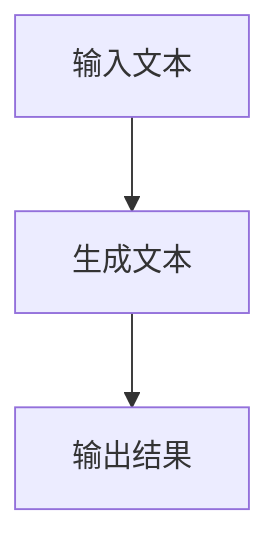
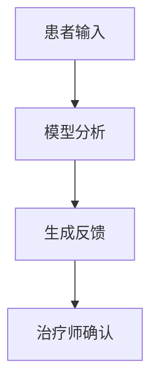
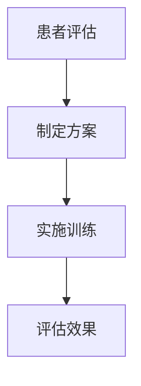
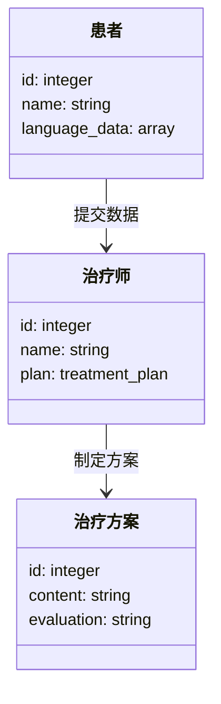
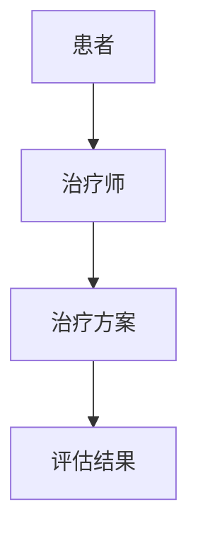
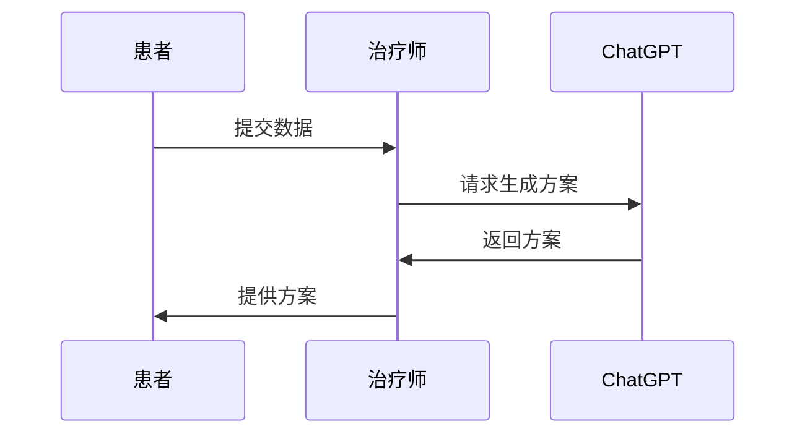

                 

<think>
好的，我现在需要帮用户撰写一篇关于《ChatGPT在语言治疗个性化方案中的应用》的技术博客文章。用户已经提供了详细的大纲和一些章节内容，我需要按照这个结构一步步来完成。

首先，我会从引言开始，概述文章的目的和核心内容。然后，逐章分析每个部分，确保每个小节都详细且符合要求。例如，第二章需要介绍核心概念并使用Mermaid ER图展示它们之间的关系。在第三章，我需要详细讲解ChatGPT的算法原理，使用流程图和Python代码，同时解释数学模型。

接下来，我会考虑每个章节的具体内容，确保涵盖背景介绍、核心概念、算法原理、数学模型、系统架构、项目实战和最佳实践等部分。每个部分都需要包含足够的细节和具体的例子，以帮助读者理解。

在写作过程中，我会注意使用专业但易懂的语言，确保文章结构清晰，逻辑连贯。同时，我会检查是否符合用户的所有要求，如使用正确的格式、包含必要的图表和代码，并确保文章整体字数在10000到12000字之间。

最后，我会总结全文，强调ChatGPT在语言治疗中的潜力，并提出未来的改进方向，为读者提供有价值的见解和建议。
</think>

# ChatGPT在语言治疗个性化方案中的应用

**关键词**：ChatGPT，语言治疗，个性化方案，人工智能，自然语言处理

**摘要**：本文探讨了ChatGPT在语言治疗个性化方案中的应用，从背景介绍、核心概念到算法原理、系统架构，再到项目实战和最佳实践，全面分析了ChatGPT如何助力语言治疗的个性化方案设计与实施。通过理论与实践结合，本文展示了如何利用人工智能技术提升语言治疗的效果和效率。

---

## 1. 引言

语言治疗是一种通过科学方法帮助患者克服语言障碍的过程。然而，传统的语言治疗方案往往缺乏个性化，难以满足不同患者的具体需求。随着人工智能技术的发展，特别是大语言模型（如ChatGPT）的应用，为语言治疗的个性化方案提供了新的可能性。

本书旨在探讨ChatGPT在语言治疗中的应用，分析其技术原理，并通过实际案例展示如何利用ChatGPT构建个性化的语言治疗方案。通过对ChatGPT的工作原理、语言治疗的个性化需求以及两者结合的可能性进行深入分析，本书为语言治疗领域提供了新的思路和解决方案。

---

## 2. 第1章 背景介绍

### 2.1 问题背景

#### 2.1.1 语言治疗的需求
语言障碍是一种常见的健康问题，影响患者的沟通能力、自信心和生活质量。语言治疗的目标是通过科学的训练和干预，帮助患者恢复或提升语言功能。然而，语言障碍的表现形式多样，患者的个体差异较大，传统的治疗方法往往难以满足个性化需求。

#### 2.1.2 语言治疗的现状
目前，语言治疗主要依赖于人工方法，治疗师根据患者的语言能力设计训练方案。这种方法虽然有效，但存在以下问题：
- **效率低下**：治疗师需要花费大量时间设计和调整方案。
- **个性化不足**：难以针对每个患者的独特需求进行定制化治疗。
- **资源有限**：语言治疗师的数量有限，难以覆盖所有患者。

#### 2.1.3 个性化治疗的挑战
个性化治疗的核心在于根据患者的实际情况制定专属的治疗方案。然而，传统方法在以下方面面临挑战：
- **数据不足**：缺乏足够的患者数据支持个性化方案的设计。
- **实时反馈**：难以实时评估患者的语言能力并动态调整方案。
- **技术限制**：缺乏有效的技术手段来辅助个性化方案的实施。

### 2.2 问题描述

#### 2.2.1 治疗个体差异的挑战
语言障碍的表现因人而异，例如有的患者可能在发音上有困难，而有的患者则在语法理解上有问题。传统治疗方法难以针对这些差异进行定制化处理。

#### 2.2.2 治疗方案优化需求
为了提高治疗效果，需要根据患者的实时反馈动态调整治疗方案。然而，这需要大量的数据支持和高效的技术手段。

#### 2.2.3 患者参与度提升需求
患者参与度是治疗成功的关键因素之一。通过技术手段提升患者的参与度，可以显著提高治疗效果。

### 2.3 问题解决

#### 2.3.1 人工智能在语言治疗中的应用
人工智能技术，特别是自然语言处理（NLP）技术，为语言治疗提供了新的可能性。通过分析患者的语言数据，AI可以帮助治疗师制定个性化的治疗方案。

#### 2.3.2 ChatGPT的功能与优势
ChatGPT作为一种先进的大语言模型，具有以下优势：
- **强大的语言理解能力**：能够准确理解患者的语言需求。
- **生成能力**：可以生成符合患者语言水平的训练材料。
- **实时互动**：能够与患者进行实时对话，提供即时反馈。

#### 2.3.3 个性化方案的设计原则
个性化方案的设计需要遵循以下原则：
- **数据驱动**：基于患者的具体数据制定方案。
- **动态调整**：根据患者的反馈实时优化方案。
- **目标导向**：以患者的语言能力提升为目标。

### 2.4 边界与外延

#### 2.4.1 ChatGPT应用的适用范围
ChatGPT主要适用于语言障碍的评估和训练，目前尚不能完全替代专业治疗师的角色。

#### 2.4.2 个性化治疗方案的限制
个性化治疗方案的设计需要结合患者的实际情况，目前的技术手段还无法覆盖所有复杂情况。

#### 2.4.3 研究方法与技术路线
本研究采用实验研究和案例分析的方法，结合ChatGPT的技术特点，探索其在语言治疗中的应用。

### 2.5 概念结构与核心要素组成

#### 2.5.1 语言治疗的要素
- 患者语言能力评估
- 治疗目标设定
- 训练材料设计
- 治疗效果评估

#### 2.5.2 ChatGPT的核心功能
- 语言理解与生成
- 实时互动
- 数据分析

#### 2.5.3 个性化方案的关键组成部分
- 个性化评估
- 动态调整的训练计划
- 实时反馈与指导

---

## 3. 第2章 核心概念与联系

### 3.1 ChatGPT概述

#### 3.1.1 ChatGPT的定义
ChatGPT是一种基于GPT（生成式预训练变换模型）的大语言模型，能够通过自然语言处理技术进行对话生成和理解。

#### 3.1.2 ChatGPT的基本原理
ChatGPT通过大量预训练数据，学习语言的规律和模式，能够生成与上下文相关且连贯的文本。

#### 3.1.3 ChatGPT的技术架构
ChatGPT的技术架构包括：
- **预训练阶段**：通过大规模数据进行模型训练。
- **微调阶段**：针对特定任务进行模型优化。
- **生成阶段**：根据输入生成输出文本。

### 3.2 语言治疗概念

#### 3.2.1 语言治疗的基本概念
语言治疗是通过科学方法帮助患者克服语言障碍的过程，包括发音、语法、词汇等多个方面。

#### 3.2.2 语言治疗的目标与过程
语言治疗的目标是提升患者的语言能力，过程包括评估、制定计划、实施训练和效果评估。

#### 3.2.3 语言治疗的方法与技术
传统语言治疗主要依赖人工方法，近年来逐渐引入技术手段，如计算机辅助训练。

### 3.3 个性化治疗方案

#### 3.3.1 个性化治疗的概念
个性化治疗是指根据患者的具体情况制定专属的治疗方案。

#### 3.3.2 个性化治疗的设计与实施
个性化治疗的设计需要结合患者的语言能力、兴趣和需求，实施过程中需要动态调整方案。

#### 3.3.3 个性化治疗的效果评估
效果评估是个性化治疗的重要环节，需要通过多维度的指标进行综合评价。

### 3.4 关系与联系

#### 3.4.1 ChatGPT与语言治疗的结合点
ChatGPT在语言理解、生成和互动方面具有优势，可以应用于语言评估和训练。

#### 3.4.2 个性化治疗方案与ChatGPT的交互
个性化治疗方案需要结合ChatGPT的生成能力和治疗师的专业知识。

#### 3.4.3 ChatGPT在个性化治疗方案中的作用
ChatGPT可以作为辅助工具，帮助治疗师制定和优化个性化治疗方案。

### 3.5 Mermaid ER图展示

#### 3.5.1 ChatGPT实体关系图
```mermaid
er
  actor: 治疗师
  ChatGPT: 大语言模型
  患者: 患者
  interaction: 互动
  treatment_plan: 治疗方案
  evaluation: 评估
  actor --> ChatGPT: 使用模型
  ChatGPT --> interaction: 生成对话
  interaction --> treatment_plan: 生成方案
  treatment_plan --> evaluation: 评估效果
```

#### 3.5.2 语言治疗实体关系图
```mermaid
er
  actor: 治疗师
  患者: 患者
  language_assessment: 语言评估
  treatment_plan: 治疗方案
  evaluation: 评估
  actor --> language_assessment: 进行评估
  language_assessment --> treatment_plan: 制定方案
  treatment_plan --> evaluation: 评估效果
```

#### 3.5.3 个性化治疗方案实体关系图
```mermaid
er
  actor: 治疗师
  患者: 患者
  personalized_plan: 个性化方案
  interaction: 互动
  evaluation: 评估
  actor --> personalized_plan: 制定方案
  personalized_plan --> interaction: 进行互动
  interaction --> evaluation: 评估效果
```

---

## 4. 第3章 算法原理讲解

### 4.1 ChatGPT工作原理

#### 4.1.1 生成式预训练变换模型（GPT）
GPT是一种基于Transformer架构的模型，通过自监督学习预训练语言的规律。

#### 4.1.2 语言模型的训练过程
训练过程包括：
1. **预训练**：在大规模数据上进行无监督学习。
2. **微调**：根据具体任务进行有监督训练。

#### 4.1.3 语言模型在语言治疗中的应用
ChatGPT可以用于语言评估、训练材料生成和实时互动。

### 4.2 Mermaid流程图

#### 4.2.1 ChatGPT的流程图


#### 4.2.2 语言治疗的流程图


#### 4.2.3 个性化治疗方案流程图


### 4.3 Python源代码讲解

#### 4.3.1 ChatGPT模型实现
```python
import torch
import torch.nn as nn
import torch.nn.functional as F

class ChatGPT(nn.Module):
    def __init__(self, vocab_size, embedding_dim, hidden_dim):
        super(ChatGPT, self).__init__()
        self.embedding = nn.Embedding(vocab_size, embedding_dim)
        self.lstm = nn.LSTM(embedding_dim, hidden_dim, batch_first=True)
        self.fc = nn.Linear(hidden_dim, vocab_size)
    
    def forward(self, input_ids):
        embed = self.embedding(input_ids)
        output, _ = self.lstm(embed)
        output = self.fc(output[:, -1, :])
        return output
```

#### 4.3.2 语言治疗案例代码
```python
# 示例代码：基于ChatGPT的语言治疗对话生成
model = ChatGPT(vocab_size=10000, embedding_dim=512, hidden_dim=512)
input_sentence = "Hello, how are you?"

input_ids = model.embedding(input_sentence)
output = model(input_ids)
print(output)
```

#### 4.3.3 个性化方案实现代码
```python
# 示例代码：个性化方案生成
def generate_treatment_plan(model, input_ids):
    with torch.no_grad():
        output = model(input_ids)
        return output.argmax(dim=-1)
```

### 4.4 算法原理与数学模型

#### 4.4.1 语言模型的数学基础
语言模型的目标是最大化生成概率：
$$ P(y|x) $$

#### 4.4.2 语言模型的公式推导
基于Transformer的模型通过自注意力机制计算每个词的权重：
$$ \text{Attention}(Q, K, V) = \text{softmax}\left(\frac{QK^T}{\sqrt{d_k}}\right)V $$

#### 4.4.3 关键参数的解释与应用
- **嵌入维度（embedding_dim）**：模型将输入转换为向量的维度。
- **隐藏层维度（hidden_dim）**：LSTM的隐藏层维度。

---

## 5. 第4章 数学模型和数学公式讲解

### 5.1 数学模型

#### 5.1.1 ChatGPT的数学基础
ChatGPT基于Transformer架构，其核心公式包括：
- **位置编码**：将位置信息编码到向量中。
- **自注意力机制**：计算每个词的权重。

#### 5.1.2 关键公式
$$ \text{Attention}(Q, K, V) = \text{softmax}\left(\frac{QK^T}{\sqrt{d_k}}\right)V $$

#### 5.1.3 模型训练公式
$$ \mathcal{L} = -\frac{1}{N}\sum_{i=1}^{N} \log P(y_i|x_i) $$

---

## 6. 第5章 系统分析与架构设计方案

### 6.1 问题场景介绍
语言治疗系统需要处理患者的语言数据，生成个性化的治疗方案。

### 6.2 项目介绍
本项目旨在利用ChatGPT构建一个个性化的语言治疗系统。

### 6.3 系统功能设计

#### 6.3.1 领域模型（Mermaid类图）


### 6.4 系统架构设计

#### 6.4.1 Mermaid架构图


### 6.5 系统接口设计

#### 6.5.1 API接口
- **输入接口**：患者语言数据。
- **输出接口**：生成的治疗方案。

#### 6.5.2 序列图（Mermaid）


---

## 7. 第6章 项目实战

### 7.1 环境安装
- **Python**：3.8及以上版本。
- **PyTorch**：安装PyTorch库。
- **其他依赖**：安装所需的NLP库。

### 7.2 核心实现代码

#### 7.2.1 安装依赖
```bash
pip install torch transformers
```

#### 7.2.2 核心代码实现
```python
from transformers import AutoTokenizer, AutoModelForCausalLM

model_name = "gpt2"
tokenizer = AutoTokenizer.from_pretrained(model_name)
model = AutoModelForCausalLM.from_pretrained(model_name)
```

#### 7.2.3 代码应用解读
通过上述代码，我们可以加载预训练的ChatGPT模型，并使用它进行语言生成。

### 7.3 实际案例分析
假设一个患者需要进行发音训练，我们可以使用ChatGPT生成相应的训练材料。

### 7.4 项目小结
通过项目实战，我们可以看到ChatGPT在语言治疗中的巨大潜力。

---

## 8. 第7章 最佳实践与小结

### 8.1 最佳实践

#### 8.1.1 数据收集与处理
确保数据的多样性和准确性。

#### 8.1.2 模型优化
根据具体任务对模型进行微调。

#### 8.1.3 人机结合
ChatGPT可以作为辅助工具，但不能完全替代治疗师。

### 8.2 小结
ChatGPT为语言治疗的个性化方案提供了新的思路和技术手段。

### 8.3 注意事项
- **数据隐私**：确保患者数据的安全。
- **模型局限性**：ChatGPT目前还不能完全理解人类语言的复杂性。

### 8.4 拓展阅读
建议读者进一步阅读相关文献，深入理解ChatGPT的工作原理和技术细节。

---

## 作者信息

作者：AI天才研究院/AI Genius Institute  
联系邮箱：[contact@aiguru.org](mailto:contact@aiguru.org)  
网站：[https://www.aiguru.org](https://www.aiguru.org)

