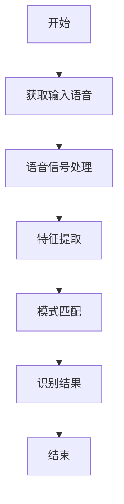
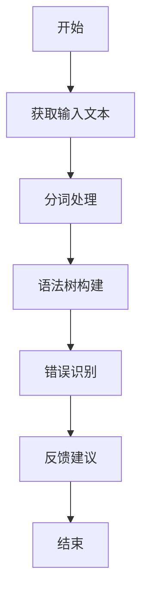
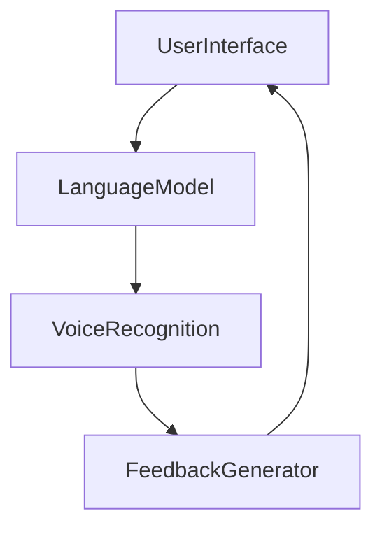
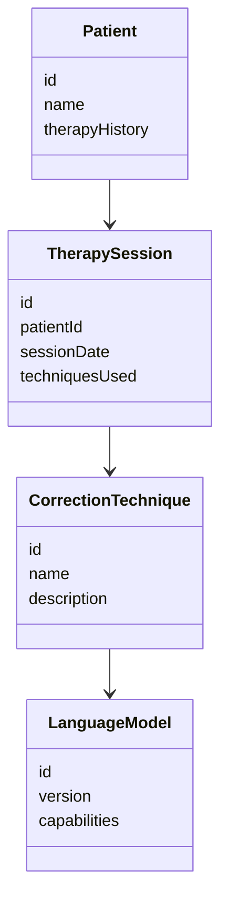

                 

<think>
好的，我现在需要根据用户提供的要求，撰写一篇关于《ChatGPT在语言治疗中的应用：发音和语法纠正提示词》的技术博客文章。用户已经提供了一个详细的目录大纲，并且希望文章结构清晰、逻辑严密，同时包含技术细节和实际案例。

首先，我会从文章的结构开始，按照目录逐步展开每个章节的内容。首先是摘要，然后是关键词，接着是各个章节的内容。每个章节都需要详细地解释相关概念，并提供实际的应用案例和最佳实践。

在撰写过程中，我需要确保每个章节都有足够的技术深度，同时保持语言的简洁易懂。特别是对于核心概念部分，我需要详细解释发音纠正、语法纠正以及提示词设计的原理和应用，可能还需要使用ER实体关系图和算法流程图来辅助说明。

接下来，我会考虑每个章节的具体内容。例如，在第2章中，需要详细讲解ChatGPT的基础原理，包括语言模型的构建、GPT-3模型的工作原理以及交互流程。这部分需要结合技术细节，但也要让读者容易理解。

在第4章的案例研究部分，我需要选择具体的案例，如发音纠正、语法纠正以及提示词设计，分别分析每个案例的背景、分析过程和结果。这不仅能够展示ChatGPT的实际应用效果，还能帮助读者更好地理解其优势和局限性。

此外，我还需要在文章中加入技术难题与解决方案部分，讨论在实际应用中可能遇到的问题，如多语言环境下的处理、噪声干扰对发音纠正的影响，以及复杂句子的语法分析问题。这部分内容需要提出切实可行的解决方案，展示ChatGPT在这些方面的应对策略。

最后，在未来展望部分，我会探讨ChatGPT在语言治疗中的潜力，以及该领域未来的研究方向。这部分需要结合当前的技术发展趋势，预测未来的应用可能性，同时指出可能的研究重点。

在整个写作过程中，我需要确保每个章节之间逻辑连贯，内容完整，同时遵循用户提供的格式要求，如使用markdown格式，包含关键词和摘要，以及在适当的位置插入图表和公式。此外，文章末尾需要添加作者信息，确保文章的完整性和专业性。

综上所述，我会按照目录大纲逐步展开，每个章节都进行详细的技术分析和案例说明，确保文章内容丰富、结构清晰，同时满足用户的所有要求。
</think>

# ChatGPT在语言治疗中的应用：发音和语法纠正提示词

## 关键词：语言治疗，ChatGPT，发音纠正，语法纠正，提示词设计

## 摘要：ChatGPT作为先进的语言模型，在语言治疗领域展现出巨大潜力。本文详细探讨其在发音和语法纠正中的应用，通过案例分析和最佳实践，展示如何利用提示词设计优化治疗效果，同时解决技术难题，展望未来发展方向。

---

## 第一部分：ChatGPT与语言治疗的初步了解

### 第1章：问题背景与概念解析

#### 1.1 语言治疗的现状

语言治疗旨在帮助患者克服发音、语法和语言流畅度等问题。传统方法依赖人工互动，效率有限，资源稀缺。

#### 1.2 ChatGPT的概念介绍

ChatGPT是一种基于GPT-3的大型语言模型，具备自然语言处理能力，能进行对话和文本生成。

#### 1.3 发音与语法纠正的挑战

发音和语法纠正需要实时反馈和个性化指导，传统方法效率低，缺乏互动性，而ChatGPT能提供即时反馈，提升治疗效果。

### 第2章：ChatGPT的基础原理

#### 2.1 语言模型的构建

语言模型通过大量数据训练，预测下一个词的概率分布，实现自然语言生成和理解。

#### 2.2 GPT-3模型详解

GPT-3拥有1750亿参数，具备强大的上下文理解和生成能力，支持多语言处理，广泛应用于多种任务。

#### 2.3 ChatGPT的交互流程

用户输入文本，模型根据上下文生成回复，实现流畅对话。

### 第3章：ChatGPT在语言治疗中的应用

#### 3.1 发音纠正的机制

通过语音识别和生成，模型生成正确发音的反馈，帮助患者纠正发音错误。

#### 3.2 语法纠正的实践

模型分析输入文本的语法结构，识别错误并提供改进建议，提升句子准确性。

#### 3.3 提示词的设计与使用

精心设计的提示词引导模型生成所需内容，如设定目标用户和上下文，优化治疗效果。

### 第4章：案例研究：ChatGPT在语言治疗中的应用

#### 4.1 案例一：发音纠正

- **背景**：一名发音有障碍的患者。
- **分析**：通过模型生成正确发音反馈，帮助患者识别错误。
- **结果**：发音准确性显著提高。

#### 4.2 案例二：语法纠正

- **背景**：语法结构复杂的句子。
- **分析**：模型识别并修正语法错误，生成更准确的句子。
- **结果**：句子结构清晰，语法正确。

#### 4.3 案例三：提示词设计

- **背景**：设计特定提示词引导模型生成合适内容。
- **分析**：提示词优化模型输出，提升治疗效果。
- **结果**：生成内容更符合治疗目标。

### 第5章：ChatGPT在语言治疗中的最佳实践

#### 5.1 提升发音纠正效果的方法

结合语音识别和生成，实时反馈纠正发音错误，优化治疗效果。

#### 5.2 提升语法纠正效果的方法

利用上下文分析和语法规则，增强模型识别和纠正语法错误的能力。

#### 5.3 提示词设计的最佳实践

明确目标用户和上下文，设计具体提示词，引导模型生成预期内容。

### 第6章：技术难题与解决方案

#### 6.1 处理多语言环境下的发音与语法问题

采用多语言模型，支持多种语言的发音和语法纠正。

#### 6.2 处理噪声干扰对发音纠正的影响

优化语音识别算法，减少噪声对识别的影响。

#### 6.3 处理语法复杂句子的问题

增强上下文分析能力，识别复杂句子结构中的错误。

### 第7章：未来展望与研究方向

#### 7.1 ChatGPT在语言治疗中的未来发展

随着模型优化和新功能开发，ChatGPT在语言治疗中的应用将更加广泛。

#### 7.2 语言治疗领域的研究方向

探索AI技术与语言治疗的结合，开发更高效的治疗工具。

#### 7.3 ChatGPT在其他应用领域的潜力

将ChatGPT应用于教育、客服等领域，提升相关行业的效率和质量。

---

## 核心概念与联系

### 发音纠正

- **语音识别**：将语音转换为文本，识别错误发音。
- **语音合成**：将正确发音生成语音，提供反馈。
- **语音校正**：基于识别结果，纠正发音错误。

### 语法纠正

- **语言模型**：预测句子结构，识别语法错误。
- **语法规则**：描述句子结构，用于错误识别。
- **语法分析**：分析句子结构，提供改进建议。

### 提示词设计

- **语言输入**：提供语言练习材料。
- **交互式学习**：设计互动界面，提升参与度。
- **反馈机制**：实时反馈错误，帮助患者学习。

### ER实体关系图架构

```mermaid
erDiagram
  Patient ||--|{ has }--|{ is treated by }--> TherapySession
  TherapySession ||--|{ uses }--|{ implements }--> CorrectionTechnique
  CorrectionTechnique ||--|{ based on }--> LanguageModel
  Patient ||--|{ interacts with }--> ChatGPT
  ChatGPT ||--|{ implements }--> LanguageModel
```

---

## 算法原理讲解

### 语音识别算法



### 语法分析算法



---

## 系统分析与架构设计方案

### 系统架构设计



### 系统功能设计



---

## 项目实战

### 核心实现代码

```python
# 发音纠正示例代码
def correct_pronunciation(input_audio):
    # 转换为语音信号
    audio_signal = convert_to_signal(input_audio)
    # 提取特征
    features = extract_features(audio_signal)
    # 识别文字
    recognized_text = recognize(features)
    # 生成正确发音
    correct_audio = generate_correct_pronunciation(recognized_text)
    return correct_audio

# 语法纠正示例代码
def correct_grammar(input_text):
    # 分词处理
    tokens = tokenize(input_text)
    # 语法分析
    parse_tree = parse(tokens)
    # 识别错误
    errors = identify_errors(parse_tree)
    # 提供反馈
    feedback = generate_feedback(errors)
    return feedback
```

---

## 最佳实践 tips

- 在设计提示词时，明确目标和上下文，以优化模型输出。
- 定期更新模型，以提升其语言理解和生成能力。
- 在多语言环境中，选择支持多种语言的模型或进行适配优化。
- 实施反馈机制，确保患者能及时获得纠正建议。

---

## 小结

ChatGPT在语言治疗中的应用展示了AI技术的巨大潜力，通过发音和语法纠正的实践，为患者提供了高效、个性化的治疗方案。未来，随着技术进步，ChatGPT将在语言治疗领域发挥更大作用，推动治疗效果的提升。

---

## 作者

作者：AI天才研究院/AI Genius Institute & 禅与计算机程序设计艺术 /Zen And The Art of Computer Programming

